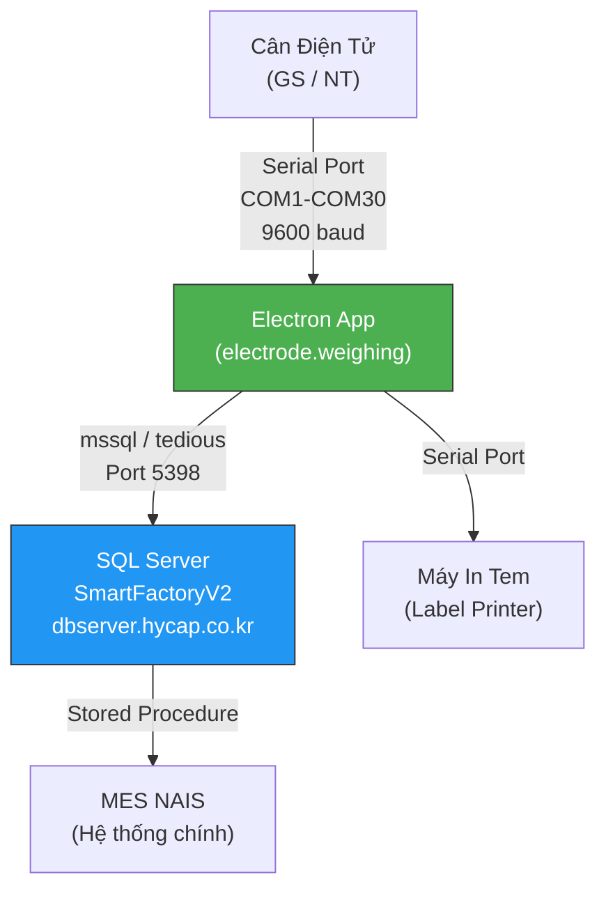
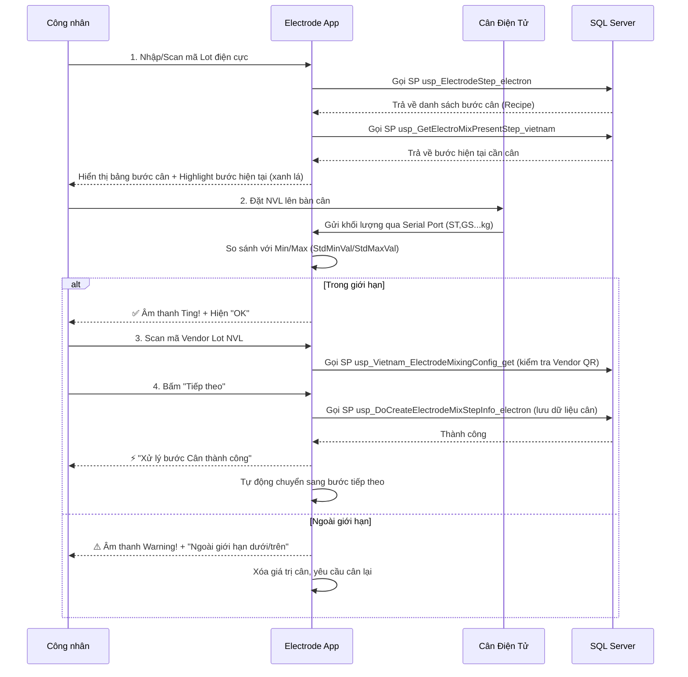

# 📘 Phân Tích Phần Mềm: Electrode Weighing App

> **Đường dẫn:** `c:\Users\User Vinatech.DESKTOP-RJJSEQU\Desktop\database\electrode.weighing`
> **Phiên bản:** `20.22.04.06` | **Tác giả gốc:** Jackaroe (`yjyu@vina.co.kr`)

---

## 1. 🎯 MỤC ĐÍCH CỦA PHẦN MỀM

**Electrode Weighing App** là phần mềm chạy trên máy tính tại **trạm cân nguyên vật liệu điện cực (Mixing)** trong nhà máy Vinatech. Nó thực hiện:

1. **Đọc khối lượng tự động** từ cân điện tử (qua cổng COM/Serial Port)
2. **Hướng dẫn công nhân cân theo đúng thứ tự** (từng bước của công thức trộn Mixing)
3. **Kiểm tra khối lượng cân** so với giới hạn Min/Max trong tiêu chuẩn
4. **Ghi nhận dữ liệu cân** vào database MES (`SmartFactoryV2`) để truy vết sản xuất
5. **In tem cân** tại trạm (qua Serial Port hoặc máy in mạng)

> [!IMPORTANT]
> Phần mềm này là **cầu nối giữa thiết bị phần cứng (cân điện tử)** và **hệ thống MES NAIS**. Nếu phần mềm lỗi, công nhân không thể cân NVL → không thể chốt mẻ trộn Mixing → sản lượng không được ghi nhận trên MES.

---

## 2. 🏗️ KIẾN TRÚC HỆ THỐNG



### Stack Công nghệ

| Thành phần | Công nghệ | Phiên bản |
|------------|-----------|-----------|
| Framework | **Electron** (Chromium + Node.js) | v11.1.0 |
| UI | HTML + Bootstrap 4 + jQuery | 4.5.3 |
| Database | **mssql** + **tedious** (SQL Server driver) | 6.3.2 / 9.2.1 |
| Phần cứng | **serialport** (đọc cân điện tử) | 9.2.5 |
| Thông báo | **SweetAlert2** (popup đẹp) | bundled |
| Datetime | **moment.js** + tempusdominus-bootstrap-4 | 2.29.1 |

---

## 3. 📁 CẤU TRÚC FILE NGUỒN

```
electrode.weighing/
├── CAN DIEN CUC Electrode x64.exe    ← File EXE chính (Electron packaged)
├── resources/
│   └── app/                           ← Source code ứng dụng
│       ├── main.js                    ← Electron main process (tạo cửa sổ)
│       ├── index.html                 ← Giao diện chính (848 dòng)
│       ├── SQLServer.js               ← Kết nối DB + gọi SP (776 dòng) ⭐
│       ├── Common.js                  ← Logic nghiệp vụ: kiểm tra cân, validate (342 dòng)
│       ├── SerialPort.js              ← Đọc dữ liệu từ cân qua Serial Port (275 dòng) ⭐
│       ├── SerialPort01.js            ← Variant cho cổng cân 1
│       ├── SerialPort02.js            ← Variant cho cổng cân 2
│       ├── SerialPortgs.js            ← Variant cho cân loại GS
│       ├── SerialPortnt.js            ← Variant cho cân loại NT
│       ├── renderer.js                ← Renderer process (khởi tạo COM port)
│       ├── version.js                 ← Hiển thị phiên bản
│       ├── preload.js                 ← Electron preload script
│       ├── package.json               ← Dependencies
│       ├── Ting.mp3                   ← Âm thanh thành công ✅
│       ├── Warning.mp3                ← Âm thanh cảnh báo ⚠️
│       └── CÂN che do GS.bat         ← Batch file chạy chế độ cân GS
│       └── CÂN che do NT.bat         ← Batch file chạy chế độ cân NT
```

---

## 4. 🔄 LUỒNG NGHIỆP VỤ (WORKFLOW)

### Quy trình cân Mixing từng bước:



---

## 5. 🖥️ GIAO DIỆN NGƯỜI DÙNG (UI)

### Các thành phần chính trên giao diện:

| Vùng | Thành phần | Chức năng |
|------|-----------|-----------|
| **Header** | COM port 1 & 2 | Chọn cổng COM kết nối cân (COM1→COM30) |
| **Header** | Nút "In thủ công" | In tem khi không có mã Lot |
| **Row 1** | `electrodeLotNumber` | Nhập/Scan mã Lot điện cực |
| **Row 1** | Nút "Tìm kiếm" | Load danh sách bước cân từ DB |
| **Row 1** | ☑️ **CA ĐÊM CHUẨN BỊ TRƯỚC** | ⭐ **Checkbox quan trọng** — thay đổi thứ tự cân |
| **Table** | `electrodeStepInfo` | Bảng hiển thị tất cả bước cân (highlight bước hiện tại) |
| **Row 2** | `materialWeight1` / `materialWeight2` | Giá trị cân (tự động nhận từ Serial Port, disabled) |
| **Row 2** | Nút "Xác nhận giá trị cân nặng" | Dùng cho NVL nặng ≥ 3.8 KG (cân thủ công) |
| **Row 3** | `materialLotNumber` | Scan mã Vendor Lot NVL |
| **Row 4** | Thời gian bắt đầu / kết thúc | DateTime picker |
| **Row 4** | Nút **"Tiếp theo"** | Lưu dữ liệu cân và chuyển bước (disabled cho đến khi cân đủ) |
| **Footer** | Nút "RePrint All" | In lại tất cả tem |
| **Footer** | Nút "Làm mới màn hình" | Reload toàn bộ ứng dụng |

---

## 6. 🔌 KẾT NỐI PHẦN CỨNG (Serial Port)

### Cách đọc dữ liệu từ cân:

```
Cân gửi chuỗi dạng: "ST,GS,+    0.523 kg" hoặc "ST,NT,+    1.200 kg"
                      ↑         ↑             ↑
                      Loại cân   Dấu +/-       Giá trị kg
```

**Logic xử lý trong [SerialPort.js](file:///c:/Users/User%20Vinatech.DESKTOP-RJJSEQU/Desktop/database/electrode.weighing/resources/app/SerialPort.js):**

1. Đợi dữ liệu từ cổng COM (9600 baud)
2. Tìm chuỗi chứa `"kg"` → Parse giá trị số
3. Kiểm tra `ST,GS` hoặc `ST,NT` (2 loại cân)
4. Khi vật liệu được **dỡ khỏi cân** (giá trị âm/giảm), ghi nhận giá trị cuối cùng
5. Tự động điền vào ô `materialWeight1` hoặc `materialWeight2`
6. Gọi `checkMaterialSpec()` để so sánh với Min/Max

> [!NOTE]
> **Cơ chế "dỡ rồi ghi"**: Phần mềm **không ghi nhận trọng lượng ngay khi đặt lên** mà đợi cho đến khi vật liệu được dỡ ra (tín hiệu âm). Đây là cách đo chính xác — đảm bảo vật liệu đã ổn định trên cân.

---

## 7. 🗄️ KẾT NỐI DATABASE

### Thông tin kết nối ([SQLServer.js:582](file:///c:/Users/User%20Vinatech.DESKTOP-RJJSEQU/Desktop/database/electrode.weighing/resources/app/SQLServer.js#L582-L591)):

| Thông số | Giá trị |
|----------|---------|
| Server | `dbserver.hycap.co.kr` |
| Port | `5398` |
| Database | `SmartFactoryV2` |
| User | `vinaadmin` |
| Password | `vina1234%6&8` |

### Các Stored Procedure quan trọng:

| SP | Chức năng | Khi nào gọi |
|----|-----------|-------------|
| `usp_ElectrodeStep_electron` | Lấy danh sách bước cân (Recipe) theo Lot | Khi scan mã Lot điện cực |
| `usp_ElectrodeStep_Vietnam` | Variant của SP trên (hỗ trợ `pOrder='kdem'`) | Khi checkbox "Ca đêm" được bật |
| `usp_GetElectroMixPresentStep_vietnam` | Lấy bước cân hiện tại (MaterialName, Min, Max) | Sau khi load Recipe |
| `usp_DoCreateElectrodeMixStepInfo_electron` | **Ghi dữ liệu cân vào DB** | Khi bấm "Tiếp theo" |
| `usp_Vietnam_ElectrodeMixingConfig_get` | Kiểm tra cấu hình Vendor QR code | Khi scan Vendor Lot |
| `usp_DoCreateElectrodeWasteInfoNew_electron` | Ghi nhận phế liệu điện cực | Khi nhập phế (waste) |
| `usp_RouteInfo_electron` | Lấy danh sách Route (công đoạn) | Dropdown chọn Route |

### Bảng DB liên quan:

| Bảng | Chức năng |
|------|-----------|
| `STB_ElectrodeMixStepInfo` | Lưu kết quả cân từng bước |
| `STB_ElectrodeMixInfo` | Lưu thông tin mẻ trộn Mixing tổng |
| `STB_ProductMachine` | Mapping máy → Route |
| `STB_MachineMaster` | Master danh sách máy |
| `STB_DefectInfo` | Danh sách lỗi (phế liệu) |
| `STB_BaseCode` | Mã cơ sở (nhóm EWCategory2) |

---

## 8. ⭐ TÍNH NĂNG "CA ĐÊM CHUẨN BỊ TRƯỚC" (isNight)

> [!WARNING]
> Đây là **nguồn gốc chính của bug "nhảy bước cân"** mà user đã báo cáo nhiều lần.

### Cơ chế hoạt động:

- **Bình thường (Ca ngày)**: SP `usp_ElectrodeStep_electron` trả về thứ tự: **Bột than → Binder → Nước cất → ...**
- **Ca đêm chuẩn bị trước** ☑️: SP được gọi thêm tham số `pOrder = 'kdem'`, đổi thứ tự: **Binder lên đầu** (vì Binder cần thời gian khuấy sấy lâu)

### Code xử lý ([index.html:402-420](file:///c:/Users/User%20Vinatech.DESKTOP-RJJSEQU/Desktop/database/electrode.weighing/resources/app/index.html#L402-L420)):

```javascript
function changeNight(control){
    localStorage.isNight = control.checked ? 1 : "";
    // Tự động refresh bảng bước cân
    document.getElementById("searchElectrodeStepInfo").click(); 

    if(control.checked)
        alert('⚡ Chuyển bước cân Binder lên làm trước, cho ca đêm chuẩn bị');
    else 
        alert('⚡ Quay lại cân lần lượt bình thường, bước cân Bột than lên trước');
}
```

### Bug liên quan:
- **Trạng thái `isNight` được lưu trong `localStorage`** → Nếu ca trước tích checkbox rồi tắt app, ca sau mở lên vẫn bị tích → thứ tự cân bị đảo mà không biết.
- Giải pháp: **Bỏ tích checkbox + Bấm "Làm mới màn hình"**.

---

## 9. 🔧 CHI TIẾT LOGIC XÁC NHẬN CÂN ([Common.js](file:///c:/Users/User%20Vinatech.DESKTOP-RJJSEQU/Desktop/database/electrode.weighing/resources/app/Common.js))

### Hàm `checkMaterialSpec(val1, val2, nextstep)`:

```
1. Parse giá trị cân (materialWeight1 + materialWeight2)
2. So sánh: finalWeightVal >= StdMinVal AND finalWeightVal <= StdMaxVal
   ├── ĐẠT → nextstep == "OK" → Enable nút "Tiếp theo"
   │         nextstep != "OK" → Hiện thông báo (VD: "Cân thêm NVL khác trước")
   └── KHÔNG ĐẠT → Disable nút "Tiếp theo" + Xóa giá trị cân + Cảnh báo
```

### Hàm `confirmweightfunc()` — Cân thủ công:
- Chỉ cho phép khi Min ≥ 3.8 KG (nguyên liệu nặng, cần dỡ từng túi)
- Hiện thông báo nhắc **TRỪ BÌ** trước khi cân
- Cho phép dỡ từng túi khỏi bàn cân mà vẫn giữ nguyên giá trị

### Hàm `insertWeigingData()` — Lưu dữ liệu cân:
- Gọi SP `usp_DoCreateElectrodeMixStepInfo_electron` với 8 tham số:
  - `pElectrodeLotNumber` — Mã Lot điện cực
  - `pElectrodeStep` — Mã bước cân
  - `pSeq` — Thứ tự trong bước
  - `pInputQty1` / `pInputQty2` — Khối lượng cân 1 & 2
  - `pBinderInputDateTime` / `pBinderOutputDateTime` — Thời gian bắt đầu/kết thúc
  - `pMaterialLotNumber` — Mã Vendor Lot NVL

---

## 10. 🐛 CÁC BUG ĐÃ BIẾT & CÁCH FIX

### Bug 1: Nhảy thứ tự bước cân
- **Nguyên nhân**: Checkbox "CA ĐÊM CHUẨN BỊ TRƯỚC" bị tích từ ca trước
- **Fix**: Bỏ tích + Bấm "Làm mới màn hình"
- **KB Reference**: [KB_14 § 4.7](file:///c:/Users/User%20Vinatech.DESKTOP-RJJSEQU/Desktop/database/MES_MASTER_KNOWLEDGE_BASE/KB_14_TRACE_BUG_METHODOLOGY.md)

### Bug 2: Mã HCE không thao tác được
- **Nguyên nhân**: Model HCE chưa có cấu hình bước cân trong SP hoặc bảng Recipe
- **Fix**: IT cần thêm cấu hình cho mã HCE vào bảng Recipe Mixing

### Bug 3: Sản xuất ra không ghi nhận trên hệ thống
- **Nguyên nhân**: Bước cân bị treo → mẻ trộn không chốt → `STB_ElectrodeMixInfo` thiếu bản ghi
- **Fix**: Reset dữ liệu cân tạm bằng SQL:
  ```sql
  DELETE FROM STB_ElectrodeMixStepInfo 
  WHERE ElectrodeLotNumber = 'Mã_Lot_Kẹt';
  ```

### Bug 4: Mã 3582-600F CY không tạo được tem
- **Nguyên nhân**: Thiếu config trong `stb_slittinglocationconfig_vvt`
- **Fix**: Thêm config Slitting + ModelBasicInfo (xem KB_14 § 4.8)

### Bug 5: Cân NVL Mixing lỗi kết nối
- **Nguyên nhân**: Sai cổng COM hoặc cân chưa bật
- **Fix**: Đổi cổng COM trên giao diện + kiểm tra dây kết nối

---

## 11. 📝 GHI CHÚ ĐẶC BIỆT

| Ghi chú | Chi tiết |
|---------|----------|
| **Ngôn ngữ** | UI bằng tiếng Việt, code comment bằng tiếng Hàn (한국어) và tiếng Việt |
| **Dịch thuật trong code** | `증류수` → Nước cất / DI-WATER; `활성탄` → Than hoạt tính |
| **HanSol Binder** | Nếu NVL là `GAHSCB-001` (HanSol Binder), hiện thông báo đặc biệt: "cần đem ra máy trộn Knead" |
| **Âm thanh** | Thành công: `Ting.mp3` ✅ | Lỗi: `Warning.mp3` ⚠️ |
| **localStorage** | `electrodeLotNumber`, `isNight`, `defaultElecProc` — persist qua các lần mở app |
| **sessionStorage** | `comweightvalue`, `conditionlotprint` — chỉ trong phiên làm việc |
| **Chế độ cân** | 2 chế độ: `GS` (CÂN che do GS.bat) và `NT` (CÂN che do NT.bat) |

---

*Phân tích: 2026-05-26 | Antigravity AI*
