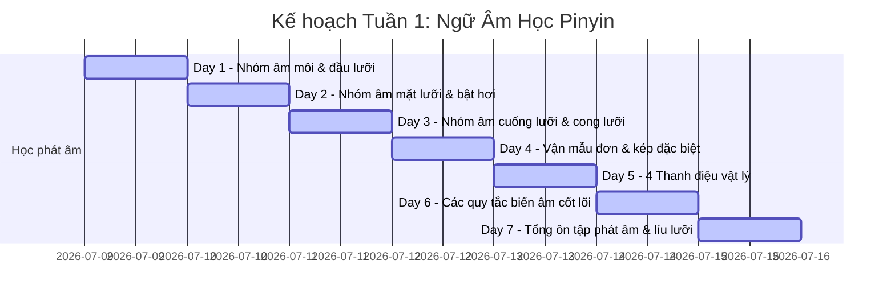
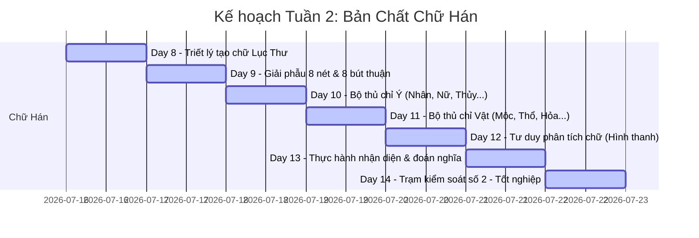

# 🗺️ LỘ TRÌNH 14 NGÀY VÀNG: BẢN ĐỒ CHINH PHỤC NỀN MÓNG TIẾNG TRUNG

Lộ trình này kéo dài **2 tuần (14 ngày)**, tập trung 100% vào việc xây dựng nền tảng vững chắc nhất về **Phát âm Pinyin** và **Bản chất Chữ Hán**. 

Mỗi ngày được thiết kế với thời lượng từ 30 đến 45 phút học chủ động.

---

## 📅 TUẦN 1: LÀM CHỦ KHẨU HÌNH & THANH ĐIỆU (PHÁT ÂM PINYIN)

Mục tiêu tuần 1 là phát âm chính xác bất kỳ từ tiếng Trung nào khi nhìn thấy phiên âm Pinyin và cảm nhận được sự chuyển động của thanh điệu.

* **Day 1: Nhóm âm dễ (Âm môi & đầu lưỡi)**
  * *Nhiệm vụ:* Đọc lý thuyết nhóm âm `b, p, m, f` và `d, t, n, l` trong [02_Phonetics_Mastery.md](file:///c:/Users/User%20Vinatech.DESKTOP-RJJSEQU/Desktop/HSK/02_Phonetics_Mastery.md). Tập trung phân biệt âm không bật hơi `b, d` và âm bật hơi `p, t` (sử dụng một tờ giấy mỏng đặt trước miệng để kiểm tra hơi đẩy ra).
* **Day 2: Thử thách nhóm âm mặt lưỡi (J, Q, X)**
  * *Nhiệm vụ:* Tìm hiểu cơ chế bẹt môi và áp lưỡi của nhóm `j, q, x` trong [02_Phonetics_Mastery.md](file:///c:/Users/User%20Vinatech.DESKTOP-RJJSEQU/Desktop/HSK/02_Phonetics_Mastery.md). Thực hành phân biệt cặp âm tối thiểu `j` và `q` (bật hơi).
* **Day 3: Âm đầu lưỡi trước (Z, C, S) & Âm cong lưỡi (ZH, CH, SH, R)**
  * *Nhiệm vụ:* Đây là nhóm âm khó nhất đối với người Việt. Học cách cuộn lưỡi của `zh, ch, sh, r` và cách thẳng lưỡi sát răng của `z, c, s`. Luyện tập các mẫu từ trong [04_Pronunciation_Practice.md](file:///c:/Users/User%20Vinatech.DESKTOP-RJJSEQU/Desktop/HSK/04_Pronunciation_Practice.md).
* **Day 4: Hệ thống Vận mẫu (Vần) đặc biệt**
  * *Nhiệm vụ:* Học cách phát âm tròn môi của âm `ü` và âm cong lưỡi `er`. Tìm hiểu cách phát âm của `i` khi đi sau các âm đầu lưỡi/cong lưỡi (đọc thành âm `ư`).
* **Day 5: Nhạc điệu tiếng Trung - 4 Thanh điệu**
  * *Nhiệm vụ:* Xem biểu đồ cao độ thanh điệu. Luyện phát âm đơn lẻ từng thanh điệu từ Thanh 1 đến Thanh 4. Tập trung tập luyện cơ học: Thanh 1 (ngang, cao họng), Thanh 4 (giật mạnh cơ bụng, hạ giọng dứt khoát).
* **Day 6: Quy tắc biến âm & Quy tắc viết Pinyin**
  * *Nhiệm vụ:* Nắm chắc quy tắc đổi dấu của hai thanh 3 đứng cạnh nhau (ví dụ: *nǐ hǎo* -> *ní hǎo*), biến điệu của `不` (bù) và `一` (yī). Tìm hiểu quy tắc viết bỏ dấu chấm của `ü` khi đi với `j, q, x, y`.
* **Day 7: Trạm kiểm soát số 1 - Luyện nói trôi chảy**
  * *Nhiệm vụ:* Mở file [04_Pronunciation_Practice.md](file:///c:/Users/User%20Vinatech.DESKTOP-RJJSEQU/Desktop/HSK/04_Pronunciation_Practice.md) và đọc to toàn bộ các cặp từ đối chiếu. Thử thách đọc bài líu lưỡi "Sì shì sì, shí shì shí" (Bốn là bốn, mười là mười). Tự ghi âm lại để kiểm tra xem mình phát âm đúng bao nhiêu phần trăm.

---

## 📅 TUẦN 2: THẤU SUỐT CHỮ HÀN (BẢN CHẤT LỤC THƯ & BỘ THỦ)

Mục tiêu tuần 2 là hiểu được cơ chế cấu tạo chữ Hán, nắm vững nét vẽ, thuộc 50 bộ thủ cốt lõi và có thể nhớ cách viết chữ Hán mà không phải chép phạt hàng trăm lần.

* **Day 8: Triết lý tạo chữ Hán - Lục Thư (六书)**
  * *Nhiệm vụ:* Đọc lý thuyết về nguồn gốc tiến hóa chữ Hán và lý thuyết **Lục Thư** trong [03_Character_Essence.md](file:///c:/Users/User%20Vinatech.DESKTOP-RJJSEQU/Desktop/HSK/03_Character_Essence.md). Hãy hiểu rõ cách người xưa vẽ hình để tạo chữ Tượng hình và kết hợp ý nghĩa để tạo chữ Hội ý.
* **Day 9: Giải phẫu 8 nét cơ bản & 8 Quy tắc Bút thuận**
  * *Nhiệm vụ:* Học cách đi lực tay cho từng nét vẽ (nét đậm, nét thanh, nét hất, nét móc). Nắm vững 8 quy tắc viết bút thuận (Ngang trước sổ sau, trên trước dưới sau...). Luyện viết thử các chữ cơ bản đúng thứ tự nét.
* **Day 10: 25 Bộ thủ chỉ Con người & Mối quan hệ**
  * *Nhiệm vụ:* Học nhóm 25 bộ thủ đầu tiên liên quan đến con người (bộ Nhân `亻`, bộ Nữ `女`, bộ Khẩu `口`, bộ Tâm `忄`...). Nhớ hình dạng chữ cổ và các biến thể của chúng khi đứng ghép.
* **Day 11: 25 Bộ thủ chỉ Thiên nhiên & Vật chất**
  * *Nhiệm vụ:* Học nhóm 25 bộ thủ tiếp theo liên quan đến vạn vật xung quanh (bộ Thủy `氵`, bộ Hỏa `灬`, bộ Mộc `木`, bộ Thổ `土`...). Luyện tập liên tưởng ý nghĩa của bộ thủ với nghĩa thực tế của chữ ghép.
* **Day 12: Tư duy phân tích chữ Hán (Hình thanh)**
  * *Nhiệm vụ:* Tìm hiểu cơ chế của **Chữ hình thanh (Phono-semantic compounds)** - loại chữ chiếm 80% kho chữ Hán. Học cách bóc tách một chữ thành 2 phần: phần gợi nghĩa (thường là bộ thủ) và phần gợi âm (chữ đơn chỉ cách đọc gần đúng).
* **Day 13: Thực hành bóc tách chữ Hán**
  * *Nhiệm vụ:* Mở file [05_Character_Writing_Practice.md](file:///c:/Users/User%20Vinatech.DESKTOP-RJJSEQU/Desktop/HSK/05_Character_Writing_Practice.md) và làm các bài tập phân tích chữ. Tập thói quen mỗi khi nhìn thấy một chữ Hán mới, hãy tự hỏi: *"Chữ này có bộ thủ gì? Thuộc nhóm Lục Thư nào?"*.
* **Day 14: Trạm kiểm soát số 2 - Đánh giá năng lực nền móng**
  * *Nhiệm vụ:* Tự làm bài test tổng hợp: viết lại 50 bộ thủ từ trí nhớ, viết đúng thứ tự nét của 15 chữ Hán thông dụng và gõ Pinyin chuẩn xác trên điện thoại/máy tính để chọn đúng chữ Hán cần tìm.

---

## 🎯 TIÊU CHUẨN TỐT NGHIỆP GIAI ĐOẠN 1
Bạn sẽ chính thức hoàn thành Giai đoạn 1 và sẵn sàng bước sang học từ vựng/ngữ pháp HSK 1 khi đạt đủ 3 tiêu chuẩn sau:
1. **Phát âm tự nhiên:** Không bị nhầm lẫn giữa âm bật hơi và âm không bật hơi; đọc đúng 90% thanh điệu trong các từ ghép hai âm tiết.
2. **Thấu hiểu chữ Hán:** Có thể nhìn vào một chữ Hán lạ, bóc tách được bộ thủ của nó và đoán sơ bộ nghĩa của chữ đó thuộc nhóm nào.
3. **Phản xạ gõ chữ:** Tự gõ được các câu Pinyin cơ bản trên bàn phím và chọn đúng chữ Hán hiển thị mà không cần nhìn tài liệu.

---
*Quay lại trang chính: [README.md](file:///c:/Users/User%20Vinatech.DESKTOP-RJJSEQU/Desktop/HSK/README.md) | Tiếp tục bài học phát âm chuyên sâu: [02_Phonetics_Mastery.md](file:///c:/Users/User%20Vinatech.DESKTOP-RJJSEQU/Desktop/HSK/02_Phonetics_Mastery.md)*
