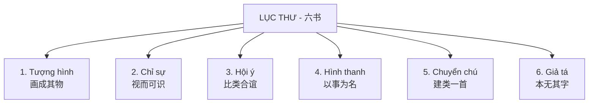

# ✍️ BẢN CHẤT CHỮ HÁN: LỊCH SỬ, LỤC THƯ & BẢN CHẤT HÌNH HOẠ

Chữ Hán không phải là các ký tự vô nghĩa ghép lại một cách ngẫu nhiên. Mỗi chữ Hán đều là một chỉnh thể nghệ thuật chứa đựng tư duy vũ trụ quan và nhân sinh quan của người xưa. 

Thấu hiểu **bản chất tạo chữ** sẽ giúp bạn nhớ chữ Hán một cách logic và tự nhiên, không bao giờ phải học vẹt.

---

## 1. TIẾN TRÌNH LỊCH SỬ TIẾN HÓA CỦA CHỮ HÁN

Chữ Hán đã trải qua hơn 3000 năm tiến hóa, từ những hình vẽ mô phỏng trực quan đến các ký tự vuông vắn hiện đại:

```
Giáp Cốt Văn (甲骨文) ---> Kim Văn (金文) ---> Triện Thư (篆书) ---> Lệ Thư (隶书) ---> Khải Thư (楷书) ---> Giản Thể (简体)
```

1. **Giáp Cốt Văn (甲骨文 - Khắc trên mai rùa, xương thú):** Xuất hiện thời nhà Thương. Chữ mang tính chất vẽ lại sự vật thô sơ nhưng sinh động.
2. **Kim Văn (金文 - Khắc trên đồ đồng):** Xuất hiện thời Chu, các nét vẽ dày dặn, tròn trịa hơn.
3. **Triện Thư (篆书 - Chữ triện hoàng gia):** Thống nhất thời Tần Thủy Hoàng. Các nét chữ uốn lượn đối xứng, mang tính thẩm mỹ cao nhưng rất khó viết nhanh.
4. **Lệ Thư (隶书 - Bước ngoặt lịch sử):** Xuất hiện thời Hán. Để phục vụ việc chép sử nhanh, người xưa đã **"cực đoan hóa" nét vẽ**: biến các đường cong uốn lượn của chữ Triện thành các nét thẳng, góc cạnh phẳng. Đây là sự khai sinh ra chữ Hán hiện đại.
5. **Khải Thư (楷书 - Chữ chuẩn mực):** Xuất hiện cuối Đông Hán, vuông vắn, rõ ràng và là chuẩn mực chữ viết tay lẫn in ấn ngày nay.
6. **Giản Thể (简体):** Được chính phủ Trung Quốc ban hành vào thập niên 1950 nhằm xóa nạn mù chữ. Chữ Giản thể lược bỏ bớt các nét phức tạp của chữ Phồn thể (繁体) nhưng vẫn giữ lại các hợp phần cốt lõi chỉ nghĩa hoặc chỉ âm.

---

## 2. LỤC THƯ (六书) - 6 PHƯƠNG THỨC TẠO CHỮ HÁN THÂM SÂU
Đây là chìa khóa vạn năng giúp bạn thấu suốt bất kỳ chữ Hán nào. Lục Thư phân loại chữ Hán thành 6 cơ chế logic:



### 🔴 1. Chữ Tượng hình (象形 - Xiàngxíng)
* **Bản chất:** Vẽ lại hình dáng thực tế của sự vật ngoài đời thực. Đây là các chữ đơn sơ đẳng nhất, làm nền móng cho các chữ phức tạp sau này.
* *Ví dụ:*
  * **人** (nhân - người): Vẽ một người đang đứng nghiêng, dang chân bước đi.
  * **山** (sơn - núi): Vẽ ba ngọn núi nhấp nhô cạnh nhau.
  * **木** (mộc - cây): Vẽ thân cây ở giữa, phía trên có cành lá xum xuê, dưới có rễ cây đâm xuống đất.

### 🔴 2. Chữ Chỉ sự / Tượng trưng (指事 - Zhǐshì)
* **Bản chất:** Biểu diễn các khái niệm trừu tượng không có hình dáng vật lý bằng cách thêm các ký hiệu chỉ dẫn vào chữ Tượng hình.
* *Ví dụ:*
  * **本** (bổn - gốc rễ): Người xưa lấy chữ **木** (cây) làm gốc, thêm một nét ngang ngắn `一` ở phía dưới rễ cây để chỉ vị trí "gốc rễ".
  * **刃** (nhận - lưỡi dao): Lấy chữ **刀** (dao), thêm một nét chấm `丶` ngay trên phần lưỡi dao để chỉ vị trí "lưỡi dao bén".
  * **上** (thượng - trên) và **下** (hạ - dưới): Dùng nét vẽ nằm ngang làm ranh giới mặt đất, đặt nét chỉ dẫn phía trên là "lên", đặt dưới là "xuống".

### 🔴 3. Chữ Hội ý (会意 - Huìyì)
* **Bản chất:** Ghép hai hoặc nhiều chữ Tượng hình lại với nhau để tạo ra một ý nghĩa mới dựa trên sự liên kết logic giữa chúng.
* *Ví dụ:*
  * **明** (minh - sáng): Ghép từ chữ **日** (mặt trời) và chữ **月** (mặt trăng) $\rightarrow$ Hai nguồn sáng lớn nhất vũ trụ đặt cạnh nhau sẽ tạo ra sự "sáng sủa".
  * **休** (hưu - nghỉ ngơi): Ghép từ chữ **人** (người, viết biến thể thành `亻`) và chữ **木** (cây) $\rightarrow$ Một người tựa lưng vào gốc cây để "nghỉ ngơi".
  * **好** (hảo - tốt/đẹp): Ghép từ chữ **女** (phụ nữ) và chữ **子** (đứa con) $\rightarrow$ Người phụ nữ sinh được con trai là điều "tốt lành" nhất cho gia đình dòng họ thời xưa.

### 🔴 4. Chữ Hình thanh (形声 - Xíngshēng)
> [!IMPORTANT]
> **Đây là loại chữ quan trọng nhất, chiếm hơn 80% tổng số chữ Hán.**
* **Bản chất:** Cấu tạo từ hai phần ghép lại:
  * **Phần hình (Semantic Component):** Thường là Bộ thủ, gợi mở về nhóm ý nghĩa của chữ.
  * **Phần thanh (Phonetic Component):** Một chữ đơn lẻ gợi ý về cách đọc phát âm của chữ đó.
* *Ví dụ:*
  * Chữ **妈** (mā - mẹ): Bộ **女** (nữ - chỉ phụ nữ $\rightarrow$ ý nghĩa) + chữ **马** (mǎ - mã/ngựa $\rightarrow$ chỉ âm đọc gần giống là *mā*).
  * Chữ **爸** (bà - bố): Bộ **父** (phụ - cha $\rightarrow$ ý nghĩa) + chữ **巴** (bā - ba $\rightarrow$ chỉ âm đọc gần giống là *bà*).
  * Chữ **湖** (hú - hồ nước): Bộ **氵** (thủy - nước $\rightarrow$ ý nghĩa) + chữ **胡** (hú - hồ $\rightarrow$ chỉ âm đọc chính xác là *hú*).

### 🔴 5. Chữ Chuyển chú (转注 - Zhuǎnzhù) & 6. Chữ Giả tá (假借 - Jiǎjiè)
* **Bản chất:** Đây là các hiện tượng phát triển ngôn ngữ học lịch sử. 
  * *Chuyển chú:* Các chữ có cùng nguồn gốc, âm đọc thay đổi nhẹ qua các thời kỳ nhưng có nghĩa giống hoặc bổ trợ nhau (như **考** *kǎo* và **老** *lǎo*).
  * *Giả tá:* Mượn một chữ có sẵn có âm đọc giống để biểu thị một từ trừu tượng hoàn toàn khác mà chưa có chữ viết (như chữ **我** *wǒ* nguyên gốc là vẽ vũ khí đinh ba cổ, sau này được mượn âm để làm đại từ nhân xưng "Tôi/Tớ").

---

## 3. GIẢI PHẪU HỌC 8 NÉT CƠ BẢN & NGHỆ THUẬT ĐI LỰC TAY
Khi viết chữ Hán bằng bút bi hoặc bút gel, bạn cần điều khiển lực ấn của ngón tay để tạo nên hồn chữ:

```
  1. Ngang (Héng)   2. Sổ (Shù)   3. Phẩy (Piě)   4. Mác (Nà)
     ——————          |             /               \
                     |            /                 \
  5. Chấm (Diǎn)    6. Hất (Tí)   7. Gập (Zhé)    8. Móc (Gōu)
      .              /             ┐                亅
```

1. **Nét Ngang (横 - Héng):** Đặt bút nhẹ, kéo ngang từ trái sang phải hơi chếch lên 5 độ, dừng bút hơi ấn nhẹ.
2. **Nét Sổ (竖 - Shù):** Đặt bút mạnh, kéo thẳng đứng từ trên xuống dưới, dừng bút dứt khoát hoặc vuốt nhọn (sổ kim).
3. **Nét Phẩy (撇 - Piě):** Đặt bút đậm nét, kéo xiên sang trái rồi vuốt nhẹ nhọn dần về cuối nét.
4. **Nét Mác (捺 - Nà):** Đặt bút nhẹ, kéo xiên sang phải đậm dần, ở cuối nét hơi nhấn mạnh rồi vuốt ngang nhẹ tạo đuôi chữ.
5. **Nét Chấm (点 - Diǎn):** Đặt bút nhẹ rồi ấn mạnh dần từ trái qua phải, nhấc bút dứt khoát tạo hình như hạt mưa rơi.
6. **Nét Hất (提 - Tí):** Đặt bút đậm ở dưới, hất nhanh và nhọn dần lên phía trên bên phải.
7. **Nét Gập (折 - Zhé):** Viết nét ngang hoặc sổ, đến điểm gập dừng bút ấn nhẹ tạo góc khấc rồi bẻ hướng viết nét tiếp theo.
8. **Nét Móc (钩 - Gōu):** Cuối nét sổ hoặc ngang, dừng bút ấn lực nhẹ rồi móc nhanh nhọn lên phía trong.

---

## 4. TƯ DUY 50 BỘ THỦ PHỔ BIẾN - KHO TÀNG GỢI NGHĨA

Dưới đây là một số bộ thủ tiêu biểu để bạn thấy rõ bản chất gợi nghĩa vật lý thâm sâu của chúng khi đi ghép chữ:

| Bộ Thủ | Hình vẽ cổ (Tượng hình gốc) | Ý nghĩa nguyên thủy | Từ ghép minh họa & Tư duy liên tưởng |
| :---: | :---: | :--- | :--- |
| **氵** <br> (Thủy) | Vẽ 3 dòng nước chảy uốn lượn | **Nước, chất lỏng** | **海** (*hǎi* - biển): Có nước mới thành biển. <br> **洗** (*xǐ* - rửa): Phải có nước mới rửa sạch đồ. |
| **忄** <br> (Tâm) | Hình vẽ quả tim của con người | **Trí óc, cảm xúc** | **忙** (*máng* - bận): Tim đập loạn nhịp vì bận rộn. <br> **怕** (*pà* - sợ): Trạng thái cảm xúc co thắt ở tim. |
| **亻** <br> (Nhân) | Vẽ hình người đang đứng nghiêng | **Con người, hành vi** | **他** (*tā* - anh ấy): Một con người cụ thể. <br> **做** (*zuò* - làm): Hành động do con người thực hiện. |
| **宀** <br> (Miên) | Vẽ mái nhà có tường và chóp | **Mái nhà, nơi trú ẩn** | **家** (*jiā* - nhà): Dưới mái nhà có chăn nuôi heo (**豕**). <br> **安** (*ān* - an): Người phụ nữ dưới mái nhà là bình an. |
| **饣** <br> (Thực) | Vẽ cái thố đựng thức ăn có nắp | **Ăn uống, lương thực** | **饭** (*fàn* - cơm): Đồ ăn cơ bản hàng ngày. <br> **饿** (*è* - đói): Cảm giác thiếu đồ ăn trong người. |
| **辶** <br> (Sước) | Vẽ ngã ba đường + bàn chân bước | **Bước đi, di chuyển** | **进** (*jìn* - tiến vào): Bước đi để đi sâu vào trong. <br> **送** (*sòng* - tiễn/tặng): Đi theo để đưa tiễn ai đó. |

---
*Quay lại trang chính: [README.md](file:///c:/Users/User%20Vinatech.DESKTOP-RJJSEQU/Desktop/HSK/README.md) | Tiếp tục thực hành luyện phát âm: [04_Pronunciation_Practice.md](file:///c:/Users/User%20Vinatech.DESKTOP-RJJSEQU/Desktop/HSK/04_Pronunciation_Practice.md)*
