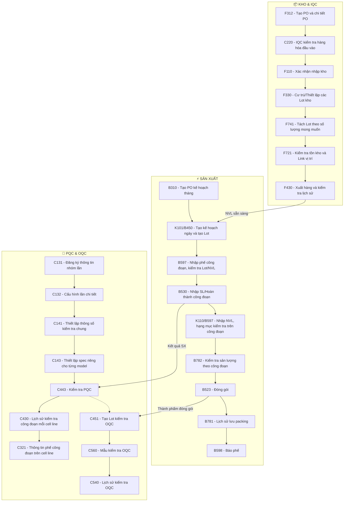

# KB_02 - Kho Nguyên Vật Liệu (WMS)

> **Màn hình liên quan:** F330, F312, F430, F110, F721, F741, C220
> ← [Về INDEX](KB_INDEX.md)

---

## 4. 📦 Kho Nguyên Vật Liệu (WMS)

### 4.0 Sơ Đồ Quy Trình Tổng Quan (KHO & IQC -> SẢN XUẤT -> PQC & OQC)

> Sơ đồ dưới đây thể hiện luồng quy trình chính xuyên suốt 3 khu vực: **Kho & IQC**, **Sản xuất**, **PQC & OQC**. Mỗi bước gắn với Screen ID tương ứng trên hệ thống MES.



**Giải thích liên kết giữa 3 khu vực:**
- **KHO -> SẢN XUẤT:** Sau khi NVL qua IQC (C220) và nhập kho (F330), NVL sẵn sàng cấp cho sản xuất qua F430
- **SẢN XUẤT -> PQC:** Kết quả sản xuất tại B530 được kiểm tra PQC tại C443
- **SẢN XUẤT -> OQC:** Sau đóng gói (B523), thành phẩm chuyển sang OQC để tạo Lot kiểm tra (C451)
- **Đóng gói (B523):** Bộ chuyển thông tin Lot và số lượng sang bảng `STB_MaterialLotInfo` để quản lý và sử dụng

---

### 4.1 Tìm kiếm F721 trả về cả danh sách (không lọc được)

**Nguyên nhân:** Điều kiện lọc trong SP bị sai hoặc tham số truyền vào rỗng.

**Debug:**
```sql
SELECT OBJECT_DEFINITION(OBJECT_ID('usp_vvt_MaterialLotInfo_get'))
-- Tìm đến phần WHERE -> Kiểm tra điều kiện lọc theo MaterialCode
```

> ⚠️ **Lưu ý ẩn:** SP `usp_vvt_MaterialLotInfo_get` (tên "_get") thực tế **UPDATE 2 bảng** mỗi khi chạy - tự động điền `LotAttr10` cho các Lot bị thiếu ngày SX bằng cách parse mã Vendor Lot. Không có transaction bảo vệ phần UPDATE này.

---

### 4.2 Không tìm thấy mã lot ở màn C512

👉 **Chi tiết Nguyên nhân & Cách xử lý:** Xem tại [KB_05_QC_ELECTRODE.md § 7.2](file:///c:/Users/User%20Vinatech.DESKTOP-RJJSEQU/Desktop/database/MES_MASTER_KNOWLEDGE_BASE/KB_05_QC_ELECTRODE.md)

---

### 4.3 Chỉnh lại Kho bị nhập sai ở màn F330

**Triệu chứng:** Hàng nhập vào đúng nhưng kho bị chọn sai (VD: nhập vào kho BG nhưng lẽ ra phải vào kho BN).

> ⚠️ Phải UPDATE đồng thời **3 bảng**: `STB_MaterialDocInfo`, `STB_MaterialDocLotInfo`, `STB_MaterialLotInfo`. Thiếu bảng nào sẽ gây lệch dữ liệu.

```sql
-- Bước 1: Xác định MaterialDocNo
SELECT * FROM STB_MaterialDocInfo WHERE MaterialDocNo = '250221000220'

-- Bước 2: Sửa header phiếu
UPDATE STB_MaterialDocInfo
SET TargetMaterialWarehouseCode = 'ROH_HN_WH'
WHERE MaterialDocNo = '250221000220'

-- Bước 3: Tìm các LotID trong phiếu
SELECT LotID, MaterialLocationCode FROM STB_MaterialDocLotInfo
WHERE MaterialDocNo = '250221000220'

-- Bước 4: Update vị trí trong phiếu
UPDATE STB_MaterialDocLotInfo
SET MaterialLocationCode = 'ROH_HN_WH_01'
WHERE LotID IN ('LotID1', 'LotID2', ...)

-- Bước 5: Update tồn kho thực tế
UPDATE STB_MaterialLotInfo
SET MaterialWarehouseCode = 'ROH_HN_WH',
    MaterialLocationCode = 'ROH_HN_WH_01'
WHERE LotID IN ('LotID1', 'LotID2', ...)
```

**Mã kho hay dùng:**

| Nhà máy | WarehouseCode | LocationCode |
|---------|--------------|-------------|
| Bắc Giang | `ROH_BG_WH` | `ROH_BG_WH_01` |
| Hà Nam | `ROH_HN_WH` | `ROH_HN_WH_01` |
| Bắc Ninh (VVT) | `ROH_VN_WH` | `ROH_VN_WH_01` |

---

### 4.4 Chỉnh Code NVL nhập sai ở màn F312

**Triệu chứng:** Nhập nhầm mã NVL khi làm phiếu nhập kho F312.

```sql
-- Sửa đồng bộ 3 bảng (đầy đủ, bao gồm tồn kho thực tế)
-- Bước 1: Xem phiếu hiện tại
SELECT * FROM STB_MaterialDocDetail WHERE MaterialDocNo = '250806000399'
SELECT * FROM STB_MaterialDocLotInfo WHERE MaterialDocNo = '250806000399'

-- Bước 2: Sửa mã NVL trong Detail
UPDATE STB_MaterialDocDetail
SET MaterialCode = 'MÃ_ĐÚNG'
WHERE MaterialDocNo = '250806000399' AND MaterialCode = 'MÃ_SAI'

-- Bước 3: Sửa mã NVL trong LotInfo
UPDATE STB_MaterialDocLotInfo
SET MaterialCode = 'MÃ_ĐÚNG'
WHERE MaterialDocNo = '250806000399' AND MaterialCode = 'MÃ_SAI'

-- Bước 4: Sửa tồn kho thực tế
UPDATE STB_MaterialLotInfo
SET MaterialCode = 'MÃ_ĐÚNG'
WHERE LotID IN (
    SELECT LotID FROM STB_MaterialDocLotInfo WHERE MaterialDocNo = '250806000399'
)
```

---

### 4.5 Sửa số lượng màn F312

**Triệu chứng:** Số lượng phiếu nhập bị sai.

```sql
-- Xem số lượng hiện tại
SELECT * FROM STB_MaterialDocDetail
WHERE MaterialDocNo = '250213000154' AND MaterialCode = '122507G1PT0'

-- Sửa tất cả các cột số lượng
UPDATE STB_MaterialDocDetail
SET RequestQty = 200000, AllowQty = 200000, PickingAssignQty = 200000
WHERE MaterialDocNo = '250213000154' AND MaterialCode = '122507G1PT0'
```

---

### 4.6 Sửa ngày xuất kho màn F430

**Triệu chứng:** Hàng xuất kho bị ghi nhận sai ngày.

```sql
-- Tìm bản ghi cần sửa
SELECT * FROM STB_MaterialWarehouseInOutHist
WHERE LotID IN ('ML20250620000036', 'ML20250520000061')

-- Sửa ngày (giữ nguyên giờ phút giây)
UPDATE STB_MaterialWarehouseInOutHist
SET CreateDateTime = CAST('2025-06-30' AS DATETIME) + CAST(CreateDateTime AS TIME)
WHERE LotID IN ('ML20250620000036', 'ML20250520000061')
```

---

### 4.7 Chuyển Lot từ kho Holding ra kho chính

> **Mã HOLDING thực tế (xác minh DB 2026-05-17):** `HOLDING_VN_WH` (Bắc Ninh), `HOLDING_BG_WH` (Bắc Giang), `HOLDING_HN_WH` (Hà Nam).

```sql
-- Bước 1: Xem trạng thái Lot hiện tại
SELECT LotID, MaterialWarehouseCode, MaterialLocationCode
FROM STB_MaterialLotInfo WHERE LotID = 'ML20250430000174'

-- Bước 2: Cập nhật lịch sử xuất nhập (nếu có)
UPDATE STB_MaterialWarehouseInOutHist
SET TargetMaterialWarehouseCode = 'ROH_VN_WH'
WHERE LotID = 'ML20250430000174'

-- Bước 3: Cập nhật tồn kho
UPDATE STB_MaterialLotInfo
SET MaterialWarehouseCode = 'ROH_VN_WH',
    MaterialLocationCode = 'ROH_VN_WH_01'
WHERE LotID = 'ML20250430000174'
```

---

### 4.8 Sửa Location vật tư (F721 - Thuộc tính LotAttr09)

```sql
-- Xem location hiện tại
SELECT LotID, LotAttr09 AS [Location], MaterialLocationCode
FROM STB_MaterialDocLotInfo WHERE LotID = 'ML...'

-- Sửa location (phải sửa cả 2 bảng)
UPDATE STB_MaterialDocLotInfo SET LotAttr09 = 'Vị_Trí_Mới' WHERE LotID = 'ML...'
UPDATE STB_MaterialLotInfo SET MaterialLocationCode = 'Vị_Trí_Mới' WHERE LotID = 'ML...'
```
> **Xem vị trí trực quan:** `192.168.1.234:9000/tv`

---

### 4.9 FIFO & Validation NVL (Tắt/Bật chặn)

- **Tắt FIFO cho toàn bộ:** SP `usp_MaterialWarehouseInOutHist_iud` -> Comment out dòng FIFO check
- **Tắt FIFO cho NVL cụ thể:** SP `usp_VVTMaterialWarehouse_validFIFO`

> ⚠️ **Nordex Audit (từ 2026-02-05):** Logic chặn quét sai BOM trong SP `usp_RawMaterialInputHist_iud` đang bị **Comment Out tạm thời**. Hệ thống hiện chấp nhận NVL không có trong BOM - cần bật lại sau khi audit xong.

**Bypass NVL hết hạn (khi QC đã đồng ý):**
```sql
INSERT INTO stb_vvt_OpenExpiredMaterial
    (MaterialCode, LotID, ExpiredDate, OpenDate, OpenUserID, Remark)
VALUES
    ('mã_nvl', 'lot_id', '2026-04-10', GETDATE(), 'admin', 'QC đã kiểm tra OK')

-- Kiểm tra bypass đang active
SELECT * FROM stb_vvt_OpenExpiredMaterial
WHERE MaterialCode = 'mã_nvl' AND OpenDate >= DATEADD(DAY, -30, GETDATE())
```

---

### 4.10 Kiểm tra Hạn sử dụng NVL (Expiry Date)

- **Ngày sản xuất:** Cột `LotAttr10` trong `STB_MaterialDocLotInfo`
- **Shelf Life:** Cột `MMExtInt01` trong `STB_MaterialMaster`
- **Hạn dùng = LotAttr10 + MMExtInt01 (tháng)**
- **Đặc biệt `MDFLUX-002`:** hardcode 179 ngày thay vì 180

```sql
-- Tra cứu nhanh hạn sử dụng của 1 Lot
SELECT
    MDLI.LotID,
    MDLI.LotAttr10 AS [Ngày_SX],
    MM.MMExtInt01 AS [Hạn_Tháng],
    DATEADD(MONTH, MM.MMExtInt01, MDLI.LotAttr10) AS [Ngày_Hết_Hạn],
    CASE WHEN DATEADD(MONTH, MM.MMExtInt01, MDLI.LotAttr10) < GETDATE()
         THEN 'ĐÃ HẾT HẠN' ELSE 'CÒN HẠN' END AS [Trạng_Thái]
FROM STB_MaterialDocLotInfo MDLI
JOIN STB_MaterialMaster MM ON MDLI.MaterialCode = MM.MaterialCode
WHERE MDLI.LotID = 'ML...'
```

**Xử lý nếu hết hạn nhưng hàng vẫn dùng được:**
1. Báo QC xác nhận gia hạn
2. Thêm vào `stb_vvt_OpenExpiredMaterial` (xem §4.9) hoặc sửa `LotAttr10` / tăng `MMExtInt01`

**Hướng dẫn thay đổi hạn sử dụng NVL (Ví dụ: từ 5 tháng lên 6 tháng ở màn F330):**
- **Cách 1 (Qua UI):** Vào màn hình **A230 (Thông tin NVL Master)** -> Tìm kiếm theo mã nguyên vật liệu -> Tại cột cấu hình hạn sử dụng (**Shelf Life (tháng)** hoặc **MMExtInt01**) sửa đổi giá trị (VD từ `5` lên `6`) -> Bấm **Save** để lưu.
- **Cách 2 (Qua SQL Query):**
  ```sql
  -- Bước 1: SELECT kiểm tra trước
  SELECT MaterialCode, MaterialName, MMExtInt01
  FROM STB_MaterialMaster
  WHERE MaterialCode = 'MÃ_NVL'; -- VD: 'MDFLUX-003'

  -- Bước 2: UPDATE qua Transaction
  BEGIN TRAN;
  UPDATE STB_MaterialMaster
  SET MMExtInt01 = 6 -- Số tháng hạn dùng mới
  WHERE MaterialCode = 'MÃ_NVL';
  
  -- SELECT lại xác nhận
  SELECT MaterialCode, MaterialName, MMExtInt01 FROM STB_MaterialMaster WHERE MaterialCode = 'MÃ_NVL';
  
  COMMIT TRAN; -- hoặc ROLLBACK TRAN;
  ```
- **Lưu ý:** Sau khi thay đổi, ngày hết hạn mới ở màn F330 sẽ tự động cập nhật real-time theo cấu hình mới. Đối với các mã dung môi đặc biệt (như `MDFLUX-002`), hệ thống áp dụng logic `(MMExtInt01 * 30) - 1` ngày (6 tháng tương đương 179 ngày).

---

### 4.11 Lỗi không lưu được F330 - Cấu hình và sửa lỗi đọc "Đặc tính 10" (Vendor Lot No)

**Triệu chứng:** F330 báo lỗi khi nhập mã Lot nhà cung cấp ở "Đặc tính 10" (hoặc Lot tự động bị đưa vào kho `HOLDING` do thiếu Đặc tính 10).

**Bản chất:** "Đặc tính 10" (`LotExtText10` / `LotAttr10`) đại diện cho mã Vendor Lot của nhà cung cấp. Mặc định hệ thống sử dụng hàm parse SQL để tự động bóc tách thông tin ngày sản xuất từ mã này.

Có **3 cách xử lý/thiết lập** tùy thuộc vào tình huống:

#### Cách 1: Cấu hình độ dài quét tem trên UI F330 (Khi mã Lot Vendor quá dài)
* **Vị trí thiết lập:** Vào màn hình **F330** -> Tab thứ 3.
* **Thực hiện:** Thiết lập cấu hình chiều dài quét của mã để cắt chuỗi barcode lấy phần Lot phù hợp, giúp tránh lỗi do chuỗi barcode truyền vào quá dài.

#### Cách 2: Chỉnh sửa hàm tự động parse ngày sản xuất trong SQL (Phương pháp chuẩn hay dùng)
Khi nhà cung cấp thay đổi định dạng mã Lot Vendor, hệ thống sẽ không đọc được ngày sản xuất, gây lỗi `Exception occurred` hoặc tính sai hạn dùng. Bạn cần sửa đổi các SQL Function tương ứng.

##### 1. Phân biệt 2 Function của hệ thống:
* **Hàm [fn_VVT_getdatebyVendorLot](file:///c:/Users/User%20Vinatech.DESKTOP-RJJSEQU/Desktop/database/MES_MASTER_KNOWLEDGE_BASE/_archive/Vinatech_MES_Complete_DataFlow.md#L4761) (2 tham số: `@materialcode`, `@vendorlot`):**
  * Dùng cho các vật tư chỉ có một định dạng Vendor Lot duy nhất từ một nhà cung cấp, không phân biệt nhà cung cấp khác nhau.
* **Hàm [fn_VVT_getdatebyVendorLot_MergeCode](file:///c:/Users/User%20Vinatech.DESKTOP-RJJSEQU/Desktop/database/MES_MASTER_KNOWLEDGE_BASE/_archive/Vinatech_MES_Complete_DataFlow.md#L4761) (3 tham số: `@materialcode`, `@vendorlot`, `@sourceCustomerCode`):**
  * Dùng khi **cùng một mã vật tư** nhưng được cung cấp bởi **nhiều nhà cung cấp khác nhau** (`@sourceCustomerCode` ví dụ: `VV033`, `VV040`, `VV034`...) có định dạng mã Lot khác nhau (đặc biệt là nhóm Vỏ nhôm `GBAKAC-%`, Sleeve `GCMDPT-%`, Băng keo `GBRLAC-%`).

##### 2. Sửa ở đâu và sửa thế nào?
* **Bước 1: Xác định hàm cần sửa**
  Xem Stored Procedure của màn hình (ví dụ: `usp_MaterialDocLotInfo_get` hoặc `usp_vvt_MaterialLotInfo_get`) đang gọi hàm nào. Thường các nâng cấp mới của Vinatech đều ưu tiên chuyển qua dùng hàm 3 tham số `fn_VVT_getdatebyVendorLot_MergeCode` để quản lý theo nhà cung cấp (NCC).
* **Bước 2: Viết câu lệnh `ALTER FUNCTION`**
  Thêm một nhánh `WHEN` vào khối `CASE` của function tương ứng trong database.

##### 3. Các mẫu viết logic parse ngày thông dụng:

* **Mẫu 1: Định dạng Year-Month-Day dạng số thông thường (ví dụ: `260530...` -> 2026-05-30)**
  ```sql
  when @materialcode in ('MÃ_VẬT_TƯ') then '20'+ substring(@vendorlot,1,2)+'-'+ substring(@vendorlot,3,2)+'-'+ substring(@vendorlot,5,2)
  ```
  *(Nếu lấy năm 4 chữ số thì dùng `substring(@vendorlot,1,4)` tùy vị trí)*

  *Ví dụ thực tế (`GBCP00-005` với mã lot `H226042815` -> `2026-04-28`):*
  Năm (`26`) nằm từ ký tự thứ 3 (độ dài 2), Tháng (`04`) nằm từ ký tự thứ 5 (độ dài 2), Ngày (`28`) nằm từ ký tự thứ 7 (độ dài 2).
  * **Nếu viết mới:**
    ```sql
    when @materialcode = 'GBCP00-005' then '20' + substring(@vendorlot,3,2) + '-' + substring(@vendorlot,5,2) + '-' + substring(@vendorlot,7,2)
    ```
  * **Nếu gộp vào Case có sẵn (Khuyên dùng):** Trong hàm `fn_VVT_getdatebyVendorLot_MergeCode` đã có sẵn nhóm dùng chung logic parse này. Chỉ cần chèn thêm `'GBCP00-005'` vào danh sách `IN` có sẵn:
    ```sql
    when @materialcode in ('GCTN00-003', 'GBCP00-004', 'GBCP00-005') then 
        '20' + substring(@vendorlot,3,2) + '-' + substring(@vendorlot,5,2) + '-' + substring(@vendorlot,7,2)
    ```

* **Mẫu 2: Phân biệt theo Nhà cung cấp (`@sourceCustomerCode`)** (Chỉ dùng trong hàm `_MergeCode`)
  
  *Ví dụ 1: Vỏ nhôm `GBAKAC-005` phân biệt giữa NCC `VV033` và các NCC khác:*
  ```sql
  when @materialcode = 'GBAKAC-005' then 
      case 
          when @sourceCustomerCode = 'VV033' then '20'+ substring(@vendorlot,5,2) +'-'+ substring(@vendorlot,7,2) +'-'+ substring(@vendorlot,9,2)
          else '20'+ substring(@vendorlot,5,2) +'-'+ substring(@vendorlot,7,2) +'-'+ substring(@vendorlot,9,2)
      end
  ```

  *Ví dụ 2: Băng keo `GBRLAC-005` từ NCC `VV040` (Mã Lot dạng `062182605230673302` -> parse thành `2026-05-23`):*
  ```sql
  when @materialcode = 'GBRLAC-005' then 
      case 
          when @sourceCustomerCode = 'VV040' then '20' + substring(@vendorlot,6,2) + '-' + substring(@vendorlot,8,2) + '-' + substring(@vendorlot,10,2)
          else '20' + substring(@vendorlot,5,2) + '-' + substring(@vendorlot,7,2) + '-' + substring(@vendorlot,9,2)
      end
  ```

* **Mẫu 3: Định dạng mã hóa Tháng bằng Chữ cái (A=10, B=11, C=12 hoặc A=01, B=02...)**
  ```sql
  when @materialcode = 'GBAKAC-039' then '202'+ substring(@vendorlot,2,1) -- Năm
                                         +'-'
                                         + right('0' + case 
                                         when substring(@vendorlot,3,1)='A' then '10'
                                         when substring(@vendorlot,3,1)='B' then '11'
                                         when substring(@vendorlot,3,1)='C' then '12'
                                         else substring(@vendorlot,3,1) end,2) -- Tháng
                                         +'-'
                                         + substring(@vendorlot,4,2) -- Ngày
  ```

* **Mẫu 4: Định dạng cứng ngày 15 hàng tháng (khi mã Lot chỉ có Năm-Tháng)**
  ```sql
  when @materialcode='GADPCB-002' then '20'+ substring(@vendorlot,1,2)+'-'+ substring(@vendorlot,3,2) + '-15'
  ```

##### 4. Nguyên tắc kiểm tra sau khi sửa:
Chạy lệnh `SELECT` kiểm tra hàm trực tiếp trong SSMS trước khi thực hiện giao dịch nhập kho:
```sql
SELECT [dbo].[fn_VVT_getdatebyVendorLot_MergeCode]('MÃ_VẬT_TƯ', 'MÃ_VENDOR_LOT_TEST', 'MÃ_NCC')
-- Kết quả trả về phải đúng định dạng YYYY-MM-DD (Ví dụ: '2026-05-30')
```

#### Cách 3: Sửa thủ công bằng SQL (Workaround bypass nhanh)
Nếu cần đưa Lot ra khỏi kho HOLDING và bổ sung Đặc tính 10 khẩn cấp:
```sql
-- Bước 1: Thêm Đặc tính 10 (Mã Lot Vendor) vào Lot
UPDATE STB_MaterialLotInfo
SET LotExtText10 = 'MÃ_LOT_VENDOR_ĐÚNG'
WHERE LotID = 'lot_id_cần_sửa';

-- Bước 2: Kéo Lot ra khỏi kho HOLDING về kho chính (Ví dụ: ROH_BN_WH)
UPDATE STB_MaterialLotInfo
SET MaterialWarehouseCode = 'ROH_BN_WH', 
    MaterialLocationCode = 'ROH_BN_WH_01'
WHERE LotID = 'lot_id_cần_sửa';

-- Bước 3: Cập nhật đồng bộ Ngày sản xuất (LotAttr10) để tránh lỗi hạn dùng (Expiry Date check)
UPDATE STB_MaterialDocLotInfo  
SET LotAttr10 = 'YYYY-MM-DD' -- Ví dụ: '2026-04-10'
WHERE LotID = 'lot_id_cần_sửa';

UPDATE STB_MaterialLotInfo  
SET LotAttr10 = 'YYYY-MM-DD'
WHERE LotID = 'lot_id_cần_sửa';
```

---

### 4.12 Lỗi "Không tồn tại thiết lập Vỏ Nhôm" (B597)

**Triệu chứng:** `"Không tồn tại thiết lập Vỏ Nhôm của LotNo... với mã Vỏ Nhôm: GBDYAC-004 <> ECVT30-367"`

> ⚠️ **Đã xác minh (2026-05-17):** Bảng `STB_AluCaseMapping_VVT` **KHÔNG TỒN TẠI**. Logic kiểm tra vỏ nhôm được **hardcode hoàn toàn** bên trong SP `usp_Vietnam_RawMaterialInputHist_uid` bằng IF/NOT IN.

**Trace:**
```sql
-- Đọc SP để tìm khối IF kiểm tra vỏ nhôm
SELECT OBJECT_DEFINITION(OBJECT_ID('usp_Vietnam_RawMaterialInputHist_uid'))
-- Ctrl+F tìm: 'Vỏ Nhôm' hoặc 'AluCase' hoặc 'GBDYAC'
-- Tìm đến đoạn:
-- IF (@MaterialCode = 'ECVT30-367' AND @pRawMaterialBarcode NOT IN ('GBRLAC-004', 'GBDYAC-004'))
```

**Fix - chỉ có 1 cách:**
> 👉 Chi tiết hướng dẫn và SQL script để thêm mã vỏ nhôm, vui lòng xem tại [KB_05_QC_ELECTRODE.md § 7.4](file:///c:/Users/User%20Vinatech.DESKTOP-RJJSEQU/Desktop/database/MES_MASTER_KNOWLEDGE_BASE/KB_05_QC_ELECTRODE.md).


**Checklist đầy đủ khi gặp lỗi B597:**
👉 Xem tại [KB_05_QC_ELECTRODE.md § 8.3](file:///c:/Users/User%20Vinatech.DESKTOP-RJJSEQU/Desktop/database/MES_MASTER_KNOWLEDGE_BASE/KB_05_QC_ELECTRODE.md)

---

### 4.13 FIFO Kho thành phẩm (FG00)

- **VVT (Bắc Ninh):** SP `usp_VN_Update_ExportExcel`
- **Bắc Giang:** SP `usp_VN_Update_ExportExcel_BG`
- **Bật/tắt FIFO cho FG:** Vào màn **F110** -> Tích/bỏ tích option FIFO

---

### 4.14 Xóa mã Sparepart thừa

```sql
SELECT * FROM STB_VNSparePartInfo WHERE sparepartcode = '[Mã cần xóa]'
DELETE FROM STB_VNSparePartInfo WHERE sparepartcode = '[Mã cần xóa]'
```

---

### 4.15 Luồng nhập kho đầy đủ (F330)

```
Groupware (Arrival Confirmation duyệt xong)
    ↓
F330 - Nhận hàng, in tem NVL, gán Lot vào kho
    ↓
C220 - IQC kiểm tra chất lượng -> PASS
    ↓
Groupware (Receiving Confirmation)
    ↓
NVL sẵn sàng cho sản xuất
```

> Không nhập được F330 -> Groupware chưa duyệt Arrival Confirmation?
> Không làm được Receiving Confirmation -> C220 chưa PASS?

---

### 4.16 Hủy phiếu nhập kho F330 đã Confirmed

> ⚠️ **Chỉ làm khi hàng chưa được xuất kho hoặc dùng sản xuất.**

```sql
-- Bước 1: Tìm phiếu cần hủy
SELECT * FROM STB_MaterialDocInfo WHERE MaterialDocNo = 'Số_Tài_Liệu'

-- Bước 2: Kiểm tra xem đã có IQC chưa - nếu có phải xóa IQC records trước
SELECT * FROM STB_MaterialQcInfo WHERE MaterialDocNo = 'Số_Tài_Liệu'
-- Nếu có IQC PASS -> xóa thêm:
DELETE FROM STB_IQcDefectReport WHERE MaterialDocNo = 'Số_Tài_Liệu'
DELETE FROM STB_MaterialQcInfo WHERE MaterialDocNo = 'Số_Tài_Liệu'

-- Bước 3: Lấy danh sách LotID
SELECT LotID FROM STB_MaterialDocLotInfo WHERE MaterialDocNo = 'Số_Tài_Liệu'

-- Bước 4: Xóa theo thứ tự ngược (tránh lỗi FK)
DELETE FROM STB_MaterialLotInfo WHERE LotID IN (
    SELECT LotID FROM STB_MaterialDocLotInfo WHERE MaterialDocNo = 'Số_Tài_Liệu'
)
DELETE FROM STB_MaterialDocLotInfo WHERE MaterialDocNo = 'Số_Tài_Liệu'
DELETE FROM STB_MaterialDocDetail WHERE MaterialDocNo = 'Số_Tài_Liệu'
DELETE FROM STB_MaterialDocInfo WHERE MaterialDocNo = 'Số_Tài_Liệu'
```

---

### 4.17 Thu hồi Lot từ F430 về kho (Revert xuất kho)

**Tình huống:** Cần revert hàng đã xuất ở F430 về lại kho.

```sql
-- Bước 1: Xem trạng thái tồn kho hiện tại
SELECT LotID, MaterialWarehouseCode, MaterialLocationCode, CurrentQty
FROM STB_MaterialLotInfo WHERE LotID = 'ML20260407000696'

-- Bước 2: Tìm ID giao dịch xuất kho cần xóa
SELECT MaterialWarehouseInOutHistNo, SourceMaterialWarehouseCode,
       TargetMaterialWarehouseCode, CreateDateTime
FROM STB_MaterialWarehouseInOutHist
WHERE LotID = 'ML20260407000696'
ORDER BY CreateDateTime DESC

-- Bước 3: Xem vị trí gốc lúc mới nhập kho
SELECT LotID, MaterialLocationCode
FROM STB_MaterialDocLotInfo WHERE LotID = 'ML20260407000696'

-- Bước 4: Thực hiện revert
BEGIN TRAN
    DELETE FROM STB_MaterialWarehouseInOutHist
    WHERE MaterialWarehouseInOutHistNo = 'MÃ_GIAO_DỊCH_CẦN_XÓA'

    UPDATE STB_MaterialLotInfo
    SET MaterialWarehouseCode = 'ROH_HN_WH',
        MaterialLocationCode = 'ROH_HN_WH_01'
    WHERE LotID = 'ML20260407000696'

    SELECT * FROM STB_MaterialLotInfo WHERE LotID = 'ML20260407000696'
-- COMMIT khi chắc chắn đúng, ROLLBACK nếu sai
```

> **Tại sao phải xóa `STB_MaterialWarehouseInOutHist`?** Nếu chỉ sửa kho mà không xóa lịch sử, báo cáo xuất nhập tồn cuối tháng sẽ bị lệch.

#### 📝 Ví dụ thực tế (Hủy xuất / Trả lại kho Hà Nam):
Giao dịch xuất sai lúc 12:07 trưa ngày 11/05/2026 cho Lot `ML20260209000136`.
1. **Kiểm tra trạng thái hiện tại:**
   ```sql
   -- Kiểm tra Lot đang ở kho nào
   SELECT MaterialWarehouseCode, MaterialLocationCode FROM STB_MaterialLotInfo WHERE LotID = 'ML20260209000136';
   -- Kết quả: Lot đang ở kho ROUTE_HN_WH (đã lên chuyền).

   -- Trích xuất lịch sử xuất/nhập để tìm MaterialWarehouseInOutHistNo đại diện cho cú click xuất sai tại F430
   SELECT * FROM STB_MaterialWarehouseInOutHist
   WHERE LotID = 'ML20260209000136'
   ORDER BY CreateDateTime DESC;
   -- Kết quả: Tìm được MaterialWarehouseInOutHistNo = '20260511000320' (xuất bởi user VES-019 lên chuyền VELINE-09 lúc 12:07:31).
   ```
2. **Kịch bản sửa lỗi an toàn bằng Transaction:**
   ```sql
   BEGIN TRAN;

   -- B1: Xóa vệt log giao dịch xuất kho tại F430
   DELETE FROM STB_MaterialWarehouseInOutHist 
   WHERE LotID = 'ML20260209000136' AND MaterialWarehouseInOutHistNo = '20260511000320';

   -- B2: Kéo cuộn nguyên liệu từ kho ảo trên chuyền (ROUTE_HN_WH) quay trở về kho vật lý gốc (ROH_HN_WH)
   UPDATE STB_MaterialLotInfo
   SET 
       MaterialWarehouseCode = 'ROH_HN_WH', 
       MaterialLocationCode = 'ROH_HN_WH_01'
   WHERE LotID = 'ML20260209000136';

   -- Kiểm tra lại trước khi chốt
   SELECT * FROM STB_MaterialLotInfo WHERE LotID = 'ML20260209000136';

   COMMIT TRAN; -- Hoặc ROLLBACK nếu có lỗi
   ```

---

### 4.14 Fix: LIKE filter sai cho MaterialLocationCode khi cập nhật LotAttr10 (Đặc tính 10)

> **Ngày phát hiện:** 2026-06-03
> **Màn hình:** F330, F710
> **SP liên quan:** `usp_DoChangeMaterialDocLotInfo`, `usp_vvt_MaterialLotInfo_get`
> **Root cause:** Điều kiện `LIKE` filter cho `MaterialLocationCode` không match vì thiếu trailing `%`

#### Mô tả lỗi
- Khi nhập nguyên vật liệu vào kho BG2 (`MODULE_BG2_WH_01`), trường `LotAttr10` (Đặc tính 10 / Ngày SX Vendor) không được tự động parse từ `LotNo`.
- Giá trị `LotAttr10` giữ nguyên `1900-01-01` thay vì chuyển thành ngày đúng (ví dụ: `20260528` → `2026-05-28`).

#### Nguyên nhân gốc
Trong 2 SP `usp_DoChangeMaterialDocLotInfo` và `usp_vvt_MaterialLotInfo_get`, đoạn UPDATE `LotAttr10` có điều kiện:
```sql
MaterialLocationCode LIKE '%BG2_WH'  -- ❌ SAI
```
Nhưng tất cả location code đều có suffix `_01`, ví dụ:
- `MODULE_BG2_WH_01` ← không match `'%BG2_WH'`
- `HEADQUARTER_VN_WH_01` ← không match `'%VN_WH'`

Lỗi tương tự xảy ra cho `%VN_WH`, `%BG_WH`, `%HN_WH`.

#### Cách fix
Thêm trailing `%` vào tất cả LIKE pattern:
```sql
MaterialLocationCode LIKE '%BG2_WH%'  -- ✅ ĐÚNG
MaterialLocationCode LIKE '%VN_WH%'   -- ✅ ĐÚNG
MaterialLocationCode LIKE '%BG_WH%'   -- ✅ ĐÚNG
MaterialLocationCode LIKE '%HN_WH%'   -- ✅ ĐÚNG
```

#### Lưu ý quan trọng
- Lỗi này ảnh hưởng **tất cả các kho** nếu location code có suffix (không chỉ BG2).
- Sau khi fix SP, cần chờ user mở lại F330/F710 để SP tự động cập nhật các lot cũ.
- Hàm `fn_VVT_getdatebyVendorLot_MergeCode` parse ngày **hoạt động đúng** — lỗi chỉ nằm ở WHERE clause.

*Cập nhật: 2026-06-10*

---

### 4.19 F110 — Xác nhận nhập kho và Cấu hình Kho (Warehouse Configurations)

**Màn hình:** F110 (Xác nhận nhập kho NVL sau IQC)  
**Bảng DB liên quan:** `STB_MaterialWarehouse`, `STB_MaterialStockAttributeInfo`

#### 1. Cơ chế quản lý kho ảo & Line Warehouse (`STB_MaterialWarehouse`)
Mỗi kho trong hệ thống (kể cả kho ảo trên các chuyền sản xuất) được quản lý trong bảng `STB_MaterialWarehouse`. Cờ `IsRouteWarehouse = 1` dùng để phân biệt kho ảo cạnh chuyền (Route Warehouse) với kho vật lý thông thường.

#### 2. Cấu hình quản lý tồn kho theo từng mã nguyên vật liệu (`STB_MaterialStockAttributeInfo`)
Với mỗi mã nguyên vật liệu (`MaterialCode`), hệ thống cấu hình các cờ điều kiện sau để quyết định hành vi nhập/xuất tại F110/F330/F430:
*   `IsUseBarcode`: Có bắt buộc quản lý và quét bằng tem nhãn barcode hay không.
*   `IsFIFO`: Có kích hoạt tính năng kiểm tra Nhập trước - Xuất trước (FIFO) đối với mã này hay không.
*   `IsLotUse`: Có bắt buộc tách hàng thành các mã Lot riêng biệt để theo dõi vòng đời hay không.
*   *Lưu ý lỗi:* Nếu nguyên vật liệu mới không gộp box được (lỗi tại B523), thủ kho cần kiểm tra xem mã vật tư đó đã được tích đầy đủ các cờ cấu hình trên hay chưa (Xem hướng dẫn thiết lập Master Data tại [KB_06 § 2.1](file:///c:/Users/User%20Vinatech.DESKTOP-RJJSEQU/Desktop/MES/MES_MASTER_KNOWLEDGE_BASE/KB_06_MASTER_DATA_TOOLS.md)).

---

### 4.20 F741 — Quy trình Tách Lot Nguyên Vật Liệu (Lot Splitting)

**Màn hình:** F741 (Tách Lot trước khi cấp lên chuyền)  
**Stored Procedure chính:** `usp_DoSplitRawMaterialAndMove`  
**Bảng ghi nhận lịch sử:** `STB_SupportRawMaterialSplitHist`

#### 1. Quy trình nghiệp vụ thực tế
Khi xuất nguyên vật liệu lên dây chuyền sản xuất, nếu số lượng cuộn/thùng gốc quá lớn so với nhu cầu của chuyền, thủ kho sử dụng màn hình F741 để tách Lot gốc thành các Lot con có số lượng nhỏ hơn.

#### 2. Logic xử lý chi tiết trong database
Khi thủ kho click xác nhận tách Lot trên UI, hệ thống sẽ thực hiện SP `usp_DoSplitRawMaterialAndMove` theo các bước:
1.  **Kiểm tra điều kiện Lot cha:**
    *   Lot gốc (`@pMaterialLotNo`) phải tồn tại trong bảng `STB_MaterialLotInfo`.
    *   `PickingQty = 0` (Lot hiện tại không trong trạng thái đang bị khóa để xuất kho).
    *   Số lượng yêu cầu tách (`@pSplitQty`) phải lớn hơn `0` và nhỏ hơn số lượng tồn hiện tại của Lot cha (`CurrentQty`).
2.  **Sinh Lot con mới:**
    *   Gọi hàm `SmartFramework.dbo.usp_DoCreateSerial` để tự động sinh mã số `MaterialLotNo` mới cho Lot con.
3.  **Tạo bản ghi Lot con (`STB_MaterialLotInfo`):**
    *   Sao chép toàn bộ thông tin thuộc tính từ Lot cha sang Lot con.
    *   Đặt `InitialQty = @pSplitQty` và `CurrentQty = @ppSplitQty`.
    *   Đặt cờ `IsSplitLot = 1` để đánh dấu đây là Lot được tách.
    *   Ghi nhận `BefMaterialLotNo` = `MaterialLotNo` của Lot cha (hoặc giữ nguyên Lot gốc ban đầu nếu Lot cha cũng là Lot đã tách).
    *   Thiết lập lại `PackingID` = `LotID` mới (Lot con sẽ có mã đóng gói riêng độc lập với Lot cha).
4.  **Cập nhật tồn kho Lot cha:**
    *   Giảm số lượng tồn thực tế của Lot cha trong `STB_MaterialLotInfo`:
        ```sql
        UPDATE STB_MaterialLotInfo
        SET CurrentQty = CurrentQty - @SplitQty
        WHERE MaterialLotNo = @MaterialLotNo;
        ```
5.  **Ghi log giao dịch:**
    *   Ghi nhận log giao dịch xuất nhập kho ảo trong bảng `STB_MaterialWarehouseInOutHist`.
    *   Ghi nhận liên kết cha-con vào bảng đối chiếu `STB_SupportRawMaterialSplitHist`:
        ```sql
        INSERT INTO STB_SupportRawMaterialSplitHist (MergeLotID, SplitLotID, TotalCurrentQty, SplitQty, IsFixed, CreateDateTime, CreateUserID)
        VALUES (@MaterialLotNo, @NewMaterialLotNo, @CurrentQty - @SplitQty, @SplitQty, 0, GETDATE(), @ProcessUserID);
        ```
6.  **Di chuyển vị trí:** Nếu người dùng truyền vào vị trí đích (`@pTargetLocation`), hệ thống sẽ tự động cập nhật vị trí mới cho Lot con vừa sinh ra.

---

### 4.21 F430 — Chi tiết Quy trình Xuất kho NVL (WMS Export Logic)

**Màn hình:** F430 (Xuất kho nguyên vật liệu)  
**Stored Procedure chính:** `usp_MaterialWarehouseInOutHist_iud_ConfirmExportNVL`  
**SP kiểm tra logic:** `usp_VVTMaterialWarehouse_validFIFO`

#### 1. Quy trình nghiệp vụ thực tế
Thủ kho quét mã Lot của nguyên vật liệu tại F430 để xác nhận xuất kho cấp cho sản xuất. Hàng sau khi quét sẽ chuyển từ các kho vật lý gốc (`ROH_VN_WH`, `ROH_HN_WH`...) sang kho ảo trên các chuyền sản xuất (`ROUTE_WH`, `ROUTE_HN_WH`...).

#### 2. Logic xử lý chi tiết trong database
1.  **Kiểm tra FIFO bắt buộc:**
    *   Đối với các kho nguyên liệu chính như `ROH_WH` hoặc `ROH_VN_WH`, hệ thống gọi SP `usp_VVTMaterialWarehouse_validFIFO` với tham số `@pKindCheck = 'FIFO'`.
    *   SP này đối soát ngày nhập kho (`GRDate`) của Lot đang quét với các Lot cùng mã hàng đang tồn trong kho. Nếu phát hiện có Lot nhập trước nhưng chưa được xuất, hệ thống sẽ chặn giao dịch và báo lỗi vi phạm nguyên tắc FIFO.
2.  **Khấu trừ & Di chuyển vị trí:**
    *   Hệ thống cập nhật thông tin kho và vị trí mới cho Lot trong bảng `STB_MaterialLotInfo` (Chuyển `MaterialWarehouseCode` sang kho ảo cạnh chuyền tương ứng với Line sản xuất được chọn).
    *   Ghi log lịch sử xuất kho chi tiết vào bảng `STB_MaterialWarehouseInOutHist` để phục vụ đối soát và báo cáo xuất nhập tồn cuối tháng.
3.  **Khôi phục xuất kho (Revert):**
    *   Nếu thủ kho quét xuất nhầm Lot, không được thực hiện xuất đè hay cập nhật thủ công một bảng riêng lẻ. Quy trình khôi phục chuẩn yêu cầu xóa dòng log giao dịch tương ứng trong `STB_MaterialWarehouseInOutHist` và cập nhật lại kho/vị trí gốc của Lot trong `STB_MaterialLotInfo` về kho vật lý ban đầu (Xem chi tiết câu lệnh rollback tại mục §4.17).

---
