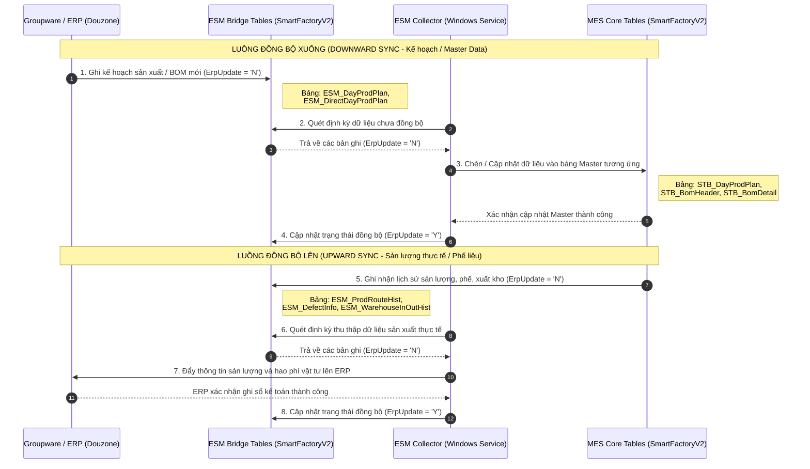

# KB_07 — Groupware & MES Integration

> **Màn hình liên quan:** Groupware (gw.vinatech.com), F330, C220, B310, B450, A230, A310
> ← [Về INDEX](KB_INDEX.md)

---

## 1. Tổng Quan

Hệ thống Groupware là nơi phê duyệt các quy trình **Mua Hàng**, **Kế Hoạch Sản Xuất** và **Master Data** trước khi dữ liệu được đồng bộ xuống MES và ERP.

---

## 2. Luồng Mua Hàng & Nhập Kho (Purchase Flow)

```
1. Purchase Order Registration (Groupware) → Khởi tạo đơn đặt hàng → đẩy xuống ERP
2. Arrival Confirmation (Groupware) → Khai báo hàng về đến công ty
   (Hàng nhập khẩu: khai báo B/L và thông tin hải quan)
3. F330 (MES) → Thủ kho nhận hàng thực tế + in tem nhãn
4. C220 (MES) → QC kiểm tra chất lượng → PASS IQC
5. Receiving Confirmation (Groupware) → Ghi nhận tồn kho vào ERP và MES
6. Purchase Resolution (Groupware) → Đóng sổ, thanh toán Vendor
```

**Debug nhanh:**
- Không nhập được F330 → Groupware chưa duyệt **Arrival Confirmation**?
- Không làm được Receiving Confirmation → C220 chưa PASS?

```sql
-- Kiểm tra trạng thái IQC của lô hàng
SELECT * FROM STB_MaterialQcInfo WHERE MaterialDocNo = 'Số_Tài_Liệu'
-- Nếu chưa có record hoặc QcResult != 'PASS' → QC chưa làm C220
```

---

## 3. Luồng Kế Hoạch Sản Xuất (PO & Production Plan)

```
Month Production Plan (Groupware)
    → Đăng ký PO theo tháng
    → BOM Version: 2001 (áp dụng cho Việt Nam)
    → Trạng thái: "Sản xuất" để xác nhận
    ↓
B310 (MES) → Thông tin PO được link xuống
    ↓
B450 (MES) → Kế hoạch theo ngày → Tạo LOT sản xuất + in tem
```

**Debug nhanh:**
- Không thấy PO trên MES (B310/B450) → Kiểm tra Groupware:
  - Đã "Xác nhận lô hàng" (chuyển sang Sản xuất) chưa?
  - BOM Version có đúng `2001` không?

```sql
-- Kiểm tra PO đã có trên MES chưa
SELECT PONo, MaterialCode, CompanyCode, PlanQty, CreateDateTime
FROM STB_ProductionOrderInfo
WHERE MaterialCode = 'Mã_Model' AND MONTH(CreateDateTime) = MONTH(GETDATE())
ORDER BY CreateDateTime DESC
```

---

## 4. Master Data (Đăng Ký Code & BOM)

**Luồng đăng ký mã vật tư mới:**
```
Item Registration Document (Groupware)
    → Loại: Cell / Module / Raw material
    → Sau khi duyệt → sync xuống A230 (STB_MaterialMaster)
    ↓
A230 (MES) → Kiểm tra mã đã sync chưa
A310 (MES) → Kiểm tra BOM đã sync chưa
```

**Đăng ký/cập nhật BOM:**
```
EBOM (ERP) → Khởi tạo BOM version, thêm NVL, định lượng
    ↓
BOM Addition & Update (Groupware) → Gửi duyệt thay đổi BOM
    → Sau khi duyệt → BOM có hiệu lực
    ↓
A310 (MES) → Kiểm tra BOM đã cập nhật chưa
```

```sql
-- Kiểm tra BOM của model trên MES
SELECT BH.BomHeaderNo, BH.MaterialCode, BH.BomVersion,
       BD.ChildMaterialCode, BD.Qty, BD.Unit, BD.RouteCode
FROM STB_BomHeader BH
JOIN STB_BomDetail BD ON BH.BomHeaderNo = BD.BomHeaderNo
WHERE BH.MaterialCode = 'Mã_Model'
ORDER BY BD.RouteCode, BD.ChildMaterialCode
```

---

## 5. Hành Chính & Nhân Sự

| Document | Mục đích | Lưu ý |
|----------|----------|-------|
| **Business Trip Document** | Đi công tác trong/ngoài nước | Phải làm **Business Trip Report** sau khi về để thanh toán |
| **Holiday Work Request** | Đăng ký đi làm ngày lễ/nghỉ | — |
| **Emp Request / Employee Retire** | Tuyển dụng / Nghỉ việc | — |
| **Draft Document** | Trình ký văn bản nội bộ | — |
| **Disbursement Document** | Yêu cầu thanh toán chi phí | Chọn đúng tài khoản VNĐ hoặc USD |
| **Partner Management** | Đăng ký Khách hàng / Nhà cung cấp mới | — |

---

## 6. Chỉ Định NCC ↔ NVL (F130 / F140)

**F130 — Từ 1 Nhà cung cấp, chỉ định được cung cấp những NVL nào:**
1. Tìm kiếm nhà cung cấp (trái) → Click chọn NCC
2. Bên phải hiển thị danh sách NVL
3. **Tick vào ô "Sử dụng"** cho từng NVL được phép → Lưu

**F140 — Từ 1 Vật liệu, chỉ định có thể mua từ những NCC nào:**
1. Tìm kiếm NVL (trái) → Click chọn NVL
2. Bên phải hiển thị danh sách NCC
3. **Tick vào ô "Sử dụng"** cho từng NCC được phép → Lưu

> **Tác động:** F130/F140 ảnh hưởng đến popup chọn NCC khi tạo tài liệu nhập kho ở F312.

```sql
-- Kiểm tra NCC nào được phép cung cấp NVL này
SELECT * FROM STB_MaterialVendorMapping
WHERE MaterialCode = 'Mã_NVL' AND IsUsed = 1

-- Thêm mapping mới (nếu cần)
INSERT INTO STB_MaterialVendorMapping (MaterialCode, VendorCode, IsUsed, CreateDateTime, CreateUserID)
VALUES ('Mã_NVL', 'Mã_NCC', 1, GETDATE(), 'vinaadmin')
```


## 7. Luồng Master Data Chi Tiết (A210, F130/F140)

**A210 — Đăng ký mã vật tư mới:**
```
Item Registration Document (Groupware)
    → Loại: Cell / Module / Raw material
    → Điền đầy đủ thông tin: MaterialCode, MaterialName, Unit, MaterialTypeCode
    → Sau khi duyệt → sync xuống A230 (STB_MaterialMaster)
    ↓
A230 (MES) — Kiểm tra mã đã sync chưa
    ↓
F130/F140 — Chỉ định NCC được phép cung cấp NVL này
    ↓
F110 — Cấu hình thuộc tính kho (IsLotUse, IsUseBarcode)
    ↓
A310 — Kiểm tra BOM đã có NVL này chưa
```

**Kiểm tra mã vật tư đã sync từ Groupware:**
```sql
-- Kiểm tra mã vật tư trong MES
SELECT MaterialCode, MaterialName, MaterialTypeCode, Unit, CreateDateTime
FROM STB_MaterialMaster
WHERE MaterialCode = 'Mã_NVL_Mới'
ORDER BY CreateDateTime DESC

-- Nếu chưa có → Kiểm tra Groupware đã duyệt chưa
-- Nếu đã duyệt nhưng chưa sync → Liên hệ IT kiểm tra job sync
```

---

## 8. 🔌 ESM Bridge Tables — Cầu Nối MES ↔ ERP (Douzone)

> **Verified against DB: 2026-06-10** — Tất cả schema đã được kiểm chứng trực tiếp từ `SmartFactoryV2`.

Hệ thống sử dụng **18 bảng ESM_*** làm "bridge" (cầu nối) để đồng bộ dữ liệu 2 chiều giữa MES và ERP (Douzone). Dữ liệu được một **Windows Service** (ESM Collector) thu thập định kỳ và đẩy sang ERP.

### 8.1 Danh sách bảng ESM và chức năng

| Bảng ESM | Chức năng | Hướng sync |
|----------|-----------|-----------|
| `ESM_DayProdPlan` | Kế hoạch SX ngày — từ Groupware/ERP đẩy xuống MES | ERP → MES |
| `ESM_DayProdPlanBatchLog` | Log batch sync (ghi nhận từng lượt đồng bộ) | Internal |
| `ESM_DayProdPlanError` | Ghi nhận lỗi khi sync kế hoạch ngày | Internal |
| `ESM_DayProdPlanNotData` | Các PO không có dữ liệu tương ứng | Internal |
| `ESM_DayProdPlanUpdateTarget` | Danh sách PO cần cập nhật | Internal |
| `ESM_DirectDayProdPlan` | Kế hoạch SX trực tiếp (bypass Groupware) | ERP → MES |
| `ESM_DirectDayProdPlanHead` | Header cho Direct PO | ERP → MES |
| `ESM_ProdRouteHist` | Sản lượng theo công đoạn — MES đẩy lên ERP | MES → ERP |
| `ESM_ProdRouteLotHist` | Sản lượng theo Lot — chi tiết hơn ProdRouteHist | MES → ERP |
| `ESM_RawMaterialInputHist` | NVL tiêu thụ trên chuyền — MES đẩy lên ERP | MES → ERP |
| `ESM_RawMaterialLotInputHist` | Chi tiết NVL theo Lot | MES → ERP |
| `ESM_WarehouseInOutHist` | Xuất/nhập kho NVL — MES đẩy lên ERP | MES → ERP |
| `ESM_DefectInfo` | Phế liệu/NG — MES đẩy lên ERP | MES → ERP |
| `ESM_DefectInfoErr` | Lỗi khi sync phế | Internal |
| `ESM_LotUpdateTarget` | Danh sách LotID cần update lên ERP | Internal |
| `ESM_SyncDeleteTarget` | Danh sách giao dịch cần xóa (revert) trên ERP | MES → ERP |
| `ESM_ProdCollectionSetting` | Cấu hình tần suất thu thập dữ liệu | Config |
| `ESM_QtPlanTemp` | Dữ liệu tạm cho kế hoạch quý | Internal |

### 8.2 Cơ chế sync — Cờ `ErpUpdate`

Mỗi bảng ESM có cột `ErpUpdate` (char):
- `'N'` = Chưa sync lên ERP — **ESM Collector sẽ pick up**
- `'Y'` = Đã sync thành công lên ERP
- `NULL` = Chưa xử lý

```sql
-- Kiểm tra dữ liệu chưa sync lên ERP
SELECT COUNT(*) AS PendingSync FROM ESM_ProdRouteHist WHERE ErpUpdate = 'N' OR ErpUpdate IS NULL

-- Kiểm tra batch log gần nhất
SELECT TOP 5 OrgDayPlanNo, BatchType, Method, CreateDateTime
FROM ESM_DayProdPlanBatchLog ORDER BY CreateDateTime DESC
```

### 8.3 Cấu hình ESM Collection (`ESM_ProdCollectionSetting`)

| CdCompany | CollectionType | Batch Size (Ngày/Đêm) | Sleep (ms) | Dawn Time |
|-----------|---------------|----------------------|-----------|-----------|
| `1000` (HQ - Hàn Quốc) | `erp` | 50/50 records | 1000ms | 01:00-07:00 |
| `1000` (HQ - Hàn Quốc) | `mes` | 200/200 records | 1000ms | 01:00-06:00 |
| `2000` (VVT - Bắc Giang/Bắc Ninh) | `erp` | 0/0 (disabled) | 1000ms | 01:00-07:00 |
| `2000` (VVT - Bắc Giang/Bắc Ninh) | `mes` | 200/200 records | 1000ms | 01:00-06:00 |
| `3000` (VVT_F3 - Hà Nam) | `mes` | 200/200 records | 1000ms | 01:00-06:00 |

> ⚠️ **Lưu ý & Phát hiện mới (2026-06-14):**
> - **CdCompany `3000`**: Được ánh xạ chính xác cho nhà máy **Hà Nam (VVT_F3)** trong dữ liệu thực tế của `ESM_DayProdPlan`.
> - **Chặn đồng bộ ERP**: Cả Việt Nam (`2000`) và Hà Nam (`3000`) đều không có tiến trình đồng bộ `erp` collection hoạt động (hồ sơ `2000` set Batch Size = 0, hồ sơ `3000` hoàn toàn không được cấu hình trong bảng). Chỉ có tiến trình thu thập `mes` hoạt động để đẩy ngược sản lượng lên ERP.

### 8.4 Sơ Đồ Tuần Tự Đồng Bộ Dữ Liệu (ESM Sync Sequence)

Dưới đây là sơ đồ tuần tự thể hiện cơ chế đồng bộ dữ liệu hai chiều (Download và Upload) giữa ERP/Groupware và MES Core thông qua trung gian các bảng ESM Bridge Tables:



---


## 9. 📊 BOM Management Chi Tiết

### 9.1 Cấu trúc BOM trong DB

```
STB_BomHeader (Header — 1 BOM cho 1 Model)
    ├── BomHeaderNo (PK)
    ├── MaterialCode (Mã model sản phẩm)
    ├── BomVersion (VN dùng: 2001, 2002)
    └── Status
         │
         └── STB_BomDetail (Chi tiết — N NVL cho 1 BOM)
              ├── BomHeaderNo (FK)
              ├── ChildMaterialCode (Mã NVL con)
              ├── Qty (Định mức tiêu thụ)
              ├── Unit (Đơn vị: PCS, KG, M...)
              └── RouteCode (Công đoạn sử dụng NVL này)
```

### 9.2 Tra cứu BOM

```sql
-- Xem BOM đầy đủ của 1 model
SELECT BH.BomHeaderNo, BH.MaterialCode AS ModelCode, BH.BomVersion,
       BD.ChildMaterialCode AS NVL_Code, BD.Qty, BD.Unit, BD.RouteCode
FROM STB_BomHeader BH
JOIN STB_BomDetail BD ON BH.BomHeaderNo = BD.BomHeaderNo
WHERE BH.MaterialCode = 'ECVT30-367' -- Thay mã model
  AND BH.BomVersion = '2002'
ORDER BY BD.RouteCode, BD.ChildMaterialCode

-- Kiểm tra BOM Revision (khi BOM thay đổi)
SELECT * FROM STB_BomDetail_Revision WHERE BomHeaderNo IN (
    SELECT BomHeaderNo FROM STB_BomHeader WHERE MaterialCode = 'ECVT30-367'
)
ORDER BY ChangeDateTime DESC
```

### 9.3 BOM Version đang dùng
| BomVersion | Ý nghĩa | Ghi chú |
|-----------|---------|---------|
| `2001` | BOM Cell line cũ | VN cũ |
| `2002` | BOM Cell line mới (đang active) | **Dùng chính** |
| `1` | BOM Electrode | Electrode |

---

## 10. 🏗️ Danh Sách Kho Đầy Đủ (Verified 2026-06-10)

> Truy vấn từ `STB_MaterialWarehouse WHERE IsUsed = 1`. Tổng: **100+ kho active**.

### 10.1 Nhóm Kho Chính Theo Nhà Máy

#### Bắc Ninh (VVT_F1)

| Mã kho | Tên | Chức năng |
|--------|-----|-----------|
| `ROH_VN_WH` | Kho NVL chính | Kho nguyên vật liệu nhập khẩu/nội địa |
| `HOLDING_VN_WH` | Kho tạm giữ (Hold) | NVL chưa qua IQC hoặc lỗi Đặc tính 10 |
| `ROUTE_VN_WH` | Kho trên chuyền | NVL đã xuất lên line sản xuất |
| `PROD_VN_WH` | Kho bán thành phẩm | Sản phẩm đang trong quy trình |
| `PROD_STBY_VN_WH` | Kho chờ SX | NVL chờ cấp cho sản xuất |
| `MODULE_VN_WH` | Kho Module | NVL/BTP cho Module line |
| `NG_RAW_VN_WH` | Kho NG | NVL không đạt chất lượng |
| `HEADQUARTER_VN_WH` | Kho trụ sở | Hàng xuất về HQ |
| `KHO_TIEU_HUY` | Kho tiêu hủy | NVL/SP cần tiêu hủy |
| `NOI_DIA_VN` | Nội địa | Hàng mua nội địa |
| `NUOC_NGOAI_VN` | Nước ngoài | Hàng nhập khẩu |
| `TOTAL_MATERIALS` | Tổng NVL | Aggregation |

#### Bắc Giang (VVT_F2)

| Mã kho | Tên | Chức năng |
|--------|-----|-----------|
| `ROH_BG_WH` | Kho NVL BG | Tương tự ROH_VN_WH |
| `HOLDING_BG_WH` | Hold BG | Tương tự HOLDING_VN_WH |
| `ROUTE_BG_WH` | Trên chuyền BG | `IsRouteWarehouse = 1` |
| `PROD_BG_WH` / `PROD_STBY_BG_WH` | BTP/Chờ SX BG | — |
| `MODULE_BG_WH` | Module BG | — |

#### Bắc Giang 2 (VVT_F4)

| Mã kho | Tên | Chức năng |
|--------|-----|-----------|
| `MODULE_BG2_WH` | Module BG2 | Module line tại BG2 |
| `ROUTE_BG2_WH` | Trên chuyền BG2 | `IsRouteWarehouse = 1` |

#### Hà Nam (VVT_F3)

| Mã kho | Tên | Chức năng |
|--------|-----|-----------|
| `ROH_HN_WH` | Kho NVL HN | — |
| `HOLDING_HN_WH` | Hold HN | — |
| `ROUTE_HN_WH` | Trên chuyền HN | `IsRouteWarehouse = 1` |
| `PROD_HN_WH` / `PROD_STBY_HN_WH` | BTP/Chờ SX HN | — |
| `MODULE_HN_WH` | Module HN | — |
| `SLITTING_HN_WH` | Slitting HN | Kho Slitting riêng cho HN |

#### Hưng Yên (VVT_F5)

| Mã kho | Tên | Chức năng |
|--------|-----|-----------|
| `ROH_HY_WH` | Kho NVL HY | — |
| `HOLDING_HY_WH` | Hold HY | — |
| `ROUTE_HY_WH` | Trên chuyền HY | — |
| `MODULE_HY_WH` | Module HY | — |

### 10.2 Phân loại kho theo `IsRouteWarehouse`

| IsRouteWarehouse | Ý nghĩa | Ví dụ |
|:---:|---------|-------|
| `1` (True) | Kho ảo trên chuyền — NVL đã xuất lên line | `ROUTE_VN_WH`, `ROUTE_BG_WH`, `ROUTE_HN_WH` |
| `0` hoặc `NULL` | Kho vật lý thực tế | `ROH_VN_WH`, `HOLDING_VN_WH` |

> ⚠️ **Tại sao quan trọng?** Khi debug lỗi "NVL đã xuất nhưng F721 vẫn thấy tồn", kiểm tra `MaterialWarehouseCode`:
> - Nếu = `ROUTE_*_WH` → NVL đang trên chuyền (đã xuất thành công)
> - Nếu = `ROH_*_WH` → NVL vẫn trong kho (chưa xuất hoặc đã revert)

---

*Cập nhật: 2026-06-10 — Bổ sung ESM Bridge Tables, BOM Management, Danh sách kho từ DB thực tế*
