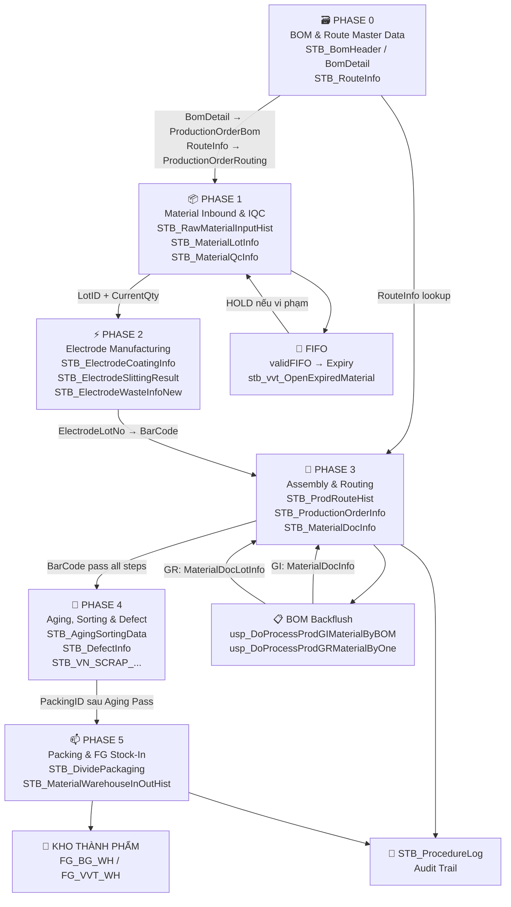

# KB_10 — Kiến Trúc & Luồng Dữ Liệu (Architecture & Data Flow)

> **Mục đích:** Hiểu bản chất thiết kế của hệ thống MES NAIS (Hàn Quốc) đang được sử dụng tại Vinatech, bao gồm sơ đồ luồng dữ liệu qua các Phase, các Stored Procedures chính và cách thức hoạt động của metadata framework.
> ← [Về INDEX](KB_INDEX.md)

---

## 0. 🥖 Bản Dịch Bình Dân: Hiểu Sơ Đồ Luồng Dữ Liệu MES Trong 5 Phút

> **Dành cho ai?** Tài liệu này dành cho bất kỳ ai (kể cả không biết IT hay Database) muốn hiểu hệ thống NAIS MES đang làm cái gì dưới xưởng.
> **Cách đọc:** Hãy tưởng tượng luồng MES giống như **Quy trình mở một Tiệm Bánh Tráng Trộn Sinh Viên.**

### GIAI ĐOẠN 0: Giao thức từ Tổng công ty (Phase 0 - Master Data)
*Tưởng tượng:* Bạn chuẩn bị khai trương tiệm bánh tráng.
*   **Hệ thống ERP (Kế toán tổng):** Đây là Ông chủ lớn trên trụ sở. Ông ấy gửi cho bạn 2 cuốn sổ:
    1.  **Sổ Nguyên Liệu (M_Materials):** Danh sách các món ăn (Bánh tráng, Xoài, Bò khô, Lạc rang...).
    2.  **Sổ Công Thức (M_BOMs):** Dạy bạn 1 suất bánh tráng thì cần 100g bánh, 20g xoài, 10g bò khô. (Chính là cái gọi là `BomVersion`).
*   **Hành động của MES:** MES lấy 2 cuốn sổ này cất vào tủ sắt (`Cấu Hình Master Data`) để làm thước đo chuẩn mực không ai được làm sai.

### GIAI ĐOẠN 1: Nhận chỉ tiêu bán hàng bắt buộc (Phase 1 - Lệnh Sản Xuất)
*Tưởng tượng:* Sáng sớm, Quản lý giao chỉ tiêu bán hàng trong ngày.
*   **PO Tháng (B310):** Chỉ tiêu tháng này phải bán được 30.000 bịch bánh tráng.
*   **Kế hoạch Ngày (B450 - Kế hoạch Ca):** Chia nhỏ ra, Cửa hàng số 1 (Line 1) ca sáng hôm nay (Shift 1) phải làm xong 1.000 bịch.
*   **⚠️ CÚ CHỐT QUAN TRỌNG NHẤT (`Nút FixDayPlan`):** 
    Quản lý vạch nếp xong phải **Ký Tên Đóng Dấu Chốt Sổ (IsFixed = True)**. Nếu quản lý quên ký, nhân viên bên dưới tuyệt đối không được phép luộc trứng hay thái xoài. (Máy quét dưới xưởng sẽ văng lỗi *Plan is locked*).

### GIAI ĐOẠN 2: Đi chợ nhập nguyên liệu (Phase 2 - Kho NVL)
*Tưởng tượng:* Xe tải ba gác chở Bánh Tráng, Xoài, Bò khô tới trước cửa tiệm.
*   **Bơm vào kho (F330):** Bạn không vác cả bao tải 50kg bò khô ném vào bếp. Bạn lấy túi zip chia nhỏ ra mỗi túi 1kg. Dán lên mỗi túi zip một tờ giấy ghi ID: "Bò Khô - Lô 01". (Đây chính là quá trình **Tạo Mã Barcode nhỏ (`M_Lots`)**).
*   **⚠️ CÚ CHỐT SỐNG CÒN (Đặc Tính 10):** 
    Lúc dán tem, bạn **BẮT BUỘC phải ghi Hạn Sử Dụng (VD: Hết hạn ngày 30/12)**. Nếu bạn quên ghi ngày ném sổ, túi bò khô đó lập tức bị "Bảo vệ" ném vào phòng Giam Lỏng (kho `Holding`). Tuyệt đối cấm mang vào bếp!
*   **Thử Độc (C220 - IQC):** Quản lý chất lượng nếm thử miếng bò mốc không? Ngon (Pass) thì cho lên kệ. Dở (Fail) thì trả lại thằng bán.
*   **Nhập Bếp (F430 - Move Inventory):** Xách cái túi Zip 1kg Bò khô đó từ "Kho Ngoài" (`SubInv: Main`) ném vào "Bàn Bếp" (`SubInv: Line`) để chuẩn bị trộn.

### GIAI ĐOẠN 3: Bếp trưởng trộn bánh và sự tích cấn trừ kho (Phase 3 - Sản Xuất & Tự Kiểm)
*Tưởng tượng:* Quá trình trộn bánh tráng thực tế của Bếp trưởng. (Trái tim của hệ thống MES, nơi dữ liệu dao động dữ dội nhất).
*   **Bắt đầu làm (B540 - Quét mã sinh Lệnh):** 
    Bếp trưởng xách túi Bò Khô 1kg đó ra, lấy "súng bắn bill" tít một phát vào mã vạch trên túi zip. 
    Lúc này, hệ thống sẽ khai sinh ra một chiếc Nồi Trộn Ảo (phần mềm gọi là `W_WIPLots` - Lot Bán Thành Phẩm). Cái nồi này được dán nhãn: **"Đang làm Bịch Bánh Tráng Số 001. Trạng thái: ĐANG NẤU (Run)"**.
*   **⚠️ CÚ PHÉP THUẬT QUAN TRỌNG NHẤT: BACKFLUSH (Cấn trừ tồn kho tự động):**
    Ngay khi tiếng "tít" vang lên, một bóng ma vô hình trong máy tính (gọi là `SP_CONSUME`) sẽ lôi cuốn **Sổ Công Thức (BomVersion)** ra dò.
    *   Sổ ghi: "1 suất hao 10g Bò khô".
    *   Bóng ma sẽ chạy thẳng vào hệ thống máy tính của cái túi Zip Bò khô 1kg kia... nó tự động dùng bút tẩy con số 1000g đi, viết lại thành **990g**. 
    *   => *Đó chính là Backflush! Công nhân không cần phải tự chép tay sổ kho báo "hôm nay tôi xài hết 10g", máy tính đã trừ nợ dùm họ một cách vô hình.*
*   **Kiểm tra Giữa Chiều (B597 - Bếp tự nếm):** 
    Bếp phó nếm thử xem mẻ bánh này vừa miệng chưa. Ghi vào sổ tay nội bộ của nhà bếp (Bảng dữ liệu này mang cờ `TEST`). 
    *Lưu ý: Cái này chỉ là bếp tự kiểm tra nhau cho yên tâm, không có giá trị pháp lý với cơ quan chức năng.*
*   **Khai Báo Phế Liệu (B530 - Báo Lỗi / Defect):** 
    Đang trộn thì bếp trưởng hắt xì hơi văng nước bọt vào nồi! Rất tiếc, cả mẻ bánh đó phải đổ sọt rác. 
    Lúc này thợ phải bấm nút "Khai Báo Lỗi" trên màn hình. Họ chọn mã lỗi C132: "Lỗi mất vệ sinh". Hệ thống sẽ trừ điểm KPI ca làm việc đó. 
    *(⚠️ Chú ý: Cuối giờ chiều, 10 thằng thợ cùng thi nhau bấm "Lưu Lỗi" 1 lúc, cửa hàng sẽ nghẽn mạng! Thợ IT gọi cái này là `Deadlock Table` do nghẽn cổ chai dữ liệu).*
*   **Thanh Tra Y Tế Gõ Cửa (C443 - PQC Độc Lập):** 
    Đây là thanh tra của Cục Vệ sinh An toàn thực phẩm (Phòng QC riêng biệt). Họ lấy mẫu mang về phòng Lab xét nghiệm vi khuẩn. Dữ liệu của họ lưu vào một cuốn sổ xịn có Mộc Đỏ (Cờ `QUALITY`).
    *   **Nếu Thanh tra bảo MẶN QUÁ (Fail):** Chiếc "Nồi Trộn 001" ngay lập tức bị cảnh sát niêm phong! Phần mềm đổi Trạng thái nhãn nồi thành **HOLD (Khóa/Giam lỏng)**. Không ai được quyền đụng vào nồi bánh này để mang đi đóng gói.
    *   **Nếu Thanh tra OK (Pass):** Nồi bánh dán mộc XANH, tiếp tục chờ đi sang phòng Đóng Hộp.

### GIAI ĐOẠN 4 & 5: Đóng hộp và dán tem bảo hành (Phase 4 & 5 - Đóng gói & Đầu ra)
*Tưởng tượng:* Nhét 50 bịch bánh nhỏ vào 1 cái Thùng Cartoon lớn giao Shipper.
*   **Tạo thùng bự (B523 - Đóng Packing):** Gom 50 bịch bánh con nhét vô 1 Thùng Carton bự. Máy sinh ra mã vạch bự, dán lên thùng (Barcode `Outer`).
*   **⚠️ LƯU Ý MỰC IN:** Luật của xưởng là tem Thùng Bự chỉ được phát ra duy nhất 1 lần để chống làm giả nhái. Máy in rách tem thì khóc ròng, phải gọi IT vào phá khóa (`Void`) mới in lại được.
*   **Khám nghiệm tử thi lần cuối (C530 - Đo 20 Params):** Thùng đóng xong, QC lôi ra đo cân nặng, đo độ mặn ngọt, độ giòn bề mặt (20 thông số). 
*   **⚠️ CÚ CHỐT VÀO KHO (EvaluateResult = OK):** Đo xong phải đóng dấu MỘC ĐỎ chữ "OK / NGON". Cột dữ liệu thiếu chữ OK này thì kho Thành phẩm (Bắc Ninh/Bắc Giang) kiên quyết không mở cửa cho xe tải đổ hàng vào. (Lệnh bị khóa `Hold_Line_FG`).

### GIAI ĐOẠN CỐT: Xe tải lăn bánh & Thu tiền (Phase 6 - Kết xuất ERP)
*Tưởng tượng:* Shipper tới bốc thùng hàng đi giao.
*   **In tem ra đường (B453):** Dán cái mã bưu điện ngoài cùng lên Thùng Cartoon. Trên phần mềm phải đánh dấu Tick vô cái ô "Là Tem Ngoài" (`IsOuterPrinted`). Không tick ô này, ông bảo vệ cổng không cho ra.
*   **Thu tiền (Job Sync ERP):** Khi Thùng Cartoon bước qua khỏi cổng điện tử nhà máy, Hệ thống Tự Động Gửi 1 Vạn Tin Nhắn SMS (`Trigger Background Job`) bắn báo cáo về Kế Toán Trụ Sở. 
*   **Kết cục:** Kế toán nghe "Ting Ting" -> Xuất Hóa Đơn -> Đếm tiền. Cây gia phả Lô sản phẩm khép lại một kiếp luân hồi êm đẹp.

---

## 1. 🏛️ Kiến Trúc Hệ Thống (NAIS Architecture)

### 1.1 Tổng Quan Kiến Trúc (The Three Pillars)

> **Câu hỏi cốt lõi:** Khi OP bấm nút "Save" trên màn hình B597 — chuyện gì xảy ra phía sau?

Hệ thống được xây dựng trên **3 Trụ cột chính**:

*   **Trụ cột 1 — Metadata (SmartFramework):** *"UI chỉ là vỏ, não nằm trong DB"*
    MES không fix cứng hành vi của từng nút bấm trong code phần mềm (C#/Java). Thay vào đó:
    *   Mỗi nút "Save" chỉ gọi 1 tên SP được cấu hình trong bảng `STB_ScreenObjects`.
    *   Muốn thay đổi hành vi → sửa trong DB, **không cần đóng gói lại phần mềm**.
    
    ```
    OP bấm "Save" → NAIS Framework đọc STB_ScreenObjects → Gọi đúng SP → SP xử lý → Ghi DB
    ```

*   **Trụ cột 2 — Stored Procedures:** *"Mọi hành động đều có dấu vết"*
    Mọi thao tác của OP đều được ghi vào bảng lịch sử (`Hist`) thông qua SP. SP là nơi chứa toàn bộ:
    *   **Validation** (kiểm tra hợp lệ trước khi lưu).
    *   **Business logic** (tính toán, kiểm tra FIFO, kiểm tra hạn dùng).
    *   **Ghi dữ liệu** (INSERT/UPDATE vào DB).

*   **Trụ cột 3 — Recursive Logic (Tính toán trực tiếp):** *"Tồn kho sản xuất tự cập nhật qua SP, không dùng triggers"*
    > ⚠️ **Lưu ý (Audit 2026-05-05):** Hệ thống **không sử dụng Triggers trên các bảng sản xuất chính** (như `STB_ProdRouteHist`, `STB_SetInfo`) để tự động trừ kho/cập nhật tồn kho sản phẩm.
    
    Thay vào đó, logic cập nhật tồn kho sản xuất được thực hiện **trực tiếp** thông qua chuỗi gọi Stored Procedure:
    `usp_DoProcessProdRouteHist` → `usp_DoProcessProdGIMaterialByBOM` → `usp_DoCreateMaterialDocLotInfoNotUsedBarcode`.
    *(Lưu ý: Đối với phân hệ kho WMS vật tư, hệ thống vẫn sử dụng Trigger liên hoàn như `tgMaterialLotInfoForUpdate` trên bảng `STB_MaterialLotInfo` để đồng bộ số lượng tồn kho tổng sang `STB_MaterialStock`).*

### 1.2 Kiến Trúc Vận Hành NAIS (NAIS Framework Architecture)

> **Nguyên lý cốt lõi:** NAIS (SmartFramework) là hệ thống **Metadata-Driven**. Giao diện (UI) không chứa logic, mọi hành động (Click, Search, Save) đều được cấu hình trong database metadata để gọi Stored Procedure.

#### Phân vùng Database
Hệ thống Vinatech MES chia làm 2 cơ sở dữ liệu (DB) chính:
*   **`SmartFactoryV2`**: Chứa toàn bộ dữ liệu nghiệp vụ (Sản lượng, Tồn kho, Lệnh sản xuất, BOM, Route).
*   **`SmartFramework`**: Chứa Metadata hệ thống (Menu, User, Quyền hạn, Cấu hình giao diện, Template nhãn in `STB_LabelInfo`).

#### Cách tìm Logic đằng sau bất kỳ màn hình nào
Để hiểu thấu đáo hệ thống, bạn không cần đọc code C#, chỉ cần truy vấn database `SmartFramework` với tài khoản `vanduc`:

**Bước 1: Tìm Tên Màn Hình (ScreenName)**
Tra cứu `Caption` (hiển thị trên tab) và `Name` (ID kỹ thuật) trong `STB_ScreenInfo`.

**Bước 2: Tìm SP tương ứng**
```sql
SELECT ScreenName, ObjectName, ObjectType, Description 
FROM SmartFramework.dbo.STB_ScreenObjects 
WHERE ScreenName = 'VVT_MaterialStockList' -- Thay bằng tên màn hình
```
*   `SearchFunction`: SP dùng để nạp dữ liệu vào Grid (lưới).
*   `ExecuteFunction`: SP dùng khi nhấn nút Save/Delete/Process.

---

## 2. 🗺️ Luồng Dữ Liệu Tổng Quan (End-to-End Data Flow)

### 2.1 Sơ đồ luồng dữ liệu qua 6 Phase



### 2.2 Vòng Đời & Phả Hệ Dữ Liệu (Data Lifecycle & Genealogy)

> **Hình dung đơn giản:** Giống như một người đi qua nhiều trạm hải quan. Mỗi trạm đóng dấu (= ghi record). Truy vết = xem lại tất cả các dấu đã đóng trên hộ chiếu.

#### Khái niệm cốt lõi:
1. **ControlNo / Barcode**: Chứng minh thư của 1 viên tụ điện. Sinh ra tại máy cuốn, theo suốt đến khi đóng thùng (`VVPR292R710617`).
2. **LotID**: Chứng minh thư của 1 kiện NVL trong kho. Prefix `ML...` = do kho cấp.
3. **PONo**: Số lệnh sản xuất. Gom nhiều Barcode vào 1 nhóm để sản xuất cùng 1 đợt.
4. **RouteCode**: Mã công đoạn. Từ `V-01` (đầu) đến `V-28` (đóng gói). Barcode phải đi đủ các bước theo thứ tự.
5. **ProductGroupCode**: Nhóm phân loại NVL. Dùng trong validation khi OP scan (`ELECTROLYTE`, `SLEEVE`, `CASE`).

#### Truy Vết 360 Độ (Golden Query)
Câu lệnh sau truy vấn toàn bộ "lịch sử cuộc đời" của một viên tụ từ lúc sinh ra đến khi vào thùng:
```sql
SELECT 
    PRH.ControlNo AS [Mã vạch SP], 
    PRH.PONo AS [Lệnh SX], 
    RI.RouteName AS [Công đoạn],
    PRH.CreateDateTime AS [Giờ quét],
    DP.PackingID AS [Mã Thùng hàng],
    DP.ParentPackingID AS [Mã BigBox]
FROM STB_ProdRouteHist PRH WITH(NOLOCK)
LEFT JOIN STB_RouteInfo RI WITH(NOLOCK) ON PRH.RouteCode = RI.RouteCode
LEFT JOIN STB_DividePackaging DP WITH(NOLOCK) ON PRH.ControlNo = DP.LotNo
WHERE PRH.ControlNo = '20260409000089' -- Thay mã vạch cần tra vào đây
ORDER BY PRH.CreateDateTime ASC
```

### 2.3 Bảng Ánh Xạ Màn Hình (Screen ID) Theo Từng Phase Quy Trình

| Phase sản xuất | Nhóm Screen ID | Chức năng nghiệp vụ liên quan |
|---|---|---|
| **PHASE 0** <br> (Master Data) | A210, A230, A310, A320, A410, A418, A419, A460, Z220, Z330, Z410 | Khai báo NVL, BOM, Route, tiêu chuẩn đóng gói, nhãn in và tài khoản. |
| **PHASE 1** <br> (Kho NVL & IQC) | F312, F330, F110, F721, F741, F430, C121, C122, C220, F130, F140 | Tạo PO, kiểm tra đầu vào (IQC), nhập kho, in tem NVL, tách lô, quản lý vị trí kho. |
| **PHASE 2** <br> (Sản xuất Điện cực) | B802, B552, F743-F748, C243 | Sản xuất và kiểm tra chất lượng cuộn điện cực (Coating, Slitting). |
| **PHASE 3** <br> (Lắp ráp & Routing) | B310, B450, B452, B530, B540, B597, B782, K101, K109 | Kế hoạch ngày, tạo Lot sản xuất, ghi nhận sản lượng công đoạn, nạp NVL. |
| **PHASE 4** <br> (PQC & Defect) | C131, C132, C141, C143, C443, C430, C321, B598 | Kiểm tra chất lượng công đoạn (PQC), quản lý phế, spec kiểm tra theo model. |
| **PHASE 5** <br> (Đóng gói & OQC) | B351, B453, B523, B525, B528, B717, B781, B789, C451, C510, C512, C530, C540, C560 | In tem pack, gộp box cell/module, đóng thùng xuất hàng, kiểm tra chất lượng đầu ra (OQC). |
| **PHASE 6** <br> (Thành phẩm & Kho) | FG00, FG01, FG02, HN551, HN866, HNC321, HN00, HN101 | Nhập/xuất kho thành phẩm, quản lý tồn kho thành phẩm (Bắc Ninh, Bắc Giang, Hà Nam). |

---

## 3. 🏢 Ma Trận Nhà Máy (The Factory Matrix - VNT vs VVT vs HN)

> **Nhất quán trong sự khác biệt:** MES Vinatech quản lý nhiều nhà máy với các quy tắc đặt tên và logic riêng biệt.

| Đặc điểm | VNT (Bắc Ninh — Electrode) | VVT (Bắc Giang — Cell/Module) | HN (Hà Nam — VVT_F3) |
|-----------|---------------------------|---------------------------|--------------------------|
| **Tiền tố Route** | `E-xx` (E-01, E-02...) | `V-xx` (V-01, V-22...), `MV-xx` (Module) | `VE-xx` (VE01, VE06...) |
| **Mã WorkCenter** | `VNT_F1` ~ `VNT_F5` | `VVT_F1`, `VVT_F2`, `VVT_F4` | `VVT_F3` |
| **Logic Đóng gói** | Standard Packing | Merge Box/Donggoi (VVT logic) | `Vietnam_Donggoi_HN` |
| **Quy tắc Barcode**| `VV...` prefix | `VV...` (Cell), `VJ...` (converted) | `VE...` (VE260507-001) |

---

## 4. ⚙️ Phân Tích Stored Procedures Theo Phase

### Phase 0 — Master Data: BOM & Routing
*Nền tảng được tham chiếu bởi tất cả phase sau.*
*   `usp_BomHeader_iud`, `usp_BomDetail_iud`, `usp_RouteInfo_iud`
*   **Kỹ thuật:** `MERGE + OPENXML + CURSOR`. Client gửi XML, SP dùng Cursor duyệt từng dòng để Upsert.

### Phase 1 — Material Inbound & Quality Control (WMS & IQC)
*Nhập NVL, kiểm tra chất lượng (IQC), quản lý Lot theo FIFO.*
*   `usp_RawMaterialInputHist_iud` & `usp_Vietnam_RawMaterialInputHist_uid`: Validation NVL đầu vào. *Lưu ý: Logic kiểm tra BOM hiện đang bị khóa tạm thời (Nordex Audit).*
*   `usp_MaterialQcInfo_iud`: Ghi kết quả IQC. Nếu Fail → `STB_NCR_Report`.
*   `usp_MaterialWarehouseInOutHist_iud`: Ghi lịch sử xuất/nhập, gọi `usp_VVTMaterialWarehouse_validFIFO` để chặn vi phạm FIFO hoặc Hết hạn.

### Phase 2 — Electrode Manufacturing (Điện cực)
*Theo dõi quá trình: Coating → Rolling Press → Slitting.*
*   `pop_Electrode_Coating_iud`: Upsert thông số phủ. Trừ `CurrentQty` của NVL (`STB_MaterialLotInfo`), ghi `STB_MaterialWarehouseUsageHist`. Dùng `BEGIN TRAN`.
*   `usp_ElectrodeSlittingResult_iud`: Ghi nhận các cuộn nhỏ sau khi cắt.
*   `usp_ElectrodeWasteInfoNew_iud`: Ghi nhận phế liệu điện cực.

### Phase 2.5 — Lập Kế Hoạch & Chuẩn Bị Sản Xuất
*Nối Master Data với Sản xuất thực tế.*
*   `usp_ProductionOrderRouting_iud`: Copy `STB_RouteInfo` sang `STB_ProductionOrderRouting`. Cài đặt `RouteIndex`, `IsInputRoute`, `IsOutputRoute`.
*   `usp_SetInfo_iud`: "Khai sinh" `ControlNo` (Barcode) cho từng viên tụ.

### Phase 3 — Assembly & Production Routing (Trái tim hệ thống)
*Theo dõi từng sản phẩm qua chuỗi công đoạn.*
*   `usp_CheckInputRawMaterialCodeForProduct`: Validation Gate. Chặn route nếu chưa nạp đủ NVL theo BOM (tại V-23, V-24).
*   **`usp_DoProcessProdRouteHist` (Core Engine)**: Ghi lịch sử quét vào `STB_ProdRouteHist`. Validate số lượng (không được vượt công đoạn trước).
*   `usp_DoProcessProdGIMaterialByBOM`: Được gọi ở mọi Route. Trừ tồn kho NVL (Backflush) tự động.
*   `usp_DoProcessProdGRMaterialByOne`: Chỉ gọi ở bước cuối (`IsOutputRoute=1`). Tạo phiếu nhận thành phẩm (GR).

### Phase 4 — Aging, Sorting & Defect Management
*Đo kiểm và phân loại chất lượng.*
*   `usp_InsertDataAgingAndSorting`: Ghi kết quả Aging (Pass/Fail/A/B/C).
*   `usp_DefectInfo_iud`: Ghi nhận hàng NG.
*   `usp_Add_VN_SCRAP_WEIGHSCALE_PRODUCTIONS`: Cân phế liệu → quy đổi số lượng.

### Phase 5 — Packing & FG Stock-In (Đóng gói)
*Đóng gói và nhập kho thành phẩm.*
*   `usp_DivideAndPrintPackagingLabels`: Chia gói (Túi/Inner box) → `STB_DividePackaging`. Trả về dữ liệu in tem. Đọc 11 bảng khác nhau.
*   `usp_Vietnam_DoProcessBigBoxPacking_VVT_F3`: Gộp túi thành thùng Carton (Big Box).
*   `usp_VN_FinishGood_BG_StockIn_iud`: Nhập kho thành phẩm vào `FG_BG_WH`.

### Phase 6 — Warehouse & Export (Xuất kho)
*Quản lý tồn kho thực tế và xuất hàng đi khách.*
*   `ImportWarehouseFinshGood_uid`: Khai báo hàng từ xưởng vào kho Inventory (`STB_VN_FINISHGOODS_HN_New`).
*   `ExportWarehouseFinshGood_uid`: Xuất hàng, trừ tồn kho, ghi nhận Invoice.

---

## 5. 📘 Từ Điển Bảng & Stored Procedures (Metadata Dictionary)

### 5.1 Sơ đồ quan hệ giữa các nhóm bảng

```
            ┌──────────────────────────────────────────────────────────┐
            │                  MASTER DATA (Nhóm 1)                     │
            │   STB_BomHeader ←→ STB_BomDetail                         │
            │   STB_RouteInfo   STB_MaterialMaster                     │
            │   STB_ModelBasicInfo  STB_UserInfo  STB_LineInfo          │
            └──────────────────────┬────────────────────────────────────┘
                                   │ copy xuống
            ┌──────────────────────▼────────────────────────────────────┐
            │              KẾ HOẠCH & LỆNH SX (Nhóm 2)                  │
            │   STB_DayProdPlan → STB_ProductionOrderInfo                │
            │   STB_ProductionOrderRouting (← RouteInfo)                 │
            │   STB_ProductionOrderBom (← BomDetail)                     │
            │   STB_SetInfo (ControlNo/Barcode)                          │
            │   STB_LineRouteMapping                                     │
            └────────┬───────────────────────────┬──────────────────────┘
                     │                           │
      ┌──────────────▼──────────┐   ┌────────────▼──────────────────────┐
      │  QUẢN LÝ VẬT TƯ (Nhóm 3) │   │  ROUTING & TRACKING (Nhóm 5)      │
      │  STB_MaterialLotInfo ◄──────│──── STB_ProdRouteHist               │
      │  STB_MaterialStock         │   │  (↑ mỗi scan barcode = 1 record)  │
      │  STB_MaterialDocInfo       │   │                                    │
      │  STB_MaterialDocDetail     │   │  Triggers:                         │
      │  STB_MaterialDocLotInfo    │   │   → GI: MaterialDocInfo/Detail     │
      │  STB_MaterialDocLotInfo    │   │   → GR: MaterialDocInfo/Detail/Lot │
      │  STB_MaterialWarehouse...  │   └────────────────────────────────────┘
      │  STB_RawMaterialInputHist  │
      └──────────────┬─────────────┘
```

### 5.2 SP → Table Mapping (Quick Reference)

| Stored Procedure | Tables READ | Tables WRITE |
|-----------------|-------------|--------------|
| `usp_Prod_Daily_Input_Schedule_iud` | — | Exec SP nhánh (`usp_Medium_Daily_Input`) |
| `usp_ProductionOrderRouting_iud` | — | **MERGE** STB_ProductionOrderRouting |
| `usp_SetInfo_iud` | — | **MERGE** STB_SetInfo |
| `usp_BomHeader_iud` | BomHeader, UserInfo | **MERGE** BomHeader; UPDATE BomDetail |
| `usp_RouteInfo_iud` | RouteInfo | **MERGE** RouteInfo |
| `usp_RawMaterialInputHist_iud` | — | INSERT RawMaterialInputHist, MaterialLotInfo |
| `usp_MaterialQcInfo_iud` | QcInfo, IQcDefectReport, NCR_REPORT | **MERGE** QcInfo; UPDATE IQcDefectReport, NCR_Report |
| `usp_MaterialWarehouseInOutHist_iud`| MaterialLotInfo, MaterialMaster, stb_vvt_OpenExpiredMaterial, ... | INSERT MaterialWarehouseInOutHist |
| `usp_VVTMaterialWarehouse_validFIFO`| MaterialLotInfo, MaterialWarehouseInOutHist, MaterialDocLotInfo | — (Chỉ Validate) |
| `pop_Electrode_Coating_iud` | MaterialLotInfo, MaterialWarehouseInOutHist, ... | **MERGE** ElectrodeCoatingInfo; UPDATE MaterialLotInfo |
| `usp_DoProcessProdRouteHist` | ProdRouteHist, ProductionOrderInfo, ProductionOrderRouting, RouteInfo, SetInfo | INSERT ProdRouteHist, ProcedureLog; UPDATE LineRouteMapping... |
| `usp_DoProcessProdGIMaterialByBOM` | LineRouteMapping, MaterialStock, ProductionOrderBom... | INSERT MaterialDocDetail, MaterialDocInfo |
| `usp_DivideAndPrintPackagingLabels` | MaterialLotInfo, ModelBasicInfo, PackingLabelSpec, SetInfo... | INSERT DividePackaging |
| `usp_VN_FinishGood_BG_StockIn_iud` | MaterialLotInfo | INSERT MaterialWarehouseInOutHist; UPDATE MaterialLotInfo |

### 5.3 Key Identifiers (Chuỗi định danh)

```
VendorBarcode (Từ nhà cung cấp)
    │
    ↓ (Nhập kho)
LotID (Chứng minh thư nguyên liệu kho: ML...)
    │
    ├── ElectrodeLotNumber (Mã cuộn điện cực Phase 2)
    │
    └── ControlNo / Barcode (Mã viên tụ / Sản phẩm Phase 3+)
            │
            └── PackingID (Mã túi / Hộp nhỏ Phase 5)
                    │
                    └── BigBoxID (Thùng Carton bự Phase 5)
```

---

## 6. 🛠️ Nhật Ký Tùy Chỉnh & Gỡ Lỗi Nâng Cao

### 6.1 Lỗi không đăng nhập được MES
> Hướng dẫn chi tiết cách xử lý lỗi đăng nhập MES, vui lòng xem tại [KB_01_UI_PHAN_QUYEN.md § 1.1](KB_01_UI_PHAN_QUYEN.md).

### 6.2 Các case study gỡ lỗi thực tế

#### Case 1: Chèn hậu tố "Dynamic Suffix" (GBAKAC-600F)
*   **Vấn đề:** Muốn in thêm đuôi `-600F` trên nhãn nhưng không được sửa tên trong `STB_MaterialMaster` (vì rủi ro DB).
*   **Giải pháp:** Dùng lệnh `REPLACE` ngay trong SP `usp_MaterialDocLotInfo_get` và SP in tem để chèn "ảo" đuôi này khi hiển thị, giữ nguyên Data gốc.

#### Case 2: Cưỡng bức Scan vật tư (V-23, V-24)
*   **Vấn đề:** Công nhân quên scan vật liệu → Lỗi Backflush hụt tồn kho.
*   **Giải pháp:** Chèn đoạn check vào thẳng `usp_DoProcessProdRouteHist`. Nếu chưa scan đủ, Raise Error bằng tiếng Việt. Cấm đi tiếp.

#### Case 3: Bắt buộc quét LOT cũ nhất (FIFO Validation)
*   **Vấn đề:** Công nhân thích quét Lot mới → Lot cũ bị mốc, hết hạn.
*   **Giải pháp:** Bật cờ `IsFIFO = 1` trong `STB_MaterialStockAttributeInfo`. `usp_VVTMaterialWarehouse_validFIFO` sẽ chặn nếu Lot scan không phải là Lot có `CreateDateTime` cũ nhất.

#### Case 4: Lỗi "Exception occurred" tại F330 do `LotAttr10` NULL
*   **Vấn đề:** Quét mã mới bị Exception màn hình.
*   **Giải pháp:** Do cột `LotAttr10` (Ngày SX) bị rỗng, hàm DATEADD cộng thêm hạn dùng bị crash. Chạy lệnh UPDATE SQL điền tay `LotAttr10` cho các Lot bị lỗi. Đồng thời thêm Đặc tính tiêu chuẩn (A, B, C...) vào `STB_MaterialAttribute`.

#### Case 5: Truy vết kế hoạch sai Line (Lỗi B450)
*   **Vấn đề:** 2 Model khác nhau nhảy chung vào 1 Line báo cáo.
*   **Giải pháp:** Dùng Time Window Query để quét 10 giây xung quanh CreateDateTime của bản ghi lỗi:
    ```sql
    SELECT DayPlanNo, PlanDate, LineCode, MaterialCode, CreateDateTime
    FROM STB_DayProdPlan
    WHERE CreateUserID = 'ID_Người_Lập'
      AND CreateDateTime BETWEEN '2026-05-16 08:00:00' AND '2026-05-16 08:00:10'
    ORDER BY DayPlanNo ASC
    ```
    **Fix:**
    *   Chưa có sản lượng → Hủy kế hoạch sai tại B450 → Tạo lại đúng Line
    *   Đã có sản lượng → Dùng script Chuyển Line (xem [KB_03_SAN_XUAT.md § 5.9](KB_03_SAN_XUAT.md))

---
*Cập nhật: 2026-06-12 | Gộp KB_10 và KB_11*
