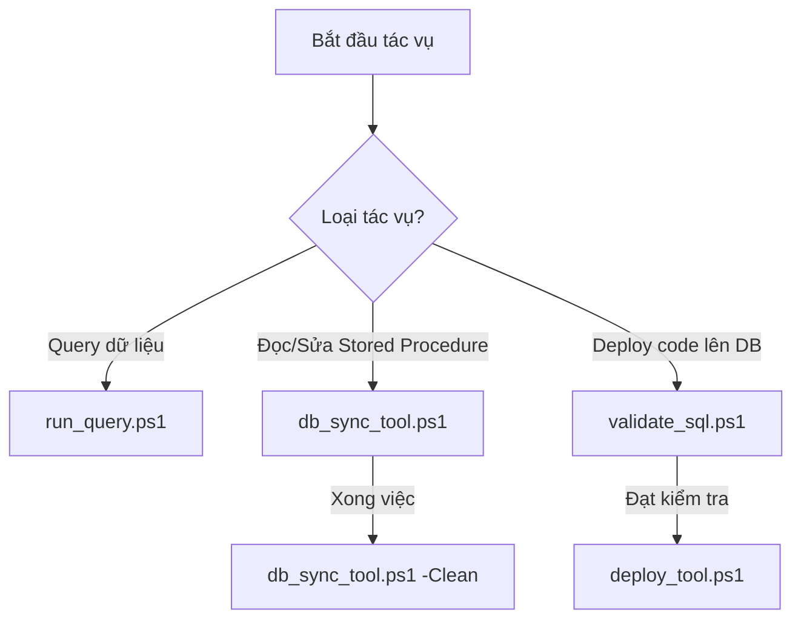

# 🛠️ Script & Tool Guide — Hướng Dẫn Sử Dụng Script PowerShell Bổ Trợ

> **Dành cho:** AI Agent (Antigravity) & Kỹ sư EA/IT vận hành dự án MES Vinatech.
> **Vị trí các script:** Nằm trực tiếp tại thư mục gốc của dự án (`c:\Users\User Vinatech.DESKTOP-RJJSEQU\Desktop\MES\`).
> ← [Về INDEX](KB_INDEX.md)

Tài liệu này hướng dẫn chi tiết cách sử dụng, các tham số đầu vào, logic xử lý nội bộ và cơ chế bảo mật an toàn của 4 script PowerShell hỗ trợ đắc lực cho việc tương tác cơ sở dữ liệu và mã nguồn.

---

## 🧭 Bản Đồ Sử Dụng Script (Quick Workflow)



---

## 1. 🔍 run_query.ps1 — Chạy Truy Vấn SQL Nhanh

Script này cho phép chạy các câu lệnh SQL read-only trực tiếp từ Terminal lên SQL Server, hỗ trợ xuất kết quả dưới dạng bảng, định dạng JSON hoặc CSV.

### 📋 Cách sử dụng & Tham số:
```powershell
powershell -File .\run_query.ps1 -Query "Nội_dung_câu_lệnh_SQL" [-Format Table|JSON|CSV]
```
*   `-Query` *(Bắt buộc):* Nội dung câu lệnh SQL cần chạy. Bắt buộc sử dụng `WITH(NOLOCK)` cho các bảng giao dịch lớn.
*   `-Format` *(Tùy chọn):* Định dạng đầu ra của dữ liệu. Mặc định là `Table`.

### 💡 Ví dụ thực tế:
```powershell
# 1. Truy vấn nhanh 5 dòng trong SetInfo dạng bảng
powershell -File .\run_query.ps1 -Query "SELECT TOP 5 Barcode, LotDecisionResult, IsDefect FROM STB_SetInfo WITH(NOLOCK) WHERE IsDefect = 1"

# 2. Xuất dữ liệu cấu hình model dạng JSON để xử lý bằng script
powershell -File .\run_query.ps1 -Query "SELECT ModelCode, MBIExtText04, MBIExtText05 FROM STB_ModelBasicInfo WITH(NOLOCK) WHERE ModelCode = 'RDMD00-368'" -Format JSON
```

---

## 2. 🔄 db_sync_tool.ps1 — Tải & Dọn Dẹp Stored Procedure Tạm

Do mã nguồn các Stored Procedure của MES nằm hoàn toàn trong database và không được tracking bằng Git, script này giúp tải định nghĩa SP từ DB về máy dưới dạng file `.sql` để đọc/sửa, và dọn dẹp sạch sẽ khi hoàn tất để giữ Git workspace không bị bẩn.

### 📋 Cách sử dụng & Tham số:
```powershell
# Tải SP về máy
powershell -File .\db_sync_tool.ps1 -SPName "Tên_Stored_Procedure"

# Dọn dẹp sạch sẽ các file SP đã tải tạm thời
powershell -File .\db_sync_tool.ps1 -Clean
```
*   `-SPName`: Tên của Stored Procedure cần tải về (ví dụ: `usp_DoProcessProdRouteHist`). File tải về sẽ nằm trong thư mục `sql/procedures/[Tên_SP].sql`.
*   `-Clean`: Xóa toàn bộ các tệp tin trong thư mục `sql/procedures/` để khôi phục trạng thái Git sạch trước khi commit.

### 💡 Ví dụ thực tế:
```powershell
# Tải SP chốt sản lượng về phân tích
powershell -File .\db_sync_tool.ps1 -SPName "usp_DoProcessProdRouteHistForCalc_SmartApp_VNT"

# Sau khi đã phân tích xong, dọn dẹp sạch thư mục sql/procedures/
powershell -File .\db_sync_tool.ps1 -Clean
```

---

## 3. 🛡️ validate_sql.ps1 — Kiểm Tra Quy Tắc An Toàn SQL

Trước khi áp dụng bất kỳ thay đổi nào lên database Production, file `.sql` bắt buộc phải được chạy qua bộ kiểm tra an toàn `validate_sql.ps1`. Bộ kiểm tra này sẽ phân tích cú pháp tĩnh để đảm bảo code tuân thủ các quy tắc vàng của dự án.

### 📋 Cách sử dụng:
```powershell
powershell -File .\validate_sql.ps1 -FilePath "Đường_dẫn_file_SQL"
```

### 🔒 Các quy tắc kiểm tra (Rules enforced):
1.  **Bắt buộc có Transaction:** File SQL thay đổi dữ liệu phải chứa khối `BEGIN TRAN` ... `ROLLBACK TRAN` (hoặc `COMMIT TRAN`).
2.  **Cấm chạy DROP/ALTER trực tiếp:** Cấm chạy các lệnh làm thay đổi vĩnh viễn cấu trúc bảng hoặc SP mà không có bọc an toàn.
3.  **Quy tắc SELECT-ONLY cho AI:** Chặn đứng các lệnh ghi (INSERT/UPDATE/DELETE) trực tiếp nếu AI agent tự ý gọi mà không qua bọc kiểm soát của người dùng.

### 💡 Ví dụ thực tế:
```powershell
# Kiểm tra file hotfix số 18 trước khi triển khai
powershell -File .\validate_sql.ps1 -FilePath "sql/hotfixes/18_FIX_WMS_FIFO_BYPASS.sql"
```

---

## 4. 🚀 deploy_tool.ps1 — Triển Khai Hotfix Lên Production

Khi file hotfix SQL đã vượt qua bộ lọc an toàn của `validate_sql.ps1`, kỹ sư IT hoặc AI Agent (dưới sự phê duyệt cụ thể của User) sẽ thực hiện deploy script lên database.

### 📋 Cách sử dụng:
```powershell
powershell -File .\deploy_tool.ps1 -FilePath "Đường_dẫn_file_SQL_Hotfix"
```
*   `-FilePath` *(Bắt buộc):* Đường dẫn tới file hotfix SQL cần deploy.

### 💡 Ví dụ thực tế:
```powershell
# Triển khai hotfix số 06 cho nhà máy Hưng Yên
powershell -File .\deploy_tool.ps1 -FilePath "sql/hotfixes/06_FIX_QC_INSPECTION_HUNG_YEN_SPS.sql"
```

---

## ⚠️ Checklist An Toàn Khi Sử Dụng Scripts cho AI Agent
- [ ] **SELECT-ONLY:** Luôn ưu tiên dùng `run_query.ps1` để đọc dữ liệu.
- [ ] **Không sửa SP trực tiếp:** Khi cần sửa SP, dùng `db_sync_tool.ps1 -SPName` tải về máy $\rightarrow$ tạo file hotfix trong `sql/hotfixes/` $\rightarrow$ chạy `validate_sql.ps1` kiểm tra $\rightarrow$ bàn giao file SQL cho User tự chạy hoặc sử dụng `deploy_tool.ps1`.
- [ ] **Git Clean:** Bắt buộc chạy `powershell -File .\db_sync_tool.ps1 -Clean` để dọn dẹp các tệp tạm trong `sql/procedures/` trước khi kết thúc turn làm việc.
