# FLOW TỔNG HỢP CHI TIẾT: TỪ KHÁCH HÀNG ĐẶT HÀNG ĐẾN GIAO HÀNG

> Toàn bộ quy trình liên kết với sơ đồ minh họa từng phase
> 
> **Bảng giải thích thuật ngữ** ở cuối tài liệu

---

## SƠ ĐỒ TOÀN CẢNH (đọc từ trên xuống dưới)

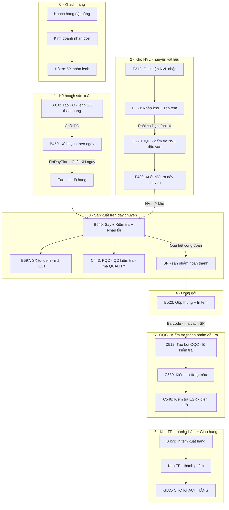

> 💡 **Cách đọc sơ đồ:** Mỗi ô là 1 bước, mũi tên cho biết bước tiếp theo. Chữ trên mũi tên là điều kiện/ghi chú. Đọc từ trên xuống dưới theo thứ tự ❶→❷→❸→❹→❺→❻→❼.

---

## PHASE SETUP: CẤU HÌNH BAN ĐẦU (DÀNH CHO HỖ TRỢ SẢN XUẤT)

> ⚠️ Phase này diễn ra **trước khi nhà máy vận hành**, do bộ phận Hỗ trợ sản xuất (EA/IT) thiết lập 1 lần.

| Màn hình | Chức năng | Ý nghĩa thực tế |
|----------|-----------|-----------------|
| **A230** | Đăng ký mã NVL, sản phẩm | Khai sinh tên/mã cho tất cả hàng hóa trong nhà máy |
| **A410** | Cấu hình hàng Cell/Module | Chi tiết hơn A230, chỉ dành riêng cho hàng Cell và Module |
| **A310** | Thông tin BOM | Cài đặt công thức: 1 sản phẩm A cần những NVL gì, định mức bao nhiêu |
| **B210** | Code Line | Khai báo tên dây chuyền (ví dụ: Cell Line 1, Cell Line 2) |
| **B220** | Khai báo công đoạn | Định nghĩa các công đoạn có trong nhà máy |
| **B230** | Cấu trúc công đoạn trên Line | Ráp công đoạn vào Line (Ví dụ: Line 1 chạy 5 công đoạn nào) |
| **B240** | Routing (Quy trình SX) | Gom Line và Công đoạn lại thành 1 quy trình chuẩn để SX con hàng |
| **B250/270** | Khai báo thiết bị | B250: Toàn nhà máy / B270: Thiết bị riêng của Sản xuất |
| **B260** | Khai báo nhân viên | Thêm thông tin CNV sản xuất (Part leader thực hiện) |
| **F110** | Quản lý thuộc tính tồn kho | **⚠️ Quan trọng:** Phải tick `IsUseBarCode`, `IsLotUse` mới gộp đóng gói được |
| **A130** | Đối tác giao dịch | Thêm thông tin khách hàng, nhà cung cấp |

---

## PHASE 0: NHẬN YÊU CẦU TỪ KHÁCH HÀNG

> ⚠️ Phase này diễn ra **ngoài MES**, Sale và Hỗ trợ SX chốt đơn trước khi lên kế hoạch.

| Bước | Ai? | Làm gì? | Chi tiết |
|------|-----|---------|----------|
| 0.1 | **Khách hàng** | Gửi yêu cầu đặt hàng | Xác định: loại sản phẩm gì, kích cỡ bao nhiêu, cần bao nhiêu cái, bao giờ giao |
| 0.2 | **Bộ phận kinh doanh (Sale)** | Nhận đơn, trao đổi với khách | Xác nhận giá bán, thời gian giao hàng, ký hợp đồng → tạo lệnh sản xuất nội bộ |
| 0.3 | **Bộ phận hỗ trợ sản xuất** | Nhận lệnh từ kinh doanh | Kiểm tra: công thức nguyên vật liệu có sẵn chưa, NVL có đủ không, dây chuyền có trống không → lên lịch SX |

---

## PHASE 1: LẬP KẾ HOẠCH SẢN XUẤT

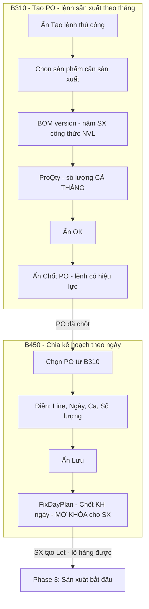

### Bước 1.1: B310 – Tạo lệnh sản xuất theo tháng

| | Chi tiết |
|---|---|
| **Ai làm?** | Bộ phận hỗ trợ sản xuất |
| **Làm gì?** | Tạo 1 lệnh sản xuất cho **cả tháng**: sản phẩm nào, bao nhiêu cái |
| **Làm như thế nào?** | Ấn "Tạo lệnh thủ công" → chọn sản phẩm → chọn BOM version (phiên bản công thức NVL = **năm sản xuất NVL của công thức đó**, ví dụ version **99** = sử dụng NVL sản xuất năm **1999**. Nhà máy **Bắc Ninh chủ yếu dùng 2001**, **Hà Nam dùng nhiều version khác nhau**) → nhập số lượng cả tháng → OK → **Chốt** |
| **Tại sao phải làm?** | Đây là bước khởi đầu trên MES. Không có lệnh SX → không có kế hoạch ngày → dây chuyền không chạy được |

**Ví dụ thực tế:**
- Khách đặt 10.000 tụ điện loại ABC tháng 3
- Hỗ trợ SX vào B310 → tạo lệnh: sản phẩm ABC, BOM version = 99 (sử dụng NVL năm 1999), số lượng = 10.000
- Ấn **Chốt** → lệnh SX có hiệu lực

> ⚠️ Chỉ tạo mà **CHƯA Chốt** → lệnh nằm im, không dùng được
> Nút **"Hủy lệnh"** = xóa lệnh SX nếu tạo sai

---

### Bước 1.2: B450 – Chia kế hoạch sản xuất theo ngày

| | Chi tiết |
|---|---|
| **Ai làm?** | Bộ phận hỗ trợ sản xuất |
| **Làm gì?** | Chia lệnh SX tháng (10.000 cái) thành kế hoạch **từng ngày**: ngày nào, dây chuyền nào, ca nào, bao nhiêu cái |
| **Làm như thế nào?** | Chọn lệnh SX từ B310 → điền 4 cột bắt buộc → Lưu → ấn **"Chốt kế hoạch ngày"** |
| **Tại sao?** | Để công nhân biết hôm nay làm gì, bao nhiêu. Để quản lý theo dõi tiến độ hàng ngày |

**4 cột bắt buộc phải điền:**

| Cột | Ý nghĩa | Ví dụ |
|-----|---------|-------|
| **Mã dây chuyền** | Sản xuất trên dây chuyền nào | LINE-01 |
| **Ngày kế hoạch** | Ngày sản xuất cụ thể | 07/03/2026 |
| **Ca làm việc** | **1** = ca ngày (sáng→chiều), **2** = ca đêm (tối→sáng) | 1 |
| **Số lượng kế hoạch** | Bao nhiêu cái trong ngày đó | 500 |

### Bước 1.3: Chốt kế hoạch ngày – Mở khóa cho sản xuất

| | Chi tiết |
|---|---|
| **Làm gì?** | Ấn nút **"Chốt kế hoạch ngày"** (FixDayPlan) trên B450 |
| **Tại sao QUAN TRỌNG?** | Đây là **"công tắc"** mở khóa. **Chưa ấn = dây chuyền không tạo lô hàng, không chạy được** |
| **Mẹo** | Có thể tạo kế hoạch ngày trước nhiều ngày, đến ngày sản xuất mới ấn Chốt |

---

## PHASE 2: KHO NGUYÊN VẬT LIỆU CHUẨN BỊ

> Phase này chạy **song song** với Phase 1. Kho chuẩn bị NVL sẵn → khi SX bắt đầu là có nguyên liệu ngay.

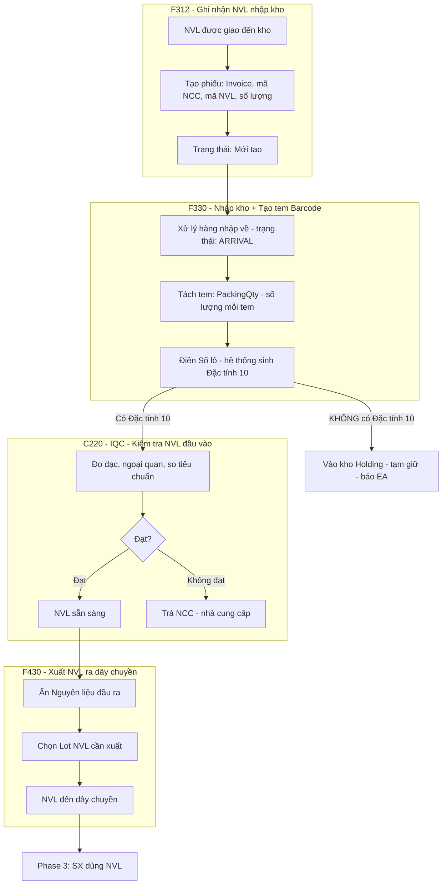

### Bước 2.1: F312 – Ghi nhận NVL mới nhập về

| | Chi tiết |
|---|---|
| **Ai làm?** | Nhân viên kho nguyên vật liệu |
| **Làm gì?** | Khi xe giao hàng đến → tạo "phiếu nhận" trên MES: ghi số hóa đơn (Invoice), mã nhà cung cấp, mã NVL, **số lượng (RequestQty)** |
| **Tại sao?** | Để hệ thống biết "NVL đã đến kho" → bắt đầu theo dõi từ đây. Trạng thái phiếu lúc này là **'Create'** (Mới tạo) |
| **Hình dung** | Giống **ký nhận bưu kiện**: hàng đến → ghi lại → chưa mở kiểm tra |

### Bước 2.2: F330 – Nhập kho chính thức + Tạo tem mã vạch

| | Chi tiết |
|---|---|
| **Ai làm?** | Nhân viên kho nguyên vật liệu |
| **Làm gì?** | 3 việc: (1) Ấn "Xử lý hàng nhập về" để đổi trạng thái từ Create sang **ARRIVAL**, (2) Tách NVL thành nhiều tem nhỏ, (3) Gán mã lô cho mỗi tem |
| **Tại sao?** | NVL cần có **tem mã vạch riêng** (mỗi tem = 1 lô nhỏ NVL) → để công nhân SX quét mã khi sử dụng → truy xuất nguồn gốc |

**Công thức tách tem:**
- `Số tem = ReceiveQty / PackingQty` (Tổng số nhận / Số lượng mong muốn 1 tem)
- Hệ thống kiểm tra `ScanQty` (số lượng đã gán tem) và `ReceiveQty`. Bằng nhau là tạo đủ tem.
- Mỗi tem gán 1 Số lô → hệ thống tự sinh **"Đặc tính 10"** (= thời hạn sử dụng / hạn hết hạn của NVL đó)

> ⚠️ **"Đặc tính 10" (thời hạn sử dụng NVL) là điều kiện sống còn:**
> - **Có** → NVL còn hạn, xuất ra sản xuất bình thường ✅
> - **Không có** → NVL không xác định được hạn dùng → vào kho **TẠM GIỮ** (holding), KHÔNG xuất được ❌
> - Điền Số lô mà **không ra Đặc tính 10** → báo nhóm **EA** (nhóm kỹ thuật hệ thống)

### Bước 2.3: C220 – Kiểm tra chất lượng NVL đầu vào

| | Chi tiết |
|---|---|
| **Ai làm?** | Nhóm kiểm tra chất lượng đầu vào (IQC = kiểm tra NVL khi mới nhập) |
| **Làm gì?** | Đo đạc, kiểm tra ngoại quan (bề mặt, kích thước), so sánh với tiêu chuẩn |
| **Tại sao?** | Ngăn NVL kém chất lượng vào sản xuất → tránh lỗi hàng loạt → tiết kiệm chi phí |

### Bước 2.4: F430 – Xuất NVL ra dây chuyền sản xuất

| | Chi tiết |
|---|---|
| **Ai làm?** | Nhân viên kho NVL |
| **Làm gì?** | (1) Xuất hàng: Chọn lô NVL đạt chất lượng → Ấn nút **"Nguyên liệu đầu ra"** → Chuyển sang dây chuyền  (2) Nhập lại hàng: Nếu **xuất nhầm line** hoặc dư y nguyên số lượng chưa dùng ráp → Ấn **"Nguyên liệu đầu vào"** để trả lại kho |
| **Tại sao?** | Công nhân SX cần NVL mới chạy máy. NVL phải xuất từ kho → mới quét mã lên hệ thống B540 được |

> ⚠️ **Nếu công nhân quét mã NVL mà kho chưa xuất** → hệ thống **không nhận** mã đó

---

## PHASE 3: SẢN XUẤT TRÊN DÂY CHUYỀN

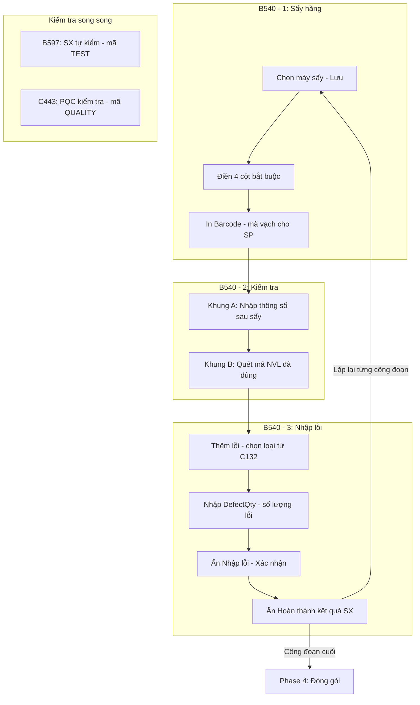

### Bước 3.1-3.3: B540 – Màn hành chính của sản xuất (3 chức năng)

| Chức năng | Ai? | Làm gì? | Tại sao? |
|-----------|-----|---------|----------|
| **1. Sấy hàng** | Công nhân vận hành | Chọn máy sấy → ghi nhận → **in mã vạch** | Mỗi sản phẩm cần mã vạch riêng để theo dõi qua từng công đoạn |
| **2. Kiểm tra** | Công nhân vận hành | **Khung A**: nhập thông số đo (kích thước, bề mặt) / **Khung B**: quét mã NVL đã dùng | Ghi nhận chất lượng + NVL nào tạo ra sản phẩm nào (truy xuất nguồn gốc) |
| **3. Nhập lỗi** | Công nhân vận hành | Thêm lỗi → chọn loại → nhập số lượng → "Hoàn thành" → hàng sang công đoạn tiếp | Theo dõi tỷ lệ lỗi từng công đoạn → cải thiện quy trình |

> 💡 **3 chức năng này lặp lại cho MỖI CÔNG ĐOẠN** trên dây chuyền. Ví dụ: dây chuyền có 5 công đoạn (sấy → dán → hàn → kiểm → đóng gói) thì mỗi công đoạn đều qua B540.

### Bước 3.4-3.5: Hai loại kiểm tra chạy song song

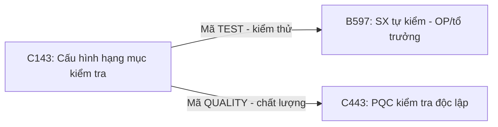

| | B597 (SX tự kiểm) | C443, C460, C521 (PQC kiểm) |
|---|---|---|
| **Ai làm?** | Công nhân / tổ trưởng trên dây chuyền | Bộ phận PQC (Kiểm tra quy trình) |
| **Kiểm tra gì?** | Thông số mã **KIỂM THỬ** (TEST) – cấu hình ở C141/C143 | Thông số mã **CHẤT LƯỢNG** (QUALITY) – cấu hình ở C141/C143 |
| **Màn hình PQC** | | **C443** (Ngoài cell line), **C460** (Quy trình điện cực), **C521** (Phát sinh) |
| **Lịch sử / Phế** | B598 (Báo phế NVL trên cell) | C430 (Lịch sử kiểm tra), C321 (Thông tin phế), C726 (Báo phế điện cực) |

> 💡 **Về cấu hình QC (C121 - C151):** 
> - **C121, C122, C131, C132:** Dùng để tạo nhóm lỗi, lỗi chi tiết và thiết lập vật phẩm cho IQC (Kiểm đầu vào C220).
> - **C141, C143:** Thiết lập thông số kiểm tra cho PQC và Sản xuất (cho C443, B597).
> - **C151:** Thiết lập thông số cho OQC (Kiểm đầu ra C530).

### Bước 3.6-3.7: Báo phế và sự cố bất thường

| Màn hình | Ai? | Khi nào? | Làm gì? | Đặc biệt |
|----------|-----|----------|---------|----------|
| **B598** | Công nhân nhập, quản lý duyệt | NVL bị hỏng trong SX | Thêm (+) → điền NVL phế + số lượng → Lưu | Ghi nhận NVL hao phí |
| **C385** | QC hoặc SX | Sự cố nghiêm trọng bất thường | Tạo báo cáo | Hệ thống **tự gửi email** thông báo đến quản lý |
| **C390** | Quản lý | Cần xem lại sự cố | Tra cứu báo cáo từ C385 | |

---

## PHASE 4: ĐÓNG GÓI

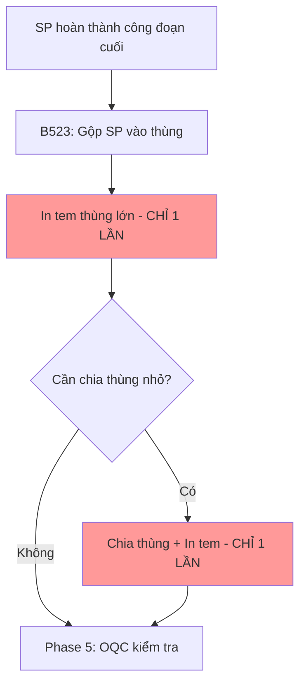

| Bước | Ai? | Làm gì? | Quy tắc |
|------|-----|---------|---------|
| 4.1 | Công nhân / Nhân viên đóng gói | Gộp sản phẩm vào thùng | Số lượng sản phẩm mỗi thùng theo cấu hình ở **A418** |
| 4.2 | Nhân viên đóng gói | **In tem thùng lớn** | ⚠️ **1 lần duy nhất**, in lại phải báo nhóm EA |
| 4.3 | Nhân viên đóng gói | Chia thùng nhỏ (nếu cần) | Phải **in tem thùng lớn TRƯỚC** mới chia được |
| 4.4 | Nhân viên đóng gói | **In tem thùng nhỏ** | ⚠️ **1 lần duy nhất**, phải in trước khi chia tiếp |

> 💡 **Tại sao chỉ in tem 1 lần?** Để tránh trùng lặp mã đóng gói → khi nhập/xuất kho không bị nhầm.

---

## PHASE 5: KIỂM TRA CHẤT LƯỢNG THÀNH PHẨM (TRƯỚC KHI GIAO KHÁCH)

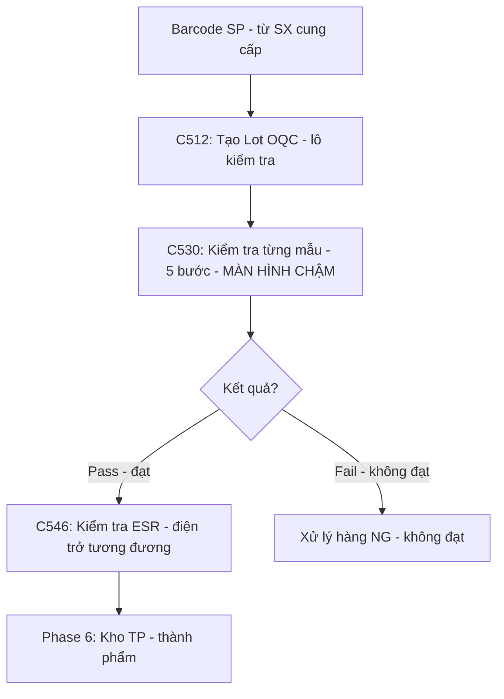

| Bước | Ai? | Làm gì? | Chi tiết |
|------|-----|---------|----------|
| 5.1 | Nhóm kiểm tra đầu ra (OQC) | **Tạo lô kiểm tra** (C512) | Dán mã vạch sản phẩm (do SX cung cấp) → "Tạo Lô". Không thấy → kiểm A410 |
| 5.2 | Nhóm kiểm tra đầu ra | **Kiểm tra từng mẫu** (C530) | (1) Chọn hạng mục → (2) Nhập giá trị đo → (3) Lưu bảng phải → (4) Đạt/Không ở bảng trái → (5) Lưu bảng trái. **⚠️ Chậm!** |
| 5.3 | Nhóm kiểm tra đầu ra | **Đánh giá kết quả** | Kiểm hết → ấn "Đánh giá OK" → Lưu |
| 5.4 | Nhóm kiểm tra đầu ra | **Kiểm tra điện trở ESR** (C546) | Tìm lô → nhập giá trị đo → Lưu. ESR = điện trở tương đương – 1 thông số kỹ thuật quan trọng của tụ điện |
| 5.5 | Nhóm kiểm tra đầu ra | **Xem lịch sử** | C540 = lịch sử kiểm tra thành phẩm, C541 = lịch sử kiểm tra ESR |

---

## PHASE 6: KHO THÀNH PHẨM + IN TEM XUẤT HÀNG + GIAO CHO KHÁCH

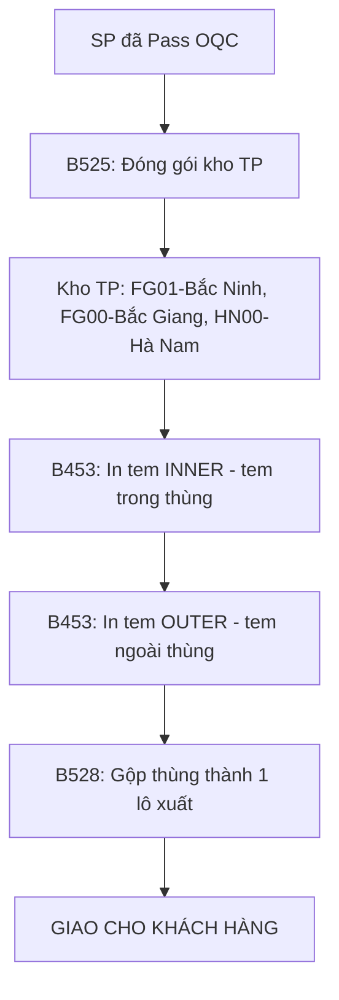

| Bước | Ai? | Làm gì? | Màn hình | Chi tiết |
|------|-----|---------|----------|----------|
| 6.1 | Kho thành phẩm | Đóng gói TP | **B525** | Đóng gói và in tem cho kho thành phẩm |
| 6.2 | Kho thành phẩm | Lịch sử Module | **B789** | Xem lại lịch sử của công đoạn module |
| 6.3 | Kho thành phẩm | Tồn kho | **FG01/FG00** | FG01 = Tồn kho Bắc Ninh / FG00 = Tồn kho Bắc Giang |
| 6.4 | Kho thành phẩm | In tem INNER | **B453** | Tick "KHÔNG Là tem ngoài". In tem dán bên trong thùng |
| 6.5 | Kho thành phẩm | In tem OUTER | **B453** | Tick "Là tem ngoài". In tem lớn dán bên ngoài thùng |
| 6.6 | Kho thành phẩm | Gộp thùng đóng gói | **B528** | Gộp nhiều thùng nhỏ thành 1 lô lớn, lưu lịch sử đóng gói gộp khi xuất hàng đi |
| 6.7 | Vận chuyển | **Giao hàng** | Ngoài MES | Xe vận chuyển → khách nhận → **HOÀN THÀNH** ✅ |

---

## PHASE 7: BÁO CÁO (CHẠY SONG SONG – DÀNH CHO QUẢN LÝ)

| Màn hình | Xem gì? | Ai xem? | Để làm gì? |
|----------|---------|---------|-----------|
| **B781** | Chốt đóng gói & đơn giá chế tạo | Quản lý kiểm tra | Biết SX được bao nhiêu, chi phí tốn bao nhiêu |
| **B682** | Lịch sử đếm SL theo luống / Sản lượng lỗi lắp ráp | Quản lý | Nắm tỷ lệ lỗi chung (thành phẩm & bán thành phẩm) |
| **B782** | Báo cáo lỗi chi tiết theo công đoạn | Quản lý | Phát hiện công đoạn nào lỗi nhiều nhất → cải thiện |
| **B726** | Các lỗi NG, hàng holding và NG khác | Quản lý | Xác định số lượng hàng cần xử lý đặc biệt |
| **B718** | Lỗi định dạng vật lý (gập chân, uốn chân, tapping) | Quản lý, KT | Xử lý lỗi cơ khí máy móc |
| **B802** | Lỗi điện cực (NG điện cực) | Quản lý, KT | Xử lý lỗi quy trình điện |
| **B791** | Phế công đoạn module | Quản lý | Biết lượng hao phí ở module |

---

## PHASE PHỤ A: HOÀN TRẢ NGUYÊN VẬT LIỆU (khi dư hoặc xuất nhầm)

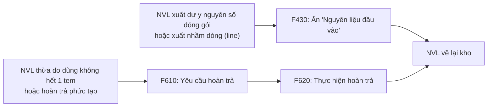

### Khi nào dùng màn hình nào?
- **F430:** Dùng khi phát hiện **xuất nhầm dây chuyền**, chưa khui tem, hoặc **xuất 500 trả đúng 500** → nhân viên kho thao tác nhanh luôn trên F430.
- **F610 / F620:** Dùng khi đòi hỏi quy trình xét duyệt, hoặc sản xuất xài lở dở 1 tem muốn trả số ODD thừa lại cho kho.

---

## PHASE PHỤ B: CẮT FOIL – SLITTING (chỉ nhà máy Hà Nam)

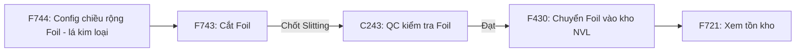

| Bước | Ai? | Làm gì? | Tại sao? |
|------|-----|---------|----------|
| B.0 | Kho | Cấu hình chiều rộng foil (F744) | 1 lần – định nghĩa kích thước cắt |
| B.1 | Kho | Cắt foil, nhập chiều dài cắt (F743) | Chia foil lớn → nhiều foil nhỏ đúng kích thước SX cần |
| B.2 | Kho | Chốt cắt foil (F743) | Gửi sang QC kiểm tra |
| B.3 | QC | Kiểm tra foil đã cắt (C243) | Đảm bảo kích thước chính xác |
| B.4 | Kho | Chuyển foil vào kho NVL (F430) | Foil sẵn sàng xuất cho SX |

---

## PHASE PHỤ C: NHẬP DỮ LIỆU TỪ MÁY PHÂN CẤP

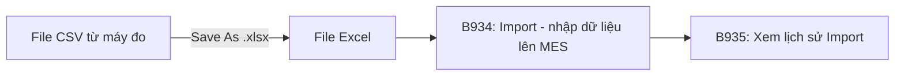

> 💡 Hệ thống MES **không đọc được file CSV** → phải đổi sang file Excel (.xlsx) trước khi nhập.

---

## 🔑 8 ĐIỀU QUAN TRỌNG NHẤT CẦN NHỚ

| # | Nội dung | Ở bước nào? | Nếu quên thì sao? |
|---|----------|-------------|-------------------|
| 1 | **Đặc tính 10** (thời hạn sử dụng NVL) phải có khi tạo tem | Phase 2 – F330 | NVL bị khóa trong kho tạm giữ, SX không có nguyên liệu |
| 2 | **Chốt kế hoạch ngày** phải ấn sau khi lập KH | Phase 1 – B450 | Dây chuyền không tạo lô hàng, không chạy được |
| 3 | **BOM version** = năm SX của NVL dùng cho công thức (ví dụ 99 = năm 1999, Bắc Ninh hay dùng 2001, Hà Nam dùng nhiều ver) | Phase 1 – B310 | Chọn sai version → công thức NVL không đúng |
| 4 | **In tem 1 lần duy nhất** | Phase 4 – B523 | Trùng mã → nhầm khi nhập/xuất kho → báo nhóm EA |
| 5 | **Mã KIỂM THỬ vs mã CHẤT LƯỢNG** (C143) | Phase 3 | Nhập sai chỗ: SX nhập vào chỗ QC hoặc ngược lại |
| 6 | **Mã vạch từ SX cho nhóm kiểm tra đầu ra** | Phase 5 – C512 | Nhóm kiểm tra TP không tạo được lô kiểm tra |
| 7 | **NVL phải xuất từ kho** trước khi quét mã | Phase 3 – B540 | Quét mã NVL hệ thống không nhận |
| 8 | **C530 màn hình chậm** – thao tác từ từ | Phase 5 | Dữ liệu bị ghi sai hoặc thiếu |

---

## 📖 BẢNG GIẢI THÍCH THUẬT NGỮ

| Viết tắt/Thuật ngữ | Nghĩa tiếng Anh | Nghĩa tiếng Việt |
|---------------------|------------------|-------------------|
| **NVL** | — | Nguyên vật liệu |
| **SX** | Production | Sản xuất |
| **QC** | Quality Control | Kiểm soát chất lượng |
| **IQC** | Incoming Quality Control | Kiểm tra chất lượng NVL đầu vào |
| **OQC** | Outgoing Quality Control | Kiểm tra chất lượng thành phẩm đầu ra |
| **PQC** | Process Quality Control | Kiểm tra chất lượng trong quy trình SX |
| **BOM** | Bill of Materials | Công thức / danh sách NVL cần để SX 1 sản phẩm. BOM version = năm sản xuất của nguyên vật liệu dùng trong công thức đó (ví dụ 99 = năm 1999). Bắc Ninh chủ yếu dùng 2001, Hà Nam dùng nhiều version |
| **ESR** | Equivalent Series Resistance | Điện trở tương đương (thông số kỹ thuật của tụ điện) |
| **NG** | Not Good | Hàng không đạt chất lượng |
| **Lot/Lô** | Lot | Một lô hàng (nhóm sản phẩm/NVL cùng đợt) |
| **Barcode/Mã vạch** | Barcode | Mã vạch để quét/bắn bằng máy |
| **Cell line** | Cell line | Dây chuyền sản xuất tụ điện dạng cell |
| **Đặc tính 10** | — | Thời hạn sử dụng (hạn hết hạn) của nguyên vật liệu. Hệ thống tự sinh khi điền Số lô ở F330. Không có = NVL vào kho tạm giữ |
| **NCC** | — | Nhà cung cấp |
| **EA team** | — | Nhóm kỹ thuật hệ thống (Enterprise Architecture) |
| **Routing** | Routing | Quy trình sản xuất (thứ tự các công đoạn) |
| **Invoice** | Invoice | Hóa đơn xuất nhập khẩu |
| **PackingQty** | Packing Quantity | Số lượng đóng gói trên 1 tem |
| **Slitting** | Slitting | Cắt foil (lá kim loại) thành dải nhỏ |
| **Foil** | Foil | Lá kim loại mỏng (dùng trong sản xuất tụ điện) |
| **Pass/Fail** | Pass/Fail | Đạt/Không đạt |
| **TP** | — | Thành phẩm (sản phẩm hoàn chỉnh) |
| **KH** | — | Kế hoạch |
| **PO** | Production Order | Lệnh sản xuất (tạo ở B310) |
| **OP** | Operator | Công nhân vận hành trên dây chuyền |
| **TEST (mã KIỂM THỬ)** | Test | Hạng mục do sản xuất tự kiểm tra (nhập ở B597) |
| **QUALITY (mã CHẤT LƯỢNG)** | Quality | Hạng mục do QC kiểm tra độc lập (nhập ở C443) |

---
*Cập nhật: 2026-03-07 | File: 13_FLOW_TONG_HOP.md*
