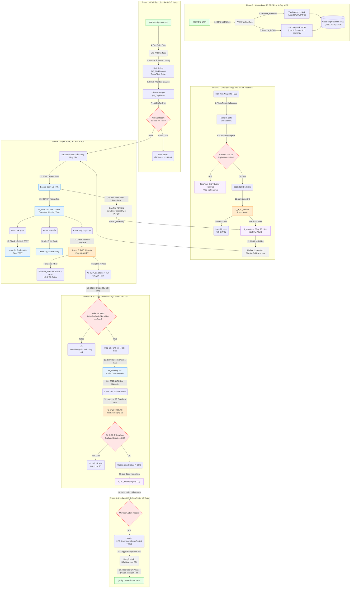

# HƯỚNG DẪN DÀNH CHO KỸ SƯ EA: PHÂN TÍCH LUỒNG DỮ LIỆU MES (TỪ NHẬP KHO ĐẾN THÀNH PHẨM)

> **Mục đích:** Tài liệu này bỏ qua các thao tác click chuột thông thường của người dùng, tập trung hoàn toàn vào **Trạng thái dữ liệu (Data Status)**, **Các cờ hệ thống (System Flags)**, **Nút thắt kỹ thuật (Bottlenecks)** và **Cách xử lý sự cố (Troubleshooting)** dành riêng cho EA/Support IT tại xưởng.

---

## 1. SƠ ĐỒ LUỒNG DỮ LIỆU CỐT LÕI (CORE DATA FLOW)

Dưới đây là sơ đồ dòng chảy dữ liệu (Data Flow) nhìn dưới góc độ của hệ thống MES, tập trung vào các **Bảng dữ liệu (Table/Lot)** và **Chốt chặn (Gate/Flag)**:

---

## 2. TỔNG QUAN LUỒNG DỮ LIỆU CHÍNH & EA CHECKPOINTS

Luồng đi vật lý: `Kho NVL` → `Cell Line / Sản xuất` → `QC` → `Đóng gói` → `Kho Thành Phẩm`.
Dưới lăng kính Database của MES, 1 Lot hàng phải đi qua các trạng thái (Status) nghiêm ngặt. Chỉ 1 Status bị kẹt/sai, toàn bộ chuỗi phía sau sẽ dừng chạy. 

---

## 2. PHASE 1: KHO NVL - NGUYÊN VẬT LIỆU ĐẦU VÀO
*Nhiệm vụ của MES: Khai sinh dữ liệu, gán mã vạch và cấp quyền sử dụng.*

| Màn hình | Sự kiện Dữ liệu (Event) | ⚠️ Điểm Nóng DB / EA Cần Xử Lý (Troubleshooting) |
|---|---|---|
| **F312** | Ghi nhận Inovice. Trạng thái: `CREATE` | Giao tiếp API ERP thường đổ dữ liệu vào `W_WorkOrder_IF`. Kiểm tra Middleware / Log nếu mất DO/PO. |
| **F330** | Nhập kho. Trạng thái: `ARRIVAL` | **Lỗi `Null` cờ Đặc tính 10 (Hạn sử dụng):** Nếu F330 chạy xong mà cột `ExpireDate` rỗng, Data rớt thẳng vào kho `Holding` (Bị giam cấm xuất). EA cần check Màn A để xem Master Data vòng đời vật tư đã khai báo chưa. |
| **F330** | Tách tem (Lô nhỏ lưu vào `M_Lots`) | Bắt buộc `ScanQty` phải == `ReceiveQty`. Lỗi máy in treo ngắt điện sinh in đè tem trùng (Duplicate ID). EA cần `Void` lệnh in trên DB nếu kẹt cứng. |
| **C220** | IQC QC check (`Q_IQC_Results`) | Nếu Fail -> Trả NCC. Nếu Pass -> Mở khóa cờ `Status` để Update Tồn kho. |
| **F430** | Đổi kho (Lệnh `Move Inventory`) | Về bản chất DB là lệnh **Update `SubInv` từ `Main` sang `Line`**. Nếu Line bóp cò báo "No stock", bật SSMS Query xem lô M_Lots này đang kẹt ở cõi `Holding` hay `Main`. |

---

## 3. PHASE 2: CẤU HÌNH & KẾ HOẠCH SẢN XUẤT
*Nhiệm vụ của MES: Tạo Work Order (WO) và mở cổng nối dữ liệu với xưởng.*

| Màn hình | Sự kiện Dữ liệu (Event) | ⚠️ Điểm Nóng DB / EA Cần Xử Lý (Troubleshooting) |
|---|---|---|
| **B310** | Tạo WO Lệnh Tháng (`W_WorkOrders`) | **Lỗi Khai Báo BOM (`BomVersion`):** Nếu Line dính Error "Lắp sai Part / Null Data", Check Column `BomVersion` ở bảng này. Việc kéo bản Version 99 hay 2001 (Bắc Ninh) sai sẽ khiến Backend Backflush chênh lệch định mức. |
| **B310** | Chốt PO | Update cờ `Status` = `Active`/`Released`. Cờ này bằng False thì B450 tịt ngòi. |
| **B450** | Kế hoạch Ngày (`W_DayPlans`) | **Cờ FixDayPlan (`IsFixed` = T/F):** Chạm mặt 100 lần 1 ngày. Nếu Cột này null, Màn Scan Máy trạm trả Error `Plan is locked`. EA gọi ĐT réo Planner bấm tick Checkbox liền! |

---

## 4. PHASE 3: CHẠY DÂY CHUYỀN (SẢN XUẤT & PQC)
*Nhiệm vụ của MES: Cấn trừ BOM (Backflush), đếm sản lượng, ghi nhận NG và truy xuất nguồn gốc (Traceability).*

| Màn hình | Sự kiện Dữ liệu (Event) | ⚠️ Điểm Nóng DB / EA Cần Xử Lý (Troubleshooting) |
|---|---|---|
| **B540** | Nuốt Mã NVL, Sinh `W_WIPLots` | Lỗi DB **"Wrong Component"**: Do Tool đọc sai BOM ở bảng `M_BOMs` kết hợp với `ExpireDate` rỗng. Hàm Store Proc SP_CONSUME không trừ được `I_Inventory` (`UsageQty` x `TargetQty`). |
| **B540** | Chuyển trạm (`Operation` Routing) | **Lỗi Bypass (Trốn Trạm):** Dữ liệu cột `Operation` nhảy cóc, DB báo Error *"Missing Operation"*. EA mở Admin Menu chạy tool `Catch-up` / `Return Line` ép lưu lại Log ảo. |
| **B530** | Nhập Lỗi Phế (`Q_DefectHistory`) | **Nạn Ách Tắc DEADLOCK Table:** Cuối ca, chục máy cùng gọi hàm Update `DefectQty` -> Query đụng ngầm Time-out. EA dùng SQL `sp_who2` kill Session treo. |
| **B597/C443** | SX và PQC bắn kết quả lên DB | **Lỗi nhầm Flag Cấu Hình:** Bảng Test lưu cờ định danh `TEST` (B597). Bảng PQC lưu `QUALITY` (C443). Móc lộn Cờ (Flag) trong Master C143 khiến Admin mò Truy xuất rỗng dữ liệu! |

---

## 5. PHASE 4: GỘP THÙNG & ĐÓNG GÓI
*Nhiệm vụ của MES: Nested Barcode (Mã vạch lồng nhau) - Thùng cha chứa nhiều Thùng con.*

| Màn hình | Sự kiện Dữ liệu (Event) | ⚠️ Điểm Nóng DB / EA Cần Xử Lý (Troubleshooting) |
|---|---|---|
| **A418, F110** | Đọc Config Màn Pack | Bắt buộc bảng thuộc tính phải tick True cột `IsUseBarCode` và `IsLotUse`. Khuyết Data thì giao diện B523 Tối thui không nút để gộp. |
| **B523** | Insert `W_PackingLots` | **Luật In Độc Quyền 1 Lần:** Insert dòng mới kèm Map (`Outer` chứa `n` `Inner` Barcodes). Máy Zebra lỗi in nát mã vạch -> Cấm In Đè. EA mở Menu Tool Backend chạy lệnh **Void In** (Trả cờ về False) để thả cửa in lại lần 2. |
| **B523** | Chia lô (Split Box) | Người dùng ngáy ngủ chia nhầm hệ số `Qty`, Data nở toác. EA Trace `Transaction_History` đọc Log Rollback lại thao tác bằng dòng Query tay. |

---

## 6. PHASE 5 & 6: OQC VÀ KHO THÀNH PHẨM (FG)
*Nhiệm vụ của MES: Gắn cờ "HÀNG OK", khóa sổ dữ liệu sản xuất, đồng bộ lên ERP.*

| Màn hình | Sự kiện Dữ liệu (Event) | ⚠️ Điểm Nóng DB / EA Cần Xử Lý (Troubleshooting) |
|---|---|---|
| **C512** | Kéo Mẫu OQC Local DB | Lỗi UI Empty Box: Quét mãi không nảy số? Check DB bảng Cấu Hình Màn A410 xem 2 cột `Type_Check` và `OQC_Type` đã map chưa! |
| **C530** | Insert 20 Cột `Q_OQC_Results` | **Hiệu Năng Rùa Bò (Laggy):** Bóp Cò C530 tương đương lệnh SQL Save 20 Variables! Nếu Timeout rớt mạng ngang -> Record Insert nhưng rỗng cờ `EvaluateResult = OK`. Cờ này bằng Null = Khóa cửa vô kho FG! |
| **C546** | Đo điện trở cuộn ESR | Pass thì Update cờ `Status` Lô gốc trong `W_WIPLots` thành `P-OQC` (Án chết của vòng đời WIP). |
| **B453** | Tick Cờ In `IsOuterPrinted` | Lên xe tải: Nếu Tool check Cột Cờ này `=== False` -> Lệnh Delivery `I_FG_Inventory` mồ côi Không Load vô Bill xuất hàng! Bắt User Click Tick Lại là xong. |
| **Job_EDI** | API ERP Tích Tắc 10 Phút | Logic API Đẩy/Kéo Data Fail do timeout mạng. Kế toán ới lệch Data Phế Liệu? Log vào IIS / Kestrel / Hangfire Re-Run Cục Gạch Job API! |

---

## 7. BỘ KỸ NĂNG VÀ TOOLKIT CỦA EA SỬ DỤNG HÀNG NGÀY TRÊN MES

1. **Genealogy Tree Search (Cây Truy Xuất):** Trace NG ngược/xuôi cực lẹ. Khi Audit xuống kiểm tra, gõ 1 Barcode FG ra luôn cái sơ đồ 10 bước lắp các thành phần, từ ca nào làm, nhân viên nào hàn.
2. **Forward Traceability (Truy Xuất Xuôi) & Lot Hold:** Truy tìm các lô thành phẩm liên đới để Block/Khóa khẩn cấp nguyên một dàn lô khi phát hiện hóa chất đầu vào bị hỏng.
3. **Database Activity Monitor / Logs Check:** Luôn tự trang bị thói quen bấm F12 (Web) hoặc coi Event Viewer/Log folder khi User than "Lỗi". EA tin vào Log Server ghi `Deadlock` hay `NullRef` chứ ko tin mắt nhìn chữ "Error rớt mạng" ngoài màn hình.
4. **Hiểu "Hai Cuốn Sổ" (MES vs ERP):** Lệnh Kế hoạch (Work Order) và Tồn kho Tổng sống ở nhà Kế Toán (ERP/SAP). Tiến độ dây chuyền và Serial Number cực chi tiết sống ở MES. Lệch số là do Cầu nối API / Sync Batch Job bị đứt đoạn. EA chính là người xây và thông cái cống mương API này!

*Tài liệu đúc kết cho khối EA System Admin | Ngày tạo: 2026-03-10*
