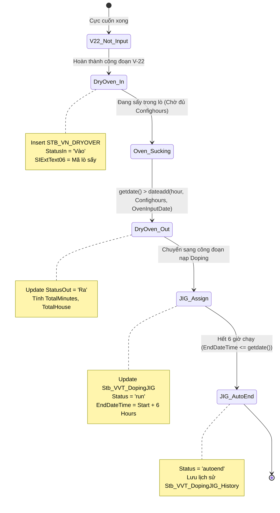
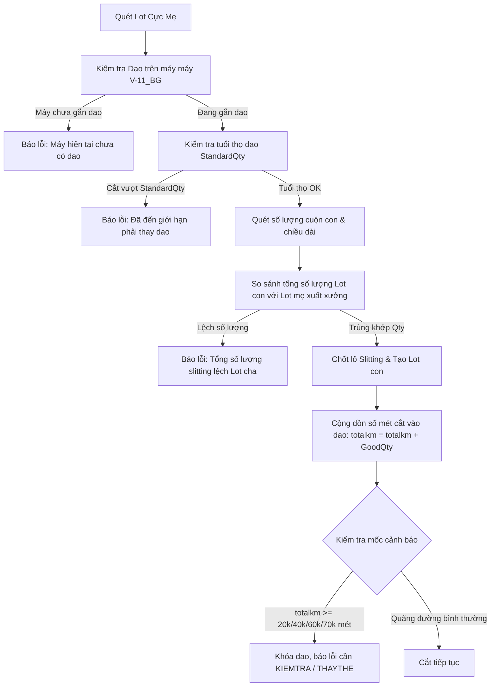

<!--
AI-READY METADATA
Purpose: Chi tiết vận hành Cell Line & Module Line (B450, B530, B540, B597, B523, B717, B789, B791, B802, B598, B351, BG2 K101-K199, H301-H305)
Scope: Cell Line & Module Production Operations
Single Source of Truth: KB_03_02_CELL_LINE.md (Cell Line Execution & Module Operations)
Target Screens: B450, B530, B540, B597, B523, B717, B789, B791, B802, B598, B351, K101-K199, H301-H305
Target Tables: STB_SetInfo, STB_ProdRouteHist, STB_DayProdPlan, STB_SingleCellModuleMappingHist, STB_VN_MASTERMODULES
Related Files:
  - [KB_INDEX.md](file:///c:/Users/User%20Vinatech.DESKTOP-RJJSEQU/Desktop/MES_LEGACY_BACKUP/MES_MASTER_KNOWLEDGE_BASE/KB_INDEX.md)
  - [KB_03 Index](file:///c:/Users/User%20Vinatech.DESKTOP-RJJSEQU/Desktop/MES_LEGACY_BACKUP/MES_MASTER_KNOWLEDGE_BASE/KB_03/INDEX.md)
  - [file:///C:/Users/User%20Vinatech.DESKTOP-RJJSEQU/Desktop/MES_LEGACY_BACKUP/MES_MASTER_KNOWLEDGE_BASE/KB_03/KB_03_01_OVERVIEW.md](file:///C:/Users/User%20Vinatech.DESKTOP-RJJSEQU/Desktop/MES_LEGACY_BACKUP/MES_MASTER_KNOWLEDGE_BASE/KB_03/KB_03_01_OVERVIEW.md)
  - [KB_08_CORE_SP_ENGINE.md](file:///c:/Users/User%20Vinatech.DESKTOP-RJJSEQU/Desktop/MES_LEGACY_BACKUP/MES_MASTER_KNOWLEDGE_BASE/KB_08_CORE_SP_ENGINE.md)
-->

## 6. 🏭 Cell Line — Vận Hành Chi Tiết Từng Màn Hình

> **Nguồn:** Phân tích 41 SP + ảnh màn hình (2026-04-13)
> ← [Về INDEX](file:///c:/Users/User%20Vinatech.DESKTOP-RJJSEQU/Desktop/MES_LEGACY_BACKUP/MES_MASTER_KNOWLEDGE_BASE/KB_INDEX.md) | [Về KB_03 Index](file:///c:/Users/User%20Vinatech.DESKTOP-RJJSEQU/Desktop/MES_LEGACY_BACKUP/MES_MASTER_KNOWLEDGE_BASE/KB_03/INDEX.md)


### 6.1 Bản đồ tổng quan Cell Line (V22 → V28)

```
[B310] Tạo PO
    ↓
[B450] Kế hoạch SX ngày — tạo Lot (DayPlanNo → STB_DayProdPlan)
    ↓  IsFixed=1 → sinh Barcode → in tem (B460/A460)
[B540] Assy Card Info — nhập NVL điện cực + sấy
    ↓  V-22: Cuốn | V-23: Lắp cao su (PHẢI scan NVL trước) | V-24: Curling | V-25: Bọc vỏ
[B530] Nhập sản lượng theo công đoạn
    ↓  usp_DoProcessProdRouteHistForCalc_SmartApp_VNT
[B597] Kiểm tra thường xuyên — nhập mã Lot NVL kho (ML...)
    ↓  Chặn: HOLD / Hết hạn / Sai chủng loại
[B523] Đóng gói — Gộp Box (VV→VJ)
    ↓
[B717] Bending & Tapping — bẻ chân, dán băng keo
```

---

### 6.2 [B450] — Kế Hoạch Sản Xuất Theo Ngày

> 🏭 **Cơ sở gốc:** VVT_F1 (Bắc Ninh) | 🔀 **Biến thể:** **K101** (BG2 — Module, barcode `K164...`) → [§6.14](#614-nhà-máy-bg2--cấu-hình-triển-khai-hệ-thống-mes)

**Vận hành:**
1. Chọn ngày, Line, nhập PO → Điền `LineCode`, `PlanDate`, `PlanQty`, `RouteCode`, `BomVersion`
2. **Tích `IsFixed=1`** → Tab bên dưới mới xuất hiện nút **Tạo Lot**
3. Bấm **Tạo Lot** → sinh `ControlNo` → lưu vào `STB_SetInfo`
4. Bấm **In Tem** → in barcode ra nhãn

| SP | Chức năng |
|----|-----------|
| `usp_DayProdPlan_get` | Lấy danh sách kế hoạch ngày |
| `usp_SetInfo_get` | Lấy danh sách barcode/Lot đã tạo |
| `usp_DayProdPlan_iud` | Lưu/Sửa/Xóa kế hoạch ngày |
| `usp_DoFixDayProdPlan` | Đánh dấu kế hoạch đã Fixed (IsFixed=1) |
| `usp_DoCancelDayProdPlan` | Hủy kế hoạch |
| `usp_DoFinishDayProdPlan` | Đóng kế hoạch ngày |
| `usp_DoCreateSetInfoForProdQty_VNT` | **★ CORE — Tạo barcode (YearCode+MonthCode+Serial)** → [KB_08](file:///C:/Users/User%20Vinatech.DESKTOP-RJJSEQU/Desktop/MES_LEGACY_BACKUP/MES_MASTER_KNOWLEDGE_BASE/KB_08_CORE_SP_ENGINE.md) |
| `usp_SetInfo_iud` | IUD thông tin SetInfo (barcode metadata) |

**Lỗi thường gặp:**

| Lỗi | Nguyên nhân |
|-----|-------------|
| Không tạo được Lot | `IsFixed` chưa tích → SP không cho sinh serial |
| Đã tạo Lot rồi không tạo thêm | `usp_DayProdPlan_iud` check `StartSerial` đã có → duplicate (thiết kế có chủ ý) |
| In tem lỗi | Sang A460 → Assembly Label → chọn số 2 của cột Định dạng |
| Lot tạo xong nhưng B540 không thấy | `DayPlanNo` không được link vào `STB_SetInfo.DayPlanNo` |

---

### 6.3 [B530] — Nhập Số Lượng Sản Xuất (Chi Tiết SP)

> 🏭 **Cơ sở gốc:** VVT_F1 | 🔀 **Biến thể:** BG2 dùng chung B530 (cùng SP). HN cấu hình mã lỗi riêng → [§6.18](#618-cấu-hình-danh-mục-mã-lỗi-b530-nhà-máy-bắc-giang-bg)

**SP đầy đủ từ màn hình:**

| SP | Loại | Chức năng |
|----|------|-----------|
| `usp_GetProdRouteHistForBarcode_VNT` | Search | Thông tin Route History theo Barcode (12K chars) |
| `usp_GetProdRouteBarcodeForDefect_VNT` | Search | Danh sách lỗi theo Barcode |
| `usp_DoProcessProdRouteHist_VNT` | Search | Variant VNT — search routing data |
| `usp_ProdRouteHist_get` | Search | Lấy lịch sử routing chung |
| `usp_WasteWeight_get` | Search | Thông tin cân phế |
| `usp_DoProcessProdRouteHistForCalc_SmartApp_VNT` | Execute | **★ Tính toán & validate (cổng chính, 22K chars)** |
| `usp_DoProcessDefectRepairInfoByBarcode_SmartApp` | Execute | Ghi nhận lỗi theo barcode |
| `usp_DoUpdateProdRouteHistMarkingLetter` | Execute | Cập nhật ký hiệu đánh dấu (Hà Nam) |
| `usp_DoUpdateDRIExtText02_iud` | Execute | Cập nhật text mở rộng lỗi |
| `usp_InterimProdQtyInfo_iud` | Execute | Nhập SL tạm thời |
| `usp_DoCreateTaktTimeForRoute` | Execute | Tạo Takt Time cho Route |
| `usp_DoSplitLotAgingHN` | Execute | Tách Lot trước Aging (Hà Nam) |
| `usp_AddRepairInfor_BG2` | Execute | Thêm info sửa chữa (BG2) |
| `usp_PassBarcodeForRoute` | Execute | Đánh dấu PASS barcode (BG2) |
| `usp_FailBarcodeForRoute` | Execute | Đánh dấu FAIL barcode (BG2) |

**7 cổng chặn trong `usp_DoProcessProdRouteHistForCalc_SmartApp_VNT`:**

```
[GATE 1] Điện cực (V-22, VVT_F1/F2): usp_CheckInputElectrodeInputForCodeProduct
[GATE 2] NVL V-23/V-24 (VVT_F1/F2): usp_CheckInputRawMaterialCodeForProduct
[GATE 3] PQC Hà Nam (VE01/VE03/VE04/VE08): usp_CheckPQCInputForProductHistForBarcode
[GATE 4] Lot bị đóng: DPPExtText01 = '1' → RAISERROR 'Đã chốt'
[GATE 5] 20 phút (VNT, RouteIndex > 1): DATEDIFF(minute) <= 20 → RAISERROR
         ⚠️ BUG: Điều kiện @SIExtInt01 = Null (phải IS NULL) → Gate KHÔNG BAO GIỜ kích hoạt
[GATE 6] Bắt buộc mã máy: IsRequireMachine=1 AND MachineCode='' → RAISERROR
[GATE 7] PO không có Route: PONo IS NULL → RAISERROR 'Routing này không có trong PO'
```

> 🚦 **Tham chiếu mở rộng:** Chi tiết logic, mã SQL debug cho 7 cổng chặn B530 trên được tích hợp trực tiếp trong SP [usp_DoProcessProdRouteHistForCalc_SmartApp_VNT](file:///c:/Users/User%20Vinatech.DESKTOP-RJJSEQU/Desktop/MES_LEGACY_BACKUP/MES_MASTER_KNOWLEDGE_BASE/KB_08_CORE_SP_ENGINE.md#L290).


**Cột IsRawMaterialInputFinish — Gate quan trọng nhất:**
```sql
-- Kiểm tra trạng thái scan NVL
SELECT ControlNo, Barcode, IsRawMaterialInputFinish
FROM STB_ProdRouteHist
WHERE Barcode = 'VV...' AND RouteCode = 'V-23'
-- 0 = Chưa scan đủ → B530 BLOCK | 1 = Đã scan đủ → cho phép

-- Bypass khẩn cấp (chỉ khi được phê duyệt)
UPDATE STB_ProdRouteHist
SET IsRawMaterialInputFinish = 1
WHERE Barcode = 'VV...' AND RouteCode = 'V-23'
```

**Lỗi thường gặp & Script Khắc Phục tại B530:**

| Lỗi | Nguyên nhân | Hướng khắc phục / Script SQL |
|-----|-------------|------------------------------|
| "Chưa nhập NVL cho Lắp Cao Su" | GATE 2: không tìm thấy record trong `STB_RawMaterialInputHist` cho V-23/V-24 | Quét NVL tại B540 hoặc bypass: `UPDATE STB_ProdRouteHist SET IsRawMaterialInputFinish=1 WHERE Barcode='...' AND RouteCode='V-23'` |
| "Chưa nhập điện cực âm/dương" | GATE 1: `usp_CheckInputElectrodeInputForCodeProduct` — check `Stb_SlittingStock_VVT` | Nhập NVL điện cực tại B540 trước khi chốt V-22 |
| "Routing không có trong PO" | Barcode thuộc PONo không có RouteCode trong `STB_ProductionOrderRouting` | Thêm RouteCode vào `STB_ProductionOrderRouting` cho PO tương ứng |
| "Đã hoàn thành thực tế rồi" | `AftProdQty <> 0` → công đoạn kế tiếp đã có dữ liệu → scan trùng | Hủy sản lượng công đoạn sau trước khi scan lại công đoạn trước |
| Chữ "Making" chưa nhập ở V-25 | `MarkingLetter` rỗng → `usp_DoUpdateProdRouteHistMarkingLetter` không có data | Nhập ký tự Marking (mã dán nhãn) trước khi qua V-25 |
| Nút "Nhập lỗi" bị ẩn (Disabled) | Công đoạn kế tiếp đã có dữ liệu (`IsHasNextProd=1`) hoặc đã bị ghi nhận Loss (`IsLoss=1`) | Hủy công đoạn sau theo kịch bản Rollback B530 dưới đây |

```sql
-- ====================================================================
-- SCRIPT KHẨN CẤP: Rollback / Hủy sản lượng công đoạn B530 
-- (Đồng bộ 100% theo Gold Standard quy trình tại KB_03_01_OVERVIEW.md)
-- ====================================================================
BEGIN TRANSACTION;
BEGIN TRY
    DECLARE @Barcode NVARCHAR(50) = 'VVQM153R025606'; -- Mã Barcode / LotNo / DayPlanNo user cung cấp
    DECLARE @RouteCode NVARCHAR(20) = 'V-25';         -- Mã công đoạn cần hủy (VD: V-25, VE08)

    -- Tự động tìm danh sách ControlNo liên quan
    DECLARE @ControlNos TABLE (ControlNo NVARCHAR(50));
    INSERT INTO @ControlNos (ControlNo)
    SELECT DISTINCT ControlNo 
    FROM STB_SetInfo WITH (NOLOCK)
    WHERE Barcode = @Barcode 
       OR ControlNo = @Barcode 
       OR DayPlanNo = @Barcode 
       OR DayPlanNo LIKE '%' + @Barcode + '%';

    -- 1. Xóa các bản ghi lỗi (NG) nhập nhầm ở công đoạn quét nhầm (⚠️ Cột là FindRouteCode)
    DELETE FROM STB_DefectRepairInfo 
    WHERE ControlNo IN (SELECT ControlNo FROM @ControlNos) 
      AND FindRouteCode = @RouteCode;

    -- 2. Xóa Routing công đoạn quét nhầm trong STB_ProdRouteHist (⚠️ Cột là RouteCode)
    DELETE FROM STB_ProdRouteHist 
    WHERE ControlNo IN (SELECT ControlNo FROM @ControlNos) 
      AND RouteCode = @RouteCode;

    -- 3. Reset cờ hoàn thành công đoạn trước đó: Set CompleteRoute = NULL để mở lại chốt
    -- (Tự động xác định công đoạn liền trước hoặc chỉ định theo RouteCode công đoạn trước)
    UPDATE h
    SET h.CompleteRoute = NULL
    FROM STB_ProdRouteHist h
    INNER JOIN (
        SELECT h_p.ControlNo, MAX(h_p.ProdRouteHistNo) AS MaxPrevHistNo
        FROM STB_ProdRouteHist h_p WITH (NOLOCK)
        INNER JOIN STB_ProdRouteHist h_t WITH (NOLOCK) 
                ON h_p.ControlNo = h_t.ControlNo 
               AND h_p.ProdRouteHistNo < h_t.ProdRouteHistNo
        WHERE h_t.ControlNo IN (SELECT ControlNo FROM @ControlNos)
          AND h_t.RouteCode = @RouteCode
        GROUP BY h_p.ControlNo
    ) m ON h.ProdRouteHistNo = m.MaxPrevHistNo;

    -- 4. ⚠️ QUY TẮC CẬP NHẬT BẢNG MASTER STB_SetInfo (Theo KB_03_01_OVERVIEW.md):
    -- Tự động tính lại tổng DefectQty và cờ IsDefect thực tế từ STB_DefectRepairInfo
    UPDATE s
    SET s.DefectQty = ISNULL((SELECT SUM(DefectQty) FROM STB_DefectRepairInfo WHERE ControlNo = s.ControlNo AND IsDelete = '0'), 0),
        s.IsDefect  = CASE WHEN ISNULL((SELECT SUM(DefectQty) FROM STB_DefectRepairInfo WHERE ControlNo = s.ControlNo AND IsDelete = '0'), 0) > 0 THEN 1 ELSE 0 END
    FROM STB_SetInfo s
    WHERE s.ControlNo IN (SELECT ControlNo FROM @ControlNos);

    -- 5. Kiểm tra lại: Lot phải khôi phục về trạng thái công đoạn trước với CompleteRoute = NULL
    SELECT ControlNo, RouteCode, CompleteRoute, JobDate 
    FROM STB_ProdRouteHist 
    WHERE ControlNo IN (SELECT ControlNo FROM @ControlNos)
    ORDER BY ControlNo, ProdRouteHistNo ASC;

    -- COMMIT TRANSACTION; -- Chạy dòng này khi thấy kết quả đã đúng
    ROLLBACK TRANSACTION; -- Mặc định ROLLBACK để kiểm tra an toàn trước
    PRINT N'SUCCESS: Rollback công đoạn B530 thành công!';
END TRY
BEGIN CATCH
    IF @@TRANCOUNT > 0 ROLLBACK TRANSACTION;
    PRINT N'LỖI: ' + ERROR_MESSAGE();
END CATCH;
```

---

### 6.4 [B540] — Assy Card Info

**Các tab chính:**

| Tab | Chức năng |
|-----|-----------|
| Common | Thông tin chung: MaterialCode, Barcode, InputDateTime, ProdQty |
| RawMaterialInputHist | Lịch sử NVL đã scan vào (điện cực âm/dương) |
| Prod Qty Input | Số lượng sản xuất theo công đoạn |
| Assy Card Info Oven | Thông tin lò sấy |

**Sấy hàng (Oven):** 4 cột bôi đậm BẮT BUỘC nhập → mới được in barcode. Dữ liệu lưu vào `STB_SetInfo` cột `SIExtText01..05`.

**Lỗi: 1 con hàng Module nhưng hiển thị thông số Cell:**
```sql
-- Nguyên nhân: POType sai trong STB_ProductionOrderInfo
-- Fix:
UPDATE STB_ProductionOrderInfo
SET POType = 'MODULE'
WHERE MaterialCode = 'mã_hàng'
```

---

### 6.4b [B597] — Kiểm Tra Thường Xuyên / Tự Kiểm NVL (SelfInspection)

> 🏭 **Cơ sở gốc:** VVT_F1 | 🔀 **Biến thể:** **K109** (BG2), **HN597** (Hà Nam)

**Chức năng:** Kiểm tra NVL đầu vào tại chuyền — công nhân scan mã barcode NVL (ML...) để hệ thống validate: HOLD / Hết hạn / Sai chủng loại.

**SP đầy đủ (8 SPs, verified):**

| SP | Loại | Chức năng |
|----|------|-----------|
| `usp_GetCommInspectionHistoryForBarcode` | Search | Lấy lịch sử QC inspection theo barcode |
| `usp_RawMaterialInputHist_get` | Search | Lấy lịch sử nhập NVL |
| `usp_DoAddCommInspMeasureHistForBarcode` | Execute | Nhập kết quả đo QC (base) |
| `usp_DoAddCommInspMeasureHistForBarcodeSelfInsp_iud` | Execute | Nhập kết quả tự kiểm (variant SelfInsp) |
| `usp_DoFinishCommInspDoc` | Execute | Hoàn thành tài liệu QC (base) |
| `usp_DoFinishCommInspDoc_VNT` | Execute | Hoàn thành tài liệu QC (variant VNT) |
| `usp_RawMaterialInputHist_iud` | Execute | IUD lịch sử nhập NVL |
| `usp_Vietnam_RawMaterialInputHist_uid` | Execute | IUD lịch sử nhập NVL (variant VN) |

**Cổng chặn chính:**
- NVL **HOLD** (`STB_MaterialLotInfo.QcResultCode = 'H'`) → BLOCK
- NVL **hết hạn** (`ExpirationDate < GETDATE()`) → BLOCK  
- NVL **sai chủng loại** (MaterialCode không match BOM) → BLOCK
- Tra cứu nhanh: [§5.15](#515-tra-cứu-model-code-và-size-tại-màn-b597)

---

### 6.5 [B523] — Đóng Gói (Gộp Box) — Quy Trình Mới

> 🏭 **Cơ sở gốc:** VVT_F1 | 🔀 **Biến thể:** **HN523** (Hà Nam), **HN544** (gộp túi bóng) → [KB_04 §6.5, §6.13](file:///C:/Users/User%20Vinatech.DESKTOP-RJJSEQU/Desktop/MES_LEGACY_BACKUP/MES_MASTER_KNOWLEDGE_BASE/KB_04/KB_04_01_CORE_PACKAGING.md)

**Quy trình mới (thay đổi so với cũ):**

| Bước | Quy trình cũ | Quy trình MỚI |
|------|-------------|---------------|
| 1 | Gộp box → In tem | Gộp box → **In tem Box To trước** |
| 2 | Chia box (tùy chọn) | **In tem Box To xong** → mới được Chia box |

**Quy tắc bắt buộc:**
```
⚠️ CHỈ ĐƯỢC IN TEM 1 LẦN DUY NHẤT
   → Muốn in lần 2 phải liên hệ EA Team

⚠️ PHẢI IN TEM BOX TO TRƯỚC KHI CHIA BOX

⚠️ SAU KHI CHIA BOX, PHẢI IN TEM BOX NHỎ TRƯỚC KHI CHIA TIẾP
```

**Logic VV → VJ (`usp_Vietnam_GetBoxIDForLotNo_VVT`):**
```sql
-- Cắt đuôi PartNo tự động (hàng Cell):
WHEN CHARINDEX('-', MM.MaterialName, 12) >= 12
THEN substring(MM.MaterialName, CHARINDEX('-', MM.MaterialName, 12), ...)
-- Mr.Tung add 2023-Feb-13: TỰ ĐỘNG LẤY ĐUÔI TRONG TÊN HÀNG của hàng CELL line
```

**Cổng chặn tại B523:**
```sql
-- Chặn nếu chưa cân → không cho in label
IF @pProcessUserID NOT IN ('vvt_worker','vvtworker',...)
    RAISERROR('Chưa cân — không được in label')
```

> 🚦 **Tham chiếu mở rộng:** Chi tiết các cổng chặn đóng gói (cân hàng, tiêu chuẩn đóng gói, in tem giới hạn) được thực hiện tại màn hình đóng gói [B523](file:///c:/Users/User%20Vinatech.DESKTOP-RJJSEQU/Desktop/MES_LEGACY_BACKUP/MES_MASTER_KNOWLEDGE_BASE/KB_04/KB_04_01_CORE_PACKAGING.md#L11).

---

### 6.6 [B717] — Bending & Tapping

> ⚠️ **Chỉ lưu được 1 lần đầu tiên** — nếu nhập sai phải UPDATE thủ công SQL

```sql
-- Sửa số lượng Bending/Tapping sai
UPDATE STB_VN_BENDING_TAPPING
SET QTYLOTNO = [số_đúng], QTYERROR = [lỗi_đúng]
WHERE LOTNO = 'mã_lot'

-- Xóa và nhập lại
DELETE FROM STB_VN_BENDING_TAPPING WHERE LOTNO = 'mã_lot'
```

---

### 6.7 [B452] — Đổi Line Sai (Vietnam Print Lot Changed)

**Phân quyền đặc biệt:** Chỉ UserID trong whitelist hardcode trong SP mới được đổi Line.

```sql
-- Nếu UserID không có quyền → RAISERROR('Ban khong duoc phep thay doi ma Line')
-- Fix: IT thêm UserID vào SP usp_Set_VVT_Info_get
```

**Chức năng đặc biệt trong SP này:**
- Đổi PONo (chuyển PO khác cùng model trong tháng)
- Cập nhật RouteCode: đổi E- thành V-
- In tem Foxcon Label (cho user `sieusao`, `transao`, `daohuong`...)

---

### 6.8 Module Line — Quy Trình Đầy Đủ & Liên Kết Single Cell

**Khác biệt Cell vs Module:**

| Tiêu chí | Cell Line | Module Line |
|----------|-----------|-------------|
| RouteCode prefix | `V-01`, `V-23`... | `MV-01`, `MV-xx`... |
| POType | CELL | MODULE |
| Đóng gói | B523 → PackingID = VJ... | B525 → BoxID Module (Lưu bảng `STB_VN_MASTERMODULES`, `STB_VN_DETAILMODULES`) |
| Lịch sử | B782, B786, B791 | B789, B791 |
| Gate V-23/V-24 | ✅ Có check NVL | ❌ Không check |

**Flow Module Line:**
```
B310 (POType=MODULE) → B450 (Module Line Code) → B540 (Không check điện cực)
→ B530 (RouteCode = MV-xx) → B525 (Gộp Box Module) → B789 (Lịch sử) → B791 (Tracking)
```

#### 6.8.1 Các Bảng Cơ Sở Dữ Liệu Module & Cấu Trúc Schema
Hệ thống quản lý Module sử dụng một tập hợp các bảng cơ sở dữ liệu chuyên biệt để liên kết, theo dõi chất lượng, và lưu trữ lịch sử cấu hình lắp ráp:

1. **[STB_SingleCellModuleMappingHist](file:///C:/Users/User%20Vinatech.DESKTOP-RJJSEQU/Desktop/MES_LEGACY_BACKUP/MES_MASTER_KNOWLEDGE_BASE/KB_03/KB_03_02_CELL_LINE.md) (Lịch sử mapping Single Cell ↔ Module Lot):**
   * Lưu thông tin mapping giữa Single Cell và Module Lot.
   * *Schema:* `ModuleLotNo` (varchar(20)), `Seq` (int), `SingleCellLotNo` (varchar(20)), `CreateDateTime` (datetime), `CreateUserID` (varchar(20)).

2. **[STB_ModuleProductionInfo](file:///C:/Users/User%20Vinatech.DESKTOP-RJJSEQU/Desktop/MES_LEGACY_BACKUP/MES_MASTER_KNOWLEDGE_BASE/KB_03/KB_03_02_CELL_LINE.md) & [STB_ModuleProductionHist](file:///C:/Users/User%20Vinatech.DESKTOP-RJJSEQU/Desktop/MES_LEGACY_BACKUP/MES_MASTER_KNOWLEDGE_BASE/KB_03/KB_03_02_CELL_LINE.md) (Thông tin & Lịch sử sản xuất module):**
   * Theo dõi tiến độ sản xuất, lượng pinhole, thay cell lỗi, thông số kiểm đo ESR/Farad của module.
   * *Schema chính:* `ModuleProductionNo` (varchar(20)), `JobStartDate` (date), `SemiProdLotNo1` (varchar(20)), `SemiProdLotNo2` (varchar(20)), `PinHoleQty` (numeric), `ChangeCellQty` (numeric), `Farad` (numeric), `ESR` (numeric), `FinishedProdLotNo` (varchar(20)), `ShipmentDate` (date), `ShipmentQty` (numeric).

3. **[STB_ModuleSemiProductionInfo](file:///C:/Users/User%20Vinatech.DESKTOP-RJJSEQU/Desktop/MES_LEGACY_BACKUP/MES_MASTER_KNOWLEDGE_BASE/KB_03/KB_03_02_CELL_LINE.md) (Thông tin bán thành phẩm Module):**
   * Liên kết bản mạch PCB và các Single Cell cấu thành bán thành phẩm.
   * *Schema:* `ModuleSemiProductionNo` (varchar(20)), `ProdDate` (date), `Grade` (varchar(10)), `PCBLotNo` (varchar(20)), `SemiProdLotNo` (varchar(20)), `SingleCellLotNo1` (varchar(20)), `SingleCellLotNo2` (varchar(20)), `SingleCellLotNo3` (varchar(20)).

4. **[STB_SubAssemblyInfoForBE](file:///C:/Users/User%20Vinatech.DESKTOP-RJJSEQU/Desktop/MES_LEGACY_BACKUP/MES_MASTER_KNOWLEDGE_BASE/KB_03/KB_03_02_CELL_LINE.md) (Mapping bán thành phẩm BE):**
   * Bản ghi liên kết thùng và mạch PCB cho công đoạn lắp ráp BE.
   * *Schema:* `SubAssemblyNo` (varchar(20)), `BoxBarcode` (varchar(20)), `PcbBarcode` (varchar(20)).

5. **[STB_ModuleLabelInfo](file:///C:/Users/User%20Vinatech.DESKTOP-RJJSEQU/Desktop/MES_LEGACY_BACKUP/MES_MASTER_KNOWLEDGE_BASE/KB_03/KB_03_02_CELL_LINE.md) (Thông tin Serial Label Module):**
   * Liên kết mã serial nhãn in với Single Cell tương ứng.
   * *Schema:* `ModuleSerialNo` (varchar(20)), `ProductNo` (varchar(20)), `RevisionNo` (varchar(20)), `SingleLotNo` (varchar(20)).

6. **[STB_ModuleAssemblyLabelInfo](file:///C:/Users/User%20Vinatech.DESKTOP-RJJSEQU/Desktop/MES_LEGACY_BACKUP/MES_MASTER_KNOWLEDGE_BASE/KB_03/KB_03_02_CELL_LINE.md) (Lịch sử tách/phát hành Lot con cho ráp Module):**
   * Lưu thông tin quan hệ giữa Lot ráp con (Assembly Lot) và Lot mẹ (Parent Lot).
   * *Schema:* `ModuleAssemblyLotNo` (varchar(20)), `ModuleParentLotNo` (varchar(20)), `IsPacking` (bit), `IsShipment` (bit).

7. **[STB_AssemblyCellWeightInfo](file:///C:/Users/User%20Vinatech.DESKTOP-RJJSEQU/Desktop/MES_LEGACY_BACKUP/MES_MASTER_KNOWLEDGE_BASE/KB_03/KB_03_02_CELL_LINE.md) (Cân nặng Cell lắp ráp):**
   * Lưu dữ liệu cân nặng ghi nhận tại công đoạn lắp ráp.
   * *Schema:* `LineCode` (varchar(20)), `CellWeight` (numeric), `CreateDateTime` (datetime).

8. **[STB_VN_MASTERMODULES](file:///C:/Users/User%20Vinatech.DESKTOP-RJJSEQU/Desktop/MES_LEGACY_BACKUP/MES_MASTER_KNOWLEDGE_BASE/KB_03/KB_03_02_CELL_LINE.md) & [STB_VN_DETAILMODULES](file:///C:/Users/User%20Vinatech.DESKTOP-RJJSEQU/Desktop/MES_LEGACY_BACKUP/MES_MASTER_KNOWLEDGE_BASE/KB_03/KB_03_02_CELL_LINE.md) (Đóng gói gộp box module Việt Nam):**
   * *Master:* Lưu thông tin thùng (`GROUPID`, `LOTNO`, `QTY`, `TOTALQTY`, `VOL`, `FWAR`, `PARTNO`, `SIZE`, `PackingID` dạng `MVKQ[Month]...`).
   * *Detail:* Lưu chi tiết của từng Lot trong thùng (`GROUPID`, `LOTNO`, `QTYACT`, `LineCode`, `RouteCode`, `ProdQty`).

#### 6.8.2 Chi Tiết Các Logic Báo Cáo & Xử Lý Stored Procedures

##### 1. Logic Liên kết Cell vào Module Lot (`usp_DoCreateModuleLot`)
Khi thực hiện binding giữa Single Cell Barcode và Module Barcode:
* Hệ thống kiểm tra xem mã Module Barcode tồn tại trong `STB_SetInfo` hay không. Nếu không, raise lỗi: `'Mã Module Lot không tồn tại'`.
* Tiến hành update cột `ModuleBarcode` trong bảng `STB_SetInfo` cho Single Cell tương ứng:
  ```sql
  UPDATE STB_SetInfo SET ModuleBarcode = @ModuleBarcode WHERE Barcode = @Barcode;
  ```
* Tính toán số `Seq` tiếp theo và insert lịch sử vào bảng mapping:
  ```sql
  SELECT @NextSeq = ISNULL(MAX(seq), 0) + 1 FROM STB_SingleCellModuleMappingHist WHERE ModuleLotNo = @ModuleBarcode;
  INSERT INTO STB_SingleCellModuleMappingHist (ModuleLotNo, Seq, SingleCellLotNo, CreateUserID)
  VALUES (@ModuleBarcode, @NextSeq, @Barcode, @pProcessUserID);
  ```

##### 2. Logic Sinh Lot Ráp Module Từ Lot Mẹ (`usp_DoCreateModuleAssemblyLotNo`)
Khi chia Lot Module mẹ (Parent Lot) thành nhiều Lot con (mỗi Lot con có số lượng = 1) để dán nhãn lắp ráp:
* Hệ thống truy vấn thông tin `ProdQty`, `MaterialCode`, `PONo`, `DayPlanNo` từ `STB_SetInfo` của Lot mẹ.
* Kiểm tra xem Lot mẹ đã được tách trước đó chưa (bằng cách check `STB_ModuleAssemblyLabelInfo`). Nếu có, raise lỗi: `'Mã Lot đã tồn tại'`.
* Reset Serial Số trong `STB_SerialInfo` cho `@Header` về `0` để các Lot con bắt đầu từ `001`:
  ```sql
  UPDATE STB_SerialInfo SET SerialNo = 0 WHERE MaterialCode = '' AND Header = @Header;
  ```
* Lặp qua số lượng `ProdQty` lần, mỗi lần:
  * Gọi `usp_GetNewSerialNoForBarcode` để sinh `@SerialNo`.
  * Định dạng `@Barcode = @Header + RIGHT('000' + CONVERT(VARCHAR, @SerialNo), 3)`.
  * Insert vào `STB_ModuleAssemblyLabelInfo` và gọi `usp_DoCreateSetInfo` tạo thông tin Lot mới.
* Cuối cùng, thực hiện xóa Lot mẹ ra khỏi danh sách `STB_SetInfo` để tránh trùng lặp dữ liệu:
  ```sql
  DELETE FROM STB_SetInfo WHERE Barcode = @ModuleParentLotNo;
  ```

##### 3. Logic Tạo Số Serial Cho Nhãn Module (`usp_DoCreateModuleLabelInfo`)
* Sinh mã nhãn module định dạng: `PLS` + `[Ký tự cuối của RevisionNo]` + `[YY]` + `[Tuần trong năm]` + `V` + `[4 số serial tự tăng]`.
* Lấy số Index lớn nhất hiện tại:
  ```sql
  SELECT @StartIndex = ISNULL(MAX(RIGHT(ModuleSerialNo, 4)), 0) + 1 FROM STB_ModuleLabelInfo WHERE ModuleSerialNo LIKE @SerialHeader + '%';
  ```
* Insert danh sách serial tương ứng vào `STB_ModuleLabelInfo`.

##### 4. Tra cứu thông số Phân cấp Module Việt Nam (`usp_VN_PartNoModule`)
Cung cấp bảng ánh xạ cứng các dải thông số Điện áp (`VOL`) và Điện dung (`FARD`) theo Part No (NAMES) của Module để phục vụ kiểm tra ngoại quan và QC:
* Ví dụ:
  * `VEC2R7105QG(0813)`: `45~130` V, `≥2.50V`
  * `WEC3R0335QG(0820)`: `22~85` V, `≥2.55V`

**Giá thành Module:**
```sql
-- Kiểm tra giá thành Module
SELECT * FROM STB_VVT_StagePrices WHERE MaterialCode LIKE '%MDL%'

-- Thêm giá thành khi có model Module mới
INSERT INTO STB_VVT_StagePrices (MaterialCode, RouteCode, Price, IsUsed, CreateDateTime)
VALUES
    ('RDMD00-368', 'MV-01', 0.254127629071929, 1, GETDATE()),
    ('RDMD00-368', 'MV-02', 0.257442076659429, 1, GETDATE()),
    ('RDMD00-368', 'MV-03', 0.258507610420299, 1, GETDATE())
```

---

### 6.9 [B351] — Lot Chuyển Đổi Nguyên Liệu / Thay Đổi Model

**Khi nào dùng:** Cần đổi mã hàng/model cho Lot đã sản xuất (sản xuất nhầm model, chuyển PO, đổi kế hoạch sản xuất ngày).

**Cấu trúc giao diện & Stored Procedures (Master-Detail 2 Grids):**

```
Lưới 1 (Master): DayProdPlanForChangeMaterial  ──▶ usp_GetDayProdPlanForChangeMaterial (Search Kế hoạch MỚI)
Lưới 2 (Detail): SetInfoForChangeMaterial      ──▶ usp_GetSetInfoForChangeMaterial (Search Barcode HIỆN TẠI)
Nút [Thay đổi model] (Action: ChangeMaterial)  ──▶ usp_DoChangeMaterialForSetInfo (Execute chuyển đổi)
```

| SP | Chức năng | Dữ liệu đầu vào / đầu ra |
|----|-----------|--------------------------|
| `usp_GetDayProdPlanForChangeMaterial` | Lấy danh sách kế hoạch ngày khả dụng để đổi sang | `@pCompanyCode`, `@pWorkCenterCode`, `@pFromDate`, `@pToDate` |
| `usp_GetSetInfoForChangeMaterial` | Lấy danh sách Lot/Barcode đủ điều kiện đổi | `@pCompanyCode`, `@pWorkCenterCode`, `@pBarcode` |
| `usp_DoChangeMaterialForSetInfo` | Thực hiện đổi — cập nhật MaterialCode, DayPlanNo | Chạy khi có `TargetDayPlanNo` & `TargetMaterialCode` ở Lưới 2 |

**Tác động cơ sở dữ liệu & Khoảng hẫng đồng bộ (System Synchronization Gap):**
- `B351` tự động cập nhật: **`STB_SetInfo`** (mã mới) + Ghi nhật ký audit **`STB_LotChangeMaterialHistory`**.
- ⚠️ **`B351` KHÔNG tự động đồng bộ:** `STB_MaterialLotInfo` (kho WMS) và `STB_ProdRouteHist` (lịch sử công đoạn). Khi cần rollback hoặc fix lệch dữ liệu ở B525/B523, phải đồng bộ thủ công cả 4 bảng.

```sql
-- Kiểm tra nhật ký đổi Lot tại B351
SELECT CPHNo, ControlNo, OldBarcode, NewBarcode, BefMaterialCode, AftMaterialCode, BefDayPlanNo, AftDayPlanNo, ChangeDateTime, ChangeUserID
FROM STB_LotChangeMaterialHistory WITH(NOLOCK)
WHERE OldBarcode = 'VV...' OR NewBarcode = 'VV...'
```

👉 **Tra cứu sự cố Thường gặp & Khắc phục lỗi B351:**
- **Lỗi 1 (Dấu chấm Barcode):** Xem [KB_04_02 §B351 Lỗi 1](file:///c:/Users/User%20Vinatech.DESKTOP-RJJSEQU/Desktop/MES_LEGACY_BACKUP/MES_MASTER_KNOWLEDGE_BASE/KB_04/KB_04_02_SCREEN_BUGS.md#lỗi-1-barcode-sinh-ra-bị-chèn-ký-tự-dấu-chấm--sai-định-dạng).
- **Lỗi 2 (Rollback đồng bộ 4 bảng):** Xem [KB_04_02 §B351 Lỗi 2](file:///c:/Users/User%20Vinatech.DESKTOP-RJJSEQU/Desktop/MES_LEGACY_BACKUP/MES_MASTER_KNOWLEDGE_BASE/KB_04/KB_04_02_SCREEN_BUGS.md#lỗi-2-user-yêu-cầu-in-lại-tem-gốc-mã-cũ-sau-khi-sản-xuất-đã-chuyển-đổi-lot-tại-b351).
- **Lỗi 3 (`No data to process` khi bấm nút):** Xem [KB_04_02 §B351 Lỗi 3](file:///c:/Users/User%20Vinatech.DESKTOP-RJJSEQU/Desktop/MES_LEGACY_BACKUP/MES_MASTER_KNOWLEDGE_BASE/KB_04/KB_04_02_SCREEN_BUGS.md#lỗi-3-bấm-nút-thay-đổi-model-xuất-hiện-thông-báo-no-data-to-process).


---

### 6.10 [B528] — Barrel Barcode (Gộp Thùng Xuất Hàng)

**Chức năng:** Tra cứu thùng Barrel/Carton khi xuất hàng.

| SP | Chức năng |
|----|-----------|
| `usp_BarrelBarcodeCartonInfo_get` | Lấy thông tin thùng Carton lớn |
| `usp_BarrelBarcodeSmallInfo_get` | Lấy thông tin thùng nhỏ bên trong |

```sql
-- ⚠️ Đã xác minh DB (2026-06-10): Bảng thực tế là STB_VietNam_CheckBarcode_2624
-- (STB_BarrelBarcodeInfo / STB_BarrelBarcodeDetail KHÔNG TỒN TẠI)

-- Tìm thùng Barrel theo PartNo và ngày
SELECT * FROM STB_VietNam_CheckBarcode_2624
WHERE PartNo = 'mã_hàng'
  AND CreateDateTime BETWEEN '2026-04-01' AND '2026-04-30'

-- Sửa số lượng thùng sai
UPDATE STB_VietNam_CheckBarcode_2624
SET Quantity = [số_đúng]
WHERE ID = [id] AND LotNo = 'mã_lot'

-- Xóa thùng tạo nhầm
DELETE FROM STB_VietNam_CheckBarcode_2624 WHERE ID = [id]
```

---

### 6.11 [B802] — Vietnam Electrode Prod Route Hist (Lịch Sử SX Điện Cực)

**Chức năng:** Báo cáo lịch sử sản xuất và phế điện cực theo từng công đoạn (Mixing → Coating → Rollpress → Slitting).

| SP | Chức năng |
|----|-----------|
| `usp_Vietnam_ElectrodeProdRouteHist_get` | Lịch sử SX + giá thành điện cực |
| `usp_Vietnam_ElectrodeDefectHist_get` | Lịch sử phế điện cực theo công đoạn |

```sql
-- ⚠️ Đã xác minh DB (2026-06-10): Không có bảng STB_ElectrodeProdRouteHist.
-- Dữ liệu lịch sử SX điện cực được lấy qua SP usp_Vietnam_ElectrodeProdRouteHist_get
-- (SP này JOIN nhiều bảng nội bộ: STB_ElectrodeWasteInfoNew, STB_ProdRouteHist, v.v.)

-- Tìm Lot điện cực theo ngày + công đoạn (dùng SP)
EXEC usp_Vietnam_ElectrodeProdRouteHist_get
  @pCompanyCode = 'VVT',
  @pFromDate = '2026-04-01',
  @pToDate = '2026-04-13'

-- Sửa ngày Coating/Rollpress/Slitting bị sai
UPDATE STB_ElectrodeWasteInfoNew
SET CoatingDate = '2026-04-12', RollpressDate = '2026-04-12'
WHERE ElectrodeWasteNo IN (...)

-- Kiểm tra điện cực chưa cắt (Slitting_Date is NULL)
SELECT * FROM V_ElectrodeDefectHist
WHERE Slitting_Date IS NULL AND Coating_Date >= '2026-04-01'
```

**Mối quan hệ B802 ↔ B552:**
```
B552 (Electrode Measure Result) — NHẬP dữ liệu:
  → Mixing → Coating → Rollpress → Slitting
  → Mỗi bước: usp_ElectrodeStep_iud → ghi vào STB_ElectrodeStep
  (⚠️ "XxxInfo" ở đây là ký hiệu placeholder, SP thực tế: usp_ElectrodeStep_iud)

B802 (Electrode Prod Route Hist) — XEM TỔNG HỢP:
  → usp_Vietnam_ElectrodeProdRouteHist_get → đọc từ nhiều bảng
  → Hiển thị giá thành + phế tổng hợp theo Lot
  → Có thể "Making-Stop" để dừng sản xuất
```

---

### 6.12 [B598] — Báo Phế Sản Xuất (Production Error/Scrap)

> 🏭 **Cơ sở gốc:** VVT_F1 | 🔀 **Biến thể:** **HN598** (Hà Nam — cùng logic, filter riêng)

> **Phân biệt:** B598 = phế **nguyên vật liệu** (kg/g). B530 DefectQty = phế **sản phẩm** (pcs).
> → Xem SQL sửa JobDate và hủy phế tại [Mục 5.4](#54-sửa-jobdate-màn-b598-production-error) (cùng file này).

| SP | Chức năng |
|----|-----------|
| `usp_vn_showproductionerror` | Lấy danh sách phế đã báo cáo |
| `usp_Add_ProductionError` | Thêm mới bản ghi phế NVL |
| `usp_VN_update_ProdutionError` | Sửa bản ghi phế đã có (⚠️ Tên SP có typo: "Prodution" không phải "Production") |
| `usp_VN_update_CanceScrap` | Hủy/Cancel bản ghi phế (⚠️ Tên SP có typo: "Cance" không phải "Cancel") |

```sql
-- Xem tất cả phế theo Line và ngày
SELECT * FROM STB_VN_PRODUCTION_ERROR
WHERE LineCode = 'VVBNC-01' AND JobDate = '2026-04-13'

-- Sửa cân nặng phế sai
UPDATE STB_VN_PRODUCTION_ERROR
SET WasteWeight = [cân_nặng_đúng], CanNangMoi = [cân_nặng_đúng]
WHERE ID = [id]

-- Hủy bản ghi phế
UPDATE STB_VN_PRODUCTION_ERROR
SET Status = 'CANCEL', CancelDateTime = GETDATE(), CancelUserID = 'admin'
WHERE ID = [id]

-- Kiểm tra tổng phế theo tháng
SELECT LineCode, SUM(WasteWeight) AS TongPhe, COUNT(*) AS SoBanGhi
FROM STB_VN_PRODUCTION_ERROR
WHERE JobDate BETWEEN '2026-04-01' AND '2026-04-30'
GROUP BY LineCode ORDER BY TongPhe DESC
```

---

### 6.13 Màn Hình Báo Cáo Phụ — Navigator Nhanh

| Màn hình | Chức năng | Liên kết |
|----------|-----------|---------|
| **B790** | Lịch sử nhập NVL theo thời gian | B597 |
| **B618** | Lịch sử hàng sản xuất lại (Rework) | Độc lập |
| **B682** | Báo cáo chi tiết lỗi Cell | DefectInfo |
| **B782** | Số lượng lỗi theo Lot/PO | ProdRouteHist |
| **B781** | Sản lượng đóng gói (lần lưu cuối B523) | B523 |
| **B733** | Check Box/Carton — troubleshoot B453/F110 | B523 |
| **B786** | ESR Monitoring Online | Máy ESR |
| **B882** | ANDON — theo dõi lỗi dây chuyền | `usp_getAndon_v1` |

---

### 6.14 [BG2] — Nhà Máy Cấu Hình Triển Khai Hệ Thống MES

Hệ thống MES tại nhà máy Bắc Giang 2 (BG2) sử dụng hai màn hình giao dịch chính được tùy biến riêng:
*   **K101 (Kế hoạch sản xuất ngày BG2):** Tương đương với màn hình tiêu chuẩn **B450** nhưng chạy logic riêng cho nhà máy BG2.
*   **K109 (Kiểm tra thường xuyên BG2):** Tương đương với màn hình tiêu chuẩn **B597** nhưng lọc riêng cho nhà máy BG2 (`WorkCenterCode = 'VVT_BG2'`). Để truy cập K109, OP vào màn **B540** -> Nhấn nút **"Việt Nam_Kiểm tra thường xuyên_BG2"**.

Dưới đây là ma trận trạng thái các hạng mục công việc đã triển khai và các hạng mục còn tồn đọng (Pending) tại nhà máy BG2:

#### 1. Hạng mục đã hoàn thành 100%
*   **Phân hệ Kho NVL (WMS):**
    *   Cấu hình chỉ định nhà cung cấp cho từng mã nguyên vật liệu (màn hình **F140**).
    *   Tạo phiếu ghi chú đơn hàng nhập khẩu về kho (màn hình **F312**).
    *   Xác nhận nhập kho thực tế (màn hình **F320**) tự động liên kết sau khi bên IQC đánh giá PASS ở màn hình **C220**.
    *   Chia nhỏ lô hàng nhập khẩu thành các Lot con theo đúng quy tắc tem nhãn của VINA Thị (màn hình **F330** - dùng tem ML khi chia, còn chia nhỏ Lot theo số lượng mong muốn thì dùng màn hình **F740**).
    *   Cấp phát NVL ra CellLine và tra cứu lịch sử xuất kho (màn hình **F430**), hỗ trợ check FIFO phục vụ Audit khách hàng.
    *   Quản lý tồn kho NVL và quét Barcode để gán vị trí vật lý (màn hình **F721**).
    *   Triển khai phần mềm hiển thị sơ đồ vị trí (Location map) trực quan trên Tivi giám sát trong kho NVL.
*   **Phân hệ Sản xuất (Cell Line):**
    *   Cấu hình tạo PO mặc định theo Cellline.
    *   Tạo BOM trên hệ thống Groupware.
    *   Cấu hình định tuyến sản xuất (Routing) chi tiết cho sản phẩm.
    *   Cấu hình chọn máy sản xuất khi kết thúc công đoạn.
    *   Cấu hình danh mục lỗi chi tiết theo từng công đoạn sản xuất, tách biệt hoàn toàn giữa các nhà máy Bắc Ninh, Bắc Giang, Hà Nam (màn hình **C132**).
    *   Quản lý và tách biệt tài khoản công nhân vận hành của 3 nhà máy.
    *   Chốt sản lượng hoàn thành từng công đoạn dựa theo Routing sản phẩm (màn hình **B530**).
    *   Hỗ trợ OP chọn trạng thái Pass hoặc Fail cho từng công đoạn.
    *   Nhập và scan barcode NVL thô cho từng con hàng (màn hình **K109**), tích hợp logic ngăn chặn việc nhập sai mã NVL.
    *   Tra cứu thông tin chi tiết của con hàng đang sản xuất (màn hình **B540**).

#### 2. Hạng mục chưa hoàn thành (Pending / Đang triển khai)
*   **Phân hệ QC:**
    *   Triển khai quy trình tạo Lot kiểm tra OQC thành phẩm (màn hình **C151**).
    *   Triển khai màn hình kiểm tra dữ liệu đo kiểm thực tế OQC (màn hình **C153**).
    *   Thiết lập spec kiểm tra chất lượng chi tiết cho từng con hàng/model.
    *   Cấu hình lưu lịch sử kiểm tra OQC.
*   **Phân hệ Sản xuất & Kho:**
    *   Triển khai chức năng báo phế nguyên vật liệu trực tiếp trên CellLine (màn hình **B598**).
    *   Thiết lập chặn lưu NVL trên màn hình **K109** theo đúng tiêu chuẩn BOM (hiện tại mới đang ở mức thử nghiệm và chưa chặn cứng).
    *   Chưa cấu hình tiêu chuẩn BOM chi tiết chia theo từng công đoạn sản xuất.
    *   Chưa triển khai màn hình in tem đóng gói của sản xuất và kho.
*   **Hỗ trợ Sản xuất (Báo cáo & Giá thành):**
    *   Thiết lập đơn giá cho từng sản phẩm trên hệ thống.
    *   Thiết lập đơn giá cho nguyên vật liệu để tính toán chi phí phế thải sản xuất.
    *   Thiết lập đơn giá công đoạn sản xuất.
    *   Xây dựng báo cáo tổng hợp sản lượng nhập/xuất kho NVL.
*   **Spare Part (Thiết bị bảo trì):**
    *   *Chưa triển khai:* Cấu hình thông tin, quy trình nhập/xuất kho, lịch sử xuất kho, báo cáo tồn kho và thông tin nhân viên bảo trì.
*   **Kho thành phẩm:**
    *   *Đạt 90%:* In tem nhãn đóng gói, nhập kho bằng phần mềm, kiểm tra dữ liệu nhập/xuất kho trên hệ thống MES, xuất kho thành phẩm. Cần tích hợp nốt phần in ấn và đồng bộ dữ liệu xuất hàng.


#### [BG2] — 3. Kiến Trúc Hệ Thống Deep Dive

##### 3.1 Phân Biệt WorkCenterCode
BG2 dùng **chung database SmartFactoryV2** (không tách DB riêng). Phân biệt bằng WorkCenterCode:

| WorkCenterCode | Nhà máy | Ghi chú |
|---|---|---|
| `VVT_F4` | Bắc Giang 2 (Cell Line) | Dùng trong `STB_DayProdPlan`, `STB_SetInfo` |
| `VNT_F4` | Bắc Giang 2 (Module/BE) | Dùng trong `WorkCenterInfo` |

> ⚠️ **Lưu ý:** SP `usp_DoCreateSetInfoForProdQty_VNT` dùng `VVT_F4` để phân nhánh logic tạo Barcode. Khi query dữ liệu BG2, cần check CẢ HAI code.

##### 3.2 Sản Phẩm BG2 (Module / PCBA / SL7)
BG2 **KHÔNG sản xuất tụ điện thô thông thường** (Cell). BG2 sản xuất **Module lắp ráp** cho khách hàng OEM:

| MaterialCode | MaterialName | MaterialType | Khách hàng | Barcode Prefix |
|---|---|---|---|---|
| `BEPCBA-001` | 164181 | FERT | **Bloom Energy** (PCBA) | `K164...` |
| `EDVTMD-248` | 100099 | FERT | **Pliops** (SCM) | `K100...` |
| `EDVTSY-001` | 711711 | FERT | **Bloom Energy** (SL-7) | `VH-711711...` |
| `EDVTMD-246` | VEM540R0335QG | MDL | **Nordex** | Theo VNT_F3 format |

##### 3.3 [BG2] — Logic Tạo Barcode Phân Tích SP `usp_DoCreateSetInfoForProdQty_VNT`
**Nhánh VVT_F4 (dòng 383-430 trong SP):**
```
CASE 1: PCBA/SCM (BEPCBA, EDVTMD-248)
  Header = 'K' + BloomEnergyPartNumber        -- Ví dụ: 'K164181'
  Barcode = Header + BOMRevision + Year + Week + Serial(5 digits)
  Kết quả: K16418106262500741

CASE 2: SL-7 (EDVTSY-001)
  Header = 'VH-' + BloomEnergyPartNumber      -- Ví dụ: 'VH-711711'
  Barcode = Header + '-' + Serial(6) + '-' + Week + Year + '-' + RevisionChar
  Kết quả: VH-711711-000001-2626-A

Ngoại lệ Nordex (EDVTMD-246): đi vào nhánh VNT_F3 (dòng 311 SP)
```

##### 3.4 Toàn Bộ 18 Màn Hình K1xx

| TCode | ScreenName | Chức năng | SP chính |
|---|---|---|---|
| **K100** | VNT_ModuleProdManagement_MENU | Menu chính Module BG2 | — |
| **K101** | DayProdPlanForMainLotMDL | Kế hoạch SX ngày (≈ B450) | `usp_DoCreateSetInfoForProdQty_VNT` |
| **K105** | VNT_ModuleAssemblyLabelInfo | In tem lắp ráp Module | `usp_ModuleAssemblyLabelInfo_get` |
| **K107** | VNT_GetProdRouteHistForBarcode_PS | Lịch sử routing barcode | `usp_GetProdRouteHistForBarcode_PS_get` |
| **K109** | VNT_SelfInspectionRawMaterialBE | Quét NVL BloomEnergy (≈ B597) | `usp_RawMaterialInputHist_iud` |
| **K110** | VNT_ModuleProductionInfo | Quản lý SX Module | `usp_ModuleProductionInfo_iud/get` |
| **K120** | VNT_ModuleSemiProductionInfo | Bán thành phẩm Module | `usp_ModuleSemiProductionInfo_iud/get` |
| **K130** | VNT_ModuleLabelInfo | In tem Module (SerialNo) | `usp_DoCreateModuleLabelInfo` |
| **K140** | VNT_ModuleProductionHistForPliops | Lịch sử SX Pliops | `usp_ModuleProductionHist_iud/get` |
| **K150** | VNT_ModuleSelfInspectionRawMaterial | Tự kiểm NVL Module | `usp_RawMaterialInputHist_iud` |
| **K160** | VNT_PackingLabelHistForPS | Lịch sử tem đóng gói | `usp_PackingLabelHistForPS_iud/get` |
| **K170** | VNT_GetBomInfoByLotOrItem | BOM theo Lot/Item | — |
| **K180** | VNT_RawMaterialReverseTraceability | Truy xuất NVL ngược | `usp_GetReverseModelBomByBarcode` |
| **K181** | VNT_DelegateMaterialInputLog | Log ủy quyền NVL | — |
| **K190** | VNT_ProductTrackingByChangeNoticeInfo | Tracking Change Notice | `usp_ProductTrackingByChangeNoticeInfo` |
| **K195** | VNT_SubAssemblyInfoForBE | Sub-Assembly BloomEnergy | `usp_SubAssemblyInfoForBE_get` |
| **K198** | VNT_PrintBloomEnergySL7Label | Tem Bloom Energy SL-7 | `usp_DoPrintBloomEnergySL7Label` |
| **K199** | VNT_NordexPackingLabelPrintingHist_get | Lịch sử tem Nordex | `usp_NordexPackingLabelPrintingHist_get` |

##### 3.5 Database Tables Riêng Module (16 bảng)

| Bảng | Rows | Vai trò |
|---|---|---|
| `STB_QC_LOTNO_MODULE_VALUES` | 113,948 | Giá trị đo kiểm QC Module |
| `STB_ModuleAssemblyLabelInfo` | 16,507 | Tem lắp ráp Module |
| `STB_ModuleSemiProductionInfo` | 2,425 | Bán TP Module (K120) |
| `STB_ModuleLabelInfo` | 1,665 | Tem Module (K130) |
| `STB_ModuleProductionInfo` | 1,183 | SX Module (K110) |
| `STB_ModuleProductionHist` | 250 | Lịch sử SX (K140) |
| `STB_VN_MASTERMODULES` | 1,592 | Master Module config |
| `STB_VN_DETAILMODULES` | 2,027 | Chi tiết Module |

##### 3.6 [K130] — Logic Tạo Serial Tem Module
Format: `PLS` + RevisionChar + Year(2) + WeekIndex(2) + `V` + Serial(4)  
Ví dụ: `PLS1262600V0001`  
Bảng lưu: `STB_ModuleLabelInfo` — Key: `ModuleSerialNo`

##### 3.7 [K110] — Module Production (usp_ModuleProductionInfo_iud)
Bảng `STB_ModuleProductionInfo`:
- `SemiProdLotNo1`, `SemiProdLotNo2`: Lot bán TP đầu vào
- `PinHoleQty`: Số lỗ kim (kiểm tra chất lượng)
- `Farad`, `ESR`: Thông số điện
- `FinishedProdLotNo`: Lot thành phẩm đầu ra

> **Khác biệt với Cell Line:** Module KHÔNG dùng `STB_ProdRouteHist`. Dùng bảng riêng `STB_ModuleProductionInfo` + `STB_ModuleSemiProductionInfo`.

##### 3.8 [K109] vs [K150] — Hai Màn Hình Quét NVL

| | K109 | K150 |
|---|---|---|
| **Mục đích** | Quét NVL Bloom Energy | Quét NVL Module chung |
| **SP back-end** | Giống nhau | Giống nhau |
| **Khác biệt** | Client UI filter riêng BE | Client UI filter Module |

##### 3.9 [K361] — Hoàn Thành Công Đoạn Cuối BG2 & Cơ Chế Auto-Pipeline WorkerCode

- **Màn hình K361 (*Hoàn thành công đoạn cuối BG2*):**
  - **Search SP:** `usp_Vietnam_GetProdPackingForBarcodeForBacGiang2`
  - **Execute SP:** `usp_CompleteRouteFinalForBacGiang2`
- **Khác biệt quan trọng với Cell Line thường:**
  - K361 BG2 **KHÔNG BẮT CẦU `IsOutputRoute = 1`** trong `STB_ProductionOrderRouting` mới load/chốt được công đoạn cuối.
  - `usp_Vietnam_GetProdPackingForBarcodeForBacGiang2` đọc trực tiếp các công đoạn đặc thù `IN ('VP07','VP18','VP12','ND08','ND05')` từ `STB_ProdRouteHist`. Nếu `CompleteRoute` IS NULL, hiển thị `Chưa hoàn thành`.
  - Nút **"Hoàn thành kết quả sản xuất"** trên K361 gọi `usp_CompleteRouteFinalForBacGiang2` kiểm tra NVL (`usp_ChecRawMaterialWhenFinishProd`) và `UPDATE STB_ProdRouteHist SET CompleteRoute = 1, ProdDateTime = GETDATE(), WorkerCode = @pProcessUserID`.
- **Cơ chế Auto-Pipeline & Khởi tạo WorkerCode trùng người trước:**
  - Khi công nhân A chốt PASS công đoạn trước (VD `ND07`), SP `usp_DoProcessProdRouteHistForCalc_SmartApp_VNT` tự động nhân bản (clone) dòng chờ cho công đoạn tiếp theo (`ND08`) với `CompleteRoute = NULL`.
  - Dòng `ND08` khởi tạo này tạm thời copy metadata (gồm `WorkerCode`) của công nhân A. Do đó, trên màn hình B540/K361 dòng `ND08` (Chưa hoàn thành) sẽ hiển thị tạm tên công nhân A.
  - Khi công nhân B thực tế thao tác chốt `ND08` tại K361, `usp_CompleteRouteFinalForBacGiang2` sẽ tự động `UPDATE WorkerCode` và `ChangeUserID` thành mã công nhân B.

---

### 6.15 [H301]/[H302]/[H303]/[H305] — Spare Part ///

| Màn hình | Chức năng |
|----------|-----------|
| **H301** | Cấu hình loại Spare Part (UsingQty, CycleReplace, LifeLotQty) |
| **H302** | Tồn kho / Nhập / Xuất kho Spare Part |
| **H303** | Lịch sử Lot Spare Part đã xuất + Barcode đã dùng qua |
| **H305** | Spare Part đang dùng (bôi đỏ nếu vượt CycleReplace) / Đã thay thế |

> ⚠️ Nếu số Lot trên Line chưa đủ điều kiện thay thế mà cố tình xuất → **lỗi**

---

### 6.16 [B754]/[B758] — In Tem Khách Hàng Đặc Biệt (~)

| Màn hình | Khách hàng | Chức năng |
|----------|-----------|-----------|
| **B754** | PAC | In tem Inner/Outer (SN riêng biệt) |
| **B755** | PAC | Lịch sử in tem từ B754 |
| **B756** | PAC | In tem thùng Carton + Cân nặng (tick `IsWeightLabel`) |
| **B757** | Digi-Key | In nhãn sản phẩm + nhãn Logistic (cần PO, PO Line, Pack List) |
| **B758** | Digi-Key | In tem thùng MIXED LOAD (Pack List, Weight, PackageCount) |

**Lưu ý B754:** Tem Inner và Outer tính Serial Number riêng biệt. Khi in OUTER phải **tick `IsOuter`**.

---

### 6.17 Root Cause Tổng Hợp — Cell Line

```
1. HOLDING → MaterialWarehouseCode LIKE 'HOLDING_%' trong STB_MaterialLotInfo
2. HẾT HẠN → LotAttr10 + (MMExtInt01 * 30 ngày) < GETDATE()
3. SAI CHỦNG LOẠI NVL → ProductGroupCode không match model
4. CHƯA SCAN NVL V-23/V-24 → STB_RawMaterialInputHist không có record
5. POType SAI → STB_ProductionOrderInfo.POType ghi sai lúc tạo PO
6. BENDING/TAPPING CHỈ LƯU 1 LẦN → check duplicate ID trong SP
7. KHÔNG ĐỔI ĐƯỢC LINE (B452) → UserID không trong whitelist hardcode SP
8. HẠNG MỤC CAO/THẤP SAI (B597) → SP cache biến lần đầu; C143 mapping sai
9. MÃ LOT VENDOR DÀI QUÁ → fn_VVT_getdatebyVendorLot parse fail
10. CHƯA NHẬP "MAKING" ĐẾN V-25 BỊ CHẶN → MarkingLetter rỗng tại bước trước
```

### 6.18 [B530] — Cấu hình danh mục mã lỗi nhà máy Bắc Giang (BG)

**Yêu cầu:** Đồng bộ danh mục mã lỗi trên màn hình B530 tại nhà máy Bắc Giang để tránh trùng lặp và phản ánh chính xác các lỗi phát sinh trong thực tế.

**1. Vô hiệu hóa (Disable) 28 mã lỗi trùng lặp/dư thừa:**
Set `IsUsed = 0` trong bảng `STB_DefectInfo` cho các mã lỗi sau:
- **Winding (V-22_BG):** `V-22_CC_BG`, `V-22_X12_BG`, `V-22_Z03_BG`, `V-22_Z04_BG`
- **Rubber/Riveting (V-23_BG):** `V-23_02_BG`, `V-23_2DR_BG`, `V-23_NE1_BG`, `V-23_NE2_BG`, `V-23_QQ_BG`, `V-23_XZ2_BG`, `V-23_X12_BG`, `V-24_2RY_BG`
- **Curling (V-24_BG):** `V-24_NE4_BG`, `V-24_22CT_BG`, `V-24_2CT_BG`, `V-24_2DR_BG`, `V-24_5VV_BG`, `V-24_NE22_BG`
- **Sleeving (V-25_BG):** `V-25_01_BG`, `V-25_2CT_BG`, `V-25_X03_BG`, `V-25_X12_BG`
- **Ngoại quan (V-27_BG):** `V-27_ZC_BG`, `V-27_ZD_BG`, `V-27_4GV_BG`, `V-27_5VI_BG`, `V-27_XP1_BG`, `V-27_RELY_BG`

*Chi tiết SQL tham khảo file script **fix_b530_disable_defects_BG.sql***

**2. Thêm mới 7 mã lỗi thực tế vận hành:**
INSERT vào bảng `STB_DefectInfo` các mã lỗi sau:
- **Winding:** `V-22_BM_BG` (Winding_Xocha đen đầu đáy)
- **Rubber:** `V-23_DV_BG` (Rubber/riveting_Dập vỡ Tancha pan)
- **Rubber:** `V-23_RD_BG` (Rubber/riveting_Rách đáy xocha khi đưa vào vỏ nhôm)
- **Riveting:** `V-23_XZ3_BG` (Riveting_Thiếu thừa vòng đệm)
- **Curling:** `V-24_NE6_BG` (Curling_NG thừa thiếu cân nặng)
- **Curling:** `V-24_NE7_BG` (Curling_Xước chân tancha)
- **Curling:** `V-24_NE8_BG` (Curling_Lỗi mẻ miệng curling)

*Chi tiết SQL tham khảo file script **fix_b530_add_defects_BG.sql***

#### 6.18.1 [B530] — Bối Cảnh Thay Đổi Quy Mô Lot Size & Mã Lỗi
Trong quá trình vận hành hệ thống MES tại nhà máy Vinatech Bắc Giang (BG), bộ phận sản xuất và chất lượng đã phát hành hai yêu cầu thay đổi cấu hình dữ liệu quan trọng:
1. **Thay đổi quy mô Lot No sản phẩm** (Lot Size) kết hợp thay đổi phương pháp sấy và số lượng mẫu test phá hủy.
2. **Chuẩn hóa danh mục mã lỗi hiển thị trên màn hình B530** (disable 28 mã trùng lặp/dư thừa và thêm mới 7 mã lỗi thực tế).

Tài liệu này ghi nhận kết quả đối soát thực tế giữa yêu cầu trong các file Excel và hiện trạng cấu hình trên cơ sở dữ liệu `SmartFactoryV2` (tính đến ngày 05/06/2026).

#### 6.18.2 Chi Tiết Cấu Hình Quy Mô Lot No Sản Xuất & Test Phá Hủy (Bắc Giang 1)
Dưới đây là bảng tổng hợp chi tiết cấu hình Lot Size, phương pháp sấy (Normal drying vs. Infrared drying), số lượng mẫu test phá hủy và thông số định mức cuộn nguyên liệu cho các model:

| Model | Lot Size Trước | Sấy Trước | Lot Size Sau | Sấy Sau | Quy cách đóng gói | Số mẫu phá hủy trước | Số mẫu phá hủy sau | Đặc tính cuộn nguyên liệu (Foil/Roll Specs) |
| :--- | :--- | :--- | :--- | :--- | :--- | :--- | :--- | :--- |
| **1320** | 1280 | Thường | 2000 / 4000 | Hồng ngoại | 2400 (1 máy 2 khay x 1k) | 21 / 63 | 13 / 39 (test 6) | 1 roll nhỏ = 400m / 167mm * 0.95 * 1000 = 2,275 pcs |
| **1325** | 1280 | Thường | 1700 / 3400 | Hồng ngoại | 2400 (1 máy 2 khay x 850) | 21 / 63 | 15 / 45 (test 6) | 1 roll nhỏ = 400m / 179mm * 0.95 * 1000 = 2,122 pcs |
| **1346** | 600 | Thường | 800 / 1600 | Hồng ngoại | 1200 (1 máy 2 khay x 400) | 17 / 51 | 12 / 36 (test 6) | 1 small roll = 400m / 185mm * 0.95 * 1000 = 2,054 pcs |
| **1625** | 900 | Thường | 1400 / 2400 | Hồng ngoại | 1400 (1 máy 2 khay x 700) | 20 / 60 | 13 / 39 (test 6) | Giữ nguyên |
| **1840** | 500 | Thường | 1000 / 2000 | Hồng ngoại | Thường: 500, Hela: 640 | 36 / 108 | 18 / 54 (test 6) | 1 small roll = 400m / 387mm * 0.95 * 1000 = 981 pcs |
| **1859** | 300 | Thường | 900 | Thường | 1 máy sấy 3 ngăn | - | - (test 6) | 1 small roll = 400m / 338mm * 0.95 * 1000 = 1,124 pcs |
| **VPC 0820** | 3000 | Thường | 3000 | Thường | 1 máy sấy 3 ngăn | - | - (test 6) | - |
| **VPC 0825** | 3000 | Thường | 3000 | Thường | 1 máy sấy 3 ngăn | - | - (test 6) | - |
| **VPC 1030** | 2000 | Thường | 2000 / 3000 | Thường | 1 máy sấy 3 ngăn | - | - (test 6) | 1 small roll = 400m / 165mm * 0.95 * 1000 = 2,303 pcs |
| **VPC 1040** | 2000 | Thường | 2000 / 3000 | Thường | 1 máy sấy 3 ngăn | - | - (test 6) | 1 small roll = 400m / 205mm * 0.95 * 1000 = 1,853 pcs |
| **VPC 1325** | 1000 | Thường | 3000 | Thường | 1 máy sấy 3 ngăn | - | - (test 6) | 1 small roll = 400m / 295mm * 0.95 * 1000 = 1,288 pcs |
| **VPC 1335** | 1000 | Thường | 3000 | Thường | 1 máy sấy 3 ngăn | - | - (test 6) | 1 small roll = 400m / 295mm * 0.95 * 1000 = 1,288 pcs |
| **2245** | 430 | Thường | 1290 | Thường | - | 10.46 | 3.48 (test 2) | 1 small roll = 400m / 575mm * 0.95 * 1000 = 660 pcs |
| **2570** | 300 | Thường | 900 | Thường | - | 8.33 | 2.77 (test 2) | 1 small roll = 400m / 575mm * 0.95 * 1000 = 660 pcs |
| **3562** | 179 | Thường | 537 / 1074 | Thường | 600 (1 ngăn 6 khay, 2 lot) | 50 | 17 (test 2) | 1 small roll = 400m / 1520mm * 0.95 * 1000 = 250 pcs |
| **3582** | 179 | Thường | 358 / 716 / 1074 | Thường | 600 (1 ngăn 4 khay, 2 lot) | 16 | 8 (test 2) | 1 small roll = 400m / 1520mm * 0.95 * 1000 = 250 pcs |
| **35105**| 179 | Thường | 358 / 716 / 1074 | Thường | 600 (1 ngăn 4 khay, 2 lot) | 16 | 8 (test 2) | 1 small roll = 400m / 1520mm * 0.95 * 1000 = 250 pcs |

#### 6.18.3 Script SQL Kiểm Chứng Đối Soát
Dưới đây là các câu lệnh SQL đã dùng để truy vấn và kiểm tra chéo dữ liệu trên Server:
```sql
-- 1. Kiểm tra cấu hình đóng gói của các Model/Size trong STB_PackingStandard
SELECT MaterialTypeCode, Size, Voltage, Farad, VinylBagQty, InnerBoxQty, OutBoxQty 
FROM STB_PackingStandard 
WHERE Size IN ('1320', '1325', '1346', '1625', '1840')
ORDER BY Size;

-- 2. Kiểm tra trạng thái của các mã lỗi đã disable và thêm mới
SELECT DefectCode, BasicDefectName, DefectGroupCode, IsUsed, ChangeUserID, ChangeDateTime
FROM STB_DefectInfo
WHERE DefectCode IN (
    'V-22_BM_BG', 'V-23_DV_BG', 'V-23_RD_BG', 'V-23_XZ3_BG', 'V-24_NE6_BG', 'V-24_NE7_BG', 'V-24_NE8_BG',
    'V-22_CC_BG', 'V-23_02_BG', 'V-24_2CT_BG', 'V-25_01_BG', 'V-27_ZC_BG'
)
ORDER BY IsUsed DESC, DefectCode;
```

#### 6.18.4 Đề Xuất Khắc Phục Gaps (Next Action Plan)
*   **Khai báo tiêu chuẩn đóng gói cho size `1840`:**
    Cần chạy câu lệnh chèn dữ liệu cấu hình đóng gói cho Model `1840` (hỏi ý kiến bộ phận sản xuất/kế hoạch trước khi chạy trên Production):
    ```sql
    INSERT INTO STB_PackingStandard (MaterialTypeCode, Size, Voltage, Farad, VinylBagQty, InnerBoxQty, OutBoxQty, CreateDateTime, CreateUserID)
    VALUES ('FERT', '1840', 0, 0, 0, 500, 1000, GETDATE(), 'vinaadmin');
    ```
*   **Tự động hóa quy trình QC cho Lot Size tăng:**
    Nếu QC muốn số lượng mẫu kiểm tra tự động giới hạn ở mức `6` mẫu test hủy thay vì `20` hay `50` như hiện tại, cần chỉnh sửa stored procedure `usp_Vietnam_MaterialFOQcDetail_get` để bổ sung logic phân nhánh `SampleQty` động theo `MaterialCode` và `LotSize`.

---

### 6.19 Hỗ trợ lưu nhiều mã vạch nguyên vật liệu (Multi-barcode Appending) cho Điện cực và Vỏ Case

**Mô tả:** Hệ thống hỗ trợ bắn nối tiếp nhiều cuộn nguyên vật liệu khác nhau (ngăn cách bởi dấu `;`) trên cùng một Lot sản phẩm để tránh trường hợp cuộn cũ hết giữa chừng nhưng Lot chưa chạy xong.

**1. Logic kiểm tra và Lưu trong `usp_Vietnam_RawMaterialInputHist_uid`:**
- **Kiểm tra trạng thái HOLD:** Nếu chuỗi `@pRawMaterialBarcode` chứa dấu `;`, hệ thống sử dụng một vòng lặp `WHILE` tách từng barcode con ra để kiểm tra trạng thái HOLD qua SP `usp_VVT_checkHOLD_Material`. Nếu có bất kỳ barcode con nào bị HOLD, hệ thống sẽ chặn không cho lưu.
- **Tính toán số lượng hợp lệ (`@count`):** Thay vì chỉ kiểm tra đơn lẻ, hệ thống lặp qua danh sách barcode ngăn cách bởi dấu `;`, đếm số lượng bản ghi tồn tại trong `stb_materialdoclotinfo` (hoặc `STB_MaterialLotInfo` đối với điện cực mới) và cộng dồn lại để validate.
- **Giới hạn điều kiện nối chuỗi (Append):**
  - **Điện cực (`ELECTRODEP`, `ELECTRODEM`):** Luôn cho phép nối chuỗi cho tất cả các size.
  - **Vỏ Case (`Case`):** Chỉ cho phép nối chuỗi đối với các size model đặc thù: `3562`, `3582`, `35105`.
  - Cấu trúc nối chuỗi: `RawMaterialBarcode = existingRawBarcode + ' ; ' + newRawBarcode`.
  - Hệ thống ghi nhận lịch sử vào bảng lịch sử phụ đối với Điện cực và Case (3562/3582/35105).

*Chi tiết mã nguồn tham khảo Stored Procedure `usp_Vietnam_RawMaterialInputHist_uid`*

**2. Gộp hiển thị trên lưới trong `usp_RawMaterialInputHist_get`:**
Khi load danh sách nguyên vật liệu đã bắn của Lot, hệ thống sử dụng `FOR XML PATH('')` gộp các dòng barcode có cùng `ProductGroupCode` và `Barcode` lại thành một chuỗi ngăn cách bởi `; ` hiển thị trong cột `RawBacodeList` đối với `ELECTRODEP`, `ELECTRODEM`, và `Case`.

*Chi tiết mã nguồn tham khảo Stored Procedure `usp_RawMaterialInputHist_get`*

---

### 6.20 📊 Dashboard, Andon & Monitoring

Hệ thống giám sát và hiển thị sản lượng, năng suất hiện trường của MES Vinatech bao gồm 3 lớp:
1. **Dashboard:** Tổng quan sản lượng theo công đoạn dành cho cấp quản lý.
2. **Andon:** Bảng hiển thị thông số và trạng thái lỗi tại xưởng dành cho công nhân và leader.
3. **UPH Tracking:** Theo dõi năng suất theo thời gian thực (Units Per Hour).

#### 6.20.1 Dashboard Configuration
Cấu hình các công đoạn hiển thị trên Dashboard được lưu tại bảng `STB_DashboardRouteInfo`:
```sql
-- Xem cấu hình hiển thị Dashboard
SELECT DashboardRouteCode, DashboardRouteName, ProdRouteTypeCode, WorkCenterCode
FROM STB_DashboardRouteInfo
ORDER BY WorkCenterCode, DashboardRouteCode;
```

#### 6.20.2 Andon Display
Các cấu hình hiển thị và dữ liệu Andon được lưu trong các bảng:
*   `CellLineANDON`: Cấu hình Line hiển thị trên màn hình Andon.
*   `DefectReportsAnDon`: Ghi nhận dữ liệu phế/lỗi hiển thị trên Andon (nhà máy Việt Nam).
*   `DefectReportsAndon_BG`: Ghi nhận dữ liệu phế/lỗi hiển thị trên Andon (nhà máy Bắc Giang).
*   `ProcessStepsANDON`: Các bước công đoạn hiển thị trên Andon.

```sql
-- Xem cấu hình Line hiển thị Andon
SELECT CellLineAndon, CellLineName FROM CellLineANDON;

-- Xem danh sách phế/NG hiển thị trên Andon trong ngày
SELECT * FROM DefectReportsAnDon WHERE CreateDateTime >= CAST(GETDATE() AS DATE);
```

#### 6.20.3 UPH (Units Per Hour) Tracking
UPH được tính dựa trên số lượng sản phẩm hoàn thành chia cho thời gian sản xuất thực tế. Nguồn dữ liệu lấy từ `STB_ProdRouteHist` (lịch sử quét mã vạch công đoạn).
Bảng liên quan: `VNT_UPHStatusInfo` (màn hình xem UPH), `VNT_UPHTimeSetupInfo` (cấu hình thời gian tính).

```sql
-- Tính UPH thô cho 1 Line trong 1 ca
SELECT LineCode, RouteCode,
       COUNT(*) AS TotalUnits,
       DATEDIFF(HOUR, MIN(CreateDateTime), MAX(CreateDateTime)) AS TotalHours,
       CASE WHEN DATEDIFF(HOUR, MIN(CreateDateTime), MAX(CreateDateTime)) > 0
            THEN CAST(COUNT(*) AS FLOAT) / DATEDIFF(HOUR, MIN(CreateDateTime), MAX(CreateDateTime))
            ELSE 0 END AS UPH
FROM STB_ProdRouteHist
WHERE LineCode = 'VELINE-01'
  AND RouteCode = 'V-22' -- Công đoạn Aging
  AND CreateDateTime >= CAST(GETDATE() AS DATE)
GROUP BY LineCode, RouteCode;
```

---

### 6.21 🔧 Máy Móc, Bảo Trì & Spare Parts Management

Hệ thống quản lý máy móc thiết bị hiện trường, lịch trình bảo trì và kho phụ tùng thay thế.

#### 6.21.1 Master Data Máy Móc
Các bảng cốt lõi:
*   `STB_MachineMaster`: Lưu thông tin master máy móc thiết bị.
*   `STB_ProductMachine`: Cấu hình mapping máy móc với công đoạn (`RouteCode`).

```sql
-- Xem tất cả máy active theo Line
SELECT MachineCode, MachineName, LineCode, WorkCenterCode
FROM STB_MachineMaster
WHERE IsUsed = 1
ORDER BY LineCode, MachineCode;

-- Xem cấu hình máy ↔ Route cho model cụ thể
SELECT PM.MachineCode, PM.RouteCode, MM.MachineName, MM.LineCode
FROM STB_ProductMachine PM
JOIN STB_MachineMaster MM ON PM.MachineCode = MM.MachineCode
WHERE PM.MaterialCode = 'ECVT30-367' -- Model cần kiểm tra
ORDER BY PM.RouteCode;
```

#### 6.21.2 Bảo Trì & Sửa Chữa Thiết Bị
Khi máy móc hỏng, thông tin sự cố được ghi nhận vào `STB_MachineRepairHistory`. Chi tiết kỹ thuật viên sửa và linh kiện thay thế được lưu tương ứng trong `STB_MachineRepairWorker` và `STB_MachineRepairMaterialHist`.
```sql
-- Xem lịch sử sửa chữa máy trong 30 ngày gần nhất
SELECT MachineRepairHistoryNo, MachineCode, JobDate,
       TroublePoint, TroubleText, RepairText, TotalRepairCost,
       DATEDIFF(MINUTE, JobStartDateTime, JobEndDateTime) AS RepairMinutes
FROM STB_MachineRepairHistory
WHERE JobDate >= DATEADD(DAY, -30, GETDATE())
ORDER BY JobDate DESC;
```

#### 6.21.3 Hiệu Chuẩn Thiết Bị Đo
Lịch sử hiệu chuẩn các thiết bị đo kiểm tại xưởng được lưu tại `STB_MeasurementControlCalibrateHistory_VVT` (tương ứng màn hình `VVT_MeasurementControlList`).
```sql
-- Xem lịch sử hiệu chuẩn của một thiết bị đo
SELECT ManagementNo, SerialNo, DayOfCalibration, Remark, Note
FROM STB_MeasurementControlCalibrateHistory_VVT
WHERE ManagementNo = 'MÃ_QUẢN_LÝ'
ORDER BY DayOfCalibration DESC;
```

#### 6.21.4 [H301]/[H305] — Spare Part (Phụ Tùng) ~
Kho phụ tùng thay thế cho máy móc tại xưởng được theo dõi qua các bảng:
*   `STB_VNSparePartInfo`: Master danh sách phụ tùng (spec, đơn giá, tồn an toàn).
*   `STB_VNSparePartStockInfo`: Tồn kho phụ tùng.
*   `STB_VNSparePartIOHistory`: Nhật ký xuất/nhập phụ tùng.
*   `STB_VN_SparePartLineUsage`: Nhật ký xuất phụ tùng cho Line máy.

```sql
-- Kiểm tra tồn kho phụ tùng dưới mức an toàn tối thiểu (SafeQty)
SELECT SparePartCode, SparePartName, CurrentStock, SafeQty,
       CASE WHEN CurrentStock < SafeQty THEN 'CẦN ĐẶT HÀNG' ELSE 'OK' END AS Status
FROM STB_VNSparePartInfo
WHERE IsUsed = 1 AND CurrentStock < SafeQty
ORDER BY CurrentStock ASC;
```

---

### 6.22 👤 Nhân Sự, Worker & Quản Lý Ca Kíp

Hệ thống quản lý thông tin công nhân hiện trường, ca kíp sản xuất và nhật ký bàn giao ca.

#### 6.22.1 Master Data Công Nhân (`STB_ProdWorkerInfo`)
Quản lý hồ sơ công nhân sản xuất hoạt động tại các Line.
```sql
-- Xem danh sách công nhân đang hoạt động (active) theo Line
SELECT WorkerCode, OrgWorkerName, WorkerGroupCode, LineCode, DATEJOIN
FROM STB_ProdWorkerInfo
WHERE IsUsed = 1 AND IsProdWorker = 1
ORDER BY LineCode, WorkerCode;
```

#### 6.22.2 Nhóm Công Nhân & Mapping Chi Phí
Công nhân được gán vào các tổ/nhóm chi phí để phục vụ tính toán giá thành công đoạn:
*   `STB_WorkerGroupInfo`: Danh mục nhóm công nhân (tổ/ca).
*   `STB_CostGroupWorkerMapping`: Gán công nhân vào nhóm chi phí tương ứng.

```sql
-- Xem phân công công nhân vào nhóm chi phí
SELECT CGM.CostGroupCode, WGI.CostGroupName, CGM.WorkerCode, PW.OrgWorkerName
FROM STB_CostGroupWorkerMapping CGM
JOIN STB_WorkerGroupInfo WGI ON CGM.CostGroupCode = WGI.CostGroupCode
JOIN STB_ProdWorkerInfo PW ON CGM.WorkerCode = PW.WorkerCode
ORDER BY CGM.CostGroupCode;
```

#### 6.22.3 Bàn Giao Ca (Worker Takeover)
Quy trình bàn giao tình trạng máy, sản lượng dở dang và lưu ý ca trước được nhập tại màn hình `VNT_WorkerTakeoverInfo` và lưu vào bảng `STB_WorkerTakeoverInfo`.
```sql
-- Xem nội dung bàn giao ca trong tuần
SELECT WorkerTakeoverNo, JobDate, TimeShiftCode, TakeoverLineCode,
       TakeoverContent, WriteWorkerCode, IsConfirm, ConfirmWorkerCode
FROM STB_WorkerTakeoverInfo
WHERE JobDate >= DATEADD(DAY, -7, GETDATE())
ORDER BY JobDate DESC, WriteDateTime DESC;
```

#### 6.22.4 Truy Vết Lịch Sử Quét Của Công Nhân
Khi công nhân scan barcode tại các công đoạn, thông tin được lưu tại bảng `STB_ProdRouteWorkerHist` để đối soát trách nhiệm:
```sql
-- Tra cứu công nhân xử lý barcode cụ thể
SELECT PRWH.WorkerCode, PW.OrgWorkerName,
       PRH.ControlNo, PRH.RouteCode, PRH.CreateDateTime
FROM STB_ProdRouteWorkerHist PRWH
JOIN STB_ProdRouteHist PRH ON PRWH.ProdRouteHistNo = PRH.ProdRouteHistNo
JOIN STB_ProdWorkerInfo PW ON PRWH.WorkerCode = PW.WorkerCode
WHERE PRH.ControlNo = 'MÃ_BARCODE'
ORDER BY PRH.CreateDateTime ASC;
```

---

*Cập nhật: 2026-06-14 | Gộp nội dung từ các tài liệu nghiệp vụ để đồng bộ hoá tri thức nghiệp vụ Sản Xuất*


---

### 6.23 Thiết Bị Phụ Trợ MES (Lò Sấy, Gá Doping & Dao Cắt Slitting) (Gộp từ KB_08)


> **Môi trường:** SmartFactoryV2 & SmartFramework trên dbserver.hycap.co.kr,5398
> **Ngày cập nhật:** 2026-06-10

---

#### 1. Bản Chất Nghiệp Vụ & Quy Trình Thực Tế (Operational Flow)
Trong nhà máy sản xuất tụ điện Vinatech, ngoài các thiết bị chính trên dây chuyền, các thiết bị phụ trợ (Lò sấy - Dry Oven, Đồ gá nạp - Doping JIG, Dao chia cuộn - Slitting Knife) đóng vai trò quyết định đến chất lượng sản phẩm (chống bavia, ẩm, hoặc bóc tách điện cực lỗi). Hệ thống MES theo dõi chặt chẽ vòng đời và thông số của các thiết bị này.

*   **Lò sấy cực (Dry Oven):** Cực tụ sau khi cuốn/phết cần được sấy khô trong lò. MES theo dõi thời gian sấy tối thiểu (tùy theo từng chủng loại sản phẩm) và bắt buộc phải ghi nhận các thông số áp suất, nhiệt độ lúc vào/ra lò.
*   **Gá nạp Doping (Doping JIG):** Công đoạn lão hóa sơ bộ bằng cách nạp điện cực thông qua đồ gá (JIG). JIG được gán với Lot điện cực trên MES và chạy trong chu kỳ sạc/nạp mặc định là **6 giờ**.
*   **Dao cắt Slitting (Slitting Cutter & Knife):** Lưỡi dao chia cuộn cực mẹ thành cuộn cực con. Hệ thống MES giám sát số mét đã cắt (tuổi thọ thực tế) và số lần cắt của từng lưỡi dao để đưa ra cảnh báo kiểm tra định kỳ hoặc khóa máy bắt buộc phải thay dao nhằm ngăn ngừa bavia gây chập tụ.

---

#### 2. Luồng Dữ Liệu & Máy Trạng Thái (Data Flow & State Machine)

##### 2.1. Sơ đồ Luồng Trạng Thái Lò Sấy & Gá Doping


##### 2.2. Sơ đồ Luồng Cắt Cuộn Cực & Giám Sát Tuổi Thọ Dao Slitting


---

#### 3. Bản Đồ Database: Bảng & Stored Procedures Cốt Lõi

##### 3.1. Các bảng CSDL liên quan (`SmartFactoryV2`)
*   `SmartFactoryV2.dbo.STB_VN_DRYOVER`: Lưu trữ thông tin chi tiết các ca sấy tụ (Barcode, mã lò, ngày vào, ngày ra, nhiệt độ, áp suất, trạng thái Vào/Ra).
*   `SmartFactoryV2.dbo.Stb_VVT_DopingJIG`: Lưu thông tin gán đồ gá JIG đang chạy nạp điện cực tụ.
*   `SmartFactoryV2.dbo.Stb_VVT_DopingJIG_History`: Lưu lịch sử sử dụng của đồ gá JIG sau khi kết thúc chu kỳ.
*   `SmartFactoryV2.dbo.Stb_Vietnam_SlitCutter`: Theo dõi quãng đường cắt (mét) của lưỡi dao slitting thế hệ cũ.
*   `SmartFactoryV2.dbo.STB_VN_SlittingKnifeInfo`: Danh mục lưỡi dao slitting thế hệ mới, cấu hình tuổi thọ tối đa (`StandardQty`).
*   `SmartFactoryV2.dbo.STB_VN_SlittingKnifeInUse`: Theo dõi lưỡi dao nào đang được lắp trên máy cắt chia cuộn nào (`MachineCode`).
*   `SmartFactoryV2.dbo.STB_ElectrodeSlittingResult`: Lưu trữ kết quả phân tách cuộn cực, liên kết với `SlittingKnifeLotID`.
*   `SmartFactoryV2.dbo.Stb_SlittingStock_VVT`: Tồn kho bán thành phẩm cuộn cực con sau khi slitting.

##### 3.2. Các Stored Procedures (SPs) chính
*   `usp_VN_DryOver`: Xử lý logic vào lò và ra lò cho Lot cực, kiểm tra điều kiện tiên quyết và tính toán thời gian sấy đạt chuẩn.
*   `usp_VN_AddDryOven`: SELECT dữ liệu lò sấy theo Barcode và hiển thị đánh giá chất lượng sấy.
*   `usp_Vietnam_DryOven_iud`: Cập nhật thông số áp suất, nhiệt độ lò sấy do công nhân nhập từ giao diện UI.
*   `usp_Vietnam_DopingJIG_uid`: Xử lý gán Lot tụ vào đồ gá JIG, tự động ngắt JIG sau 6 giờ và lưu trữ lịch sử nạp.
*   `usp_DoSlittingLot`: Thực hiện phân tách cuộn cực con, tự động tính diện tích tồn kho ($m^2$) theo công thức tỉ lệ chiều rộng.
*   `usp_ChotSlittingLot`: Chốt lô chia cuộn cực, kiểm tra đối soát tổng số lượng cực con có khớp 100% với cực mẹ không.
*   `usp_DoCreateSlittingResult`: Tạo barcode và kết quả cuộn cực con, tích hợp kiểm tra giới hạn tuổi thọ dao slitting.
*   `usp_Vietnam_SlitCutter_iud`: Cộng dồn mét cắt và đưa ra cảnh báo kiểm tra định kỳ lưỡi dao theo các mốc 20k/40k/60k/70k mét.
*   `usp_VN_ExportSlittingKnife_iud`: Nghiệp vụ lắp lưỡi dao slitting mới vào máy chia cuộn.
*   `usp_VN_ImportSlittingKnife_iud`: Nghiệp vụ thu hồi lưỡi dao slitting về kho.

---

#### 4. Phân Tích Logic Code & Validation Checks

##### 4.1. Cấu hình thời gian sấy lò theo từng chủng loại sản phẩm (`usp_VN_DryOver`)
Thời gian sấy bắt buộc khác nhau phụ thuộc vào mã vật liệu (`MaterialCode`):
```sql
DECLARE @Confighours INT = 0
SET @Confighours = CASE 
    WHEN @MaterialCodes IN ('ECVT27-382','ECVT30-333','ECVT27-353','ECVT30-250','ECVT30-262',...) THEN 3  -- Sấy cực nhanh 3 giờ
    WHEN @MaterialCodes IN ('LIVT38-016','LIVT38-009','LIVT38-027') THEN 12                                 -- Sấy tiêu chuẩn 12 giờ
    WHEN @MaterialCodes IN ('ECVT27-358','ECVT27-369','ECVT30-271',...) THEN 15                             -- Sấy sâu 15 giờ
    WHEN @MaterialCodes IN ('ECVT27-247','ECVT30-115','ECVT30-316',...) THEN 20                             -- Sấy sâu 20 giờ
    WHEN @MaterialCodes IN ('ECVT30-357') THEN 30                                                           -- Sấy đặc biệt 30 giờ
    ELSE 9                                                                                                  -- Mặc định sấy 9 giờ
END
```
Hệ thống kiểm tra nếu thời gian hiện tại chưa vượt qua thời gian vào lò cộng với `@Confighours` thì sẽ chặn không cho làm thủ tục ra lò.

##### 4.2. Công thức tính toán diện tích tồn kho cực Slitting (`usp_DoSlittingLot`)
Số lượng tồn kho của cuộn cực con sau khi slitting (`CurrentQty`) không tính bằng số cuộn mà tính bằng diện tích ($m^2$):
$$\text{CurrentQty} = \text{LengthSlitting} \times \left(\frac{\text{WidthSlitting}}{1000}\right)$$
```sql
-- Ví dụ: Cuộn cực con dài 300m, rộng 50mm
-- CurrentQty = 300 * (50 / 1000) = 15.0 (m²)
UPDATE STB_MaterialLotInfo
SET CurrentQty = @LengthSlitting * (@WidthSlitting / 1000.0)
WHERE MaterialLotNo = @NewLotNo;
```

---

#### 5. Danh Sách Lỗi Logic, Điểm Yếu & Giải Pháp (Bugs & Troubleshooting)


##### 🔴 Bug #1: Lỗi toán tử SQL bypass kiểm tra công đoạn V-22 bắt buộc (`usp_VN_DryOver`)
*   **Triệu chứng:** Hệ thống cho phép Lot ra lò dù chưa đủ thời gian sấy.
*   **Nguyên nhân:** SP `usp_VN_DryOver` có điều kiện so sánh sai `= NULL` thay vì `IS NULL`.
*   **Fix:** ALTER SP sửa `= NULL` → `IS NULL` trong đoạn check `@pCompanyCode`.

##### 🔴 Bug #2: Bug thời gian ghi nhận lịch sử Doping JIG khiến mất dữ liệu log (`usp_Vietnam_DopingJIG_uid`)
*   **Triệu chứng:** JIG chạy 6h auto-end nhưng lịch sử biến mất khỏi `Stb_VVT_DopingJIG_History`.
*   **Nguyên nhân:** SP `autoend` không INSERT vào `Stb_VVT_DopingJIG_History`.
*   **Fix:** ALTER SP thêm INSERT vào bảng History sau khi tự ngắt.

##### 🔴 Bug #3: Mismatch logic tuổi thọ dao và Hardcode địa lý Bắc Giang (`usp_DoCreateSlittingResult`)
*   **Triệu chứng:** Nhà máy Hà Nam/Hưng Yên không cảnh báo thay dao. Dao bị khóa sớm do tính sai tuổi thọ.
*   **Nguyên nhân:** (1) Hardcode `RouteCode = 'V-11_BG'`, (2) Đếm số cuộn thay vì tổng số mét cắt.
*   **Fix:** Sửa điều kiện `RouteCode LIKE 'V-11%'` + đổi cơ chế sang `SUM(GoodQtyLength)`. Xem [KB_02/KB_02_02_SCREEN_BUGS.md §F742/F746 Lỗi 2](file:///C:/Users/User%20Vinatech.DESKTOP-RJJSEQU/Desktop/MES_LEGACY_BACKUP/MES_MASTER_KNOWLEDGE_BASE/KB_02/KB_02_02_SCREEN_BUGS.md).


---


