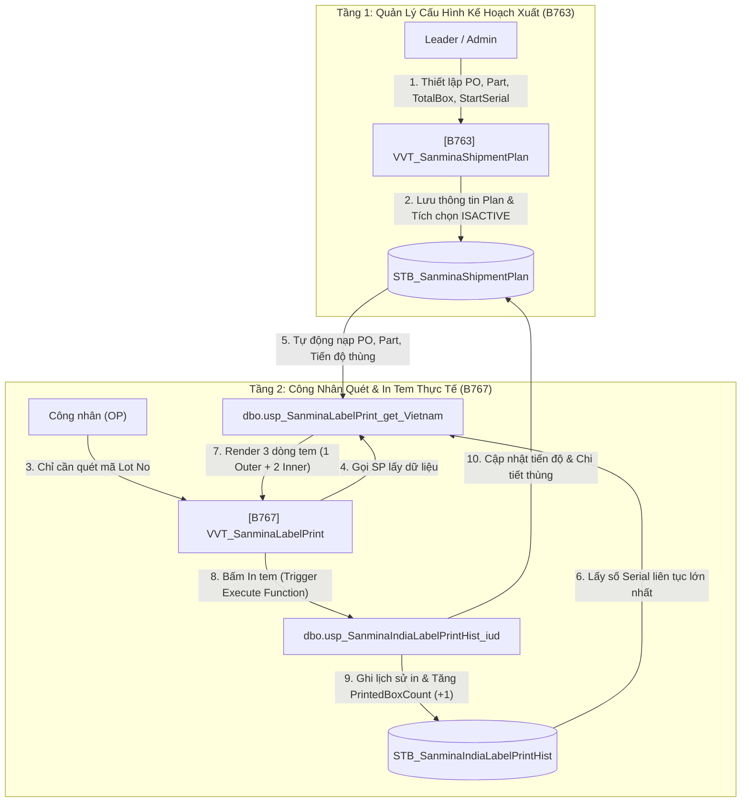

<!--
AI-READY METADATA
Purpose: Cẩm nang kỹ thuật & quy chuẩn kiến trúc in tem 2D Barcode Sanmina (Mô hình 2 màn hình B763 Cấu hình & B767 In tem, Serial liên tục đa Lot, Inner/Outer serials)
Scope: Sanmina Custom Customer Label Specification & 2-Screen Production Blueprint
Single Source of Truth: KB_04_03_SANMINA_LABEL_GUIDE.md (Sanmina Label Specification & Production Architecture)
Target Screens: B763, B767, Z530, A460
Target Tables: STB_SanminaShipmentPlan, STB_SanminaShipmentPlanLot, STB_SanminaIndiaLabelPrintHist, STB_ModelLabelInfo, STB_LabelInfo
Related Files:
  - [KB_INDEX.md](file:///c:/Users/User%20Vinatech.DESKTOP-RJJSEQU/Desktop/MES_LEGACY_BACKUP/MES_MASTER_KNOWLEDGE_BASE/KB_INDEX.md)
  - [KB_04 Index](file:///c:/Users/User%20Vinatech.DESKTOP-RJJSEQU/Desktop/MES_LEGACY_BACKUP/MES_MASTER_KNOWLEDGE_BASE/KB_04/INDEX.md)
  - [KB_04_01_CORE_PACKAGING.md](file:///c:/Users/User%20Vinatech.DESKTOP-RJJSEQU/Desktop/MES_LEGACY_BACKUP/MES_MASTER_KNOWLEDGE_BASE/KB_04/KB_04_01_CORE_PACKAGING.md)
-->

# Cẩm Nang Phát Triển & Vận Hành Tem Nhãn Sanmina (B763 & B767 Production Guide)

> ← [Về INDEX](file:///c:/Users/User%20Vinatech.DESKTOP-RJJSEQU/Desktop/MES_LEGACY_BACKUP/MES_MASTER_KNOWLEDGE_BASE/KB_INDEX.md) | [Về KB_04 Index](file:///c:/Users/User%20Vinatech.DESKTOP-RJJSEQU/Desktop/MES_LEGACY_BACKUP/MES_MASTER_KNOWLEDGE_BASE/KB_04/INDEX.md)

---

Tài liệu này mô tả chi tiết **Kiến trúc phân quyền 2 màn hình (B763 & B767)** và **Thuật toán sinh số thùng / số serial liên tục** cho tem xuất khẩu Sanmina India trên hệ thống NAIS MES của Vinatech. Đây là **tài liệu kỹ thuật mẫu (Blueprint)** chuẩn mực để nhân bản cho các khách hàng xuất khẩu khác có yêu cầu tương tự.

---

## 1. 📐 Kiến Trúc Phân Quyền 2 Màn Hình (Separation of Concerns)

Nhằm tối ưu hóa thao tác tại xưởng sản xuất, giảm thiểu sai sót do công nhân (OP) gõ nhầm mã PO/Part Number, hệ thống tách biệt thành 2 tầng màn hình:



### 1.1 Màn hình [B763] — Thiết lập kế hoạch xuất Sanmina (`VVT_SanminaShipmentPlan`)
* **Đối tượng sử dụng:** Quản lý sản xuất, Leader, Admin.
* **Mục đích:** Cấu hình thông tin Lô hàng xuất khẩu trước khi xưởng tiến hành đóng gói in tem.
* **Stored Procedures:**
  * `usp_SanminaShipmentPlan_get`: Tải danh sách kế hoạch xuất, tự động tính cột `RemainingBox` ($= \text{TotalBox} - \text{PrintedBoxCount}$).
  * `usp_SanminaShipmentPlan_iud`: Thêm, sửa, xóa kế hoạch trực tiếp trên Grid XML. Tự động cập nhật `Status = 'COMPLETED'` khi in đủ thùng, hoặc `'ACTIVE'` khi kích hoạt.
* **Các trường dữ liệu cốt lõi trên bảng `STB_SanminaShipmentPlan`:**
  | Tên Cột | Kiểu Dữ Liệu | Ý Nghĩa Nghiệp Vụ |
  | :--- | :---: | :--- |
  | `PlanID` | `INT` (PK) | Khóa chính tự tăng của kế hoạch |
  | `IsActive` | `BIT` | Cờ kích hoạt (`1` = Đang áp dụng cho màn B767, `0` = Tạm dừng) |
  | `PONumber` | `VARCHAR(50)` | Mã đơn hàng PO của khách hàng Sanmina |
  | `PartNumber` | `VARCHAR(50)` | Mã linh kiện (Sanmina Part Number) |
  | `LotNo` | `VARCHAR(50)` | Mã Lot chỉ định (NULL = áp dụng chung cho mọi Lot của PO) |
  | `QtyPerBox` | `INT` | Số lượng pcs trên 1 thùng Outer (Mặc định: 102, Inner tự chia 51) |
  | `TotalBox` | `INT` | Tổng số thùng trên Pallet (Ví dụ: 196) |
  | `PrintedBoxCount` | `INT` | Số thùng thực tế đã in (Cho phép sửa trực tiếp để tiếp tục in dở) |
  | `RemainingBox` | `INT` (Computed) | Số thùng còn lại cần in (Tự động tính: $\text{TotalBox} - \text{PrintedBoxCount}$) |
  | `StartSerial` | `INT` | Số serial bắt đầu chỉ định (NULL = tự động nối tiếp theo lịch sử DB) |
  | `Status` | `VARCHAR(20)` | Trạng thái (`ACTIVE`, `COMPLETED`, `PENDING`) |

### 1.2 Màn hình [B767] — In tem khách hàng Sanmina India (`VVT_SanminaLabelPrint`)
* **Đối tượng sử dụng:** Công nhân đứng máy đóng gói (OP).
* **Mục đích:** In tem 2D Barcode (Outer & Inner) dán lên từng thùng hàng thành phẩm.
* **Quy trình thao tác:** Công nhân **chỉ cần quét duy nhất mã Lot No (Barcode)**. Mọi thông số (PO Number, Part Number, Số lượng, Số thứ tự thùng `CartonBoxNo`, Số Serial `BoxSerialNo`) được hệ thống tự động điền 100%.

---

## 2. 🧮 Thuật Toán Sinh Số Thùng & Số Serial Liên Tục

### 2.1 Thuật toán số thứ tự thùng (`CartonBoxNo`)
* **Quy chuẩn hiển thị:** `[Thùng hiện tại] / [Tổng số thùng]` (Ví dụ: `01/196`, `02/196`... `100/196`... `196/196`).
* **Logic tính toán trong SP `usp_SanminaLabelPrint_get_Vietnam`:**
  ```sql
  DECLARE @NextBox INT = @ActivePrintedBoxCount + 1;
  IF @NextBox > @pTotalBox SET @NextBox = @pTotalBox;
  IF @NextBox <= 0 SET @NextBox = 1;

  -- Định dạng chuỗi hiển thị không bị giới hạn ở 2 chữ số (không dùng RIGHT(..., 2))
  DECLARE @CartonBoxStr VARCHAR(20) = 
      CASE WHEN @NextBox < 10 THEN '0' + CONVERT(VARCHAR(10), @NextBox) 
           ELSE CONVERT(VARCHAR(10), @NextBox) 
      END + '/' + @TotalBoxString;
  ```

### 2.2 Thuật toán Serial đếm độc lập & tự động Reset theo Tuần/Mã ngày (Weekly Serial Reset Algorithm)
> [!IMPORTANT]
> **Quy tắc nghiệp vụ cốt lõi:**
> Tem Sanmina India sử dụng cấu trúc Serial Number: `VINA + [Mã ngày (WWYY)] + [5 chữ số Serial]`.
> * **Tiền tố Mã ngày / Tuần (`VINA + WWYY`):** Tự động đổi theo ngày sản xuất của mã Lot (ví dụ `VINA2526`, `VINA2626`...). Bản thân tiền tố này đã đảm bảo tính duy nhất (`unique`) giữa các tuần.
> * **Dải 5 chữ số Serial đằng sau (`00001` - `99999`):** **Chạy độc lập theo từng Mã ngày**. Khi mã Lot chuyển sang một tuần sản xuất mới (chưa từng in), Serial Number **bắt buộc nhảy về 1 (`00001, 00002`)** để đếm từ đầu cho tuần đó. Nếu tiếp tục in trong cùng tuần thì tiếp tục tăng tịnh tiến (`+1, +2`).

* **Logic xác định số Serial cơ sở (`BaseSerial`):**
  ```sql
  DECLARE @SerialPrefix VARCHAR(10) = 'VINA' + @rDC2
  DECLARE @BaseSerial INT = 0

  IF @IsPlanMode = 1 AND @ActiveStartSerial IS NOT NULL
  BEGIN
      -- TRƯỜNG HỢP 1: Plan có chỉ định StartSerial cụ thể (VD: 0, 100, 500...)
      -- Tự động tịnh tiến theo số thùng đã in của Plan: BaseSerial = StartSerial + (PrintedBoxCount * 2)
      SET @BaseSerial = @ActiveStartSerial + (ISNULL(@ActivePrintedBoxCount, 0) * 2);
  END
  ELSE
  BEGIN
      -- TRƯỜNG HỢP 2: Tự động theo lịch sử in của đúng Mã ngày / Tuần hiện tại (@SerialPrefix)
      -- Lấy số serial 5 chữ số lớn nhất trong lịch sử in của đúng tuần hiện tại
      -- Nếu sang tuần mới (chưa từng in), @LatestSerial sẽ là NULL -> BaseSerial = 0 -> Serial bắt đầu từ 00001, 00002
      DECLARE @LatestSerial INT = 0;
      SELECT TOP 1 @LatestSerial = TRY_CAST(RIGHT(BoxSerialNo, 5) AS INT)
      FROM STB_SanminaIndiaLabelPrintHist WITH(NOLOCK)
      WHERE LEN(BoxSerialNo) = 13 
        AND BoxSerialNo LIKE @SerialPrefix + '%'
      ORDER BY ID DESC;

      SET @BaseSerial = ISNULL(@LatestSerial, 0);
  END

  -- Gán Serial cho thùng Outer và 2 thùng Inner:
  -- Inner 1 = @SerialPrefix + RIGHT('00000' + CONVERT(VARCHAR, @BaseSerial + 1), 5)
  -- Inner 2 = @SerialPrefix + RIGHT('00000' + CONVERT(VARCHAR, @BaseSerial + 2), 5)
  -- Outer   = Inner1Serial + ', ' + Inner2Serial
  ```

* **Bảng minh họa kết quả in khi đổi mã Lot giữa các tuần:**
  | Thứ tự thùng | Mã Lot quét vào | Tuần sản xuất | Số Serial tem sinh ra | Ghi chú vận hành |
  | :---: | :--- | :---: | :--- | :--- |
  | **Thùng 84** | `VVQO033R072703` | Tuần 23 (`2326`) | `VINA232600427, VINA232600428` | Đang in tuần 23 |
  | **Thùng 85** | `VVQO033R072738` | Tuần 23 (`2326`) | `VINA232600429, VINA232600430` | Tăng tiếp tuần 23 |
  | **Thùng 86** | 👉 **Đổi sang** `VVQO173R072735` | Tuần 25 (`2526`) | `VINA252600001, VINA252600002` | **Tuần 25 mới $\rightarrow$ Reset về 1** |
  | **Thùng 87** | Quét tiếp `VVQO173R072740` | Tuần 25 (`2526`) | `VINA252600003, VINA252600004` | Tăng tiếp tuần 25 |
  | **Thùng 88** | 👉 **Đổi sang** `VVQP283R072710` | Tuần 31 (`3126`) | `VINA312600001, VINA312600002` | **Tuần 31 mới $\rightarrow$ Reset về 1** |

---

## 3. 🛡️ Cơ Chế Chống Lỗi Nhân 3 Tiến Độ (NAIS Multi-Row Guard)

### Vấn đề kỹ thuật của NAIS SmartFramework:
Mỗi khi người dùng bấm nút **In tem** trên màn hình [B767], lưới dữ liệu chứa 3 dòng (1 Outer, 2 Inner). Framework của NAIS sẽ **gọi Stored Procedure `_iud` 3 lần liên tiếp** cho 3 dòng này.

### Giải pháp kỹ thuật đã áp dụng trong `usp_SanminaIndiaLabelPrintHist_iud`:
* **Bảng lịch sử gốc `STB_SanminaIndiaLabelPrintHist`:** Lưu đủ cả 3 lần gọi (1 dòng Outer + 2 dòng Inner).
* **Bảng tiến độ `STB_SanminaShipmentPlan` & `STB_SanminaShipmentPlanLot`:** Sử dụng cờ kiểm tra `@IsOuterLabel`:
  ```sql
  DECLARE @IsOuterLabel BIT = 0;
  IF @pLabelClass = 'Outer' OR @pBoxSerialNo LIKE '%,%' OR (@pCartonBoxNo IS NOT NULL AND @pCartonBoxNo NOT LIKE '02/0[1-9]')
  BEGIN
      SET @IsOuterLabel = 1;
  END

  -- CHỈ CẬP NHẬT TIẾN ĐỘ KHI LÀ DÒNG OUTER
  IF @IsOuterLabel = 1
  BEGIN
      UPDATE STB_SanminaShipmentPlan
      SET PrintedBoxCount = PrintedBoxCount + 1,
          Status = CASE WHEN PrintedBoxCount + 1 >= TotalBox THEN 'COMPLETED' ELSE 'ACTIVE' END
      WHERE PlanID = @TargetPlanID;
      
      INSERT INTO STB_SanminaShipmentPlanLot (PlanID, LotNo, BoxSeq, CartonBoxNo, BoxSerialNo, PrintedTime, PrintUserID)
      VALUES (@TargetPlanID, @pLotNo, @NewPrintedCount, @pCartonBoxNo, @pBoxSerialNo, GETDATE(), @pProcessUserID);
  END
  ```

---

## 4. 📖 Sổ Tay Vận Hành Chuẩn (Standard Operating Procedure - SOP)

### Tình huống 1: Bắt đầu Lô xuất mới (PO mới hoàn toàn)
1. Mở màn hình **[B763]**.
2. Thêm 1 dòng mới: Nhập `PONumber`, `PartNumber`, `TotalBox` (ví dụ `196`), `Quantity` (102).
3. Đặt `Printed Box Count = 0`, để trống ô `StartSerial`.
4. Tích chọn `ISACTIVE = [v]`, bỏ tích các dòng cũ $\rightarrow$ Bấm **Lưu (Save)**.
5. OP mở **[B767]** quét mã Lot $\rightarrow$ Tự động in từ thùng **`01/TotalBox`**.

### Tình huống 2: In nối tiếp (Hôm qua in dở, hôm nay in tiếp)
*Ví dụ: Hôm qua đã in xong thùng thứ 84, hôm nay cần in tiếp thùng 85.*
1. Mở màn hình **[B763]**.
2. Sửa ô **`Printed Box Count = 84`** (ô `Remaining Box` tự động cập nhật về `112`).
3. Ô `StartSerial` cứ để trống (NULL).
4. Bấm **Lưu (Save)**.
5. OP mở **[B767]** quét mã Lot $\rightarrow$ Tự động in thùng **`85/196`** với Serial nối tiếp chính xác.

### Tình huống 3: Sự cố máy in kẹt tem / rách nhãn / Cần chỉ định dải số Serial
*Ví dụ: Thùng 85 bị kẹt rách tem `00429, 00430`, muốn bỏ qua và in từ `00431`.*
1. Mở màn hình **[B763]**.
2. Nhập `StartSerial = 430` (để thùng tiếp theo lấy $430 + 1 = 431$).
3. Bấm **Lưu (Save)**.
4. Quét lại mã Lot trên **[B767]** $\rightarrow$ Hệ thống tự động bắt đầu từ `...00431, ...00432`.

### Tình huống 4: In lại từ đầu cho một PO cũ
1. Mở màn hình **[B763]**.
2. Sửa ô **`Printed Box Count = 0`** $\rightarrow$ Bấm **Lưu (Save)**.
3. Trạng thái tự động đổi từ `COMPLETED` sang `ACTIVE`.
4. OP quét Lot trên **[B767]** $\rightarrow$ Bắt đầu in lại từ thùng **`01/TotalBox`**.

---

## 5. 🏗️ Khung Mẫu (Blueprint) Nhân Bản Cho Khách Hàng Xuất Khẩu Mới

Khi cần phát triển hệ thống in tem theo kế hoạch xuất cho khách hàng mới (ví dụ: Khách hàng Y):

1. **Tạo bảng quản lý Kế hoạch xuất:** `STB_YShipmentPlan` & `STB_YShipmentPlanLot` (theo cấu trúc của `STB_SanminaShipmentPlan`).
2. **Tạo bảng lịch sử in:** `STB_YLabelPrintHist` (chú ý `BoxSerialNo VARCHAR(50)`).
3. **Tạo màn hình cấu hình `[Bxxx]`:** Dùng SP `usp_YShipmentPlan_get` và `usp_YShipmentPlan_iud`.
4. **Tạo SP in tem `usp_YLabelPrint_get`:**
   - Tự động nạp Plan có `IsActive = 1`.
   - Tính toán `CartonBoxNo` và `BaseSerial` tịnh tiến liên tục.
5. **Tạo SP ghi log `usp_YLabelPrintHist_iud`:** Thêm cờ `@IsOuterLabel` guard để tránh lỗi tăng tiến độ x3.
6. **Thiết kế template trên Z530 & ánh xạ trên A460.**
