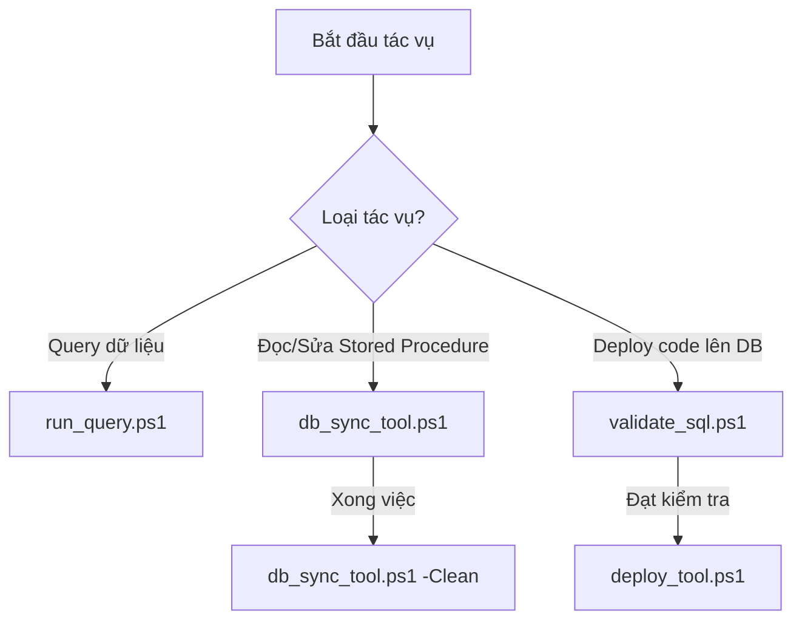

<!--
AI-READY METADATA
Purpose: Hướng dẫn chi tiết cách sử dụng 6+ công cụ script PowerShell (run_query, db_sync_tool, validate_sql, deploy_tool, debug_screen, record_hotfix) và quy trình DB Archaeology
Scope: Workspace PowerShell Tools & Execution Workflows
Single Source of Truth: MES_SCRIPT_GUIDE.md (PowerShell Tools Documentation)
Target Scripts: run_query.ps1, db_sync_tool.ps1, validate_sql.ps1, deploy_tool.ps1, debug_screen.ps1, record_hotfix.ps1
Related Files:
  - [BOOTSTRAP.md](file:///c:/Users/User%20Vinatech.DESKTOP-RJJSEQU/Desktop/PROCESS/MES/AI_AGENT_CONFIG/BOOTSTRAP.md)
  - [RULES.md](file:///c:/Users/User%20Vinatech.DESKTOP-RJJSEQU/Desktop/PROCESS/MES/AI_AGENT_CONFIG/RULES.md)
  - [SKILLS.md](file:///c:/Users/User%20Vinatech.DESKTOP-RJJSEQU/Desktop/PROCESS/MES/AI_AGENT_CONFIG/SKILLS.md)
-->

# 🛠️ Script & Tool Guide — Hướng Dẫn Sử Dụng Script PowerShell Bổ Trợ

> **Dành cho:** AI Agent (Antigravity) & Kỹ sư EA/IT vận hành dự án MES Vinatech.
> **Vị trí các script:** Nằm trực tiếp tại thư mục gốc của dự án (`c:\Users\User Vinatech.DESKTOP-RJJSEQU\Desktop\PROCESS\MES\`).
> ← [Về INDEX](file:///c:/Users/User%20Vinatech.DESKTOP-RJJSEQU/Desktop/PROCESS/MES/MES_MASTER_KNOWLEDGE_BASE/KB_INDEX.md)


Tài liệu này hướng dẫn chi tiết cách sử dụng, các tham số đầu vào, logic xử lý nội bộ và cơ chế bảo mật an toàn của 4 script PowerShell hỗ trợ đắc lực cho việc tương tác cơ sở dữ liệu và mã nguồn.

---

## 🧭 Bản Đồ Sử Dụng Script (Quick Workflow)



---

## 1. 🔍 run_query.ps1 — Chạy Truy Vấn SQL Nhanh

Script này cho phép chạy các câu lệnh SQL read-only trực tiếp từ Terminal lên SQL Server, hỗ trợ xuất kết quả dưới dạng bảng, định dạng JSON hoặc CSV.

### 📋 Cách sử dụng & Tham số:
```powershell
powershell -File .\run_query.ps1 -Query "Nội_dung_câu_lệnh_SQL"
```
*   `-Query` *(Bắt buộc):* Nội dung câu lệnh SQL cần chạy. Bắt buộc sử dụng `WITH(NOLOCK)` cho các bảng giao dịch lớn.

### 💡 Ví dụ thực tế:
```powershell
# 1. Truy vấn nhanh 5 dòng trong SetInfo dạng bảng
powershell -File .\run_query.ps1 -Query "SELECT TOP 5 Barcode, LotDecisionResult, IsDefect FROM STB_SetInfo WITH(NOLOCK) WHERE IsDefect = 1"

# 2. Xuất dữ liệu cấu hình model dạng JSON để xử lý bằng script
powershell -File .\run_query.ps1 -Query "SELECT ModelCode, MBIExtText04, MBIExtText05 FROM STB_ModelBasicInfo WITH(NOLOCK) WHERE ModelCode = 'RDMD00-368'" -Format JSON
```

---

## 2. 🔄 db_sync_tool.ps1 — Tải & Dọn Dẹp Stored Procedure Tạm

Do mã nguồn các Stored Procedure của MES nằm hoàn toàn trong database và không được tracking bằng Git để tránh phình dung lượng, script này giúp tải định nghĩa SP từ DB về máy dưới dạng file `.sql` để đọc/sửa, và dọn dẹp sạch sẽ khi hoàn tất để giữ Git workspace luôn sạch.

### 📋 Cách sử dụng & Tham số:
```powershell
# Tải SP về máy (Tự động tạo thư mục tạm sql/procedures/ nếu chưa có)
powershell -File .\db_sync_tool.ps1 -SPName "Tên_Stored_Procedure"

# Dọn dẹp sạch sẽ các file SP đã tải tạm thời
powershell -File .\db_sync_tool.ps1 -Clean
```
*   `-SPName`: Tên của Stored Procedure cần tải về (ví dụ: `usp_DoProcessProdRouteHist`). File tải về sẽ nằm trong thư mục tạm `sql/procedures/[Tên_SP].sql`.
*   `-Clean`: Xóa toàn bộ các tệp tin trong thư mục tạm `sql/procedures/` để khôi phục trạng thái Git sạch trước khi commit.

### 💡 Ví dụ thực tế:
```powershell
# Tải SP chốt sản lượng về phân tích
powershell -File .\db_sync_tool.ps1 -SPName "usp_DoProcessProdRouteHistForCalc_SmartApp_VNT"

# Sau khi đã phân tích xong, dọn dẹp sạch thư mục tạm sql/
powershell -File .\db_sync_tool.ps1 -Clean
```

---

## 3. 🛡️ validate_sql.ps1 — Kiểm Tra Quy Tắc An Toàn SQL

Trước khi áp dụng bất kỳ thay đổi nào lên database Production, file `.sql` bắt buộc phải được chạy qua bộ kiểm tra an toàn `validate_sql.ps1`. Bộ kiểm tra này sẽ phân tích cú pháp tĩnh để đảm bảo code tuân thủ các quy tắc vàng của dự án.

### 📋 Cách sử dụng:
```powershell
powershell -File .\validate_sql.ps1 -SqlPath "Đường_dẫn_file_SQL"
```

### 🔒 Các quy tắc kiểm tra (Rules enforced):
1.  **Bắt buộc có Transaction:** File SQL thay đổi dữ liệu phải chứa khối `BEGIN TRAN` ... `ROLLBACK TRAN` (hoặc `COMMIT TRAN`).
2.  **Cấm chạy DROP/ALTER trực tiếp:** Cấm chạy các lệnh làm thay đổi vĩnh viễn cấu trúc bảng hoặc SP mà không có bọc an toàn.
3.  **Quy tắc SELECT-ONLY cho AI:** Chặn đứng các lệnh ghi (INSERT/UPDATE/DELETE) trực tiếp nếu AI agent tự ý gọi mà không qua bọc kiểm soát của người dùng.

### 💡 Ví dụ thực tế:
```powershell
# Kiểm tra file SQL sửa lỗi trong thư mục nháp/scratch trước khi deploy
powershell -File .\validate_sql.ps1 -SqlPath "C:\Users\User Vinatech.DESKTOP-RJJSEQU\.gemini\antigravity-ide\brain\cab9e98e-f5af-4971-93ca-36def1d031e9\scratch\fix_slitting.sql"
```

---

## 🚀 deploy_tool.ps1 — Triển Khai Hotfix Lên Production

Khi file SQL sửa lỗi đã vượt qua bộ lọc an toàn của `validate_sql.ps1`, kỹ sư IT hoặc AI Agent (dưới sự phê duyệt cụ thể của User) sẽ thực hiện deploy script trực tiếp lên database.

### 📋 Cách sử dụng:
```powershell
powershell -File .\deploy_tool.ps1 -SqlPath "Đường_dẫn_file_SQL"
```
*   `-SqlPath` *(Bắt buộc):* Đường dẫn tới file SQL cần deploy.

### 💡 Ví dụ thực tế:
```powershell
# Triển khai SQL sửa lỗi từ thư mục nháp/scratch trực tiếp lên DB
powershell -File .\deploy_tool.ps1 -SqlPath "C:\Users\User Vinatech.DESKTOP-RJJSEQU\.gemini\antigravity-ide\brain\cab9e98e-f5af-4971-93ca-36def1d031e9\scratch\fix_slitting.sql"
```

---

## 5. 🔄 check_sp_sync.ps1 — Kiểm Tra Đồng Bộ SP & Function (Local vs DB)

Script tự động quét toàn bộ file SQL trong workspace hoặc kiểm tra SP/Function chỉ định, kết nối trực tiếp DB để so sánh nội dung logic và ngày cập nhật nhằm tránh rủi ro thao tác trên bản code cũ.

### 📋 Cách sử dụng & Tham số:
```powershell
# 1. Quét toàn bộ thư mục sql (báo cáo trạng thái SYNCED / OUT_OF_SYNC / NOT_IN_DB)
powershell -File .\check_sp_sync.ps1

# 2. Quét riêng thư mục sql/procedures
powershell -File .\check_sp_sync.ps1 -Path .\sql\procedures

# 3. Kiểm tra 1 SP/Function cụ thể
powershell -File .\check_sp_sync.ps1 -SPName fn_VVT_getdatebyVendorLot

# 4. Tự động kéo bản mới nhất từ DB về nếu phát hiện file local bị lệch/cũ
powershell -File .\check_sp_sync.ps1 -Path .\sql\procedures -Pull
```

---

## 6. 🕵️‍♂️ Database Archaeology & Change Tracking — Quy Trình Khảo Cổ & Tra Cứu Lịch Sử Đối Tượng DB

Khi cần xác định **ai, khi nào, và nội dung gì** đã được chỉnh sửa trong một Stored Procedure hoặc Table trực tiếp trên Database Production (nơi không được Git tracking thường xuyên):

### 📋 Bước 1: Kiểm tra thời điểm sửa đổi gần nhất từ hệ thống DB
Chạy truy vấn để lấy ngày tạo (`create_date`) và ngày chỉnh sửa gần nhất (`modify_date`) từ `sys.objects`:
```powershell
powershell -File .\run_query.ps1 -Query "SELECT name, create_date, modify_date FROM sys.objects WHERE name = 'Tên_Stored_Procedure_Hoặc_Bảng'"
```
*Lưu ý: Múi giờ của Database Server có thể lệch với múi giờ máy local (Ví dụ: DB Server Vinatech chạy múi giờ Hàn Quốc KST GMT+9, lệch +2 tiếng so với Việt Nam ICT GMT+7).*

### 📋 Bước 2: Truy vết lịch sử SP thông qua Git log (Nếu từng được backup)
Mặc dù thư mục `sql/procedures/` được dọn sạch trước khi commit, trong lịch sử Git vẫn lưu trữ các file SP đã được tải về phân tích ở các commit cũ:
1. **Tìm các commit từng chứa file SP:**
   ```powershell
   git log --name-only --format="COMMIT %h %ad : %s" | ForEach-Object { if ($_ -match "^COMMIT") { $currentCommit = $_ } elseif ($_ -match "Tên_Stored_Procedure.sql") { Write-Output "$currentCommit -> $_" } }
   ```
2. **Khôi phục file SP từ commit lịch sử:**
   ```powershell
   git show [Mã_Commit]:[Đường_dẫn_file_trong_commit] > sql/procedures/old_version.sql
   ```
   *(Nếu file được xuất ra dạng UTF-16LE gây lỗi đọc file của AI, hãy dùng PowerShell chuyển đổi sang UTF-8: `Get-Content -Path "file_cu" | Out-File -FilePath "file_moi" -Encoding utf8`).*

### 📋 Bước 3: So sánh line-by-line để tìm dòng thay đổi
Dùng công cụ `fc.exe /N` của Windows hoặc `Compare-Object` của PowerShell để chỉ ra chính xác các dòng code được thêm vào, xóa đi hoặc sửa đổi giữa bản cũ và bản live vừa tải từ DB về:
```powershell
fc.exe /N sql\procedures\old_version.sql sql\procedures\live_version.sql
```

### 📋 Bước 4: Kiểm tra chéo các phụ thuộc mới (Dependencies)
Nếu phát hiện trong đoạn code mới thêm có gọi tới các SP hoặc Function lạ, hãy kiểm tra ngày tạo của đối tượng đó để xác minh thời điểm tích hợp:
```powershell
powershell -File .\run_query.ps1 -Query "SELECT name, create_date, modify_date FROM sys.objects WHERE name = 'Tên_SP_Mới_Tích_Hợp'"
```

---

## ⚠️ Quy Tắc An Toàn
Các script trên tương tác trực tiếp với cơ sở dữ liệu. Vui lòng tham khảo chi tiết các quy tắc an toàn dữ liệu bắt buộc tại [RULES.md](file:///C:/Users/User%20Vinatech.DESKTOP-RJJSEQU/Desktop/PROCESS/MES/AI_AGENT_CONFIG/RULES.md).
