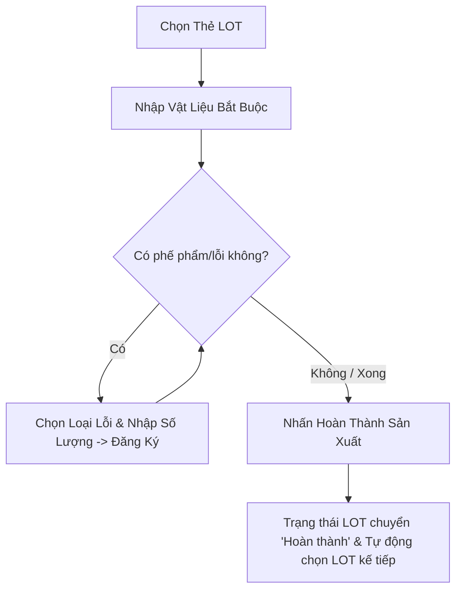
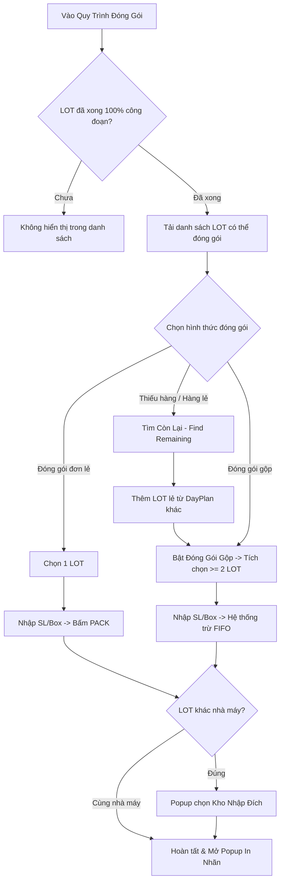
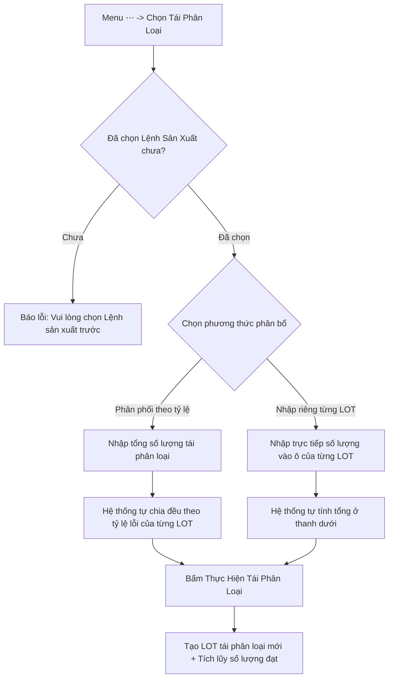
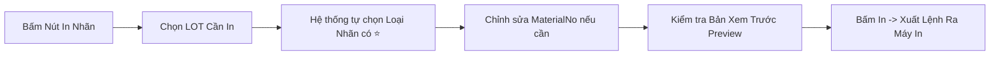

# HƯỚNG DẪN SỬ DỤNG HỆ THỐNG POP KIOSK (POINT OF PRODUCTION)
**Tài liệu hướng dẫn vận hành hệ thống POP dành cho công nhân, chuyền trưởng & kỹ sư vận hành**  
*Phiên bản: v1.1 (Cập nhật 2026-06) — Tác giả: Hanbit Kang — Vinatech MES*

---

## 📑 MỤC LỤC
1. [Phần 0: Tổng Quan Giao Diện POP Kiosk](#phần-0-tổng-quan-giao-diện-pop-kiosk)
   - [0.1 Bố cục 4 khu vực màn hình](#01-bố-cục-4-khu-vực-màn-hình)
   - [0.2 Các chức năng chung trên Header](#02-các-chức-năng-chung-trên-header)
2. [Phần 1: Bắt Đầu Ca Làm Việc](#phần-1-bắt-đầu-ca-làm-việc)
   - [1.1 Chọn Công Nhân (Đăng nhập)](#11-chọn-công-nhân-đăng-nhập)
   - [1.2 Chọn Dây Chuyền Sản Xuất](#12-chọn-dây-chuyền-sản-xuất)
   - [1.3 Chọn Ngày Làm Việc (Lịch Sản Xuất)](#13-chọn-ngày-làm-việc-lịch-sản-xuất)
   - [1.4 Chọn Lệnh Sản Xuất (Work Order / DayPlan)](#14-chọn-lệnh-sản-xuất-work-order--dayplan)
   - [1.5 Menu Quy Trình & Danh Sách Thẻ LOT](#15-menu-quy-trình--danh-sách-thẻ-lot)
3. [Phần 2: Quy Trình Thao Tác Thủ Công (Manual Process)](#phần-2-quy-trình-thao-tác-thủ-công-manual-process)
   - [2.1 Bố cục màn hình thao tác thủ công](#21-bố-cục-màn-hình-thao-tác-thủ-công)
   - [2.2 Chọn thẻ LOT làm việc](#22-chọn-thẻ-lot-làm-việc)
   - [2.3 Nhập Vật Liệu (Bắt buộc)](#23-nhập-vật-liệu-bắt-buộc)
     - [2.3.1 Nhập chi tiết cho từng LOT](#231-nhập-chi-tiết-cho-từng-lot)
     - [2.3.2 Phân phối vật liệu hàng loạt (Batch Distribution)](#232-phân-phối-vật-liệu-hàng-loạt-batch-distribution)
   - [2.4 Đăng Ký Phế Phẩm / Lỗi (Defect Registration)](#24-đăng-ký-phế-phẩm--lỗi-defect-registration)
   - [2.5 Hoàn Thành Đăng Ký Sản Xuất](#25-hoàn-thành-đăng-ký-sản-xuất)
   - [2.6 Menu Mở Rộng (Nút ⋯) & Kiểm Tra Định Mức BOM](#26-menu-mở-rộng-nút--và-kiểm-tra-định-mức-bom)
4. [Phần 3: Đóng Gói & Đóng Gói Gộp (Packing & Merge Packing)](#phần-3-đóng-gói--đóng-gói-gộp-packing--merge-packing)
   - [3.1 Vào quy trình đóng gói & Điều kiện](#31-vào-quy-trình-đóng-gói--điều-kiện)
   - [3.2 Bố cục màn hình đóng gói](#32-bố-cục-màn-hình-đóng-gói)
   - [3.3 Đóng gói tiêu chuẩn (Single LOT Pack)](#33-đóng-gói-tiêu-chuẩn-single-lot-pack)
   - [3.4 Tìm LOT Còn Lại từ Lệnh SX khác (Find Remaining)](#34-tìm-lot-còn-lại-từ-lệnh-sx-khác-find-remaining)
   - [3.5 Đóng Gói Gộp Nhiều LOT (Merge Packing)](#35-đóng-gói-gộp-nhiều-lot-merge-packing)
   - [3.6 Đóng Gói Liên Nhà Máy — Chọn Kho (Cross-plant Packing)](#36-đóng-gói-liên-nhà-máy--chọn-kho-cross-plant-packing)
   - [3.7 In Nhãn Sau Đóng Gói (Nhãn LOT / Nhãn Box)](#37-in-nhãn-sau-đóng-gói-nhãn-lot--nhãn-box)
   - [3.8 Lịch Sử Đóng Gói — In Lại Nhãn & Hủy Đóng Gói](#38-lịch-sử-đóng-gói--in-lại-nhãn--hủy-đóng-gói)
5. [Phần 4: Tái Phân Loại (Re-sorting)](#phần-4-tái-phân-loại-re-sorting)
   - [4.1 Mục đích & Điều kiện truy cập](#41-mục-đích--điều-kiện-truy-cập)
   - [4.2 Tái phân loại tự động phân phối theo tỷ lệ](#42-tái-phân-loại-tự-động-phân-phối-theo-tỷ-lệ)
   - [4.3 Tái phân loại nhập riêng từng LOT](#43-tái-phân-loại-nhập-riêng-từng-lot)
6. [Phần 5: In Nhãn Tem Mã Vạch (Label Printing)](#phần-5-in-nhãn-tem-mã-vạch-label-printing)
   - [5.1 Truy cập màn hình in nhãn](#51-truy-cập-màn-hình-in-nhãn)
   - [5.2 Chọn LOT & Định dạng nhãn](#52-chọn-lot--định-dạng-nhãn)
   - [5.3 Xác nhận bản xem trước & Thực hiện in](#53-xác-nhận-bản-xem-trước--thực-hiện-in)
7. [Tóm Tắt Các Điểm Lưu Ý Vận Hành Quan Trọng](#tóm-tắt-các-điểm-lưu-ý-vận-hành-quan-trọng)

---

## PHẦN 0: TỔNG QUAN GIAO DIỆN POP KIOSK

Màn hình POP (Point of Production) được thiết kế tối ưu hóa cho màn hình cảm ứng Kiosk tại các chuyền sản xuất, giúp công nhân thao tác nhanh chóng và chính xác.

```
+-----------------------------------------------------------------------------------------+
| [1] HEADER: [Tên Công Ty] | Ngày Giờ Thực | [Dây Chuyền] | [Tên Công Nhân] | Nút (↻)    |
+-------------------+---------------------------------------------------------------------+
| [2] MENU QUY TRÌNH| [3] THANH TRẠNG THÁI THIẾT BỊ (Equipment Chip Bar)                  |
|   - Công đoạn 1   +---------------------------------------------------------------------+
|   - Công đoạn 2   |                                                                     |
|   - ...           | [4] KHU VỰC LÀM VIỆC CHÍNH (Main Work Area)                         |
|   - Lắp ráp       |     - Danh sách LOT thẻ (Card View)                                 |
|   - Đóng gói      |     - Chi tiết tiến độ / Bàn phím số cảm ứng                        |
|                   |     - Bảng nhập vật tư / Đăng ký lỗi                                |
|                   |                                                                     |
+-------------------+---------------------------------------------------------------------+
| Chuyển đổi ngôn ngữ [KO | EN | VI]                          Công tắc Chế độ Tối/Sáng 🌓 |
+-----------------------------------------------------------------------------------------+
```

### 0.1 Bố cục 4 khu vực màn hình
1. **Header (Thanh tiêu đề phía trên):** Hiển thị thông tin tổng quan gồm: Ngày/giờ thực tế, Tên Dây chuyền hiện tại, Tên Công nhân đang đăng nhập, và Nút làm mới dữ liệu.
2. **Menu Quy trình (Process Menu bên trái):** Liệt kê toàn bộ các công đoạn sản xuất của dây chuyền hiện tại theo đúng thứ tự chu trình. Chạm vào từng công đoạn để chuyển đổi giao diện tương ứng.
3. **Thanh trạng thái thiết bị (Equipment Chip Bar):** Hiển thị trạng thái kết nối phần cứng của các thiết bị được gán với Kiosk này:
   - 🟢 **Bình thường (Normal):** Thiết bị đang kết nối ổn định.
   - 🟡 **Trì hoãn (Delayed):** Tín hiệu truyền nhận chậm.
   - 🔴 **Mất kết nối (Disconnected):** Mất tín hiệu với máy móc/cân/đầu đọc.
4. **Khu vực Chính (Main Work Area):** Không gian thao tác nghiệp vụ, nội dung sẽ thay đổi linh hoạt theo công đoạn được lựa chọn ở Menu bên trái.

> [!NOTE]
> Phía dưới cùng của màn hình là nút chuyển đổi nhanh **Đa ngôn ngữ** (`KO` - Tiếng Hàn / `EN` - Tiếng Anh / `VI` - Tiếng Việt) và công tắc chuyển đổi **Giao diện Tối/Sáng (Dark/Light mode)**.

---

### 0.2 Các chức năng chung trên Header
* **Ngày và Giờ (Realtime Date & Time):** Cập nhật liên tục theo thời gian thực của hệ thống máy chủ.
* **Tên Dây Chuyền (Line Name):** Chạm trực tiếp vào tên Dây chuyền để mở danh sách đổi dây chuyền khác.
  > [!WARNING]
  > Việc đổi dây chuyền sản xuất khi đang tải dở lệnh sản xuất sẽ **đặt lại (reset) toàn bộ dữ liệu phiên làm việc hiện tại**.
* **Tên Công Nhân (Worker Name):** Chạm trực tiếp vào tên Công nhân để đổi tài khoản người thực hiện.
* **Nút Tải lại (↻ - Refresh):** Nằm ở góc phải trên cùng của Header, dùng để đồng bộ lại dữ liệu mới nhất từ máy chủ MES.

---

## PHẦN 1: BẮT ĐẦU CA LÀM VIỆC


### 1.1 Chọn Công Nhân (Đăng nhập)
Trước khi bắt đầu bất kỳ thao tác nào trên Kiosk, công nhân phải đăng ký thông tin người vận hành:
1. **Chuyển đổi Công ty:** Chọn Trụ sở chính (Vinatech) hoặc Chi nhánh tương ứng.
2. **Chọn Phòng ban:** Chạm chọn phòng ban trực thuộc tại cây danh mục bên trái.
3. **Chọn Nhân viên:** Chạm chọn thẻ tên nhân viên của mình ở danh sách bên phải.
4. **Xác nhận:** Tên công nhân sẽ ngay lập tức hiển thị trên thanh Header.

> [!TIP]
> **Đăng nhập siêu tốc bằng mã QR:** Nếu có thẻ nhân viên in mã QR, chỉ cần đưa thẻ vào đầu đọc mã vạch để đăng nhập ngay mà không cần tìm kiếm thủ công.

---

### 1.2 Chọn Dây Chuyền Sản Xuất
1. **Chọn Nơi làm việc (WorkCenter):** Chọn xưởng hoặc khu vực làm việc từ danh sách bên trái.
2. **Chọn Dây chuyền (Line):** Chọn tên dây chuyền mà bạn đang đứng máy từ danh sách bên phải.
3. **Xác nhận:** Tên dây chuyền được gán thành công sẽ hiển thị trên Header.

---

### 1.3 Chọn Ngày Làm Việc (Lịch Sản Xuất)
1. **Điều hướng Tháng:** Dùng nút `◀` hoặc `▶` để chuyển đổi qua lại giữa các tháng.
2. **Chọn Ngày:** Chạm vào ngày cần sản xuất. *Hệ thống tự động chọn mặc định là ngày hôm nay.*
3. **Tóm tắt Sản lượng:** Dưới lịch sẽ hiển thị tổng số lượng **Kế hoạch (Plan)** / **Đạt (Good)** / **Lỗi (Defect)** của ngày đã chọn.
4. **Số lượng Lệnh:** Con số nhỏ hiển thị phía dưới mỗi ô ngày thể hiện số lượng lệnh sản xuất (DayPlan) có trong ngày đó.

---

### 1.4 Chọn Lệnh Sản Xuất (Work Order / DayPlan)
Khi chọn một ngày, danh sách các Lệnh sản xuất sẽ hiển thị:
1. **Số Lệnh Sản Xuất (Work Order No):** Mã DayPlan duy nhất của đợt sản xuất.
2. **Thông tin Sản phẩm:** Kiểm tra chính xác Mã sản phẩm (Item Code) và Tên sản phẩm (Item Name).
3. **Kiểm tra Số lượng:** Xác nhận số lượng kế hoạch và tổng số lượng LOT cần chạy.
4. **Chọn dòng:** Chạm vào dòng lệnh sản xuất để hệ thống tự động tải toàn bộ danh sách LOT con.

> [!TIP]
> **Quét mã vạch tự động tải lệnh:** Công nhân có thể quét trực tiếp mã vạch trên phiếu LOT bằng đầu đọc scanner; hệ thống sẽ tự động tìm kiếm, chọn và tải đúng Lệnh sản xuất tương ứng.

---

### 1.5 Menu Quy Trình & Danh Sách Thẻ LOT
1. **Menu Quy trình:** Chuỗi các công đoạn sản xuất của dây chuyền hiển thị ở cột bên trái; công đoạn đang làm việc sẽ được tô sáng (Active).
2. **Thẻ LOT (LOT Cards):** Toàn bộ các LOT thuộc Lệnh sản xuất đã chọn hiển thị trực quan dạng thẻ.
3. **Huy hiệu Trạng thái (Status Badge):**
   - ⏳ `Chờ nhập vật liệu` (Material Waiting)
   - ⚙️ `Đang tiến hành` (In Progress)
   - ✅ `Hoàn thành` (Completed)
4. **Chọn LOT:** Chạm vào thẻ LOT để hiển thị bảng thông tin chi tiết và bàn phím thao tác ở khu vực bên phải.

---

## PHẦN 2: QUY TRÌNH THAO TÁC THỦ CÔNG (MANUAL PROCESS)

Dành cho các công đoạn sản xuất lắp ráp thủ công hoặc bán tự động.



### 2.1 Bố cục màn hình thao tác thủ công
Màn hình được chia làm 3 khu vực chức năng chính:
- **Khu vực 1 (Trái):** Danh sách các thẻ LOT của Lệnh sản xuất kèm thanh tiến độ.
- **Khu vực 2 (Phải - Giữa):** Bảng chi tiết LOT hiện tại + Bàn phím số cảm ứng để nhập số lượng lỗi.
- **Khu vực 3 (Dưới cùng):** Bộ 3 nút điều khiển chính:
  - 🟠 **Nhập vật liệu (Material Input)**
  - 🟢 **Loại lỗi (Defect Type)** / 🔵 **Đăng ký lỗi (Register)**
  - 🟣 **Hoàn thành sản xuất (Complete Production)**

---

### 2.2 Chọn thẻ LOT làm việc
- **Thanh thông tin:** Hiển thị Số lệnh SX / Tên sản phẩm / Ngày sản xuất.
- **Thẻ LOT:** Chạm vào mã LOT cần gia công để kích hoạt bảng làm việc.
- **Thanh tiến trình:** Thể hiện trực quan tỷ lệ Kế hoạch so với Thực tế tại công đoạn hiện tại.
- **Huy hiệu quy trình:** Dạng `0/6`, `1/6`,... cho biết LOT đã đi qua bao nhiêu trên tổng số công đoạn.

---

### 2.3 Nhập Vật Liệu (Bắt buộc)

> [!IMPORTANT]
> **Quy tắc bắt buộc:** Công nhân PHẢI nhập đầy đủ vật liệu đầu vào trước khi hoàn thành LOT. Nút **"Hoàn thành sản xuất"** sẽ bị KHÓA (Disabled) nếu chưa nhập đủ vật liệu!

Nút **"Nhập vật liệu"** màu cam ở góc dưới sẽ hiển thị tiến độ nhập liệu dưới dạng phân số, ví dụ `(0/6)` (nghĩa là đã nhập 0 trên tổng số 6 vật tư theo BOM).

#### 2.3.1 Nhập chi tiết cho từng LOT
1. Chọn LOT mục tiêu cần cấp vật liệu.
2. Chạm vào thẻ vật liệu tương ứng trong danh sách định mức BOM.
3. Nhập số lượng thực tế xuất dùng và bấm Lưu.
   *(Nếu trạm làm việc có kết nối Cân điện tử, khối lượng/số lượng sẽ tự động điền từ cân).*

#### 2.3.2 Phân phối vật liệu hàng loạt (Batch Distribution)
Áp dụng khi chuẩn bị nguyên vật liệu chung cho nhiều LOT cùng lúc:
1. Chuyển sang chế độ **Phân phối hàng loạt (Batch Distribution)**.
2. Danh sách các LOT sử dụng chung loại vật liệu này sẽ hiển thị.
3. Nhập tổng lượng vật tư xuất dùng trên bàn phím số.
4. **Hệ thống tự động phân bổ theo tỷ lệ định mức BOM:**
   - *Ví dụ:* LOT 1 yêu cầu 7.28, LOT 2 yêu cầu 7.28 -> Nhập tổng 14.56 -> Hệ thống tự động chia đều 7.28 cho mỗi LOT.
5. Kiểm tra lại bảng phân bổ và nhấn **"Xác nhận nhập"** để lưu toàn bộ.

---

### 2.4 Đăng Ký Phế Phẩm / Lỗi (Defect Registration)
Khi phát sinh sản phẩm lỗi trong quá trình gia công:
1. **Chọn Loại lỗi:** Chạm nút xanh lá **"Loại lỗi"** ở góc dưới -> Danh sách các mã lỗi xuất hiện -> Chạm chọn loại lỗi phù hợp.
2. **Nhập Số lượng lỗi:** Dùng bàn phím số cảm ứng để gõ số lượng phế phẩm phát sinh.
3. **Đăng ký:** Chạm nút **"Đăng ký"** (Register).
   - Hệ thống ghi nhận số lượng lỗi vào cơ sở dữ liệu.
   - Bàn phím số tự động đặt lại về `0` để sẵn sàng cho lần ghi nhận lỗi tiếp theo.

> [!NOTE]
> Nút "Đăng ký" sẽ bị vô hiệu hóa nếu công nhân chưa chọn loại lỗi hoặc số lượng đang là `0`.

---

### 2.5 Hoàn Thành Đăng Ký Sản Xuất
1. Sau khi đã nhập đủ vật liệu và ghi nhận tất cả phế phẩm, chạm nút **"Hoàn thành sản xuất"** (Complete Production).
2. **Popup xác nhận:** Hiển thị thông tin kiểm tra lần cuối (Dây chuyền / Công nhân / Tên sản phẩm / Số lượng đạt và lỗi).
3. **Xác nhận hoàn tất:**
   - Trạng thái LOT chuyển thành **`Hoàn thành` (Completed)**.
   - Hệ thống tự động chuyển vùng chọn sang LOT kế tiếp trong danh sách.

---

### 2.6 Menu Mở Rộng (Nút ⋯) & Kiểm Tra Định Mức BOM
* **Menu Thêm (Nút `⋯`):** Nằm ở góc dưới cùng bên phải màn hình thủ công. Chạm vào để mở chức năng **Tái phân loại (Re-sorting)** nhằm thu hồi sản phẩm đạt từ các LOT có phế phẩm.
* **Kiểm Tra BOM (BOM Check):** Nằm ở góc trên bên phải của danh sách LOT. Cho phép tra cứu nhanh toàn bộ Bảng kê vật liệu (BOM) của Lệnh sản xuất (gồm Mã vật tư, Tên vật liệu, Định mức yêu cầu và Đơn vị tính).

---

## PHẦN 3: ĐÓNG GÓI & ĐÓNG GÓI GỘP (PACKING & MERGE PACKING)

Công đoạn đóng gói thành phẩm vào thùng (Box) và in tem nhãn dán Box/LOT.



### 3.1 Vào quy trình đóng gói & Điều kiện
- Chạm vào mục **"Đóng gói" (Packing)** trên Menu quy trình bên trái.
- **Điều kiện hiển thị:** Chỉ những LOT đã **hoàn thành 100% tất cả các công đoạn sản xuất trước đó** mới được phép hiển thị trên màn hình đóng gói.

---

### 3.2 Bố cục màn hình đóng gói
Bao gồm 3 bước thao tác trực quan:
1. **Bước 1 (Chọn LOT):** Danh sách các LOT đủ điều kiện đóng gói ở cột bên trái.
2. **Bước 2 (Cài đặt Box):** Nhập số lượng sản phẩm đóng vào mỗi thùng (Box) bằng bàn phím số ở giữa.
3. **Bước 3 (Thực hiện):** Chạm nút **"Đóng gói" (PACK)** để xuất thùng.
- *Các nút tính năng nâng cao ở khu vực giữa:* **Tìm còn lại (Find Remaining)** và **Đóng gói gộp (Merge Packing)**.

---

### 3.3 Đóng gói tiêu chuẩn (Single LOT Pack)
1. Chạm chọn LOT cần đóng gói.
2. Kiểm tra 3 chỉ số hiển thị:
   - **Có sẵn (Available):** Tổng số lượng hiện tại có thể đóng.
   - **Đã đóng (Packed):** Số lượng đã được đóng thùng trước đó.
   - **Còn lại (Remaining):** Số lượng còn dư chưa vào thùng.
3. Nhập số lượng mỗi Box bằng bàn phím số (dùng nút `<<` để xóa nếu bấm nhầm).
4. Nhấn nút **"Đóng gói" (PACK)**.
5. Sau khi lưu thành công, nút in tem nhãn sẽ tự động kích hoạt.

---

### 3.4 Tìm LOT Còn Lại từ Lệnh SX khác (Find Remaining)
Khi số lượng sản phẩm của LOT hiện tại không đủ làm tròn một Box:
1. Chạm nút **"Tìm còn lại" (Find Remaining)**.
2. Hệ thống tự động tìm kiếm các LOT lẻ có **cùng mã sản phẩm** từ các Lệnh sản xuất (DayPlan) khác.
3. Chạm nút **"Thêm"** trên LOT mong muốn để nạp vào danh sách chờ đóng gói hiện tại.
4. **Phân biệt trực quan:** LOT gốc hiển thị thanh tiến độ chuẩn; LOT được thêm từ ngoài sẽ có nhãn/màu sắc riêng biệt để tránh nhầm lẫn.

---

### 3.5 Đóng Gói Gộp Nhiều LOT (Merge Packing)
Cho phép gom nhiều LOT lẻ vào chung một Box thành phẩm duy nhất:
1. Chạm nút **"Đóng gói gộp" (Merge Pack)** để bật chế độ chọn nhiều.
2. Tích chọn các LOT cần gộp bằng hộp kiểm Checkbox *(Bắt buộc chọn ít nhất 2 LOT)*.
3. Màn hình hiển thị **Tổng số lượng khả dụng gộp** của các LOT đã chọn.
4. Nhập số lượng cần đóng gói và bấm **PACK**.
5. **Cơ chế trừ số lượng tự động (FIFO):**
   - Hệ thống trừ lùi tuần tự từ trên xuống dưới.
   - *Ví dụ:*
     - LOT 1: 20 pcs
     - LOT 3: 20 pcs
     - LOT 4: 20 pcs (Tổng gộp: 60 pcs)
     - Nhập số lượng đóng gói: **50 pcs**
     - **Kết quả trừ:** LOT 1 trừ hết 20, LOT 3 trừ hết 20, LOT 4 trừ 10 (còn lại 10 pcs).
6. Mã số LOT Đóng gói / Box ID mới được tạo ra và có thể in tem ngay.

---

### 3.6 Đóng Gói Liên Nhà Máy — Chọn Kho (Cross-plant Packing)
*(Tính năng cập nhật mới trên v1.1)*
- **Tự động nhận diện:** Khi LOT được sản xuất tại một nhà máy khác với nhà máy trực thuộc của dây chuyền đóng gói hiện tại, hệ thống sẽ tự động bật hộp thoại thông báo.
- **Chọn Kho Đích:** Công nhân chọn kho hàng tiếp nhận thành phẩm từ danh sách.
- **Thực hiện:** Đóng gói sẽ ghi nhận dữ liệu nhập kho chính xác theo kho đã chọn.
- *(Nếu đóng gói các LOT cùng nhà máy thì hộp thoại này sẽ không xuất hiện).*

---

### 3.7 In Nhãn Sau Đóng Gói (Nhãn LOT / Nhãn Box)
*(Tính năng cập nhật mới trên v1.1)*
Sau khi bấm hoàn thành đóng gói, giao diện in nhãn sẽ hiện lên:
1. **Tab xem trước LOT / Box:** Chuyển đổi tab để kiểm tra nội dung và định dạng của Nhãn LOT và Nhãn Thùng (Box).
2. **Tùy chọn in:** Tích chọn in `Nhãn LOT`, `Nhãn Box`, hoặc in cả hai loại cùng lúc.
3. **Số lượng bản in:** Điều chỉnh số lượng tem cần in bằng nút `−` / `+`.
4. **Bấm In:** Chạm nút **"In"** để gửi lệnh ra máy in mã vạch.

---

### 3.8 Lịch Sử Đóng Gói — In Lại Nhãn & Hủy Đóng Gói
*(Tính năng cập nhật mới trên v1.1)*
Cho phép tra cứu các đợt đóng thùng trước đó, in lại tem bị mờ/hỏng hoặc hủy đóng gói khi phát hiện sai sót:
1. **Mở Lịch sử:** Chạm vào nút **"Lịch sử"** để hiển thị bảng danh sách các Box đã đóng gói của Lệnh SX hiện tại.
2. **Thông tin Box:** Hiển thị chi tiết Mã Box ID, Số lượng, Thời gian đóng gói và Tên công nhân thực hiện.
3. **In lại nhãn (Reprint):** Bấm nút **"In"** tại bất kỳ Box nào để in lại tem của Box đó (in được cả nhãn Box và nhãn LOT).
4. **Hủy đóng gói từng Box (Cancel Pack):**
   - Bấm nút **"Hủy"** trên dòng Box cần hủy.
   - Xác nhận cảnh báo -> Hệ thống hủy mã Box và **tự động hoàn trả (khôi phục) số lượng sản phẩm về số lượng còn lại của LOT gốc**.
5. **Hủy tất cả (Cancel All):** Bấm nút **"Hủy tất cả"** ở góc trên để hoàn tác toàn bộ các Box đã đóng gói của lệnh sản xuất.

---

## PHẦN 4: TÁI PHÂN LOẠI (RE-SORTING)

Chức năng **Tái phân loại** dùng để thu hồi và trích xuất lại các sản phẩm đạt tiêu chuẩn (OK) từ các LOT bị ghi nhận phế phẩm/lỗi sau khi đã được QC/công nhân kiểm tra lại.



### 4.1 Mục đích & Điều kiện truy cập
- **Truy cập:** Chạm vào menu **`⋯`** ở góc dưới phải màn hình thao tác thủ công -> Chọn **"Tái phân loại"**.
- **Điều kiện:** Phải chọn Lệnh sản xuất trước khi vào. Nếu chưa chọn, hệ thống sẽ cảnh báo: *"Vui lòng chọn lệnh sản xuất trước"*.

---

### 4.2 Tái phân loại tự động phân phối theo tỷ lệ
1. Nhập tổng số lượng sản phẩm đạt cần trích xuất vào ô **"Số lượng tái phân loại"**.
2. Hệ thống sẽ tự động phân bổ tỷ lệ trừ vào số lượng lỗi còn lại của từng LOT.
   - *Ví dụ:*
     - LOT 1: 20 lỗi
     - LOT 2: 10 lỗi
     - Nhập số lượng tái phân loại: **25 cái**
     - **Kết quả phân bổ:** LOT 1 trừ 13 cái, LOT 2 trừ 12 cái (phân bổ tỷ lệ thuận theo số lỗi hiện có).
3. Kiểm tra kết quả trên bản xem trước và bấm nút **"Thực hiện"**.

---

### 4.3 Tái phân loại nhập riêng từng LOT
1. Nhập số lượng cụ thể trực tiếp vào ô nhập liệu trên từng dòng LOT tương ứng.
2. Tổng số lượng trừ sẽ tự động được cộng dồn và hiển thị ở phía dưới.
3. Bấm nút **"Thực hiện"** để lưu kết quả.

> [!NOTE]
> - Sau khi thực hiện xong, một **LOT Tái phân loại mới** sẽ được tạo ra và số lượng đạt (Good Qty) sẽ được tích lũy vào kết quả sản xuất.
> - Số lượng lỗi gốc không bị xóa mất mà được lưu giữ đầy đủ trong lịch sử dữ liệu phục vụ truy xuất nguồn gốc.

---

## PHẦN 5: IN NHÃN TEM MÃ VẠCH (LABEL PRINTING)

Dùng để in tem nhãn mã vạch dán lên LOT sản phẩm hoặc thùng sau khi hoàn thành.



### 5.1 Truy cập màn hình in nhãn
- Bấm nút **"In Nhãn"** ở góc trên bên phải màn hình Lắp ráp hoặc dưới màn hình Đóng gói.
- Popup in nhãn chuyên dụng sẽ xuất hiện.

---

### 5.2 Chọn LOT & Định dạng nhãn
1. **Chọn LOT:** Chạm chọn các LOT cần in (có thể chọn nhiều LOT hoặc bấm nút **"Chọn tất cả"**).
2. **Loại Nhãn:** Hệ thống tự động đề xuất loại nhãn phù hợp nhất với mã sản phẩm (được đánh dấu sao ⭐).
3. **Thông số Nhãn:** Định dạng kích thước và layout tem được tự động áp dụng từ Master Data theo Item của LOT.
4. **Chỉnh sửa tên vật tư:** Công nhân có thể chỉnh sửa lại trường `MaterialNo` (tên/mã hiển thị trên tem) ngay trên giao diện nếu có yêu cầu đặc biệt trước khi in.

---

### 5.3 Xác nhận bản xem trước & Thực hiện in
1. **Số tờ in:** Hệ thống tự động tính toán tổng số tem cần in theo danh sách LOT đã chọn.
2. **Xem trước (Preview):** Kiểm tra trực quan hình ảnh nhãn tem thực tế trên màn hình (mã vạch, số LOT, thông số kỹ thuật).
3. **Thực hiện in:** Chạm nút **"In"** để gửi dữ liệu đến máy in mã vạch đã kết nối.

> [!TIP]
> Không giới hạn số lần in. Công nhân có thể in lại bất cứ lúc nào nếu tem bị rách, mờ hoặc thất lạc.

---

## ⚠️ TÓM TẮT CÁC ĐIỂM LƯU Ý VẬN HÀNH QUAN TRỌNG

| Tình huống / Thao tác | Quy tắc & Hướng xử lý |
| :--- | :--- |
| **Đổi Dây Chuyền (Line)** | Đổi chuyền khi đang tải dở lệnh SX sẽ **reset toàn bộ dữ liệu** phiên làm việc hiện tại. |
| **Khóa Nút Hoàn Thành** | Bắt buộc phải **nhập đủ vật liệu theo BOM** thì nút *Hoàn thành sản xuất* mới mở khóa. |
| **Nhập Phế Phẩm (Defect)** | Phải **chọn Loại lỗi** trước và **nhập số lượng > 0** thì nút *Đăng ký* mới có hiệu lực. |
| **Điều kiện Đóng Gói** | Chỉ LOT nào đã **hoàn thành 100% tất cả các công đoạn trước** mới hiển thị để đóng gói. |
| **Đóng Gói Gộp (Merge)** | Bắt buộc chọn từ **2 LOT trở lên**. Thứ tự trừ số lượng áp dụng theo nguyên tắc **FIFO (từ trên xuống)**. |
| **Đóng Gói Khác Nhà Máy** | Hệ thống tự động bật popup yêu cầu **chọn Kho Nhập Đích** trước khi hoàn tất đóng gói. |
| **Hủy Đóng Gói (Cancel Box)** | Hủy Box trong màn hình Lịch sử sẽ **tự động hoàn trả số lượng** về lại LOT gốc. |
| **Quét Mã Vạch Barcode/QR** | Quét mã thẻ công nhân để đăng nhập nhanh; Quét mã thẻ LOT để tự động tìm và tải Lệnh sản xuất. |
