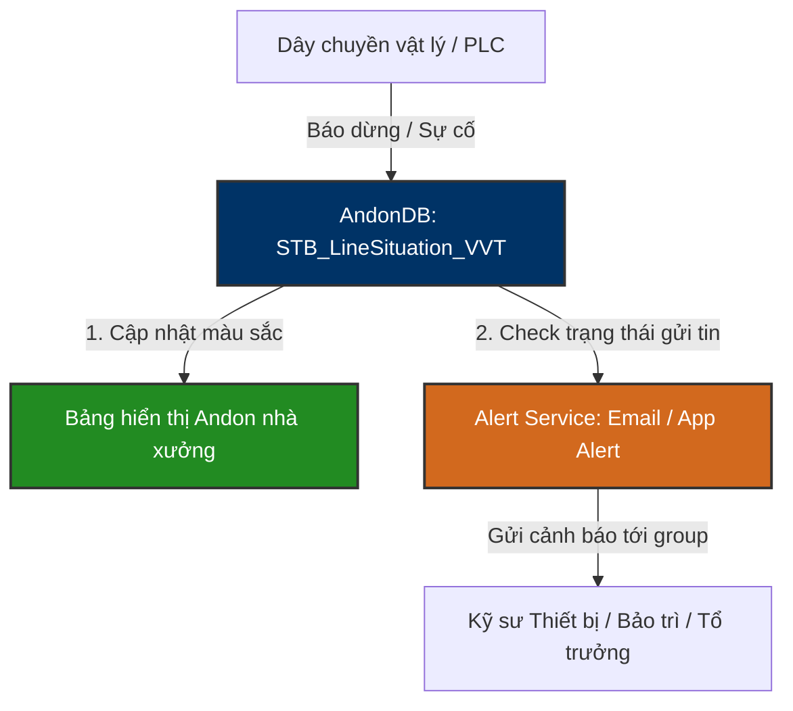

# 🚨 AndonDB — Andon Monitoring & Alert System Database Knowledge Base

`AndonDB` là cơ sở dữ liệu chuyên biệt phục vụ cho hệ thống **Andon Board (Bảng hiển thị trạng thái)** và **Hệ thống cảnh báo thời gian thực (User Warning Alert System)** tại các nhà máy của Vinatech Việt Nam. Hệ thống này có nhiệm vụ theo dõi trực quan tình trạng hoạt động vật lý của các dây chuyền sản xuất, phát hiện sự cố dừng máy (Line Downtime) và tự động kích hoạt thông báo cảnh báo tới các bộ phận liên quan (Bảo trì, Kỹ thuật thiết bị, Tổ trưởng).

---

## 🗺️ 1. Nguyên Lý Vận Hành Hệ Thống Andon

Hệ thống Andon hoạt động dựa trên cơ chế đẩy trạng thái tự động từ các trạm PLC/Kiosk POP hoặc do công nhân nhấn nút cơ học báo động tại dây chuyền.

### ⚙️ Các Chức Năng Chính:
1.  **Theo dõi Trạng thái Dây chuyền:** Lưu trữ cấu hình danh mục các line sản xuất (`STB_LineInfo`).
2.  **Giám sát Tình huống Dừng máy (Line Situation):** Ghi nhận trạng thái chạy/dừng, mã lỗi dừng máy hiện tại (`STB_LineSituation_VVT`).
3.  **Điều phối Cảnh báo (Escalation Alarm):** Kiểm soát trạng thái gửi thông báo qua Email hoặc App di động nhằm đảm bảo người phụ trách nhận được tin tức ngay lập tức nhưng không bị trùng lặp thông tin (Double Alerting).
4.  **Phân quyền Cảnh báo theo Nhóm (Alert Targeting):** Định nghĩa tài khoản và nhóm kỹ sư bảo trì (`STB_VVT_UserWarning`) sẽ tiếp nhận cảnh báo tùy thuộc vào loại sự cố và khu vực line xảy ra vấn đề.

---

## 🗄️ 2. Các Bảng Nghiệp Vụ Cốt Lõi

### 2.1 Tình Huống Dây Chuyền Thời Gian Thực: `STB_LineSituation_VVT`
Bảng trung tâm liên tục được cập nhật trạng thái hoạt động thực tế của từng công đoạn trên line.

| Tên Cột | Kiểu Dữ Liệu | Nullable | Mô Tả |
| :--- | :--- | :--- | :--- |
| **id** (PK) | `int` | NO | ID tự tăng của dòng trạng thái |
| **linecode** | `varchar(20)` | NO | Mã dây chuyền sản xuất |
| **linename** | `varchar(50)` | YES | Tên hiển thị của dây chuyền |
| **routecode** | `varchar(20)` | YES | Mã công đoạn xảy ra tình huống (ví dụ: V-23, B540) |
| **errorcode** | `nvarchar(1000)`| YES | Mã lỗi dừng máy hiện tại (ví dụ: lỗi hỏng máy, thiếu nguyên vật liệu) |
| **errorname** | `nvarchar(1000)`| YES | Mô tả chi tiết tên lỗi dừng máy |
| **status** | `int` | YES | Trạng thái line: `0` = Đang chạy (Normal), `1` = Sự cố dừng máy (Error/Stop), `2` = Chờ (Idle) |
| **statusApp** | `int` | YES | Trạng thái gửi thông báo về App di động: `0` = Chưa gửi, `1` = Đã gửi thành công |
| **statusEmail** | `int` | YES | Trạng thái gửi thông báo qua Email: `0` = Chưa gửi, `1` = Đã gửi thành công |
| **createdatetime** | `datetime` | YES | Thời điểm phát sinh sự cố / Cập nhật trạng thái |

---

### 2.2 Danh Mục Dây Chuyền Sản Xuất: `STB_LineInfo`
Lưu trữ danh sách master các dây chuyền và thông tin phân loại màn hình giám sát.

| Tên Cột | Kiểu Dữ Liệu | Mô Tả |
| :--- | :--- | :--- |
| **LineCode** (PK) | `varchar(20)` | Mã dây chuyền định danh |
| **LineName** / **LineDesc**| `nvarchar(50)` / `(200)`| Tên hiển thị và mô tả chi tiết của dây chuyền |
| **WorkCenterCode** | `varchar(20)` | Liên kết tới mã trung tâm làm việc trong MES |
| **LineType** | `varchar(10)` | Phân loại line (ví dụ: Cell, Module, Mixing) |
| **MonitoringGroup** | `nvarchar(50)` | Nhóm hiển thị màn hình Andon giám sát (để gom cụm nhiều line trên 1 TV hiển thị) |
| **TotalLossTime** | `numeric` | Tổng số thời gian lãng phí/dừng máy tích lũy |
| **IsUsed** | `bit` | Trạng thái dây chuyền đang hoạt động hay đã dừng sử dụng |

---

### 2.3 Người Nhận Cảnh Báo: `STB_VVT_UserWarning`
Định nghĩa thông tin tài khoản và cấu hình phân nhóm nhận cảnh báo sự cố từ nhà xưởng.

| Tên Cột | Kiểu Dữ Liệu | Nullable | Mô Tả |
| :--- | :--- | :--- | :--- |
| **id** (PK) | `int` | NO | ID duy nhất của cấu hình tài khoản cảnh báo |
| **username** | `varchar(50)` | NO | Tên đăng nhập của nhân sự trên ứng dụng cảnh báo |
| **password** / **password2**| `varchar(50)` | NO | Mật khẩu xác thực (Mã hóa) |
| **groupid** | `varchar(50)` | YES | Mã nhóm nhận tin (ví dụ: Nhóm Bảo trì cơ điện, Nhóm Kỹ thuật quy trình) |
| **typeid** | `varchar(50)` | YES | Phân loại loại cảnh báo tiếp nhận |
| **createdatetime** | `datetime` | YES | Ngày tạo tài khoản cảnh báo |

---

## 📊 3. Danh Mục Toàn Bộ Bảng Trong CSDL `AndonDB`

Do hệ thống Andon được tối giản hóa tối đa để đạt tốc độ truy xuất cực nhanh (tránh gây trễ khi hiển thị bảng trạng thái hoặc gửi tin khẩn cấp), CSDL chỉ sử dụng đúng 3 bảng nghiệp vụ lõi:

1.  `STB_LineInfo`: Quản lý danh mục dây chuyền sản xuất (Line Master).
2.  `STB_LineSituation_VVT`: Ghi nhận tình huống, trạng thái chạy/dừng và kiểm soát cờ gửi mail/app cảnh báo thời gian thực (Real-time Situation Monitoring).
3.  `STB_VVT_UserWarning`: Quản lý người nhận cảnh báo, phân nhóm bảo trì và thông tin xác thực ứng dụng cảnh báo (Recipient and Role Mapping).

---

*Tài liệu được biên soạn dựa trên phân tích trực tiếp cấu trúc CSDL thực tế tại máy chủ `dbserver.hycap.co.kr,5398`.*
