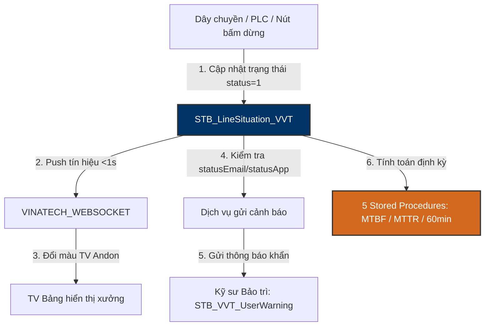

# 🚨 AndonDB — Andon Monitoring, Alert & MTBF/MTTR Analytics Database

> **Máy chủ:** `dbserver.hycap.co.kr,5398` | **CSDL:** `AndonDB`  
> **Quy mô thực tế:** **3 Bảng nghiệp vụ lõi**, **5 Thủ tục phân tích (Stored Procedures)**  
> **Vai trò:** Theo dõi trực quan tình trạng hoạt động vật lý của các dây chuyền sản xuất, phát hiện sự cố dừng máy thời gian thực, tự động kích hoạt thông báo Email/App và tính toán các chỉ số độ tin cậy thiết bị (MTBF, MTTR).

---

## 🗺️ 1. Nguyên Lý Vận Hành Hệ Thống Andon & Analytics



---

## 🗄️ 2. Danh Mục 3 Bảng Nghiệp Vụ Cốt Lõi

1. **`STB_LineSituation_VVT`**:
   - Ghi nhận trạng thái chạy/dừng (`status`: `0` = Normal, `1` = Stop/Error, `2` = Idle).
   - Mã lỗi (`errorcode`), mô tả lỗi (`errorname`), công đoạn xảy ra (`routecode`).
   - Cờ kiểm soát gửi thông báo: `statusApp` (0/1), `statusEmail` (0/1).
2. **`STB_LineInfo`**:
   - Danh mục Master các dây chuyền (`LineCode`, `LineName`, `WorkCenterCode`, `MonitoringGroup`).
   - Tổng thời gian lãng phí tích lũy: `TotalLossTime`.
3. **`STB_VVT_UserWarning`**:
   - Phân nhóm kỹ sư bảo trì tiếp nhận thông báo theo loại lỗi và khu vực line (`groupid`, `typeid`).

---

## ⚡ 3. Chi Tiết 5 Stored Procedures Phân Tích Độ Tin Cậy Thiết Bị

| Tên Stored Procedure | Tham Số Đầu Vào | Ý Nghĩa Nghiệp Vụ & Công Thức Tính |
| :--- | :--- | :--- |
| **`usp_Vietnam_MTBF_Andon_get`** | `@LineCode`, `@StartDate`, `@EndDate` | **Mean Time Between Failures:** Tính thời gian trung bình giữa 2 lần phát sinh sự cố hỏng máy = `Tổng thời gian chạy / Tổng số lần dừng máy`. Chỉ số càng cao, dây chuyền càng ổn định. |
| **`usp_Vietnam_MTTR_Andon_get`** | `@LineCode`, `@StartDate`, `@EndDate` | **Mean Time To Repair:** Tính thời gian trung bình để đội bảo trì khắc phục xong sự cố và máy chạy lại = `Tổng thời gian dừng sửa / Tổng số lần hỏng`. Chỉ số càng thấp, năng lực bảo trì càng tốt. |
| **`usp_Vietnam_Andon60minutes_get`**| `@LineCode`, `@CheckTime` | **Rolling 60-Minute Trend:** Phân tích biểu đồ nhiệt các đợt dừng máy ngắn hạn trong 60 phút gần nhất để cảnh báo nguy cơ tắc nghẽn dây chuyền. |
| **`usp_Vietnam_AndonDetail_get_BG`**| `@LineCode`, `@JobDate` | Chi tiết lịch sử dừng máy và phân loại mã lỗi phát sinh theo từng ca làm việc tại nhà máy Bắc Giang / Hà Nam. |
| **`usp_lineinfo_qcaudit`** | `@LineCode` | Kiểm tra tính tuân thủ chất lượng và tình trạng audit trên line. |

---

## 🛠️ 4. Tra Cứu Andon Nhanh Bằng CLI Hub `.\db.ps1`
```powershell
# Xem định nghĩa thủ tục tính MTBF
.\db.ps1 sp -Profile Andon -Name "usp_Vietnam_MTBF_Andon_get" -Definition

# Xem định nghĩa thủ tục tính MTTR
.\db.ps1 sp -Profile Andon -Name "usp_Vietnam_MTTR_Andon_get" -Definition

# Kiểm tra các line đang bị báo dừng máy (status = 1)
.\db.ps1 query -Profile Andon "SELECT linecode, linename, routecode, errorcode, errorname, createdatetime FROM STB_LineSituation_VVT WITH(NOLOCK) WHERE status = 1"
```
