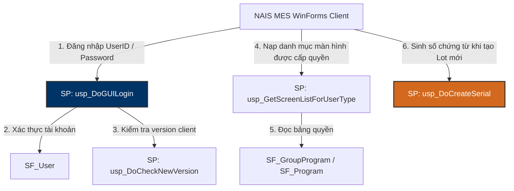

# 🔐 SmartFramework — MES Authentication, Permissions & Common Framework Knowledge Base

> **Máy chủ:** `dbserver.hycap.co.kr,5398` | **CSDL:** `SmartFramework`  
> **Quy mô thực tế:** **61 Bảng (Tables)**, **6 Khung nhìn (Views)**, **224 Thủ tục (Stored Procedures)**  
> **Vai trò:** Quản trị đăng nhập tập trung, kiểm soát phân quyền màn hình theo nhân sự ERP (Z410), sinh số serial hệ thống và quản lý cây menu điều hướng NAIS MES.

---

## 🗺️ 1. Nguyên Lý Xác Thực & Phân Quyền Tập Trung



---

## 🗄️ 2. Các Bảng Nghiệp Vụ Cốt Lõi

| Tên Bảng | Vai Trò Nghiệp Vụ | Cột Khóa / Cột Quan Trọng | Mô Tả |
| :--- | :--- | :--- | :--- |
| **SF_User** | Danh mục tài khoản | `UserID` (PK), `UserName`, `Password`, `DeptCode`, `IsUse` | Lưu tài khoản đăng nhập vào MES. |
| **SF_Group** | Danh mục nhóm quyền | `GroupID` (PK), `GroupName`, `GroupDesc` | Định nghĩa các Role trong hệ thống. |
| **SF_UserGroup** | Ánh xạ User vào Nhóm | `UserID` (PK), `GroupID` (PK) | 1 người dùng có thể thuộc nhiều nhóm quyền. |
| **SF_Program** | Danh mục màn hình MES | `ProgramID` (PK), `ProgramName`, `ScreenID` | Mã định danh màn hình (ví dụ: B530, C220, F330). |
| **SF_GroupProgram**| Phân quyền màn hình theo Nhóm | `GroupID` (PK), `ProgramID` (PK), `IsRead`, `IsSave`, `IsDelete` | Ràng buộc quyền Đọc/Ghi/Xóa trên từng màn hình. |
| **SF_Menu** | Menu điều hướng | `MenuID` (PK), `MenuName`, `ParentMenuID`, `OrderSeq` | Cây thư mục điều hướng menu trái của phần mềm. |
| **SF_CommonCode** | Bảng mã dùng chung | `CodeType`, `CodeValue`, `CodeName` | Danh mục mã lỗi hệ thống, mã loại người dùng. |
| **SF_UserLog** | Nhật ký truy cập | `LogID`, `UserID`, `LoginDateTime`, `ClientIP` | Phục vụ kiểm toán tuân thủ K-SOX. |

---

## ⚡ 3. Các Stored Procedures Trọng Yếu (224 SPs)

1. **`usp_DoGUILogin`**: Thủ tục xác thực đăng nhập người dùng cho phần mềm NAIS MES WinForms client.
2. **`usp_GetScreenListForUserType`**: Trả về danh sách các Screen ID và quyền hạn (Read/Save/Delete) mà tài khoản đăng nhập được phép truy cập.
3. **`usp_DoCreateSerial`**: Động cơ sinh mã số tự tăng liên tục (Serial Number Generator) cho toàn bộ hệ thống (dùng khi sinh `ProdRouteHistNo`, `ControlNo`, `PackingID`).
4. **`usp_DoCheckNewVersion`**: Kiểm tra phiên bản phần mềm MES client của máy trạm xem có cần cập nhật bản vá mới từ server không.
5. **`usp_GetUpgradeFile`**: Tải file cập nhật phần mềm client.

---

## 🛠️ 4. Tra Cứu SmartFramework Nhanh Bằng CLI Hub `.\db.ps1`
```powershell
# Xem định nghĩa thủ tục sinh số serial
.\db.ps1 sp -Profile SmartFramework -Name "usp_DoCreateSerial" -Definition

# Xem danh sách màn hình đã đăng ký
.\db.ps1 query -Profile SmartFramework "SELECT TOP 10 ProgramID, ProgramName, ScreenID FROM SF_Program WITH(NOLOCK) ORDER BY ProgramID"
```
