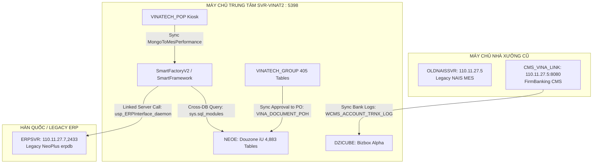

# 🌐 CHUYÊN ĐỀ 1: CẤU TRÚC VẬT LÝ HỆ THỐNG & MẠNG LƯỚI LINKED SERVERS

> **Tài liệu tham chiếu chuyên sâu CSDL Vinatech**  
> **Nguồn xác minh:** Truy vấn trực tiếp từ `sys.servers`, `sys.configurations`, và hệ thống mạng `dbserver.hycap.co.kr,5398`  
> **Cập nhật ngày:** 21/09/2026

---

## 1. Bản Đồ Mạng Lưới & Các Máy Chủ Liên Kết (Linked Servers)

Máy chủ trung tâm chạy trên instance `SVR-VINAT2` (IP nội bộ: `dbserver.hycap.co.kr`, Port: `5398`). Đây là đầu mối tiếp nhận toàn bộ dữ liệu điều hành xưởng và liên kết sang các hệ thống bên ngoài qua SQL Server Linked Server:

| Server Name | Product | Provider | Data Source (IP, Port) | Bản Chất & Vai Trò Nghiệp Vụ |
| :--- | :--- | :--- | :--- | :--- |
| **`SVR-VINAT2`** | SQL Server | SQLNCLI | `SVR-VINAT2` (Local) | Máy chủ chính chứa 15 CSDL vận hành MES, ERP Douzone, Groupware, POP |
| **`ERPSVR`** | MS-SQL | SQLNCLI | `110.11.27.7,2433` | Máy chủ ERP tổng bộ tại Hàn Quốc / Legacy NeoPlus Server. Phục vụ lấy số phiếu xuất nhập kho (`MM0402_NUM_OUT`, `MM0310_NUM_OUT`, `FM0306_NUM_OUT`) |
| **`110.11.27.5`** | SQL Server | SQLNCLI | `110.11.27.5` | Máy chủ MES cũ (NAIS MES v1 legacy) |
| **`OLDNAISSVR`** | MS-SQL | SQLNCLI11 | `110.11.27.5` | Alias kết nối sang máy chủ MES cũ để đối soát dữ liệu lịch sử |
| **`CMS_VINA_LINK`** | MS-SQL | SQLNCLI | `110.11.27.5\MESTESTDB,8080` | Cổng kết nối tích hợp FirmBanking & Kế toán Ngân hàng CMS |
| **`110.11.27.5\MESTESTDB,8080`** | SQL Server | SQLNCLI | `110.11.27.5\MESTESTDB,8080` | Môi trường thử nghiệm và kết nối song song kiểm thử MES |
| **`SVR-VINAT2\MSSQLSERVER_TEST`**| SQL Server | SQLNCLI | `SVR-VINAT2\MSSQLSERVER_TEST` | Instance kiểm thử cục bộ trên cùng máy chủ vật lý |

---

## 2. Đặc Thù Schema Giữa Các CSDL Trên Cùng Instance

Một điểm mấu chốt được phát hiện qua kiểm toán trực tiếp:

1. **Douzone iU (`NEOE`)**:
   - Gồm **4,849 bảng** thuộc schema `NEOE` (`NEOE.NEOE.<TableName>`).
   - Chỉ có **34 bảng** thuộc schema `dbo`.
   - Tất cả Stored Procedures chính (`usp_MaterialMaster_itf`, `UP_PR_WO*`, `UP_PU_PO*`) đều nằm dưới schema `NEOE`!
   - ⚠️ **Lưu ý truy vấn:** Luôn viết `FROM NEOE.NEOE.<TableName>` hoặc `FROM NEOE.<TableName>` khi đã `USE NEOE`.

2. **Bizbox Alpha (`DZICUBE`)**:
   - Gồm **3,386 bảng** thuộc schema `dbo`.
   - Bảng hạch toán chứng từ tự động (`ABDOCU`, `ABDOCU_D`) nằm dưới `dbo`.

3. **MES Core (`SmartFactoryV2`)**:
   - Toàn bộ **1,140 bảng** đều nằm dưới schema `dbo`.
   - Kết nối trực tiếp sang `SmartFramework.dbo.*` và `NEOE.NEOE.*`.

---

## 3. Quy Tắc Vận Hành Trên Mạng Lưới Linked Servers

- **Không bao giờ gọi Distributed Transaction (MSDTC) tùy tiện:** Các thủ tục gọi sang `ERPSVR` đều sử dụng Cursor đọc từ hàng đợi trung gian `STB_ERP_INTERFACE` để cô lập lỗi mạng (Fail-soft). Nếu mạng sang Hàn Quốc chập chờn, bảng trung gian giữ trạng thái `InterfaceFinYn = 'N'` chờ quét lại.
- **Bảo mật kết nối:** Tài khoản `vinaadmin` có quyền truy cập xuyên suốt trên instance `SVR-VINAT2`, nhưng các liên kết sang `110.11.27.7` và `110.11.27.5` được thiết lập qua bảo mật Linked Server Logins cố định.
