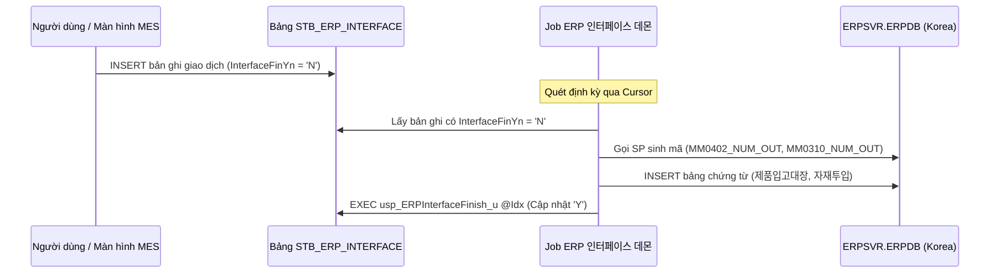

# ⏱️ CHUYÊN ĐỀ 2: CỖ MÁY ĐỒNG BỘ NỀN & BƠM DỮ LIỆU TỰ ĐỘNG (SQL AGENT JOBS)

> **Tài liệu tham chiếu chuyên sâu CSDL Vinatech**  
> **Nguồn xác minh:** Truy vấn trực tiếp từ `msdb.dbo.sysjobs`, `sysjobsteps`, `sysjobschedules` trên máy chủ `dbserver.hycap.co.kr,5398`  
> **Cập nhật ngày:** 21/09/2026

---

## 1. Tổng Quan Kiến Trúc Bơm Dữ Liệu Tự Động (Data Pumps)

Hệ thống điều phối tại Vinatech duy trì **40 SQL Server Agent Jobs kích hoạt (ENABLED)** chạy liên tục 24/7. Các Jobs này chia thành 4 nhóm chính:

```
                      +--------------------------------------------------+
                      |       SQL SERVER AGENT BATCH ENGINE              |
                      +--------------------------------------------------+
                                        |
       +--------------------+-----------+------------+--------------------+
       |                    |                        |                    |
[1. ERP-MES MASTER]    [2. LIÊN NHÀ MÁY]       [3. BÁO CÁO & SNAPSHOT] [4. BẢO TRÌ HỆ THỐNG]
- 더존ERP품목 I/F      - Tranfer_BN_BG          - vvt_finishgoodCapture  - DB최적화
- ERP 단위정보 동기화   - Tranfer_BacGiang_...   - vvt_materialSnapshot   - DB일백업 (4h/daily)
- ITF_거래처정보        - Transfer_FG00_To_C560  - 제품재고현황이력생성   - 인덱스리빌드 (Monthly)
- ERP 사원/급여정보     - VN_FINISHEDGOODS_TO_KR - 전일실적Data Insert    - CLR Domain Reload
```

---

## 2. Bảng Kê Chi Tiết 16 Jobs Nghiệp Vụ Quan Trọng Nhất

| Tên Job | Giờ Chạy | Target DB | Câu Lệnh / Thủ Tục Chính | Bản Chất Nghiệp Vụ |
| :--- | :--- | :--- | :--- | :--- |
| **`더존ERP품목 I/F`** | 09:00:00 Daily | `NEOE` | Step 1: `[NEOE].[usp_MaterialMaster_itf] '', '', '2000', 1`<br/>Step 2: `[NEOE].[usp_MaterialMaster_itf] '', '', '1000', 1` | Đồng bộ toàn bộ Danh mục Vật tư/Thành phẩm từ Douzone iU sang MES cho cả Pháp nhân HQ (1000) và VN (2000). |
| **`ERP 단위정보 동기화(IU)`** | 04:30:00 Daily | `NEOE` | `exec NEOE.usp_DoSyncMaterialUnit` (Chạy cho 1000 & 2000) | Đồng bộ đơn vị tính (EA, M, KG, Roll) chuẩn hóa từ ERP sang MES. |
| **`ITF_거래처정보`** | 09:10:01 Daily | `NEOE` | `exec NEOE.usp_CustomerInfo_interface` | Đồng bộ danh bạ Khách hàng và Nhà cung cấp (`MA_PARTNER`) từ ERP sang MES. |
| **`출하이력 기준 판매단가 동기화`**| 08:30:00 Daily | `NEOE` | `exec NEOE.usp_SalesUnitPrice_interface` | Cập nhật đơn giá bán từ chứng từ xuất kho ERP về hệ thống tính toán chi phí xuất hàng. |
| **`VN_FINISHEDGOODS_TO_KR_FINISHEDGOODS`** | 10:30:00 Daily | `SmartFactoryV2` | `DECLARE @Days NVARCHAR(50) = DATEPART(day, getdate()); EXEC usp_VN_transfer_data_finishedgoods_to_Kr @Days` | Đẩy dữ liệu thành phẩm đóng gói tại kho VN (kho `PROD_VN_WH`) sang bảng trung gian để gửi sang hệ thống tổng bộ Hàn Quốc. |
| **`Tranfer_BacGiang_To_BacNinh`** | 09:00:00 Daily | `SmartFactoryV2` | `EXEC usp_VN_Finshed_Waiting_BG` | Luân chuyển danh sách hàng thành phẩm chờ vận chuyển giữa nhà máy Bắc Giang và Bắc Ninh. |
| **`Tranfer_BN_BG`** | 09:00:00 Daily | `SmartFactoryV2` | `EXEC usp_VN_Finshed_Waiting` | Luân chuyển danh mục thành phẩm ngược chiều từ Bắc Ninh về Bắc Giang. |
| **`Transfer_FG00_To_C560`** | 22:00:00 Daily | `SmartFactoryV2` | Bơm dữ liệu thành phẩm hoàn thành tự động sang màn hình nhập kho C560. |
| **`vvt_productreceipt560`** | 08:00:00 Daily | `SmartFactoryV2` | Chèn dữ liệu kho FG01 vào màn hình tiếp nhận thành phẩm C560. |
| **`vvt_finishgoodCapture`** | 10:30:00 Daily | `SmartFactoryV2` | Chụp snapshot số dư kho thành phẩm để phục vụ đối chiếu tồn kho cuối ngày. |
| **`vvt_materialSnapshot`** | 10:00:00 Daily | `SmartFactoryV2` | Chụp snapshot số dư tồn kho nguyên vật liệu thô tại xưởng. |
| **`전일실적Data Insert`** | 08:31:00 Daily | `SmartFactoryV2` | Tổng hợp sản lượng thực tế ngày hôm trước phục vụ màn hình báo cáo B601. |
| **`목표량 자동계산`** | 09:15:00 Daily | `SmartFactoryV2` | Tính toán chỉ tiêu sản lượng mục tiêu tự động theo kế hoạch ngày `STB_DayProdPlan`. |
| **`ERP 사원정보 I/F`** | 17:00:00 Daily | `SmartFactoryV2` | `EXEC usp_Workinfolist_iud` | Đồng bộ danh sách nhân sự chấm công và ca kíp làm việc từ ERP sang MES. |
| **`ERP 급여정보 생성(IU)`** | 01:00:00 Daily | `SmartFactoryV2` | `exec usp_DoCreateEmployeeSalary`<br/>`exec usp_DoCreateEmployeeWorkTime` | Tính toán giờ công tăng ca, ca đêm và đẩy sang phân hệ tính lương của Douzone iU. |
| **`MakeMaterialExpirationEmailAlert`**| 09:30:00 Daily | `SmartFactoryV2` | Quét bảng tồn kho nguyên vật liệu, phát cảnh báo Email tự động cho các Lot sắp hết hạn dùng. |

---

## 3. Bản Chất Của Cơ Chế Daemon `STB_ERP_INTERFACE`

Ngoài các Jobs kích hoạt theo lịch cứng (Schedule), hệ thống duy trì mô hình **Hàng Đợi Giao Dịch Không Đồng Bộ (Asynchronous Transaction Queue)**:



### Lợi ích cốt lõi của mô hình:
1. **Chống nghẽn giao diện người dùng:** Khi công nhân quét mã nhập xuất trên màn hình MES, hệ thống chỉ mất vài mili-giây để ghi vào `STB_ERP_INTERFACE` rồi trả về kết quả thành công ngay.
2. **Khả năng chịu lỗi đường truyền (Network Fault Tolerance):** Nếu kết nối mạng giữa Việt Nam và Hàn Quốc bị đứt hoặc trễ cao, giao dịch vẫn nằm an toàn trong hàng đợi, chờ daemon quét lại khi mạng phục hồi mà không làm mất mát dữ liệu.
