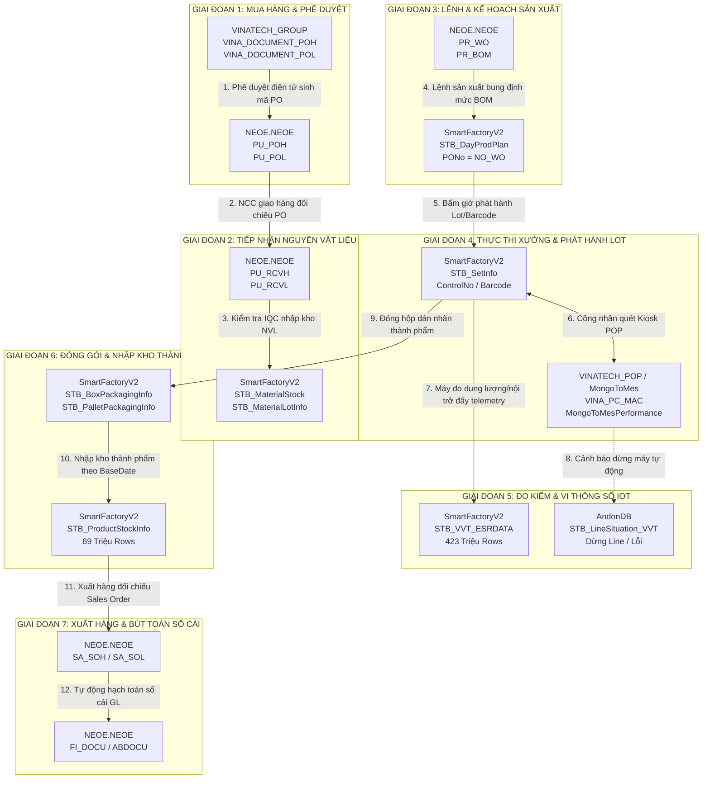

# 🗺️ CHUYÊN ĐỀ 3: BẢN ĐỒ HUYẾT MẠCH DỮ LIỆU ĐẦU-CUỐI (END-TO-END DATA LINEAGE ATLAS)

> **Tài liệu tham chiếu chuyên sâu CSDL Vinatech**  
> **Nguồn xác minh:** Trích xuất và kiểm chứng trực tiếp trên 5 hệ thống: Groupware (`VINATECH_GROUP`), ERP (`NEOE`), MES (`SmartFactoryV2`), POP (`VINATECH_POP`), và Cảnh báo (`AndonDB`).  
> **Cập nhật ngày:** 21/09/2026

---

## 1. Chuỗi Huyết Mạch 7 Giai Đoạn Từ Mua Hàng Đến Xuất Kho

Mọi chu trình sản xuất kinh doanh tại Vinatech đều đi qua một chuỗi mắt xích liên kết 5 CSDL chặt chẽ:

---

## 2. Bảng Ánh Xạ Khóa (Key Mapping Dictionary) Giữa Các Hệ Thống

| Thực Thể Nghiệp Vụ | CSDL & Bảng Nguồn | Cột Khóa Nguồn | CSDL & Bảng Đích | Cột Khóa Đích | Ghi Chú Kỹ Thuật |
| :--- | :--- | :--- | :--- | :--- | :--- |
| **Đơn Hàng Mua (PO)** | `VINATECH_GROUP.dbo.VINA_DOCUMENT_POH` | `NO_PO` | `NEOE.NEOE.PU_POH` | `NO_PO` | `CD_COMPANY` thường là `'1000'` (HQ) hoặc `'2000'` (VN). |
| **Chi Tiết Đơn Hàng Mua** | `VINATECH_GROUP.dbo.VINA_DOCUMENT_POL` | `NO_PO`, `NO_LINE` | `NEOE.NEOE.PU_POL` | `NO_PO`, `NO_LINE` | Lưu mã vật tư `CD_ITEM`, đơn giá `UM`, số lượng `QT_PO`. |
| **Lệnh Sản Xuất (Work Order)**| `NEOE.NEOE.PR_WO` | `NO_WO` | `SmartFactoryV2.dbo.STB_DayProdPlan` | `PONo` | **QUAN TRỌNG:** Trong MES, cột `PONo` trên thực tế lưu mã Work Order từ ERP (`2026091800032_R001` hoặc `260828000015`)! |
| **Kế Hoạch Ngày (Day Plan)** | `SmartFactoryV2.dbo.STB_DayProdPlan` | `DayPlanNo` | `SmartFactoryV2.dbo.STB_SetInfo` | `DayPlanNo` | Khóa chính của bảng kế hoạch ngày (`DayPlanNo` dạng `YYYYMMDDxxxxx`). |
| **Mã Vạch / Lot Sản Xuất** | `SmartFactoryV2.dbo.STB_SetInfo` | `Barcode` | `SmartFactoryV2.dbo.MongoToMesPerformance` | `Barcode` | Đồng bộ thời gian thực giữa máy tính Kiosk POP và bảng điều hành MES. |
| **Định Mức Sản Phẩm (BOM)** | `NEOE.NEOE.PR_BOM` | `CD_ITEM`, `CD_MATL` | `SmartFactoryV2.dbo.fnGetMaterialBOM` | Function Call | Hàm SQL trong MES gọi trực tiếp sang ERP để lấy tỷ lệ tiêu hao và mã con. |
| **Đóng Thùng Sang Tồn Kho** | `SmartFactoryV2.dbo.STB_BoxPackagingInfo` | `PackingID` | `SmartFactoryV2.dbo.STB_ProductStockInfo` | `PackingID` | Thùng sau khi đóng gói được chuyển vào số dư tồn kho thành phẩm. |
| **Chứng Từ Kế Toán Sổ Cái** | `DZICUBE.dbo.ABDOCU` | `ROW_ID`, `IN_DT` | `NEOE.NEOE.FI_DOCU` | `NO_DOCU` | Bizbox Alpha sinh bút toán tự động sau khi chứng từ Groupware được duyệt. |

---

## 3. Ví Dụ Dữ Liệu Truy Vết Thật (Live Traced Data Walkthrough)

Truy vết mã Barcode thực tế: **`VVQR153R060615`**:
1. **Tại `SmartFactoryV2.dbo.STB_SetInfo`:**
   - `ControlNo`: `20260915000206`
   - `PONo`: `260828000015` (Lệnh sản xuất)
   - `DayPlanNo`: `2026091400059` (Kế hoạch ngày 14/09/2026)
   - `MaterialCode`: `ECVT30-260` (Mã sản phẩm tụ điện EDLC 3.0V)
   - `ProdQty`: `1000.0` chiếc
   - `DefectQty`: `9` chiếc
2. **Tại `SmartFactoryV2.dbo.STB_DayProdPlan`:**
   - Kế hoạch sản xuất cho dây chuyền xưởng `VVT_F5` (Phân xưởng Ha Nam Cell F5).
   - Sản lượng mục tiêu ca: `11,000` chiếc.
3. **Tại `SmartFactoryV2.dbo.MongoToMesPerformance`:**
   - Trạm thao tác POP tương ứng đã gửi tín hiệu hoàn thành (`IsDone = 1`) từ PLC máy tính gán thẻ MAC.
