# 📦 DZICUBE — Douzone Bizbox Groupware & Accounting Bridge Database

> **Máy chủ:** `dbserver.hycap.co.kr,5398` | **CSDL:** `DZICUBE`  
> **Quy mô thực tế:** **3,387 Bảng (Tables)**, **288 Khung nhìn (Views)**, **28,799 Thủ tục (Stored Procedures)**, **8 Khóa ngoại (FKs)**  
> **Vai trò:** Cầu nối hạch toán tự động giữa phê duyệt tài chính trên Groupware và Sổ cái kế toán ERP (`NEOE`).

---

## 🗺️ 1. Nguyên Lý Sinh Bút Toán Tự Động (Groupware ➔ DZICUBE ➔ NEOE)

Khi tờ trình thanh toán hoặc chi phí được duyệt trên Groupware, hệ thống Bizbox tự động kích hoạt các thủ tục lưu trữ `USP_A_*` để sinh chứng từ nháp:

```mermaid
graph LR
    GW[Groupware: VINA_DOCUMENT_PAYMENT] -->|1. Phê duyệt hoàn tất| BizboxEngine[Bizbox Accounting Engine]
    BizboxEngine -->|2. Gọi USP_A_* sinh chứng từ nháp| ABDOCU[DZICUBE.dbo.ABDOCU / ABDOCU_D]
    ABDOCU -->|3. Kế toán trưởng nghiệm thu| SyncProc[Thủ tục đồng bộ liên CSDL]
    SyncProc -->|4. Đẩy chính thức vào Sổ cái| ERP[NEOE.dbo.FI_DOCU / FI_DOCU_D]
    style ABDOCU fill:#003366,stroke:#333,stroke-width:2px,color:#fff
    style ERP fill:#D2691E,stroke:#333,stroke-width:2px,color:#fff
```



---

## ⚙️ 2. Phân Bổ Tiền Tố Stored Procedures (28,799 SPs)

Hệ thống Bizbox chứa kho Stored Procedures cực kỳ đồ sộ chuẩn hóa theo tiền tố `USP_`:
- **`USP_A` (5,036 SPs):** Kế toán tự động (Accounting) — Sinh bút toán nợ/có, kiểm tra tài khoản định khoản, thuế VAT.
- **`USP_B` (5,036 SPs):** Quản trị nền tảng (Base Business) — Ánh xạ người dùng, phòng ban, phân quyền cấp duyệt.
- **`USP_W` (4,211 SPs):** Quy trình công việc (Workflow) — Điều phối luồng ký, thông báo duyệt, xử lý trạng thái phiếu.
- **`USP_S` (2,966 SPs):** Tiện ích hệ thống (System & Sync) — Đồng bộ danh mục đối tác, ngân hàng, mã công ty.
- **`USP_P` (2,547 SPs):** Quản lý thanh toán và bảng lương (Payroll & Payment).
- **`USP_H` (2,308 SPs):** Nhân sự và hồ sơ cán bộ (Human Resources).
- **`USP_M` (2,210 SPs):** Quản lý tài sản cố định và khấu hao (`ABASSET`).
- **`USP_D` (1,458 SPs):** Quản lý chứng từ và tài liệu đính kèm (Document).

---

## 🗄️ 3. Các Bảng Nghiệp Vụ Cốt Lõi

| Tên Bảng | Vai Trò Nghiệp Vụ | Mô Tả Chức Năng |
| :--- | :--- | :--- |
| **ABDOCU** | Header chứng từ nháp | Số chứng từ (`NO_DOCU`), ngày lập (`DT_DOCU`), tổng số tiền (`AM_DOCU`) |
| **ABDOCU_D** | Chi tiết định khoản nợ/có | Mã tài khoản (`CD_ACCT`), tiền nợ (`AM_DR`), tiền có (`AM_CR`), mã CC (`CD_CC`) |
| **ABASSET** | Tài sản cố định | Mã tài sản (`CD_ASSET`), nguyên giá (`AM_ACQ`), phòng ban quản lý (`CD_DEPT`) |
| **A_TAXBILL** | Hóa đơn thuế GTGT | Số hóa đơn (`NO_TAX`), tiền trước thuế (`AM_SUPPLY`), tiền thuế (`AM_VAT`) |
| **ABANK_CMS** | Liên kết ngân hàng | Giao dịch ngân hàng điện tử liên kết đối chiếu chứng từ |

---

## 🛠️ 4. Tra Cứu Bizbox Nhanh Bằng CLI Hub `.\db.ps1`
```powershell
# Xem thống kê tổng quan Bizbox
.\db.ps1 stats -Profile Bizbox

# Tìm kiếm Stored Procedure hạch toán tự động
.\db.ps1 sp -Profile Bizbox -Search "ABDOCU"

# Tra cứu cấu trúc bảng chứng từ định khoản chi tiết
.\db.ps1 schema -Profile Bizbox -Table ABDOCU_D
```
