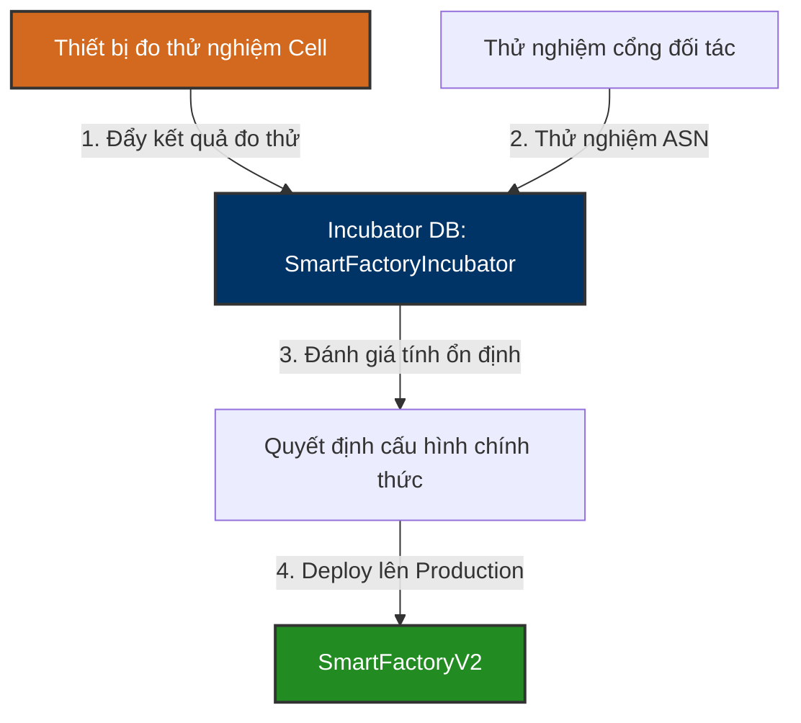

# 🔬 SmartFactoryIncubator — R&D / Pilot Production Database Knowledge Base

`SmartFactoryIncubator` là cơ sở dữ liệu chuyên biệt phục vụ cho các **Dây chuyền thử nghiệm (Pilot Lines)**, R&D sản phẩm mới (đặc biệt là các dòng tụ điện siêu hóa - Supercapacitors) và thử nghiệm tích hợp hệ thống trước khi chính thức áp dụng rộng rãi trên cơ sở dữ liệu sản xuất chính **SmartFactoryV2**.

---

## 🗺️ 1. Vai Trò & Nghiệp Vụ Thử Nghiệm Lõi

Cơ sở dữ liệu này hoạt động như một Sandbox (Môi trường cô lập) giúp đội ngũ nghiên cứu & phát triển (R&D) và Kỹ sư hệ thống thử nghiệm các thiết bị kiểm đo mới, các dòng sản phẩm mới (Cell/Module mới) hoặc các giao thức logisitcs mới mà không sợ ảnh hưởng đến tính toàn vẹn dữ liệu của nhà máy đang chạy thực tế.

### ⚙️ Các Phân Hệ Nghiệp Vụ Nghiên Cứu Lõi:
1.  **Thu thập dữ liệu đo hiệu năng Cell (Cell Test Results - `STB_CellTestResult`):** Ghi nhận dữ liệu đo kiểm chi tiết của các tụ điện thử nghiệm (Điện áp, Điện dung/Farad, Nội trở ESR, Dòng rò rỉ). Đây là công đoạn cốt lõi của R&D để đánh giá chất lượng các lô điện cực/hóa chất mới.
2.  **Thử nghiệm cổng Logistics đối tác (ASN Testing - `RCV_ASN` / `OUT_ASN`):** Thử nghiệm gửi/nhận thông tin thông báo trước khi giao hàng (Advanced Shipping Notice - ASN) với các hệ thống kho vận ngoài nước hoặc đối tác trung gian.
3.  **Hỗ trợ công cụ tiện ích (Utilities - `LUNAR_TO_SOLAR`):** Bảng chuyển đổi lịch Âm sang lịch Dương để hỗ trợ lập kế hoạch sản xuất/nghỉ lễ tự động phù hợp với văn hóa nhà xưởng Việt Nam và Hàn Quốc.

---

## 🗄️ 2. Các Bảng Nghiệp Vụ Cốt Lõi

### 2.1 Đo Kiểm Hiệu Năng Tụ Điện Thử Nghiệm: `STB_CellTestResult`
Bảng ghi nhận toàn bộ kết quả kiểm tra năng lực của cell siêu tụ điện trong giai đoạn R&D.

| Tên Bảng | Vai Trò Nghiệp Vụ | Mô tả chi tiết |
| :--- | :--- | :--- |
| **STB_CellTestResult** | Kết quả đo Cell | Ghi nhận dữ liệu đo kiểm dung lượng, điện áp, nội trở ESR của từng mẫu thử |
| **STB_CellTestResultMax**| Giới hạn đo tối đa | Lưu trữ các giá trị đo kiểm đạt đỉnh (Peak performance values) của cell |
| **STB_CellTestResultRT** | Đo thời gian thực | Ghi nhận dữ liệu dòng rò rỉ và điện áp tự xả của cell theo thời gian thực (Real-time telemetry) |

---

### 2.2 Thử Nghiệm Luồng Logistics Liên Tỉnh & Quốc Tế: `RCV_ASN` / `OUT_ASN`
Quản lý thử nghiệm thông báo trước khi giao hàng (ASN) để chuẩn bị cho các đợt tích hợp chuỗi cung ứng (SCM) mới.

| Tên Bảng | Ý nghĩa nghiệp vụ | Mô tả chức năng |
| :--- | :--- | :--- |
| **RCV_ASN** / **RCV_RSLT** | ASN Nhận / Kết quả | Thử nghiệm nhận thông tin khai báo trước khi hàng về từ nhà cung cấp và đối chiếu kết quả nhập thực tế |
| **OUT_ASN** / **OUT_RSLT** | ASN Xuất / Kết quả | Thử nghiệm gửi dữ liệu khai báo hàng xuất cho khách hàng và xác nhận kết quả giao hàng đầu cuối |

---

## 📊 3. Danh Mục Các Bảng Quản Lý Thử Nghiệm

Hệ thống Incubator bao gồm khoảng **50 bảng** dữ liệu, chủ yếu phục vụ các nhóm chức năng chính sau:

1.  **Dữ liệu đo kiểm R&D:** Các bảng đo kiểm cell siêu tụ điện (`STB_CellTestResult`, `STB_CellTestResultRT`, `STB_CellTestResultMax`).
2.  **Logistics SCM thử nghiệm:** Nhận/xuất thông báo giao hàng trước (`RCV_ASN`, `OUT_ASN`, `RCV_RSLT`, `OUT_RSLT`).
3.  **Bảng tiện ích & Tra cứu:** Chuyển đổi lịch (`LUNAR_TO_SOLAR`), danh mục khóa học đào tạo (`COURSE`), thông tin đăng ký (`Registration`).

---

*Tài liệu được biên soạn dựa trên phân tích trực tiếp cấu trúc CSDL thực tế tại máy chủ `dbserver.hycap.co.kr,5398`.*
