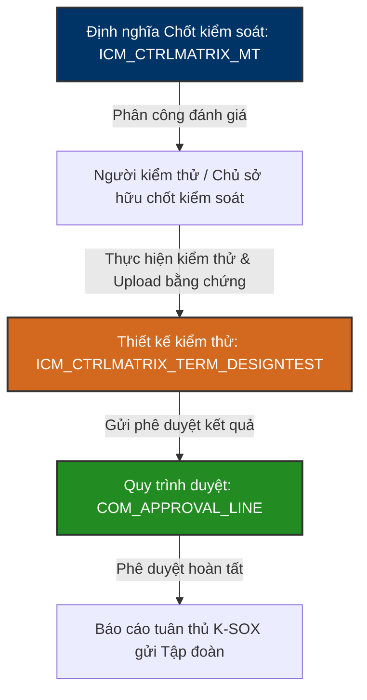

# ⚖️ VINATECH_DATA_KSOX — K-SOX Compliance Management Database Knowledge Base

`VINATECH_DATA_KSOX` là cơ sở dữ liệu lưu trữ và quản lý hệ thống **K-SOX (Korean Sarbanes-Oxley Act / Internal Control over Financial Reporting - ICFR)** tại Vinatech Việt Nam. Do Vinatech là doanh nghiệp niêm yết trên thị trường chứng khoán Hàn Quốc, pháp nhân Việt Nam (với tư cách là công ty con sản xuất chính) có nghĩa vụ tuân thủ các quy định nghiêm ngặt về Kiểm soát nội bộ đối với báo cáo tài chính (ICFR). Cơ sở dữ liệu này quản lý ma trận kiểm soát, phân công đánh giá và lưu trữ bằng chứng kiểm thử kiểm soát.

---

## 🗺️ 1. Nguyên Lý Vận Hành Hệ Thống Tuân Thủ K-SOX

Hệ thống K-SOX là một cổng thông tin tuân thủ độc lập giúp bộ phận Kiểm soát nội bộ (Internal Control), Ban giám đốc và các Kiểm toán viên độc lập thực hiện đánh giá định kỳ về tính hiệu quả của các chốt kiểm soát trong doanh nghiệp.

### ⚙️ Các Phân Hệ Nghiệp Vụ Chính:
1.  **Ma trận Kiểm soát Nội bộ (Control Matrix - `ICM_CTRLMATRIX_MT`):** Định nghĩa các rủi ro tài chính và các chốt kiểm soát tương ứng (ví dụ: Chốt kiểm soát quy trình mua hàng phải có 3 báo giá, chốt kiểm soát đối chiếu tồn kho MES và sổ cái ERP...).
2.  **Đánh giá & Kiểm thử Kiểm soát (Control Testing - `ICM_CTRLMATRIX_TERM_DESIGNTEST`):** Giao việc cho các Testers tiến hành kiểm tra ngẫu nhiên các mẫu chứng từ (samples) để xác nhận xem quy trình kiểm soát có được vận hành đúng thực tế hay không.
3.  **Quản lý Thay đổi Quy trình (Change Submission - `ICM_CHANGE_SUBMISSION_APP`):** Kiểm soát và phê duyệt các thay đổi trong quy trình vận hành có ảnh hưởng tới rủi ro báo cáo tài chính.
4.  **Phê duyệt kết quả đánh giá (Compliance Approvals - `COM_APPROVAL_LINE`):** Hệ thống phê duyệt các kết quả kiểm thử kiểm soát nội bộ cấp phòng ban và cấp CEO trước khi tổng hợp báo cáo gửi về Tổng công ty tại Hàn Quốc.

---

## 🗄️ 2. Các Bảng Nghiệp Vụ Cốt Lõi

### 2.1 Ma Trận Kiểm Soát: `ICM_CTRLMATRIX_MT` / `ICM_CTRLMATRIX_TERM`
Lưu trữ danh mục định nghĩa rủi ro và thiết kế chốt kiểm soát nội bộ.

| Tên Bảng | Tên Cột | Mô Tả |
| :--- | :--- | :--- |
| **ICM_CTRLMATRIX_MT** (Master) | `CONTROL_UUID` (PK) | ID duy nhất của chốt kiểm soát |
| | `PROCESS_CODE` | Mã quy trình nghiệp vụ kiểm soát (Mua hàng, Bán hàng, Kho...) |
| | `CONTROL_NAME` | Tên/Nội dung chốt kiểm soát nội bộ |
| | `CONTROL_OBJECTIVE` | Mục tiêu kiểm soát giảm thiểu rủi ro báo cáo tài chính |
| **ICM_CTRLMATRIX_TERM** (Detail) | `TERM_UUID` (PK) | ID phiên bản đánh giá chốt kiểm soát |
| | `CONTROL_UUID` (FK) | Liên kết tới `ICM_CTRLMATRIX_MT` |
| | `EVAL_YEAR` / `EVAL_HALF` | Năm đánh giá và Kỳ đánh giá (Nửa đầu năm / Nửa cuối năm) |
| | `OWNER_EMP_NO` | Mã nhân viên chủ sở hữu chịu trách nhiệm vận hành chốt |

---

### 2.2 Kiểm Thử Kiểm Soát Thiết Kế: `ICM_CTRLMATRIX_TERM_DESIGNTEST`
Lưu trữ kết quả đánh giá thực tế của nhân sự kiểm thử chốt kiểm soát.

| Tên Cột | Kiểu Dữ Liệu | Nullable | Mô Tả |
| :--- | :--- | :--- | :--- |
| **TEST_UUID** (PK) | `varchar(50)` | NO | ID duy nhất của bản ghi kiểm thử |
| **TERM_UUID** (FK) | `varchar(50)` | NO | Liên kết tới phiên bản đánh giá chốt |
| **TESTER_EMP_NO** | `nvarchar(20)`| YES | Mã nhân viên thực hiện kiểm thử |
| **SAMPLE_SIZE** | `int` | YES | Kích thước mẫu chứng từ chọn kiểm tra (ví dụ: kiểm tra 5 mẫu PO) |
| **TEST_RESULT** | `nvarchar(20)`| YES | Kết quả kiểm thử (PASS / FAIL / EXCEPTION) |
| **ATTACH_FILE_ID** | `varchar(50)` | YES | Đường dẫn/ID file bằng chứng đính kèm (ảnh chụp màn hình, chứng từ...) |
| **TEST_DATE** | `datetime` | YES | Ngày thực hiện kiểm thử |

---

### 2.3 Phê Duyệt Tuân Thủ K-SOX: `COM_APPROVAL_LINE` / `COM_APPROVAL_HIST`
Luồng duyệt chứng từ đánh giá kiểm soát nội bộ.

| Tên Cột | Kiểu Dữ Liệu | Mô Tả |
| :--- | :--- | :--- |
| **APPROVAL_CODE** (PK)| `varchar(50)` | Mã định danh luồng phê duyệt đánh giá K-SOX |
| **DOC_SUBJECT** | `nvarchar(200)`| Tiêu đề phiếu trình duyệt đánh giá |
| **APP_STATUS** | `varchar(20)` | Trạng thái phê duyệt (DRAFT, IN_PROGRESS, APPROVED, REJECTED) |
| **APPROVER_EMP_NO** | `nvarchar(20)`| Mã nhân sự phê duyệt ở bước hiện tại |

---

## 📊 3. Danh Mục Các Bảng Quản Lý Tuân Thủ K-SOX

| Phân hệ nghiệp vụ | Tên Bảng | Vai trò nghiệp vụ |
| :--- | :--- | :--- |
| **Quản trị Nhân sự K-SOX** | `ADM_EMP` / `_WORK_INFO`| Danh mục nhân sự tham gia đánh giá, kiểm thử kiểm soát |
| | `ADM_POSITION` | Chức danh chuyên môn của nhân sự K-SOX |
| **Ma trận & Đánh giá** | `ICM_CTRLMATRIX_MT` | Ma trận kiểm soát nội bộ (Control Matrix Master) |
| | `ICM_CTRLMATRIX_TERM` | Các kỳ đánh giá chốt kiểm soát nội bộ |
| | `ICM_CTRLMATRIX_TERM_DESIGNTEST`| Kết quả đánh giá kiểm thử thiết kế kiểm soát |
| | `ICM_CONTROL_MANAGER_PROCESS` | Phân công cán bộ quản lý phụ trách quy trình |
| **Thay đổi quy trình** | `ICM_CHANGE_SUBMISSION_APP`| Phiếu yêu cầu phê duyệt thay đổi quy trình vận hành ảnh hưởng báo cáo tài chính |
| **Phê duyệt K-SOX** | `COM_APPROVAL_LINE` | Thiết lập tuyến phê duyệt báo cáo đánh giá |
| | `COM_APPROVAL_HIST` | Nhật ký chi tiết lịch sử ký duyệt chốt kiểm soát |
| | `COM_FILE_ROOM` | Kho lưu trữ chứng từ, bằng chứng kiểm toán K-SOX |

---

*Tài liệu được biên soạn dựa trên phân tích trực tiếp cấu trúc CSDL thực tế tại máy chủ `dbserver.hycap.co.kr,5398`.*
