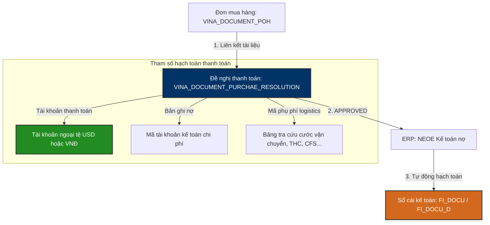

# 💸 VINATECH_GROUP — Disbursement & Payment Integration & DB Schema Mapping

Tài liệu này đi sâu vào cấu trúc dữ liệu vật lý và cơ chế liên thông cơ sở dữ liệu của **Phân hệ Đề nghị Thanh toán & Quyết toán chi phí (Disbursement & Payment Module)** trên Groupware (`VINATECH_GROUP`) kết nối với **ERP (`NEOE`)**.

---

## 🗺️ 1. Quy Trình Vận Hành & Khớp Nối Phân Hệ Thanh Toán

Phân hệ Quyết toán chi phí là công đoạn cuối của luồng nghiệp vụ mua sắm nhằm ghi nhận công nợ và thực hiện giải ngân thực tế cho các nhà cung cấp/đối tác logistics.



### ⚙️ Các Nghiệp Vụ Thanh Toán Chính:
1.  **Đề nghị thanh toán liên kết PO (Disbursement Document):** Gom một hoặc nhiều đơn đề xuất chi phí/đơn mua hàng cũ đã duyệt thành một lệnh thanh toán duy nhất thông qua cơ chế kéo liên kết tài liệu.
2.  **Định biên tài khoản thanh toán theo đồng tiền giao dịch:**
    *   *Mua hàng trong nước (Local):* Bắt buộc chọn tài khoản ngân hàng bằng **VNĐ** và nhập thuế suất VAT.
    *   *Mua hàng nước ngoài (Overseas):* Bắt buộc chọn tài khoản ngân hàng bằng **USD** và chọn tỷ giá hối đoái.
3.  **Hạch toán tự động sang ERP:** Click chọn **"Bản ghi nợ"** trên giao diện GW để gán mã tài khoản kế toán chi phí (`CD_ACCT`). Khi phiếu được sếp ký duyệt hoàn tất, hệ thống tự động đẩy bút toán sang ERP ghi nhận Nợ tài khoản chi phí và Có tài khoản phải trả người bán (`FI_DOCU`/`FI_DOCU_D`).
4.  **Kiểm soát và đối chiếu phí vận chuyển (Logistics Surcharge Audit):** Khi thanh toán hóa đơn cước vận chuyển, bắt buộc đối chiếu mã phụ phí (ví dụ: `FREIGHT COST`, `THC`, `CFS`, `FSC`...) từ danh mục cước chuẩn của Vinatech để theo dõi chi phí logistics hiệu quả.

---

## 🗄️ 2. Các Bảng & Cấu Trúc Khóa Ngoại (Foreign Keys Map)

```
        [VINA_DOCUMENT_SAVE] (Header phê duyệt chung)
                 │
                 └───► [VINA_DOCUMENT_PURCHAE_RESOLUTION] (Header đề nghị thanh toán)
                                │
                                └───► [VINA_DOCUMENT_PURCHAE_RESOLUTION_LINE] (Chi tiết các khoản chi)
```

---

## 🔍 3. Hướng Dẫn Truy Vấn & Kiểm Tra (Golden Audit Queries)

Dưới đây là các câu truy vấn SQL mẫu (SELECT-ONLY) dùng để đối chiếu thông tin Thanh toán.

### Mẫu 3.1: Kiểm tra thông tin đề nghị thanh toán và liên kết hóa đơn
```sql
SELECT 
    S.DOCUMENT_SAVE_CODE,
    S.DOCUMENT_SAVE_SUBJECT AS [Title],
    S.DOCUMENT_SAVE_STATE AS [Approval Status],
    PR.CD_PARTNER AS [Vendor Code],
    PR.CD_EXCH AS [Currency],
    PR.RT_EXCH AS [Exchange Rate],
    PR.AM_EX AS [Amount External],
    PR.AM AS [Amount VND],
    PR.PAYMENT_DATE AS [Payment Date] -- Ngày giải ngân dự kiến
FROM VINATECH_GROUP.dbo.VINA_DOCUMENT_SAVE S WITH(NOLOCK)
INNER JOIN VINATECH_GROUP.dbo.VINA_DOCUMENT_PURCHAE_RESOLUTION PR WITH(NOLOCK) 
    ON S.DOCUMENT_SAVE_CODE = PR.DOCUMENT_SAVE_CODE
WHERE S.DOCUMENT_SAVE_STATE = 'APPROVED'
  AND PR.CD_PARTNER = 'MÃ_VENDOR_CẦN_TRA';
```

### Mẫu 3.2: Kiểm tra định khoản tài khoản chi phí của phiếu thanh toán
```sql
SELECT 
    L.NO_LINE,
    L.CD_ACCT AS [Expense Account Code],
    -- Tra cứu tên tài khoản từ danh mục ERP
    (SELECT TOP 1 NM_ACCT FROM NEOE.dbo.FI_ACCT WITH(NOLOCK) WHERE CD_ACCT = L.CD_ACCT) AS [Account Name],
    L.AM_EX AS [Line Amount External],
    L.AM AS [Line Amount VND],
    L.CD_CC AS [Cost Center Charged],
    L.LOGISTICS_FEE_CODE AS [Logistics Fee Code] -- Mã phụ phí nếu có
FROM VINATECH_GROUP.dbo.VINA_DOCUMENT_PURCHAE_RESOLUTION_LINE L WITH(NOLOCK)
WHERE L.DOCUMENT_SAVE_CODE = 'MÃ_DOCUMENT_SAVE_CODE_THANH_TOÁN';
```

### Mẫu 3.3: Thống kê tổng hợp chi phí Logistics theo mã phụ phí trong tháng
```sql
SELECT 
    L.LOGISTICS_FEE_CODE AS [Logistics Fee Code],
    COUNT(*) AS [Total Transactions],
    SUM(L.AM) AS [Total Cost VND]
FROM VINATECH_GROUP.dbo.VINA_DOCUMENT_PURCHAE_RESOLUTION_LINE L WITH(NOLOCK)
INNER JOIN VINATECH_GROUP.dbo.VINA_DOCUMENT_PURCHAE_RESOLUTION H WITH(NOLOCK) 
    ON L.DOCUMENT_SAVE_CODE = H.DOCUMENT_SAVE_CODE
WHERE H.PAYMENT_DATE >= '2026-06-01' AND H.PAYMENT_DATE <= '2026-06-30'
  AND L.LOGISTICS_FEE_CODE IS NOT NULL
GROUP BY L.LOGISTICS_FEE_CODE
ORDER BY [Total Cost VND] DESC;
```

---

*Tài liệu được biên soạn phục vụ cho Kỹ sư Vận hành và Lập trình viên hệ thống Vinatech.*
> [!NOTE]
> **Tài liệu tham chiếu nghiệp vụ người dùng:**
> *   Xem hướng dẫn quyết toán thanh toán tại: [GW_06_THANH_TOAN.md](file:///C:/Users/User%20Vinatech.DESKTOP-RJJSEQU/Desktop/GROUPWARE/GROUPWARE_KNOWLEDGE_BASE/GW_06_THANH_TOAN.md)
