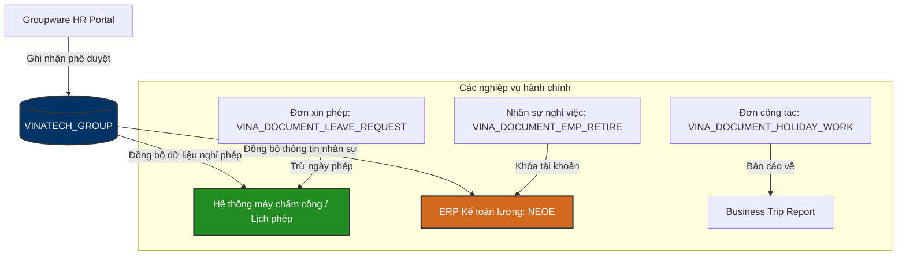

# 👥 VINATECH_GROUP — HR & Admin Integration & DB Schema Mapping

Tài liệu này đi sâu vào cấu trúc dữ liệu vật lý và cơ chế liên thông cơ sở dữ liệu của **Phân hệ Hành chính & Nhân sự (HR & Admin Module)** trên Groupware (`VINATECH_GROUP`).

---

## 🗺️ 1. Quy Trình Vận Hành & Khớp Nối Phân Hệ HR

Phân hệ Hành chính nhân sự quản lý các hoạt động phi sản xuất nhưng có ảnh hưởng trực tiếp đến chấm công, tiền lương, và luân chuyển tài sản/nhân sự.



### ⚙️ Các Nghiệp Vụ Hành Chính Nhân Sự Chính:
1.  **Quản lý Công tác hai pha (Two-phase Business Trip):** 
    *   *Pha 1 (Yêu cầu):* Đăng ký lộ trình, thời gian, phụ cấp ăn uống/chức danh dự trù (`VINA_DOCUMENT_HOLIDAY_WORK` - bảng dùng chung cho công tác và tăng ca lễ).
    *   *Pha 2 (Báo cáo):* Liên kết đơn phê duyệt cũ, đính kèm bắt buộc cuống vé máy bay/vé tàu xe thực tế để kế toán quyết toán chi phí chênh lệch.
2.  **Đăng ký đi làm ngày nghỉ/lễ (Holiday Work):** Đăng ký số giờ dự kiến tăng ca ngày nghỉ. Sau khi làm việc, nhân viên lập báo cáo check-in/check-out thực tế để phòng HR chốt bảng công lương (`Holiday Work Calculate Management`) và xuất báo cáo kiểm toán.
3.  **Hồ sơ Nghỉ việc & Bàn giao (Retirement Checklist):** Ghi nhận ngày nghỉ chính thức, người tiếp nhận bàn giao công việc và địa chỉ gửi bưu điện chốt BHXH (`VINA_DOCUMENT_EMP_RETIRE`). Khi được duyệt hoàn tất, hệ thống tự động khóa tài khoản trên ERP và MES.
4.  **Tờ trình tự do (Draft Document):** Sử dụng cho các đề xuất tự do. Tích hợp tính năng **✨ AI Tinh Chỉnh** ở khung Rich-text để tự động sửa lỗi chính tả, văn phong trước khi trình ký ban lãnh đạo.

---

## 🗄️ 2. Các Bảng & Cấu Trúc Khóa Ngoại (Foreign Keys Map)

```
        [VINA_DOCUMENT_SAVE] (Header phê duyệt chung)
                 │
                 ├───► [VINA_DOCUMENT_LEAVE_REQUEST] (Xin nghỉ phép/lễ)
                 │
                 ├───► [VINA_DOCUMENT_EMP_RETIRE] (Đơn xin nghỉ việc)
                 │              │
                 │              └───► [VINA_DOCUMENT_EMP_RETIRE_CHECKLIST] (Bàn giao tài sản)
                 │
                 ├───► [VINA_DOCUMENT_EMP_REQUEST] (Yêu cầu tuyển dụng nhân sự)
                 │
                 └───► [VINA_DOCUMENT_HOLIDAY_WORK] (Đi công tác / Tăng ca lễ)
```

---

## 🔍 3. Hướng Dẫn Truy Vấn & Kiểm Tra (Golden Audit Queries)

Dưới đây là các câu truy vấn SQL mẫu (SELECT-ONLY) dùng để đối chiếu thông tin Hành chính - Nhân sự.

### Mẫu 3.1: Kiểm tra danh sách nhân viên đăng ký đi làm ngày lễ/tăng ca
```sql
SELECT 
    S.DOCUMENT_SAVE_CODE,
    S.DOCUMENT_SAVE_SUBJECT AS [Subject],
    S.DOCUMENT_SAVE_STATE AS [Approval State],
    HW.NO_EMP AS [Employee ID],
    N.ORG_CHART_NODE_NAME AS [Employee Name],
    HW.WORK_DATE AS [Overtime Date],
    HW.PLAN_WORK_HOURS AS [Estimated Hours],
    HW.ACTUAL_WORK_HOURS AS [Actual Hours]
FROM VINATECH_GROUP.dbo.VINA_DOCUMENT_SAVE S WITH(NOLOCK)
INNER JOIN VINATECH_GROUP.dbo.VINA_DOCUMENT_HOLIDAY_WORK HW WITH(NOLOCK) 
    ON S.DOCUMENT_SAVE_CODE = HW.DOCUMENT_SAVE_CODE
LEFT JOIN VINATECH_GROUP.dbo.VINA_ORG_CHART_NODE N WITH(NOLOCK) 
    ON HW.NO_EMP = N.NO_EMP AND HW.CD_COMPANY = N.CD_COMPANY
WHERE HW.WORK_DATE = '2026-06-12'
  AND S.DOCUMENT_SAVE_STATE = 'APPROVED';
```

### Mẫu 3.2: Tra cứu thông tin bàn giao công việc của nhân sự nghỉ việc
```sql
SELECT 
    R.DOCUMENT_SAVE_CODE,
    R.NO_EMP AS [Retiree ID],
    N1.ORG_CHART_NODE_NAME AS [Retiree Name],
    R.DT_RETIRE AS [Retire Date],
    R.LAST_WORK_DATE AS [Last Work Date],
    R.REPLACEMENT_EMP_NO AS [Replacement ID],
    N2.ORG_CHART_NODE_NAME AS [Replacement Name],
    R.CONTACT_ADDRESS AS [Postal Address for Insurance]
FROM VINATECH_GROUP.dbo.VINA_DOCUMENT_EMP_RETIRE R WITH(NOLOCK)
LEFT JOIN VINATECH_GROUP.dbo.VINA_ORG_CHART_NODE N1 WITH(NOLOCK) 
    ON R.NO_EMP = N1.NO_EMP AND R.CD_COMPANY = N1.CD_COMPANY
LEFT JOIN VINATECH_GROUP.dbo.VINA_ORG_CHART_NODE N2 WITH(NOLOCK) 
    ON R.REPLACEMENT_EMP_NO = N2.NO_EMP AND R.CD_COMPANY = N2.CD_COMPANY
WHERE R.NO_EMP = 'MÃ_NHÂN_VIÊN_NGHỈ_VIỆC';
```

### Mẫu 3.3: Lấy danh sách phiếu Yêu cầu tuyển dụng đang phê duyệt
```sql
SELECT 
    S.DOCUMENT_SAVE_CODE,
    S.DOCUMENT_SAVE_SUBJECT AS [Job Title],
    S.DOCUMENT_SAVE_REG_DATE AS [Requested Date],
    ER.RECRUIT_TYPE AS [Type: New/Replace],
    ER.CONTRACT_TYPE AS [Contract Type],
    ER.RECRUIT_QTY AS [Headcount],
    ER.DUE_DATE AS [Recruitment Deadline]
FROM VINATECH_GROUP.dbo.VINA_DOCUMENT_SAVE S WITH(NOLOCK)
INNER JOIN VINATECH_GROUP.dbo.VINA_DOCUMENT_EMP_REQUEST ER WITH(NOLOCK) 
    ON S.DOCUMENT_SAVE_CODE = ER.DOCUMENT_SAVE_CODE
WHERE S.DOCUMENT_SAVE_STATE = 'APPROVING'
ORDER BY S.DOCUMENT_SAVE_REG_DATE DESC;
```

---

*Tài liệu được biên soạn phục vụ cho Kỹ sư Vận hành và Lập trình viên hệ thống Vinatech.*
> [!NOTE]
> **Tài liệu tham chiếu nghiệp vụ người dùng:**
> *   Xem hướng dẫn nghiệp vụ hành chính (công tác, đi làm ngày lễ, nhân sự) tại: [GW_05_HANH_CHINH.md](file:///C:/Users/User%20Vinatech.DESKTOP-RJJSEQU/Desktop/GROUPWARE/GROUPWARE_KNOWLEDGE_BASE/GW_05_HANH_CHINH.md)
