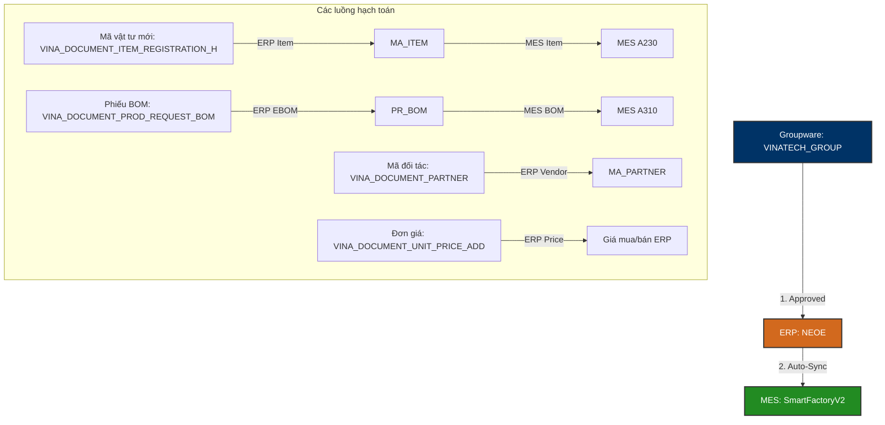

# 📦 VINATECH_GROUP — Master Data Integration & DB Schema Mapping

Tài liệu này đi sâu vào cấu trúc dữ liệu vật lý và cơ chế liên thông cơ sở dữ liệu của **Phân hệ Dữ liệu gốc (Master Data Module)** trên Groupware (`VINATECH_GROUP`) kết nối với **MES (`SmartFactoryV2`)** và **ERP (`NEOE`)**.

---

## 🗺️ 1. Quy Trình Đồng Bộ Master Data (Item, BOM, Partner & Price)

Master Data là nền tảng cốt lõi của mọi giao dịch. Để đảm bảo tính đồng bộ và tránh nhập liệu trùng lặp, Vinatech thiết lập luồng đồng bộ tự động từ Groupware làm điểm xuất phát phê duyệt pháp lý.



### ⚙️ Các Nghiệp Vụ Master Data Chính:
1.  **Đăng ký Vật tư Mới (Item Registration):** Khai báo các thuộc tính kỹ thuật của sản phẩm (Cell/Module/Raw materials) bao gồm điện áp (Voltage), điện dung (Farad), quy cách kích thước. Duyệt xong tự động ghi nhận vào ERP `MA_ITEM` và MES `A230`.
2.  **Quản lý phiên bản BOM (BOM Version Control):** Toàn bộ nhân sự tại Việt Nam bắt buộc phải áp dụng phiên bản BOM code là **2001** (Mã BOM chuẩn của Việt Nam). Duyệt xong tự động đẩy vào ERP EBOM và đồng bộ xuống MES `A310`.
3.  **Danh mục Đối tác & Ngân hàng (Partner Master):** Khai báo thông tin nhà cung cấp/khách hàng, MST bắt buộc, tài khoản ngân hàng và ngân hàng giao dịch của đối tác (`VINA_DOCUMENT_PARTNER_ACCOUNT`).
4.  **Quản lý Hiệu lực Đơn giá (Price Master):** Kiểm soát đơn giá mua và giá bán theo đối tác, thiết lập ngày bắt đầu và kết thúc hiệu lực đơn giá để ERP tự động áp giá khi làm PO/Suju.

---

## 🗄️ 2. Các Bảng & Cấu Trúc Khóa Ngoại (Foreign Keys Map)

```
        [VINA_DOCUMENT_SAVE] (Header phê duyệt chung)
                 │
                 ├───► [VINA_DOCUMENT_ITEM_REGISTRATION_H] (Đăng ký vật tư)
                 │              │
                 │              └───► [VINA_DOCUMENT_ITEM_REGISTRATION_L] (Tab nhiều con hàng)
                 │
                 ├───► [VINA_DOCUMENT_PROD_REQUEST_BOM] (Biểu mẫu duyệt BOM)
                 │
                 ├───► [VINA_DOCUMENT_PARTNER] (Đăng ký đối tác/nhà thầu)
                 │              │
                 │              └───► [VINA_DOCUMENT_PARTNER_ACCOUNT] (Tài khoản ngân hàng đối tác)
                 │
                 └───► [VINA_DOCUMENT_UNIT_PRICE_ADD] (Đăng ký đơn giá mua/bán)
                                │
                                └───► [VINA_DOCUMENT_UNIT_PRICE_FILE] (Tệp đính kèm bảng giá)
```

---

## 🔍 3. Hướng Dẫn Truy Vấn & Kiểm Tra (Golden Audit Queries)

Dưới đây là các câu truy vấn SQL mẫu (SELECT-ONLY) dùng để đối chiếu thông tin Master Data.

### Mẫu 3.1: Đối chiếu mã vật tư mới đăng ký từ Groupware sang MES A230
```sql
SELECT 
    GW_H.DOCUMENT_SAVE_CODE,
    GW_L.CD_ITEM AS [GW Item Code],
    GW_L.NM_ITEM AS [GW Item Name],
    GW_L.SPEC AS [GW Spec], -- Chứa thông tin Voltage / Farad
    GW_L.ITEM_TYPE AS [Item Type],
    -- Đối chiếu sang MES A230
    MES.MaterialCode AS [MES Item Code],
    MES.MaterialName AS [MES Item Name],
    MES.Spec AS [MES Spec],
    MES.CreateDateTime AS [MES Sync Date]
FROM VINATECH_GROUP.dbo.VINA_DOCUMENT_ITEM_REGISTRATION_H GW_H WITH(NOLOCK)
INNER JOIN VINATECH_GROUP.dbo.VINA_DOCUMENT_ITEM_REGISTRATION_L GW_L WITH(NOLOCK) 
    ON GW_H.DOCUMENT_SAVE_CODE = GW_L.DOCUMENT_SAVE_CODE
LEFT JOIN SmartFactoryV2.dbo.STB_MaterialMaster MES WITH(NOLOCK) 
    ON GW_L.CD_ITEM = MES.MaterialCode
WHERE GW_L.CD_ITEM = 'MÃ_VẬT_TƯ_CẦN_TRA';
```

### Mẫu 3.2: Kiểm tra phiên bản BOM Việt Nam (phiên bản 2001) trong MES
```sql
SELECT 
    BH.MaterialCode AS [Parent Product],
    BD.MaterialCode AS [Sub Material Code],
    MM.MaterialName AS [Sub Material Name],
    BD.BOMVersion AS [BOM Version], -- Bắt buộc phải là '2001'
    BD.StandardQty AS [Consump Qty],
    BD.CreateDateTime AS [Sync Date]
FROM SmartFactoryV2.dbo.STB_BomHeader BH WITH(NOLOCK)
INNER JOIN SmartFactoryV2.dbo.STB_BomDetail BD WITH(NOLOCK) 
    ON BH.BOMHeaderSeq = BD.BOMHeaderSeq
LEFT JOIN SmartFactoryV2.dbo.STB_MaterialMaster MM WITH(NOLOCK) 
    ON BD.MaterialCode = MM.MaterialCode
WHERE BH.MaterialCode = 'MÃ_CELL_HOẶC_MODULE'
  AND BD.BOMVersion = '2001'
ORDER BY BD.BOMDetailSeq ASC;
```

### Mẫu 3.3: Truy vấn thông tin ngân hàng giao dịch của nhà thầu/vendor mới đăng ký
```sql
SELECT 
    P.CD_PARTNER AS [Vendor Code],
    P.NM_PARTNER AS [Vendor Name],
    P.NO_BIZ AS [Tax Code],
    A.BANK_CODE AS [Bank Code],
    -- Tra cứu tên ngân hàng từ dữ liệu tĩnh
    (SELECT TOP 1 NAME_EN FROM VINATECH_GROUP.dbo.VINA_STATIC_DATA WITH(NOLOCK) 
     WHERE CODE_TYPE = 'BANK' AND CODE = A.BANK_CODE) AS [Bank Name],
    A.ACCOUNT_NO AS [Account Number],
    A.OWNER_NAME AS [Account Owner]
FROM VINATECH_GROUP.dbo.VINA_DOCUMENT_PARTNER P WITH(NOLOCK)
INNER JOIN VINATECH_GROUP.dbo.VINA_DOCUMENT_PARTNER_ACCOUNT A WITH(NOLOCK) 
    ON P.DOCUMENT_SAVE_CODE = A.DOCUMENT_SAVE_CODE
WHERE P.CD_PARTNER = 'MÃ_VENDOR_CẦN_TRA' 
   OR P.NM_PARTNER LIKE N'%TÊN_VENDOR%';
```

---

*Tài liệu được biên soạn phục vụ cho Kỹ sư Vận hành và Lập trình viên hệ thống Vinatech.*
> [!NOTE]
> **Tài liệu tham chiếu nghiệp vụ người dùng:**
> *   Xem hướng dẫn đăng ký mã code, BOM và nhà thầu tại: [GW_04_MASTER_DATA.md](file:///C:/Users/User%20Vinatech.DESKTOP-RJJSEQU/Desktop/GROUPWARE/GROUPWARE_KNOWLEDGE_BASE/GW_04_MASTER_DATA.md)
