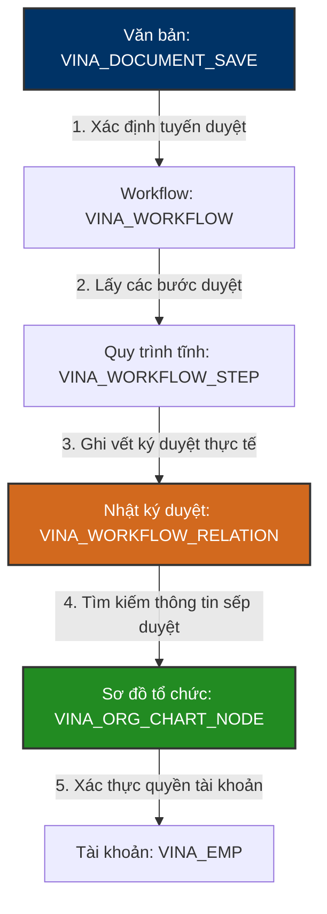

# 👥 VINATECH_GROUP — Org Chart & Workflow Approval Integration

> [!NOTE]
> **Tài liệu tham chiếu nghiệp vụ người dùng:**
> *   Xem hướng dẫn đăng nhập và phân quyền tại: [GW_01_DANG_NHAP.md](file:///C:/Users/User%20Vinatech.DESKTOP-RJJSEQU/Desktop/GROUPWARE/GROUPWARE_KNOWLEDGE_BASE/GW_01_DANG_NHAP.md)
> *   Xem hướng dẫn quản lý thông tin đối tác & mã code tại: [GW_04_MASTER_DATA.md](file:///C:/Users/User%20Vinatech.DESKTOP-RJJSEQU/Desktop/GROUPWARE/GROUPWARE_KNOWLEDGE_BASE/GW_04_MASTER_DATA.md)
> *   Xem hướng dẫn nghiệp vụ hành chính (công tác, đi làm ngày lễ, nhân sự) tại: [GW_05_HANH_CHINH.md](file:///C:/Users/User%20Vinatech.DESKTOP-RJJSEQU/Desktop/GROUPWARE/GROUPWARE_KNOWLEDGE_BASE/GW_05_HANH_CHINH.md)

Tài liệu này đi sâu vào cấu trúc dữ liệu vật lý và cơ chế liên thông cơ sở dữ liệu của **Hồ sơ nhân sự, Sơ đồ tổ chức (HR & Org Chart)** và **Hệ thống phê duyệt điện tử (Electronic Approval / Workflows)** trên Groupware (`VINATECH_GROUP`).

---

## 🗺️ 1. Nguyên Lý Lưu Trữ Sơ Đồ Tổ Chức & Phê Duyệt

Hệ thống Groupware của Vinatech sử dụng thiết kế chuẩn hóa và phân rã cơ sở dữ liệu như sau:
1.  **Nhân sự & Tài khoản (`VINA_EMP`):** Chỉ lưu trữ thông tin kỹ thuật của tài khoản (quyền admin, trạng thái khóa, ngày vào/ngày nghỉ việc).
2.  **Tên & Phòng ban hiển thị (`VINA_ORG_CHART_NODE`):** Tất cả tên hiển thị của nhân viên và phòng ban được lưu tập trung trong cây sơ đồ tổ chức để tránh trùng lặp dữ liệu và dễ dàng cập nhật khi thay đổi sơ đồ phòng ban.
3.  **Luồng phê duyệt động (Approval Workflow):** Khi một biểu mẫu được gửi đi, hệ thống sẽ đối chiếu `DOCUMENT_TYPE_ID` để xác định tuyến duyệt (`VINA_WORKFLOW_STEP`) và ghi lại quá trình ký duyệt thực tế của từng sếp vào `VINA_WORKFLOW_RELATION`.



---

## 🗄️ 2. Các Bảng & Cột Lõi Nghiệp Vụ Nhân Sự & Phê Duyệt

### 2.1 Bảng Sơ Đồ Tổ Chức: `VINA_ORG_CHART_NODE`
Lưu trữ toàn bộ cây sơ đồ tổ chức phòng ban và nhân viên.

| Tên Cột | Kiểu Dữ Liệu | Nullable | Mô Tả |
| :--- | :--- | :--- | :--- |
| **ORG_CHART_NODE_CODE** (PK) | `varchar(50)` | NO | Mã định danh nút sơ đồ |
| **ORG_CHART_NODE_TYPE** | `nvarchar(50)` | YES | Loại nút: `DEPT` (Phòng ban) hoặc `EMP` (Nhân viên) |
| **ORG_CHART_NODE_NAME** | `nvarchar(100)`| YES | Tên hiển thị (Tên Phòng ban hoặc Tên Nhân viên tiếng Việt/Hàn) |
| **CD_DEPT** | `nvarchar(12)` | YES | Mã phòng ban |
| **NO_EMP** | `nvarchar(10)` | YES | Mã nhân viên (Nếu nút đại diện cho một nhân sự) |
| **CD_DUTY_RESP** | `nvarchar(4)` | YES | Mã chức vụ trách nhiệm (Trưởng phòng, Tổ trưởng...) |
| **CD_DUTY_STEP** | `nvarchar(4)` | YES | Cấp bậc nhân sự (Staff, Manager, Director...) |
| **ORG_CHART_NODE_SEQ** | `int` | YES | Thứ tự sắp xếp hiển thị trên sơ đồ cây |

---

### 2.2 Bảng Tuyến Duyệt Tĩnh: `VINA_WORKFLOW_STEP`
Định nghĩa các bước duyệt tiêu chuẩn theo từng loại văn bản.

| Tên Cột | Kiểu Dữ Liệu | Nullable | Mô Tả |
| :--- | :--- | :--- | :--- |
| **WORKFLOW_STEP_CODE** (PK) | `varchar(50)` | NO | Mã bước duyệt tĩnh |
| **WORKFLOW_CODE** (FK) | `varchar(50)` | NO | Liên kết danh mục `VINA_WORKFLOW` |
| **DOCUMENT_TYPE_ID** | `varchar(50)` | YES | Loại văn bản áp dụng (ví dụ: PO, Nghỉ phép) |
| **WORKFLOW_NAME_EN** / **KR** | `varchar(100)`| YES | Tên bước duyệt (tiếng Anh / tiếng Hàn) |
| **WORKFLOW_ORDER** | `varchar(50)` | YES | Thứ tự bước duyệt (ví dụ: Bước 1, Bước 2...) |

---

## 🔍 3. Hướng Dẫn Truy Vấn & Tra Cứu Nhân Sự & Phê Duyệt (Golden Queries)

Dưới đây là các câu truy vấn SQL mẫu (SELECT-ONLY) dùng để tra cứu thông tin nhân sự và quá trình phê duyệt thực tế của một tờ trình.

### Mẫu 3.1: Tìm kiếm thông tin nhân viên theo Tên hoặc Mã Nhân Viên
Vì tên nhân sự nằm ở cây sơ đồ tổ chức, ta cần thực hiện JOIN giữa `VINA_EMP` và `VINA_ORG_CHART_NODE`.
```sql
SELECT 
    E.NO_EMP,
    E.CD_COMPANY,
    N.ORG_CHART_NODE_NAME AS [Employee Name],
    N.CD_DEPT AS [Department Code],
    -- Lấy tên phòng ban bằng cách tự JOIN lại cây sơ đồ
    (SELECT TOP 1 DEPT.ORG_CHART_NODE_NAME 
     FROM VINATECH_GROUP.dbo.VINA_ORG_CHART_NODE DEPT WITH(NOLOCK) 
     WHERE DEPT.CD_DEPT = N.CD_DEPT AND DEPT.ORG_CHART_NODE_TYPE = 'DEPT') AS [Department Name],
    N.CD_DUTY_RESP AS [Duty Code],
    E.EMP_ADMIN AS [Is Admin],
    E.EMP_STOP AS [Is Resigned]
FROM VINATECH_GROUP.dbo.VINA_EMP E WITH(NOLOCK)
INNER JOIN VINATECH_GROUP.dbo.VINA_ORG_CHART_NODE N WITH(NOLOCK) 
    ON E.NO_EMP = N.NO_EMP AND E.CD_COMPANY = N.CD_COMPANY
WHERE E.NO_EMP = 'MA_NHAN_VIEN_CẦN_TÌM'
   OR N.ORG_CHART_NODE_NAME LIKE N'%TÊN_NHÂN_VIÊN_CẦN_TÌM%';
```

### Mẫu 3.2: Truy vết lịch sử ký duyệt thực tế của một văn bản (Approval History)
Giúp kiểm tra xem văn bản đã đi qua những ai ký duyệt, thời gian ký và trạng thái hiện tại.
```sql
SELECT 
    S.DOCUMENT_SAVE_SUBJECT AS [Document Subject],
    S.DOCUMENT_SAVE_STATE AS [Overall State],
    R.WORKFLOW_ORDER AS [Step Order],
    N.ORG_CHART_NODE_NAME AS [Approver Name],
    R.APPROVAL_STATE AS [Step Status], -- APPROVED, REJECTED, PENDING
    R.APPROVAL_DATE AS [Action Date],
    R.APPROVAL_OPINION AS [Comment/Opinion]
FROM VINATECH_GROUP.dbo.VINA_DOCUMENT_SAVE S WITH(NOLOCK)
INNER JOIN VINATECH_GROUP.dbo.VINA_WORKFLOW_RELATION R WITH(NOLOCK) 
    ON S.DOCUMENT_SAVE_CODE = R.DOCUMENT_SAVE_CODE
LEFT JOIN VINATECH_GROUP.dbo.VINA_ORG_CHART_NODE N WITH(NOLOCK) 
    ON R.NO_EMP_APPROVER = N.NO_EMP AND R.CD_COMPANY_APPROVER = N.CD_COMPANY
WHERE S.DOCUMENT_SAVE_CODE = 'MÃ_DOCUMENT_SAVE_CODE_CẦN_TRA'
ORDER BY R.WORKFLOW_ORDER ASC;
```

### Mẫu 3.3: Lọc danh sách văn bản đang chờ duyệt của một Sếp cụ thể
```sql
SELECT 
    S.DOCUMENT_SAVE_CODE,
    S.DOCUMENT_SAVE_SUBJECT,
    S.DOCUMENT_SAVE_REG_DATE,
    S.NO_EMP_WRITER AS [Writer ID],
    N.ORG_CHART_NODE_NAME AS [Writer Name]
FROM VINATECH_GROUP.dbo.VINA_DOCUMENT_SAVE S WITH(NOLOCK)
INNER JOIN VINATECH_GROUP.dbo.VINA_WORKFLOW_RELATION R WITH(NOLOCK) 
    ON S.DOCUMENT_SAVE_CODE = R.DOCUMENT_SAVE_CODE
LEFT JOIN VINATECH_GROUP.dbo.VINA_ORG_CHART_NODE N WITH(NOLOCK) 
    ON S.NO_EMP_WRITER = N.NO_EMP AND S.CD_COMPANY_WRITER = N.CD_COMPANY
WHERE R.NO_EMP_APPROVER = 'MÃ_NHÂN_VIÊN_SẾP_DUYỆT'
  AND R.APPROVAL_STATE = 'PENDING' -- Đang chờ duyệt
  AND S.DOCUMENT_SAVE_STATE = 'APPROVING'
ORDER BY S.DOCUMENT_SAVE_REG_DATE DESC;
```

---

*Tài liệu được biên soạn phục vụ cho Kỹ sư Vận hành và Lập trình viên hệ thống Vinatech.*
