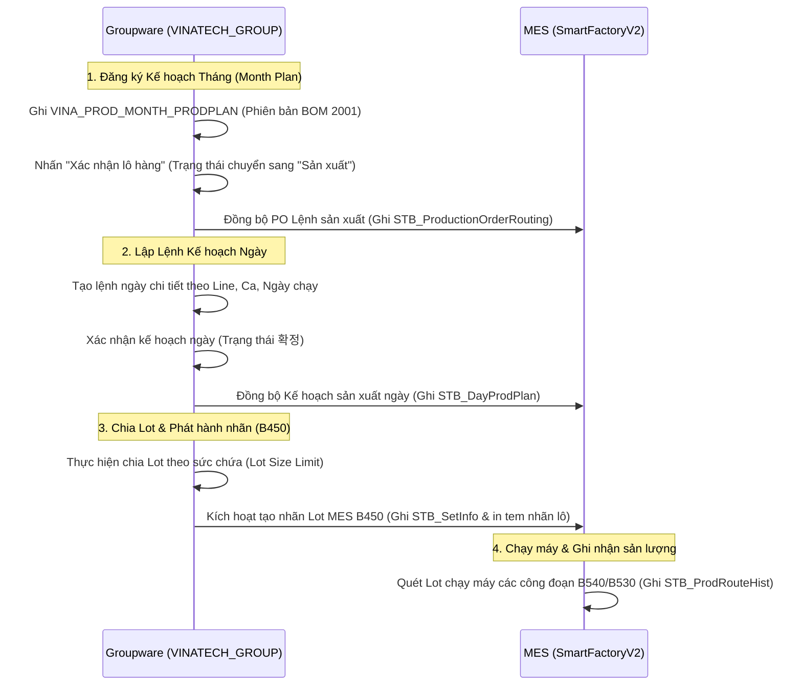

# 📅 VINATECH_GROUP — Production Planning & DB Schema Mapping

> [!NOTE]
> **Tài liệu tham chiếu nghiệp vụ người dùng:**
> *   Xem hướng dẫn lập kế hoạch sản xuất và PO ngày tại: [GW_03_KE_HOACH_SX.md](file:///C:/Users/User%20Vinatech.DESKTOP-RJJSEQU/Desktop/GROUPWARE/GROUPWARE_KNOWLEDGE_BASE/GW_03_KE_HOACH_SX.md)

Tài liệu này đi sâu vào cấu trúc dữ liệu vật lý và cơ chế liên thông cơ sở dữ liệu của **Phân hệ Kế hoạch Sản xuất (Production Planning Module)** trên Groupware (`VINATECH_GROUP`) kết nối với **MES (`SmartFactoryV2`)**.

---

## 🗺️ 1. Quy Trình Trạng Thái Lệnh Sản Xuất & Bảng Khớp Nối (Data Pipeline)

Luồng kế hoạch sản xuất bắt đầu từ nhu cầu bán hàng (Suju) tự động chuyển đổi thành kế hoạch tháng, sau đó được rã nhỏ thành kế hoạch ngày và tạo Lot sản xuất trong MES.



---

## 🗄️ 2. Chi Tiết Các Bảng & Cấu Trúc Khóa Ngoại (Foreign Keys Map)

```
        [VINA_PROD_MONTH_PRODPLAN] (Kế hoạch tháng)
                    │
                    └───(MONTH_PLAN_CODE)───► [VINA_DOCUMENT_DAILY_PRODUCTION_ORDER] (Kế hoạch ngày)
                                                                │
                                                                └───► [VINA_DOCUMENT_DAILY_PRODUCTION_ORDER_LOT] (Chia Lot)
```

### 2.1 Ma Trận Cột Khớp Nối Kế Hoạch Sản Xuất:

| Phân hệ nghiệp vụ | Tên Bảng (Groupware DB) | Các trường liên kết MES | Ghi chú vận hành |
| :--- | :--- | :--- | :--- |
| **1. Month Plan** | `VINA_PROD_MONTH_PRODPLAN` | `MATERIAL_CODE` (Mã sản phẩm)<br>`BOM_VERSION` (Bắt buộc = 2001)<br>`MONTH_PLAN_STATUS` | Khi chuyển sang trạng thái `'Sản xuất'`, dữ liệu PO tự động hiển thị trên màn hình giám sát **MES B310**. |
| **2. Daily Plan** | `VINA_DOCUMENT_DAILY_PRODUCTION_ORDER` | `DAY_PLAN_NO` (Mã kế hoạch ngày)<br>`LINE_CODE` (Mã Line)<br>`WORK_DATE` (Ngày chạy máy)<br>`SHIFT_CODE` (Ca làm việc) | Khi người dùng chọn **"Đã xác nhận"**, dữ liệu đồng bộ xuống **MES B450** để mở ca sản xuất. |
| **3. Lot Split** | `VINA_DOCUMENT_DAILY_PRODUCTION_ORDER_LOT`| `LOT_NO` (Mã Lot sản xuất)<br>`CONTROL_NO` (Mã kiểm soát MES)<br>`LIMIT_QTY` (Sức chứa Lot) | Tự động sinh danh sách Lot trong **MES B450**. Ghi nhận vào bảng `SmartFactoryV2.dbo.STB_SetInfo` để chờ quét chạy máy. |

---

## 🔍 3. Hướng Dẫn Truy Vấn & Kiểm Tra Khớp Nối (Golden Audit Queries)

Dưới đây là các câu truy vấn SQL mẫu (SELECT-ONLY) giúp kiểm tra đối chiếu luồng kế hoạch sản xuất giữa Groupware và MES.

### Mẫu 3.1: Kiểm tra kế hoạch tháng và phiên bản BOM áp dụng
```sql
SELECT 
    MP.MONTH_PLAN_CODE,
    MP.PLAN_MONTH,
    MP.MATERIAL_CODE,
    MP.PLAN_QTY,
    MP.BOM_VERSION, -- Phải là '2001' cho nhà máy Việt Nam
    MP.PLAN_STATUS, -- 'Sản xuất' (Production) hoặc 'Không làm' (Draft)
    MP.REG_DATE,
    MP.NO_EMP_WRITER
FROM VINATECH_GROUP.dbo.VINA_PROD_MONTH_PRODPLAN MP WITH(NOLOCK)
WHERE MP.PLAN_MONTH = '202606' -- Định dạng YYYYMM
  AND MP.MATERIAL_CODE = 'MÃ_SẢN_PHẨM_SẢN_XUẤT';
```

### Mẫu 3.2: Truy vấn lịch sử điều chỉnh số lượng kế hoạch tháng
```sql
SELECT 
    H.MONTH_PLAN_CODE,
    H.OLD_QTY,
    H.NEW_QTY,
    H.CHANGE_REASON,
    H.CREATE_DATE_TIME,
    H.CREATE_USER_ID
FROM VINATECH_GROUP.dbo.VINA_PROD_MONTH_PRODPLAN_HISTORY H WITH(NOLOCK)
WHERE H.MONTH_PLAN_CODE = 'MÃ_KẾ_HOẠCH_THÁNG_CẦN_TRA';
```

### Mẫu 3.3: Đối chiếu kế hoạch ngày đã xác nhận từ Groupware sang MES B450
```sql
SELECT 
    GW.DAY_PLAN_NO,
    GW.LINE_CODE,
    GW.WORK_DATE,
    GW.SHIFT_CODE,
    GW.PLAN_QTY AS [GW Plan Qty],
    -- Đối chiếu sang MES
    MES.DayProdPlanNo AS [MES Plan No],
    MES.LineCode AS [MES Line Code],
    MES.ProdOrderQty AS [MES Order Qty],
    MES.JobState AS [MES Status] -- '0' = Đã chốt, '1' = Đang chạy, v.v.
FROM VINATECH_GROUP.dbo.VINA_DOCUMENT_DAILY_PRODUCTION_ORDER GW WITH(NOLOCK)
LEFT JOIN SmartFactoryV2.dbo.STB_DayProdPlan MES WITH(NOLOCK) 
    ON GW.DAY_PLAN_NO = MES.DayProdPlanNo
WHERE GW.WORK_DATE = '2026-06-12' -- Định dạng ngày YYYY-MM-DD
  AND GW.LINE_CODE = 'MÃ_LINE_SẢN_XUẤT';
```

### Mẫu 3.4: Kiểm tra danh sách Lot sản xuất và sản lượng thực tế đã quét chạy máy
```sql
SELECT 
    SI.Barcode AS [Lot No],
    SI.ControlNo AS [Control No],
    SI.MaterialCode AS [Product Code],
    SI.PONo AS [PO Number],
    SI.ProdQty AS [Target Qty],
    -- Lịch sử quét thực tế tại MES
    PRH.RouteCode AS [Step Code],
    PRH.ProdQty AS [Step Good Qty],
    PRH.CreateDateTime AS [Scan Date Time]
FROM SmartFactoryV2.dbo.STB_SetInfo SI WITH(NOLOCK)
INNER JOIN SmartFactoryV2.dbo.STB_ProdRouteHist PRH WITH(NOLOCK) 
    ON SI.ControlNo = PRH.ControlNo
WHERE SI.PONo = 'PO_PLAN_NUMBER_FROM_GW'
ORDER BY SI.ControlNo, PRH.CreateDateTime ASC;
```

---

*Tài liệu được biên soạn phục vụ cho Kỹ sư Vận hành và Lập trình viên hệ thống Vinatech.*
