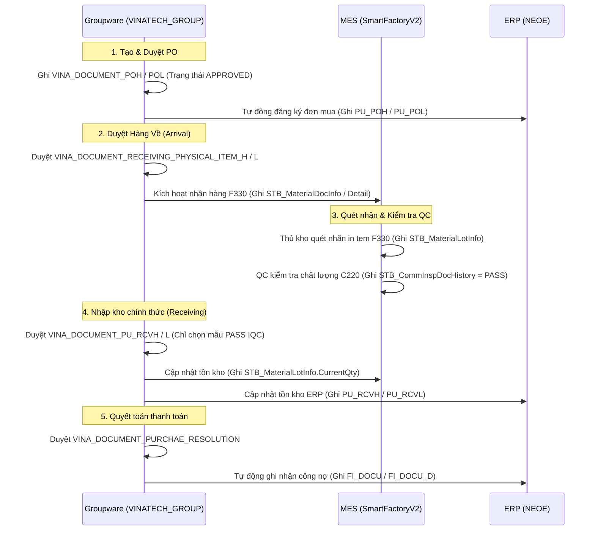

# 🛒 VINATECH_GROUP — Purchase Integration & DB Schema Mapping

> [!NOTE]
> **Tài liệu tham chiếu nghiệp vụ người dùng:**
> *   Xem hướng dẫn luồng mua hàng tại: [GW_02_MUA_HANG.md](file:///C:/Users/User%20Vinatech.DESKTOP-RJJSEQU/Desktop/GROUPWARE/GROUPWARE_KNOWLEDGE_BASE/GW_02_MUA_HANG.md)
> *   Xem hướng dẫn quyết toán thanh toán tại: [GW_06_THANH_TOAN.md](file:///C:/Users/User%20Vinatech.DESKTOP-RJJSEQU/Desktop/GROUPWARE/GROUPWARE_KNOWLEDGE_BASE/GW_06_THANH_TOAN.md)

Tài liệu này đi sâu vào cấu trúc dữ liệu vật lý và cơ chế liên thông cơ sở dữ liệu của **Phân hệ Mua hàng (Purchase Module)** trên Groupware (`VINATECH_GROUP`) kết nối với **MES (`SmartFactoryV2`)** và **ERP (`NEOE`)**.

---

## 🗺️ 1. Quy Trình Trạng Thái Dữ Liệu & Bảng Khớp Nối (Data Pipeline)

Luồng mua hàng đi qua 5 giai đoạn chính được lưu vết trực tiếp trong cơ sở dữ liệu bằng các bảng liên kết thông qua khóa `DOCUMENT_SAVE_CODE`.



---

## 🗄️ 2. Chi Tiết Các Bảng & Cấu Trúc Khóa Ngoại (Foreign Keys Map)

Mọi tệp tin nghiệp vụ mua hàng đều bắt đầu từ bảng cha `VINA_DOCUMENT_SAVE` chứa trạng thái chung của biểu mẫu.

```
          [VINA_DOCUMENT_SAVE]  (Header chung)
                   │
                   ├───(DOCUMENT_SAVE_CODE)───► [VINA_DOCUMENT_POH] (PO Header)
                   │                                     │
                   │                                     └───► [VINA_DOCUMENT_POL] (PO Lines)
                   │
                   ├───(DOCUMENT_SAVE_CODE)───► [VINA_DOCUMENT_RECEIVING_PHYSICAL_ITEM_H] (Arrival Header)
                   │                                     │
                   │                                     └───► [VINA_DOCUMENT_RECEIVING_PHYSICAL_ITEM_L] (Arrival Lines)
                   │
                   ├───(DOCUMENT_SAVE_CODE)───► [VINA_DOCUMENT_PU_RCVH] (Receiving Header)
                   │                                     │
                   │                                     └───► [VINA_DOCUMENT_PU_RCVL] (Receiving Lines)
                   │
                   └───(DOCUMENT_SAVE_CODE)───► [VINA_DOCUMENT_PURCHAE_RESOLUTION] (Payment Resolution)
                                                         │
                                                         └───► [VINA_DOCUMENT_PURCHAE_RESOLUTION_LINE]
```

### 2.1 Ma Trận Cột Khớp Nối Nghiệp Vụ Mua Hàng:

| Phân hệ nghiệp vụ | Tên Bảng (Groupware DB) | Các trường liên kết MES / ERP | Ghi chú vận hành |
| :--- | :--- | :--- | :--- |
| **1. Purchase Order** | `VINA_DOCUMENT_POH`<br>`VINA_DOCUMENT_POL` | `NO_PO` (Mã PO ERP)<br>`CD_ITEM` (Mã vật tư ERP)<br>`CD_SL` (Mã kho nhận ERP)<br>`NO_SO` (Sales Order liên kết HQ) | Sau khi duyệt, hệ thống tự động đẩy dữ liệu sang ERP `PU_POH`/`PU_POL` và gán mã `NO_PO`. |
| **2. Arrival Confirmation** | `VINA_DOCUMENT_RECEIVING_PHYSICAL_ITEM_H`<br>`VINA_DOCUMENT_RECEIVING_PHYSICAL_ITEM_L` | `DOCUMENT_SAVE_CODE` (Mã liên kết)<br>`BARCODE_LABEL_QTY` (Số lượng nhãn)<br>`QTY_PER_LABEL` (Lượng mỗi nhãn) | Dữ liệu được đồng bộ xuống **MES F330** để in tem mã. Tạo bản ghi trạng thái trong MES `STB_MaterialDocInfo`. |
| **3. QC IQC kiểm tra** | *(Không có bảng trên GW)*<br>*(Đọc trực tiếp từ MES C220)* | `STB_CommInspDocHistory`<br>`CommInspResult` (Kết quả)<br>`ProdNo` (ControlNo / LotNo) | Khi QC đánh giá **PASS** (giá trị = `'P'`), bản ghi mới xuất hiện trên GW để làm Receiving. |
| **4. Receiving Confirmation** | `VINA_DOCUMENT_PU_RCVH`<br>`VINA_DOCUMENT_PU_RCVL` | `DOCUMENT_SAVE_CODE` (Mã liên kết)<br>`CD_ITEM`<br>`QTY_RCV` (Số lượng nhập kho)<br>`DOCUMENT_POL_REMAIN_QT_PO` (Trừ đi) | Khi được duyệt, hệ thống cập nhật số dư kho trong MES `STB_MaterialLotInfo.CurrentQty` và đồng bộ ERP `PU_RCVH`. |
| **5. Purchase Resolution** | `VINA_DOCUMENT_PURCHAE_RESOLUTION`<br>`VINA_DOCUMENT_PURCHAE_RESOLUTION_LINE` | `DOCUMENT_SAVE_CODE`<br>`CD_ACCT` (Tài khoản kế toán)<br>`ERP_TX_INDEX` (Chỉ mục giao dịch ERP) | Tạo bút toán tự động ghi nhận nợ phải trả người bán (`FI_DOCU`/`FI_DOCU_D`) trên ERP `NEOE`. |

---

## 🔍 3. Hướng Dẫn Truy Vấn & Kiểm Tra Khớp Nối (Golden Audit Queries)

Dưới đây là các câu truy vấn SQL mẫu (SELECT-ONLY) giúp Lập trình viên/AI kiểm tra tính toàn vẹn dữ liệu và đối chiếu vết của một đơn mua hàng cụ thể.

### Mẫu 3.1: Kiểm tra trạng thái phê duyệt biểu mẫu PO trên Groupware
```sql
SELECT 
    S.DOCUMENT_SAVE_CODE,
    S.DOCUMENT_SAVE_SUBJECT,
    S.DOCUMENT_SAVE_STATE,
    S.NO_EMP_WRITER,
    H.CD_COMPANY,
    H.CD_PARTNER,
    H.NO_PO,
    H.DT_PO,
    H.CD_EXCH,
    H.RT_EXCH
FROM VINATECH_GROUP.dbo.VINA_DOCUMENT_SAVE S WITH(NOLOCK)
INNER JOIN VINATECH_GROUP.dbo.VINA_DOCUMENT_POH H WITH(NOLOCK) 
    ON S.DOCUMENT_SAVE_CODE = H.DOCUMENT_SAVE_CODE
WHERE H.NO_PO = 'PO_NUMBER_CAN_TRA_CUU' 
   OR S.DOCUMENT_SAVE_SUBJECT LIKE N'%TIÊU_ĐỀ_PO%';
```

### Mẫu 3.2: Kiểm tra chi tiết mặt hàng PO và số lượng còn lại chưa nhập kho
```sql
SELECT 
    L.NO_POLINE,
    L.CD_ITEM,
    L.QT_PO AS [Qty Ordered],
    L.DOCUMENT_POL_REMAIN_QT_PO AS [Qty Remaining],
    L.UM AS [Unit Price VND],
    L.AM AS [Amount VND],
    L.CD_SL AS [Target Warehouse],
    L.CD_CC AS [Cost Center]
FROM VINATECH_GROUP.dbo.VINA_DOCUMENT_POL L WITH(NOLOCK)
WHERE L.DOCUMENT_SAVE_CODE = 'MÃ_DOCUMENT_SAVE_CODE_PO';
```

### Mẫu 3.3: Đối chiếu liên thông từ PO sang phiếu hàng về (Arrival) và phiếu nhập kho (Receiving)
```sql
SELECT 
    PO.NO_PO,
    PO.CD_ITEM,
    PO.QT_PO AS [PO Qty],
    -- Thông tin Arrival
    ARH.DOCUMENT_SAVE_CODE AS [Arrival Doc Code],
    ARS.DOCUMENT_SAVE_STATE AS [Arrival State],
    ARL.QT_RECEIVING_PHYSICAL AS [Arrival Qty],
    -- Thông tin Receiving
    RCH.DOCUMENT_SAVE_CODE AS [Receiving Doc Code],
    RCS.DOCUMENT_SAVE_STATE AS [Receiving State],
    RCL.QT_RECEIVING AS [Receiving Qty]
FROM (
    SELECT H.DOCUMENT_SAVE_CODE, H.NO_PO, L.CD_ITEM, L.QT_PO
    FROM VINATECH_GROUP.dbo.VINA_DOCUMENT_POH H WITH(NOLOCK)
    INNER JOIN VINATECH_GROUP.dbo.VINA_DOCUMENT_POL L WITH(NOLOCK) ON H.DOCUMENT_SAVE_CODE = L.DOCUMENT_SAVE_CODE
) PO
-- Liên kết sang Arrival
LEFT JOIN VINATECH_GROUP.dbo.VINA_DOCUMENT_RECEIVING_PHYSICAL_ITEM_L ARL WITH(NOLOCK) ON PO.CD_ITEM = ARL.CD_ITEM
LEFT JOIN VINATECH_GROUP.dbo.VINA_DOCUMENT_RECEIVING_PHYSICAL_ITEM_H ARH WITH(NOLOCK) ON ARL.DOCUMENT_SAVE_CODE = ARH.DOCUMENT_SAVE_CODE
LEFT JOIN VINATECH_GROUP.dbo.VINA_DOCUMENT_SAVE ARS WITH(NOLOCK) ON ARH.DOCUMENT_SAVE_CODE = ARS.DOCUMENT_SAVE_CODE
-- Liên kết sang Receiving
LEFT JOIN VINATECH_GROUP.dbo.VINA_DOCUMENT_PU_RCVL RCL WITH(NOLOCK) ON PO.CD_ITEM = RCL.CD_ITEM
LEFT JOIN VINATECH_GROUP.dbo.VINA_DOCUMENT_PU_RCVH RCH WITH(NOLOCK) ON RCL.DOCUMENT_SAVE_CODE = RCH.DOCUMENT_SAVE_CODE
LEFT JOIN VINATECH_GROUP.dbo.VINA_DOCUMENT_SAVE RCS WITH(NOLOCK) ON RCH.DOCUMENT_SAVE_CODE = RCS.DOCUMENT_SAVE_CODE
WHERE PO.NO_PO = 'PO_NUMBER_CAN_TRA_CUU';
```

### Mẫu 3.4: Kiểm tra trạng thái IQC (MES C220) trước khi làm Receiving
```sql
SELECT 
    CIDH.CommInspDocNo,
    CIDH.ProdNo AS [Lot Number / Control Number],
    CIDH.CommInspResult, -- 'P' đại diện cho PASS, 'F' đại diện cho FAIL
    CIDH.CreateDateTime AS [QC Check Date],
    CIDH.CreateUserID AS [QC Inspector]
FROM SmartFactoryV2.dbo.STB_CommInspDocHistory CIDH WITH(NOLOCK)
WHERE CIDH.ProdNo IN (
    SELECT MaterialLotNo 
    FROM SmartFactoryV2.dbo.STB_MaterialLotInfo WITH(NOLOCK)
    WHERE PurchaseOrderNo = 'PO_NUMBER_CAN_TRA_CUU'
)
ORDER BY CIDH.CreateDateTime DESC;
```

---

*Tài liệu được biên soạn phục vụ cho Kỹ sư Vận hành và Lập trình viên hệ thống Vinatech.*
