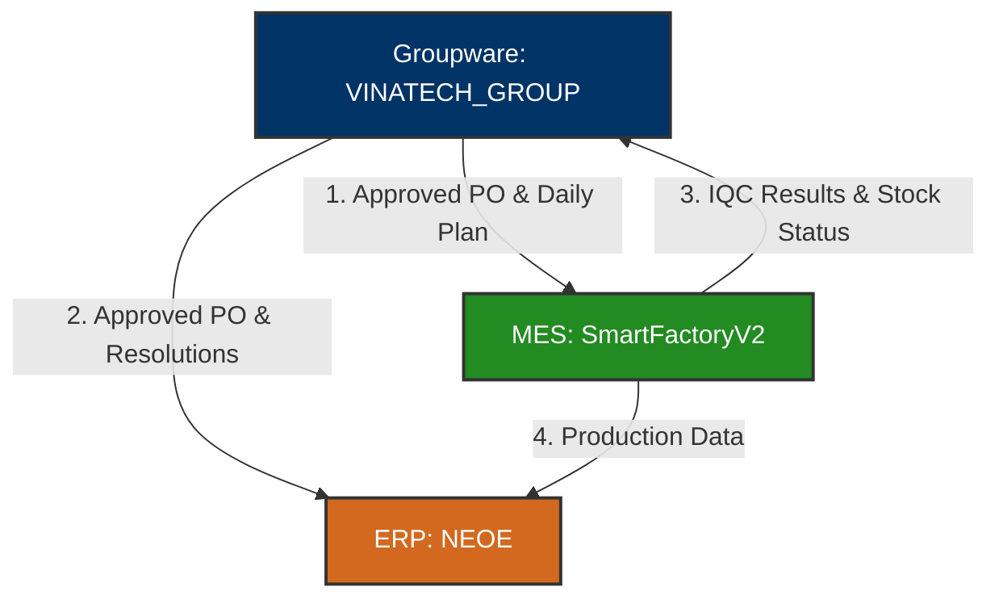

# 🏛️ VINATECH_GROUP — Groupware Database Knowledge Base

> [!IMPORTANT]
> **Tài liệu hướng dẫn nghiệp vụ vận hành người dùng:**
> *   Xem chi tiết mục lục và quy trình nghiệp vụ Groupware tại: [GW_INDEX.md](file:///C:/Users/User%20Vinatech.DESKTOP-RJJSEQU/Desktop/GROUPWARE/GROUPWARE_KNOWLEDGE_BASE/GW_INDEX.md)

`VINATECH_GROUP` là cơ sở dữ liệu cốt lõi của hệ thống **Groupware (GW)** tại Vinatech Việt Nam. Hệ thống này đóng vai trò trung tâm điều phối toàn bộ luồng phê duyệt điện tử (Electronic Approval), thông tin nhân sự, sơ đồ tổ chức và kết nối chặt chẽ các luồng dữ liệu nghiệp vụ giữa **MES (SmartFactoryV2)** và **ERP (NEOE)**.

---

## 🗺️ Bản đồ tài liệu tích hợp chuyên sâu (Integration Guides Map)

Để hỗ trợ đắc lực cho việc vận hành và debug, các tài liệu kỹ thuật chi tiết đã được phân rã theo từng luồng nghiệp vụ liên kết hệ thống:

1.  **Sơ đồ Tổ chức & Phê duyệt điện tử:** [ORGANIZATION_AND_WORKFLOW.md](file:///C:/Users/User%20Vinatech.DESKTOP-RJJSEQU/Desktop/database/VINATECH_GROUP/ORGANIZATION_AND_WORKFLOW.md) (Đối chiếu tài khoản nhân sự và lịch sử phê duyệt).
2.  **Tích hợp Mua hàng (PO):** [PURCHASE_INTEGRATION.md](file:///C:/Users/User%20Vinatech.DESKTOP-RJJSEQU/Desktop/database/VINATECH_GROUP/PURCHASE_INTEGRATION.md) (Đối chiếu từ PO đến Arrival, kiểm QC, nhập kho và quyết toán).
3.  **Kế hoạch & Chỉ thị sản xuất:** [PRODUCTION_PLANNING.md](file:///C:/Users/User%20Vinatech.DESKTOP-RJJSEQU/Desktop/database/VINATECH_GROUP/PRODUCTION_PLANNING.md) (Đồng bộ Month Plan, Daily Plan và chia tách Lot sản xuất).
4.  **Quản lý Dữ liệu gốc (Master Data):** [MASTER_DATA_INTEGRATION.md](file:///C:/Users/User%20Vinatech.DESKTOP-RJJSEQU/Desktop/database/VINATECH_GROUP/MASTER_DATA_INTEGRATION.md) (Đăng ký mã vật tư mới, BOM 2001 và thông tin đối tác/đơn giá).
5.  **Tích hợp Đề nghị thanh toán:** [DISBURSEMENT_INTEGRATION.md](file:///C:/Users/User%20Vinatech.DESKTOP-RJJSEQU/Desktop/database/VINATECH_GROUP/DISBURSEMENT_INTEGRATION.md) (Quyết toán chi phí mua hàng và quản lý cước Logistics).
6.  **Tích hợp Hành chính - Nhân sự:** [HR_AND_ADMIN_INTEGRATION.md](file:///C:/Users/User%20Vinatech.DESKTOP-RJJSEQU/Desktop/database/VINATECH_GROUP/HR_AND_ADMIN_INTEGRATION.md) (Xin nghỉ phép, tăng ca ngày nghỉ, đi công tác và nhân sự nghỉ việc).
7.  **Tích hợp Bán hàng & Xuất khẩu:** [SALES_AND_SHIPMENT_INTEGRATION.md](file:///C:/Users/User%20Vinatech.DESKTOP-RJJSEQU/Desktop/database/VINATECH_GROUP/SALES_AND_SHIPMENT_INTEGRATION.md) (Theo dõi Suju, Shipment Request, Shipment Confirmation và Sales Resolution).
8.  **Quản lý Kho & Tồn kho thành phẩm:** [WAREHOUSE_AND_INVENTORY_INTEGRATION.md](file:///C:/Users/User%20Vinatech.DESKTOP-RJJSEQU/Desktop/database/VINATECH_GROUP/WAREHOUSE_AND_INVENTORY_INTEGRATION.md) (Vận hành hiện trường MES FG01, B750, B752 và tra cứu mã kho chuẩn).
9.  **Bảo mật & Single Sign-On (SSO):** [SSO_AND_SECURITY_INTEGRATION.md](file:///C:/Users/User%20Vinatech.DESKTOP-RJJSEQU/Desktop/database/VINATECH_GROUP/SSO_AND_SECURITY_INTEGRATION.md) (Xác thực một lần qua RESTful API, quản lý Token và IP Whitelists).

---

## 🗺️ 1. Tổng Quan Vận Hành & Vai Trò Hệ Thống

Hệ thống Groupware không chỉ là cổng thông tin nội bộ mà còn là **nơi khởi tạo và phê duyệt** các giao dịch trước khi chúng được đẩy xuống nhà máy (MES) hoặc ghi nhận vào hệ thống kế toán (ERP).

### 🔗 Mối Liên Kết Nghiệp Vụ Liên Hệ Thống:

#### 1. Luồng mua hàng & Quản lý kho Nguyên vật liệu (NVL):
*   **Khởi tạo (GW):** Nhân sự tạo và phê duyệt **Purchase Order (PO)** (`VINA_DOCUMENT_POH` / `VINA_DOCUMENT_POL`). Sau khi duyệt, thông tin PO tự động được đăng ký vào ERP.
*   **Hàng về (GW):** Tạo **Arrival Confirmation** (`VINA_DOCUMENT_RECEIVING_PHYSICAL_ITEM_H`).
*   **Nhận hàng & In tem (MES):** Dữ liệu Arrival Confirmation từ GW kích hoạt màn hình **MES F330** để thủ kho quét nhận hàng và in tem nhãn NVL.
*   **Kiểm tra QC (MES):** Đội QC thực hiện kiểm tra chất lượng tại **MES C220 (IQC)**.
*   **Nhập kho chính thức (GW):** Sau khi C220 báo **PASS**, nhân sự làm **Receiving Confirmation** trên GW để cập nhật tồn kho chính thức lên cả MES và ERP.
*   **Thanh toán (GW):** Làm **Purchase Resolution** gửi kế toán duyệt để tự động tạo bút toán công nợ trên ERP.

#### 2. Luồng bán hàng & Xuất kho thành phẩm:
*   **Đơn hàng (GW):** Đăng ký đơn bán hàng (**Suju / Sales Order**).
*   **Lệnh xuất kho (GW):** Tạo phiếu duyệt **Shipment Request**.
*   **Thực xuất (MES):** Thủ kho quét Packing ID trên màn hình **MES FG01** để xuất kho vật lý (trừ tồn kho MES).
*   **Thông quan & Pallet (GW/MES):** Tạo **Shipment Confirmation** trên GW và in tem pallet **MES B750** để thông quan, ghi nhận doanh thu trên ERP.

#### 3. Luồng nhân sự & Cấp quyền:
*   Khi có nhân viên mới hoặc cần cấp quyền hệ thống, biểu mẫu **New Employee EA** hoặc **Permission MES** được tạo trên GW. Sau khi được duyệt, hệ thống tự động đồng bộ tài khoản/quyền hạn sang MES.

---

## 🗄️ 2. Kiến Trúc Cấu Trúc Dữ Liệu Trọng Tâm

Hệ thống được thiết kế theo dạng **Generic Document Flow** (Luồng tài liệu chung):
1.  Bảng `VINA_DOCUMENT_SAVE` lưu trữ Header chung cho mọi loại văn bản (Người viết, tiêu đề, trạng thái duyệt, nội dung HTML).
2.  Mỗi loại văn bản chuyên biệt sẽ có một bảng nghiệp vụ riêng (ví dụ: `VINA_DOCUMENT_POH` cho đơn mua hàng, `VINA_DOCUMENT_LEAVE_REQUEST` cho xin nghỉ phép) liên kết qua khóa ngoại `DOCUMENT_SAVE_CODE`.

### 2.1 Bảng Tài Liệu Chung: `VINA_DOCUMENT_SAVE`
Lưu trữ thông tin gốc của tất cả các phiếu trình duyệt.

| Tên Cột | Kiểu Dữ Liệu | Nullable | Mô Tả |
| :--- | :--- | :--- | :--- |
| **DOCUMENT_SAVE_CODE** (PK) | `varchar(50)` | NO | Mã định danh duy nhất của tài liệu/bản nháp |
| **DOCUMENT_TYPE_ID** (FK) | `varchar(50)` | NO | Phân loại tài liệu (PO, PR, Nghỉ phép, Thanh toán...) |
| **DOCUMENT_SAVE_STATE** | `varchar(50)` | NO | Trạng thái (DRAFT, APPROVING, APPROVED, REJECTED) |
| **NO_EMP_WRITER** | `nvarchar(10)` | YES | Mã nhân viên soạn thảo |
| **CD_COMPANY_WRITER** | `nvarchar(7)` | YES | Mã công ty của người soạn thảo (VVT, VNT...) |
| **NO_EMP_USE** | `nvarchar(10)` | YES | Mã nhân viên sử dụng thực tế (nếu viết hộ) |
| **DOCUMENT_SAVE_SUBJECT** | `nvarchar(250)` | NO | Tiêu đề văn bản |
| **DOCUMENT_SAVE_CONTENT** | `ntext` | NO | Nội dung văn bản định dạng HTML (Rich-text) |
| **DOCUMENT_SAVE_REG_DATE** | `datetime` | YES | Ngày khởi tạo/gửi duyệt |

---

### 2.2 Nghiệp Vụ Mua Hàng (Purchase Order)

#### A. Header Đơn Mua Hàng: `VINA_DOCUMENT_POH`
Lưu thông tin chung của đơn đặt hàng với nhà cung cấp.

| Tên Cột | Kiểu Dữ Liệu | Mô Tả |
| :--- | :--- | :--- |
| **DOCUMENT_SAVE_CODE** (PK/FK) | `varchar(50)` | Liên kết tới `VINA_DOCUMENT_SAVE` |
| **CD_COMPANY** | `nvarchar(7)` | Mã pháp nhân mua hàng (VVT, VNT...) |
| **CD_PARTNER** | `nvarchar(20)` | Mã nhà cung cấp/đối tác (ví dụ: 13000 cho HQ) |
| **NO_PO** | `nvarchar(20)` | Số đơn hàng (PO Number) đồng bộ với ERP |
| **DT_PO** | `datetime` | Ngày đặt hàng |
| **CD_EXCH** | `nvarchar(3)` | Đơn vị tiền tệ giao dịch (VND, USD, KRW) |
| **RT_EXCH** | `numeric` | Tỷ giá hối đoái tại ngày đặt hàng |
| **RT_VAT** | `numeric` | Tỷ lệ thuế VAT áp dụng |
| **DOCUMENT_POH_PARTY_TRADE_YN** | `nchar(1)` | Giao dịch liên công ty (Y/N) |
| **NO_SO** | `nvarchar(20)` | Số đơn bán hàng liên kết phía HQ (nếu mua từ HQ) |

#### B. Line Đơn Mua Hàng: `VINA_DOCUMENT_POL`
Lưu chi tiết các mặt hàng trong đơn mua hàng.

| Tên Cột | Kiểu Dữ Liệu | Mô Tả |
| :--- | :--- | :--- |
| **DOCUMENT_SAVE_CODE** (PK/FK) | `varchar(50)` | Liên kết tới `VINA_DOCUMENT_POH` |
| **NO_POLINE** (PK) | `numeric` | Số thứ tự dòng hàng |
| **CD_ITEM** | `nvarchar(20)` | Mã vật tư đặt mua (Item Code) |
| **DT_LIMIT** | `datetime` | Hạn giao hàng (Delivery Date) |
| **QT_PO** | `numeric` | Số lượng đặt mua |
| **UM_EX** | `numeric` | Đơn giá ngoại tệ |
| **AM_EX** | `numeric` | Thành tiền ngoại tệ |
| **UM** | `numeric` | Đơn giá quy đổi nội tệ (VND) |
| **AM** | `numeric` | Thành tiền quy đổi nội tệ (VND) |
| **CD_SL** | `nvarchar(7)` | Mã kho nhận hàng dự kiến |
| **CD_CC** | `nvarchar(5)` | Mã trung tâm chi phí (Cost Center) chịu phí |
| **DOCUMENT_POL_REMAIN_QT_PO** | `numeric` | Số lượng còn lại chưa nhập kho (dùng để kiểm soát tiến độ) |

---

### 2.3 Hồ Sơ Nhân Sự & Sơ Đồ Tổ Chức

Để tối ưu hóa, Groupware tách biệt thông tin cấu hình tài khoản (`VINA_EMP`) và thông tin hiển thị/sơ đồ cây (`VINA_ORG_CHART`).

#### A. Trạng Thái Tài Khoản Nhân Viên: `VINA_EMP`
| Tên Cột | Kiểu Dữ Liệu | Mô Tả |
| :--- | :--- | :--- |
| **NO_EMP** (PK) | `nvarchar(10)` | Mã nhân viên |
| **CD_COMPANY** (PK) | `nvarchar(7)` | Mã công ty làm việc |
| **EMP_ADMIN** | `char(1)` | Quyền quản trị thường (Y/N) |
| **EMP_SYSTEM_ADMIN** | `char(1)` | Quyền quản trị hệ thống (Y/N) |
| **EMP_STOP** | `char(1)` | Trạng thái khóa tài khoản/nghỉ việc (Y/N) |
| **DT_ENTER_LEAVE** | `date` | Ngày chính thức nghỉ việc |

#### B. Sơ Đồ & Thông Tin Hiển Thị: `VINA_ORG_CHART_NODE`
Bảng này lưu trữ toàn bộ cây sơ đồ tổ chức, bao gồm cả các Phòng ban (Department) và Nhân sự (Employee) kèm theo tên hiển thị của họ.

| Tên Cột | Kiểu Dữ Liệu | Mô Tả |
| :--- | :--- | :--- |
| **ORG_CHART_NODE_CODE** (PK) | `varchar(50)` | Mã nút sơ đồ |
| **ORG_CHART_CODE** | `varchar(50)` | Thuộc về cây sơ đồ nào |
| **ORG_CHART_NODE_TYPE** | `nvarchar(50)` | Loại nút (ví dụ: `DEPT` - Phòng ban, `EMP` - Nhân viên) |
| **ORG_CHART_NODE_NAME** | `nvarchar(100)` | Tên hiển thị (Tên Phòng ban hoặc Tên Nhân viên) |
| **CD_DEPT** | `nvarchar(12)` | Mã phòng ban |
| **NO_EMP** | `nvarchar(10)` | Mã nhân viên (nếu nút là nhân viên) |
| **CD_DUTY_RESP** | `nvarchar(4)` | Mã chức vụ trách nhiệm |
| **CD_DUTY_STEP** | `nvarchar(4)` | Mã cấp bậc/chức danh |

---

## 📊 3. Danh Mục Các Bảng Quan Trọng Khác

| Nhóm chức năng | Tên Bảng | Vai trò nghiệp vụ |
| :--- | :--- | :--- |
| **Quy trình duyệt** | `VINA_WORKFLOW` | Lưu trữ cấu hình quy trình phê duyệt chung |
| | `VINA_WORKFLOW_STEP` | Định nghĩa các bước phê duyệt và thứ tự thực hiện |
| | `VINA_WORKFLOW_RELATION` | Ghi nhận lịch sử duyệt thực tế của từng tài liệu |
| **Kế hoạch & Sản xuất** | `VINA_PROD_MONTH_PRODPLAN` | Kế hoạch sản xuất tháng được duyệt (đồng bộ sang MES B310) |
| | `VINA_DOCUMENT_DAILY_PRODUCTION_ORDER_COATING` | Phiếu chỉ thị sản xuất ngày công đoạn Coating |
| | `VINA_DOCUMENT_ITEM_REGISTRATION_H` / `_L` | Phiếu đăng ký mã vật tư mới (Cell, Module, NVL) |
| **Logistics & Bán hàng** | `VINA_DOCUMENT_SALES_ORDER` | Đơn bán hàng (Suju) đồng bộ sang ERP |
| | `VINA_DOCUMENT_DELIVER_OUT_CONFIRMATION_IV` | Phiếu xác nhận xuất kho bán hàng/logistics |
| | `VINA_DOCUMENT_RETURN_PRODUCT` | Phiếu duyệt trả lại sản phẩm lỗi cho nhà cung cấp |
| **Hành chính nhân sự** | `VINA_DOCUMENT_LEAVE_REQUEST` | Biểu mẫu xin nghỉ phép (kết nối trực tiếp lịch chấm công) |
| | `VINA_DOCUMENT_HOLIDAY_WORK` | Đăng ký đi làm ngày lễ/chủ nhật |
| | `VINA_DOCUMENT_BUSINESS_CARD` | Biểu mẫu đề xuất cấp phát danh thiếp |
| | `VINA_DOCUMENT_SEAL_REQUEST` | Yêu cầu đóng dấu pháp lý công ty |

---

*Tài liệu được biên soạn dựa trên phân tích trực tiếp cấu trúc CSDL thực tế tại máy chủ `dbserver.hycap.co.kr,5398` kết hợp với Groupware User Manuals.*
