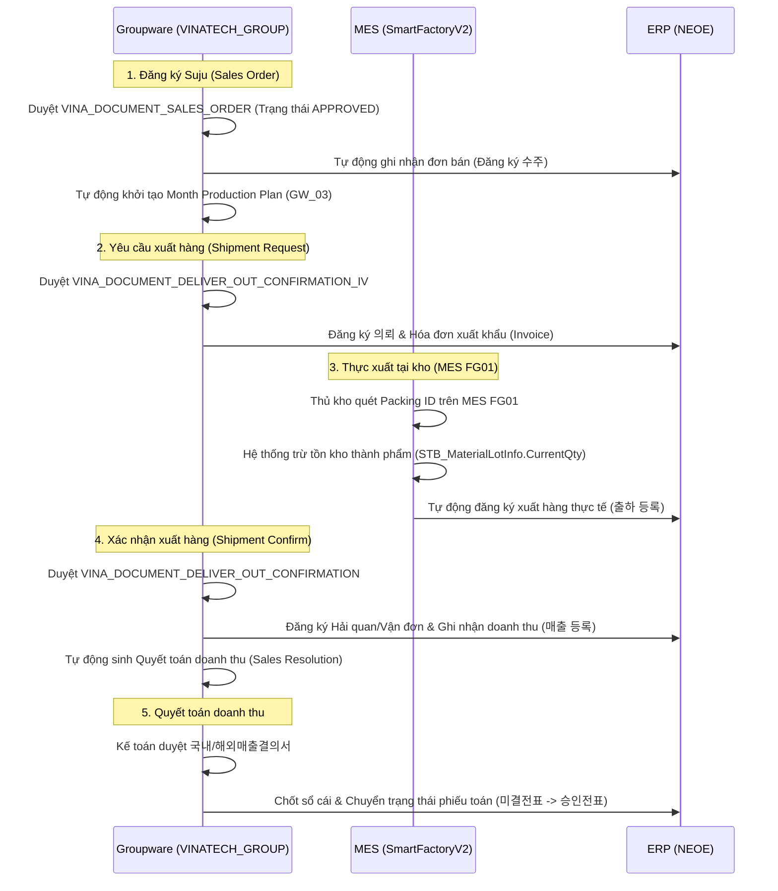

# 📊 VINATECH_GROUP — Sales & Shipment Integration & DB Schema Mapping

> [!NOTE]
> **Tài liệu tham chiếu nghiệp vụ người dùng:**
> *   Xem hướng dẫn luồng bán hàng và xuất khẩu tại: [GW_08_BAN_HANG.md](file:///C:/Users/User%20Vinatech.DESKTOP-RJJSEQU/Desktop/GROUPWARE/GROUPWARE_KNOWLEDGE_BASE/GW_08_BAN_HANG.md)
> *   Xem hướng dẫn hiện trường kho thành phẩm tại: [GW_07_KHO_THANH_PHAM.md](file:///C:/Users/User%20Vinatech.DESKTOP-RJJSEQU/Desktop/GROUPWARE/GROUPWARE_KNOWLEDGE_BASE/GW_07_KHO_THANH_PHAM.md)

Tài liệu này đi sâu vào cấu trúc dữ liệu vật lý và cơ chế liên thông cơ sở dữ liệu của **Phân hệ Bán hàng & Xuất khẩu (Sales & Shipment Module)** trên Groupware (`VINATECH_GROUP`) kết nối với **ERP (`NEOE`)** và **MES (`SmartFactoryV2`)**.

---

## 🗺️ 1. Quy Trình Trạng Thái Bán Hàng & Bảng Khớp Nối (Data Pipeline)

Luồng bán hàng được phê duyệt qua 4 giai đoạn chính trên Groupware, kích hoạt việc ghi nhận dữ liệu tự động tại ERP và MES.



---

## 🗄️ 2. Chi Tiết Các Bảng & Cấu Trúc Khóa Ngoại (Foreign Keys Map)

```
          [VINA_DOCUMENT_SAVE]  (Header chung)
                   │
                   ├───(DOCUMENT_SAVE_CODE)───► [VINA_DOCUMENT_SALES_ORDER] (Suju Header)
                   │                                     │
                   │                                     └───► [VINA_DOCUMENT_SALES_ORDER_LINE] (Suju Lines)
                   │
                   ├───(DOCUMENT_SAVE_CODE)───► [VINA_DOCUMENT_DELIVER_OUT_CONFIRMATION_IV] (Shipment Request)
                   │                                     │
                   │                                     └───► [VINA_DOCUMENT_DELIVER_OUT_CONFIRMATION_IV_LINE]
                   │
                   └───(DOCUMENT_SAVE_CODE)───► [VINA_DOCUMENT_DELIVER_OUT_CONFIRMATION] (Shipment Confirm)
```

### 2.1 Ma Trận Cột Khớp Nối Nghiệp Vụ Bán Hàng:

| Phân hệ nghiệp vụ | Tên Bảng (Groupware DB) | Các trường liên kết ERP / MES | Ghi chú vận hành |
| :--- | :--- | :--- | :--- |
| **1. Sales Order (Suju)** | `VINA_DOCUMENT_SALES_ORDER`<br>`VINA_DOCUMENT_SALES_ORDER_LINE` | `NO_SO` (Mã Suju ERP)<br>`CD_ITEM` (Mã sản phẩm)<br>`CD_PARTNER` (Khách hàng)<br>`QT_SO` (Số lượng đặt) | Sau khi duyệt, hệ thống tự động đẩy dữ liệu sang ERP và MES để lập kế hoạch sản xuất tháng. |
| **2. Shipment Request** | `VINA_DOCUMENT_DELIVER_OUT_CONFIRMATION_IV`<br>`VINA_DOCUMENT_DELIVER_OUT_CONFIRMATION_IV_LINE` | `NO_SO`<br>`CD_ITEM`<br>`QT_REQUEST` (Số lượng yêu cầu)<br>`NO_INVOICE` (Mã Invoice xuất khẩu) | Đẩy trạng thái yêu cầu xuất hàng sang ERP (의뢰 등록) và cho phép kho quét xuất trên MES. |
| **3. Shipment Confirm** | `VINA_DOCUMENT_DELIVER_OUT_CONFIRMATION` | `DOCUMENT_SAVE_CODE`<br>`NO_CUSTOMS` (Số tờ khai hải quan)<br>`NO_BL` (Số vận đơn)<br>`DT_SHIPPED` (Ngày tàu chạy) | Xác nhận lô hàng đã bốc lên phương tiện vận chuyển và đẩy nghiệp vụ doanh thu sang ERP. |
| **4. Sales Resolution** | `VINA_DOCUMENT_SALES_RESOLUTION` | `DOCUMENT_SAVE_CODE`<br>`CD_COMPANY`<br>`AM_SALES` (Doanh thu quyết toán) | Quyết toán kế toán tự động khởi tạo để phòng kế toán phê duyệt sổ sách doanh thu. |

---

## 🔍 3. Hướng Dẫn Truy Vấn & Kiểm Tra (Golden Audit Queries)

Dưới đây là các câu truy vấn SQL mẫu (SELECT-ONLY) giúp Lập trình viên/AI kiểm tra tính toàn vẹn dữ liệu và đối chiếu vết của một đơn bán hàng cụ thể.

### Mẫu 3.1: Kiểm tra trạng thái phê duyệt đơn bán hàng (Suju) trên Groupware
```sql
SELECT 
    S.DOCUMENT_SAVE_CODE,
    S.DOCUMENT_SAVE_SUBJECT AS [Title],
    S.DOCUMENT_SAVE_STATE AS [Approval State],
    S.NO_EMP_WRITER AS [Creator ID],
    SO.CD_COMPANY,
    SO.CD_PARTNER AS [Customer Code],
    SO.NO_SO AS [ERP Sales Order No],
    SO.DT_SO AS [Suju Date]
FROM VINATECH_GROUP.dbo.VINA_DOCUMENT_SAVE S WITH(NOLOCK)
INNER JOIN VINATECH_GROUP.dbo.VINA_DOCUMENT_SALES_ORDER SO WITH(NOLOCK) 
    ON S.DOCUMENT_SAVE_CODE = SO.DOCUMENT_SAVE_CODE
WHERE SO.NO_SO = 'SUJU_NUMBER_CAN_TRA' 
   OR S.DOCUMENT_SAVE_SUBJECT LIKE N'%TÊN_KHÁCH_HÀNG%';
```

### Mẫu 3.2: Đối chiếu từ Suju sang Yêu cầu xuất hàng (Shipment Request) và Thực tế xuất hàng
```sql
SELECT 
    SO.NO_SO AS [Suju No],
    SOL.CD_ITEM AS [Product Code],
    SOL.QT_SO AS [Suju Qty],
    -- Thông tin Yêu cầu xuất hàng
    SRH.DOCUMENT_SAVE_CODE AS [Request Doc Code],
    SRS.DOCUMENT_SAVE_STATE AS [Request State],
    SRL.QT_REQUEST AS [Request Qty],
    -- Đối chiếu xuất thực tế từ ERP
    (SELECT SUM(OL.QT_GI) 
     FROM NEOE.dbo.MM_GI_LINE OL WITH(NOLOCK) 
     WHERE OL.NO_IS = SRH.DOCUMENT_SAVE_CODE AND OL.CD_ITEM = SOL.CD_ITEM) AS [Actual Shipped Qty]
FROM VINATECH_GROUP.dbo.VINA_DOCUMENT_SALES_ORDER SO WITH(NOLOCK)
INNER JOIN VINATECH_GROUP.dbo.VINA_DOCUMENT_SALES_ORDER_LINE SOL WITH(NOLOCK) 
    ON SO.DOCUMENT_SAVE_CODE = SOL.DOCUMENT_SAVE_CODE
-- Liên kết sang Shipment Request
LEFT JOIN VINATECH_GROUP.dbo.VINA_DOCUMENT_DELIVER_OUT_CONFIRMATION_IV_LINE SRL WITH(NOLOCK) 
    ON SOL.CD_ITEM = SRL.CD_ITEM
LEFT JOIN VINATECH_GROUP.dbo.VINA_DOCUMENT_DELIVER_OUT_CONFIRMATION_IV SRH WITH(NOLOCK) 
    ON SRL.DOCUMENT_SAVE_CODE = SRH.DOCUMENT_SAVE_CODE
LEFT JOIN VINATECH_GROUP.dbo.VINA_DOCUMENT_SAVE SRS WITH(NOLOCK) 
    ON SRH.DOCUMENT_SAVE_CODE = SRS.DOCUMENT_SAVE_CODE
WHERE SO.NO_SO = 'SUJU_NUMBER_CAN_TRA';
```

### Mẫu 3.3: Tra cứu thông tin Hải quan & Vận đơn của đơn xuất khẩu
```sql
SELECT 
    SC.DOCUMENT_SAVE_CODE,
    S.DOCUMENT_SAVE_STATE AS [Confirm State],
    SC.NO_CUSTOMS AS [Customs Declaration No],
    SC.NO_BL AS [B/L Number],
    SC.DT_SHIPPED AS [Shipping Date],
    SC.NM_VESSEL AS [Vessel Name],
    SC.PORT_LOADING AS [Port of Loading],
    SC.PORT_DESTINATION AS [Port of Destination]
FROM VINATECH_GROUP.dbo.VINA_DOCUMENT_DELIVER_OUT_CONFIRMATION SC WITH(NOLOCK)
INNER JOIN VINATECH_GROUP.dbo.VINA_DOCUMENT_SAVE S WITH(NOLOCK) 
    ON SC.DOCUMENT_SAVE_CODE = S.DOCUMENT_SAVE_CODE
WHERE SC.DOCUMENT_SAVE_CODE = 'MÃ_SHIPMENT_CONFIRMATION_CODE';
```

### Mẫu 3.4: Kiểm tra đồng bộ doanh thu (Sales Resolution) sang ERP
```sql
SELECT 
    SR.DOCUMENT_SAVE_CODE,
    S.DOCUMENT_SAVE_STATE AS [Approval State],
    SR.CD_COMPANY,
    SR.AM_SALES AS [Revenue Amount VND],
    SR.ERP_DOCU_NO AS [ERP Accounting Voucher No], -- Số chứng từ ERP
    SR.REG_DATE AS [Resolution Date]
FROM VINATECH_GROUP.dbo.VINA_DOCUMENT_SALES_RESOLUTION SR WITH(NOLOCK)
INNER JOIN VINATECH_GROUP.dbo.VINA_DOCUMENT_SAVE S WITH(NOLOCK) 
    ON SR.DOCUMENT_SAVE_CODE = S.DOCUMENT_SAVE_CODE
WHERE SR.DOCUMENT_SAVE_CODE = 'MÃ_SALES_RESOLUTION_CODE';
```

---

*Tài liệu được biên soạn phục vụ cho Kỹ sư Vận hành và Lập trình viên hệ thống Vinatech.*
