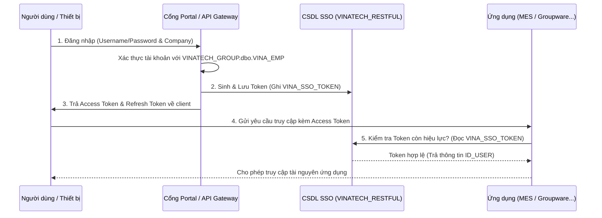

# 🔑 VINATECH_GROUP — SSO & Security Integration & DB Schema Mapping

> [!NOTE]
> **Tài liệu tham chiếu nghiệp vụ người dùng:**
> *   Xem hướng dẫn đăng nhập và thiết lập công ty tại: [GW_01_DANG_NHAP.md](file:///C:/Users/User%20Vinatech.DESKTOP-RJJSEQU/Desktop/GROUPWARE/GROUPWARE_KNOWLEDGE_BASE/GW_01_DANG_NHAP.md)
> *   Xem hướng dẫn phân quyền và sơ đồ tổ chức tại: [ORGANIZATION_AND_WORKFLOW.md](file:///C:/Users/User%20Vinatech.DESKTOP-RJJSEQU/Desktop/database/VINATECH_GROUP/ORGANIZATION_AND_WORKFLOW.md)

Tài liệu này đi sâu vào cơ chế xác thực tập trung **Single Sign-On (SSO)** và cấu trúc dữ liệu bảo mật giữa cơ sở dữ liệu `VINATECH_RESTFUL`, cổng Portal Groupware (`VINATECH_GROUP`), ứng dụng di động và hệ thống phân xưởng **MES (`SmartFactoryV2`)**.

---

## 🗺️ 1. Kiến Trúc Xác Thực Một Lần (SSO Pipeline)

Hệ thống SSO của Vinatech đảm bảo người dùng sau khi xác thực tại cổng Portal chính có thể di chuyển sang Web Groupware, ứng dụng PDA, Kiosk POP sản xuất hoặc MES Web Portal mà không cần nhập lại mật khẩu.



---

## 🗄️ 2. Chi Tiết Các Bảng Bảo Mật (SSO Schema Map)

Cơ sở dữ liệu `VINATECH_RESTFUL` được thiết kế tối giản để tối ưu hóa hiệu năng xác thực thời gian thực (real-time validation) với 3 bảng chính:

### 2.1 Bảng Lưu Trữ Phiên Token: `VINA_SSO_TOKEN`
Mỗi phiên làm việc của người dùng khi đăng nhập thành công sẽ sinh ra một dòng dữ liệu tại đây.

| Tên Cột | Kiểu Dữ Liệu | Nullable | Vai Trò |
| :--- | :--- | :--- | :--- |
| **SSO_TOKEN_CODE** (PK) | `varchar(400)` | NO | Chuỗi Access Token (JWT mã hóa) gửi kèm mỗi request API |
| **SSO_REFRESH_TOKEN** | `varchar(400)` | NO | Chuỗi Token dùng để xin cấp lại Access Token mới khi hết hạn |
| **ID_USER** | `nvarchar(50)` | YES | Tên đăng nhập của nhân viên |
| **CD_COMPANY** | `nvarchar(7)` | YES | Mã pháp nhân công ty chọn khi đăng nhập (VVT, VNT...) |
| **SSO_TOKEN_CLIENT_IP** | `nvarchar(50)` | YES | Địa chỉ IP của máy khách kết nối |
| **SSO_TOKEN_DIVICE** | `nvarchar(10)` | YES | Loại thiết bị đăng nhập (`PC`, `Mobile`, `Kiosk`...) |
| **SSO_TOKEN_REG_DATE** | `datetime` | YES | Thời điểm bắt đầu đăng nhập |
| **SSO_TOKEN_REFRESH_DATE**| `datetime` | YES | Thời điểm cập nhật Token gần nhất |

### 2.2 Bảng Thống Kê Phiên Hoạt Động Hàng Ngày: `VINA_SSO_LOGIN`
Theo dõi tần suất đăng nhập của người dùng để tối ưu hóa tài nguyên hệ thống.

| Tên Cột | Kiểu Dữ Liệu | Nullable | Vai Trò |
| :--- | :--- | :--- | :--- |
| **ID_USER** (PK) | `nvarchar(50)` | NO | Tên đăng nhập của nhân viên |
| **CD_COMPANY** (PK) | `nvarchar(7)` | NO | Mã pháp nhân công ty |
| **SSO_LOGIN_DATE** (PK) | `date` | NO | Ngày ghi nhận (YYYY-MM-DD) |
| **SSO_LOGIN_COUNT** | `int` | YES | Số lần đăng nhập tích lũy trong ngày |
| **SSO_LOGIN_REG_DATE** | `datetime` | NO | Thời điểm đăng nhập đầu tiên trong ngày |

### 2.3 Bảng Whitelists IP Gọi API: `VINA_ALLOWED_IP`
Chỉ cho phép các IP máy chủ nội bộ hoặc các dải mạng văn phòng được chỉ định gọi RESTful API.

| Tên Cột | Kiểu Dữ Liệu | Nullable | Vai Trò |
| :--- | :--- | :--- | :--- |
| **ALLOWED_IP** (PK) | `varchar(50)` | NO | Địa chỉ IP tĩnh được cấp quyền kết nối (ví dụ: IP Server MES) |

---

## 🔍 3. Hướng Dẫn Truy Vấn & Kiểm Tra Bảo Mật (Golden Audit Queries)

Dưới đây là các câu truy vấn SQL mẫu (SELECT-ONLY) giúp quản trị viên kiểm tra an ninh và kiểm kê phiên làm việc của hệ thống.

### Mẫu 3.1: Kiểm tra các phiên đăng nhập đang hoạt động (Active Sessions) của một tài khoản
```sql
SELECT 
    T.ID_USER AS [Username],
    T.CD_COMPANY AS [Company],
    T.SSO_TOKEN_CLIENT_IP AS [Client IP],
    T.SSO_TOKEN_DIVICE AS [Device Type],
    T.SSO_TOKEN_REG_DATE AS [Login Time],
    T.SSO_TOKEN_REFRESH_DATE AS [Last Active Time],
    -- Tính thời gian phiên hoạt động (phút)
    DATEDIFF(MINUTE, T.SSO_TOKEN_REG_DATE, GETDATE()) AS [Session Duration (Min)]
FROM VINATECH_RESTFUL.dbo.VINA_SSO_TOKEN T WITH(NOLOCK)
WHERE T.ID_USER = 'TÊN_ĐĂNG_NHẬP_CẦN_TRA'
ORDER BY T.SSO_TOKEN_REG_DATE DESC;
```

### Mẫu 3.2: Thống kê số lượng đăng nhập trong ngày của nhân viên
```sql
SELECT 
    L.SSO_LOGIN_DATE AS [Date],
    L.ID_USER AS [Username],
    L.CD_COMPANY AS [Company],
    L.SSO_LOGIN_COUNT AS [Daily Login Count],
    L.SSO_LOGIN_REG_DATE AS [First Login At]
FROM VINATECH_RESTFUL.dbo.VINA_SSO_LOGIN L WITH(NOLOCK)
WHERE L.SSO_LOGIN_DATE = CAST(GETDATE() AS DATE)
ORDER BY L.SSO_LOGIN_COUNT DESC;
```

### Mẫu 3.3: Whitelist IP bảo mật và phát hiện IP ngoài dải cho phép
```sql
SELECT 
    T.ID_USER AS [Username],
    T.SSO_TOKEN_CLIENT_IP AS [Unrecognized IP],
    T.SSO_TOKEN_DIVICE AS [Device],
    T.SSO_TOKEN_REG_DATE AS [Access Date Time]
FROM VINATECH_RESTFUL.dbo.VINA_SSO_TOKEN T WITH(NOLOCK)
WHERE T.SSO_TOKEN_CLIENT_IP NOT IN (SELECT ALLOWED_IP FROM VINATECH_RESTFUL.dbo.VINA_ALLOWED_IP WITH(NOLOCK))
ORDER BY T.SSO_TOKEN_REG_DATE DESC;
```

### Mẫu 3.4: Phát hiện các Token hoạt động thuộc về nhân viên đã nghỉ việc (EMP_STOP)
Đây là câu truy vấn kiểm toán đặc biệt quan trọng giúp ngăn chặn rò rỉ dữ liệu sau khi nhân viên thôi việc.
```sql
SELECT 
    T.ID_USER AS [Active Token User],
    T.SSO_TOKEN_CLIENT_IP AS [IP Address],
    T.SSO_TOKEN_REG_DATE AS [Session Created Date],
    E.EMP_STOP AS [Is Stop in Groupware], -- Trạng thái khóa tài khoản trên GW
    E.DT_ENTER_LEAVE AS [Resignation Date]
FROM VINATECH_RESTFUL.dbo.VINA_SSO_TOKEN T WITH(NOLOCK)
INNER JOIN VINATECH_GROUP.dbo.VINA_EMP E WITH(NOLOCK) 
    ON T.ID_USER = E.NO_EMP AND T.CD_COMPANY = E.CD_COMPANY
WHERE E.EMP_STOP = 'Y' -- Đã bị khóa hoặc nghỉ việc
ORDER BY T.SSO_TOKEN_REG_DATE DESC;
```

---

*Tài liệu được biên soạn phục vụ cho Kỹ sư Vận hành và Lập trình viên hệ thống Vinatech.*
