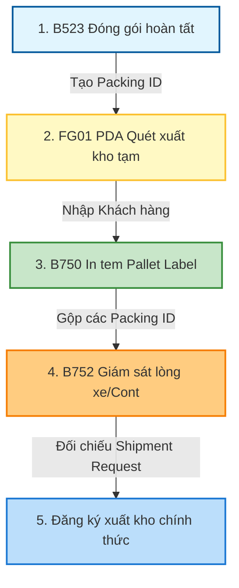

# 🏢 VINATECH_GROUP — Warehouse & Inventory Integration & DB Schema Mapping

> [!NOTE]
> **Tài liệu tham chiếu nghiệp vụ người dùng:**
> *   Xem hướng dẫn hiện trường kho thành phẩm và tra cứu mã kho tại: [GW_07_KHO_THANH_PHAM.md](file:///C:/Users/User%20Vinatech.DESKTOP-RJJSEQU/Desktop/GROUPWARE/GROUPWARE_KNOWLEDGE_BASE/GW_07_KHO_THANH_PHAM.md)
> *   Xem hướng dẫn luồng bán hàng và xuất khẩu tại: [GW_08_BAN_HANG.md](file:///C:/Users/User%20Vinatech.DESKTOP-RJJSEQU/Desktop/GROUPWARE/GROUPWARE_KNOWLEDGE_BASE/GW_08_BAN_HANG.md)

Tài liệu này đi sâu vào cấu trúc dữ liệu vật lý và cơ chế liên thông cơ sở dữ liệu của **Hệ thống Kho hàng & Quản lý tồn kho thành phẩm (Warehouse & Inventory Management)** giữa **MES (`SmartFactoryV2`)**, **Groupware (`VINATECH_GROUP`)** và **ERP (`NEOE`)**.

---

## 🗺️ 1. Quy Trình Vận Hành Hiện Trường Kho & Trạng Thái CSDL

Luồng vận chuyển vật lý từ công đoạn đóng gói thành phẩm đến bốc xếp lên Container được theo dõi chặt chẽ thông qua các mã vạch (Packing ID / Pallet ID) lưu trong cơ sở dữ liệu.



### ⚙️ Các Trạm Thao Tác Nghiệp Vụ Kho:
1.  **MES FG01 (Xuất kho tạm / trung chuyển):** Thủ kho quét mã thùng hàng **Packing ID** trên PDA để chuyển vị trí vật lý của hàng từ xưởng sản xuất sang khu vực kho trung chuyển. Hệ thống cập nhật cột vị trí kho hiện tại của thùng.
2.  **MES B750 (In tem Pallet):** Nhóm các thùng hàng Packing ID có cùng điểm đến/cùng khách hàng lên một Pallet bọc PE niêm phong. Hệ thống sinh mã **Pallet ID** (Parent Label) liên kết với danh sách các Packing ID (Child Labels).
3.  **MES B752 (Kiểm tra chi tiết bốc cont):** Giám sát lưới chi tiết danh sách Pallet thực xuất xếp vào lòng Container. Khi bốc xếp hoàn tất, hệ thống đối chiếu số lượng thực tế với phiếu duyệt **Shipment Request** trên Groupware.

---

## 🗄️ 2. Bảng Tra Cứu Mã Kho Việt Nam (Warehouse Code Master List)

Dưới đây là danh mục mã kho tiêu chuẩn được cấu hình thống nhất trên ERP và MES để hạch toán xuất-nhập tồn kho:

| Mã Kho (Warehouse Code) | Công ty | Nhà máy (Work Center) | Tên Kho Tiếng Việt | Vai Trò & Nghiệp Vụ |
| :--- | :--- | :--- | :--- | :--- |
| **ROH_VN_WH** | VVT | VVT_F1 | Kho nguyên vật liệu Bắc Ninh | Kho NVL chính nhà máy Bắc Ninh (F1) *(⚠️ Lỗi dịch trong Excel gốc)* |
| **ROH_BG_WH** | VVT | VVT_F2 | Kho nguyên vật liệu Bắc Giang | Kho NVL chính nhà máy Bắc Giang (F2) *(⚠️ Lỗi dịch trong Excel gốc)* |
| **PROD_VN_WH** | VVT | VVT_F1 | Kho thành phẩm Bắc Ninh | Kho lưu trữ thành phẩm chính F1 (Bắc Ninh) |
| **PROD_BG_WH** | VVT | VVT_F2 | Kho thành phẩm Bắc Giang | Kho lưu trữ thành phẩm chính F2 (Bắc Giang) |
| **MODULE_VN_WH** | VVT | VVT_F1 | Kho nguyên liệu hàng module BN | Kho vật tư chuyên biệt cho Module F1 |
| **MODULE_BG_WH** | VVT | VVT_F2 | Kho nguyên liệu hàng module BG | Kho vật tư chuyên biệt cho Module F2 |
| **HOLDING_VN_WH** | VVT | VVT_F1 | Kho NVL chờ xử lý Bắc Ninh | Kho chờ kiểm tra chất lượng (Hold IQC) F1 |
| **HOLDING_BG_WH** | VVT | VVT_F2 | Kho NVL chờ xử lý Bắc Giang | Kho chờ kiểm tra chất lượng (Hold IQC) F2 |
| **NG_RAW_VN_WH** | VVT | VVT_F1 | Kho nguyên liệu bị NG Bắc Ninh | Kho hàng lỗi hỏng chờ trả Vendor F1 |
| **NG_RAW_BG_WH** | VVT | VVT_F2 | Kho nguyên liệu bị NG Bắc Giang | Kho hàng lỗi hỏng chờ trả Vendor F2 |
| **NOI_DIA_VN** / **BG** | VVT | F1 / F2 | Xuất trả NCC trong nước | Kho trung chuyển trả hàng nội địa |
| **NUOC_NGOAI_VN** / **BG** | VVT | F1 / F2 | Xuất trả NCC nước ngoài | Kho trung chuyển trả hàng nhập khẩu |
| **ROUTE_VN_WH** / **BG_WH** | VVT | F1 / F2 | Sản xuất Bắc Ninh / Bắc Giang | Kho công đoạn ảo (WIP - Work in Progress) |
| **W27** | VVT | VVT_F3 | Kho Vina Enersol | Kho nhà máy F3 (Hà Nam) |

> ⚠️ **Chú ý sửa lỗi dịch thuật hệ thống:**
> Trong file Excel cấu hình gốc, tên tiếng Việt của **ROH_BG_WH** bị ghi nhầm thành "Bắc Ninh", và **ROH_VN_WH** bị ghi nhầm thành "Bắc Giang". Khi làm việc với CSDL, lập trình viên và thủ kho cần tuân thủ đúng quy tắc tiền tố: **VN = Bắc Ninh (F1)** và **BG = Bắc Giang (F2)**.

---

## 🔍 3. Hướng Dẫn Truy Vấn & Kiểm Tra (Golden Audit Queries)

Dưới đây là các câu truy vấn SQL mẫu (SELECT-ONLY) dùng để đối chiếu thông tin tồn kho và quét mã vạch hiện trường trên MES.

### Mẫu 3.1: Kiểm tra tồn kho thành phẩm thực tế tại các kho chính (ROH/PROD)
```sql
SELECT 
    ML.WarehouseCode AS [WH Code],
    MM.MaterialName AS [Item Name],
    ML.MaterialCode AS [Item Code],
    COUNT(DISTINCT ML.MaterialLotNo) AS [Total Box Count],
    SUM(ML.CurrentQty) AS [Total Qty in WH]
FROM SmartFactoryV2.dbo.STB_MaterialLotInfo ML WITH(NOLOCK)
INNER JOIN SmartFactoryV2.dbo.STB_MaterialMaster MM WITH(NOLOCK) 
    ON ML.MaterialCode = MM.MaterialCode
WHERE ML.WarehouseCode IN ('PROD_VN_WH', 'PROD_BG_WH', 'ROH_VN_WH', 'ROH_BG_WH')
  AND ML.CurrentQty > 0
GROUP BY ML.WarehouseCode, ML.MaterialCode, MM.MaterialName
ORDER BY ML.WarehouseCode, [Total Qty in WH] DESC;
```

### Mẫu 3.2: Tra cứu lịch sử quét thùng hàng Packing ID trên màn hình FG01
```sql
SELECT 
    SI.ControlNo AS [Control No],
    SI.Barcode AS [Packing ID / Box No],
    SI.MaterialCode AS [Product Code],
    SI.ProdQty AS [Quantity],
    SI.WarehouseCode AS [Current WH],
    -- Lịch sử quét hiện trường
    PRH.RouteCode AS [Scan Station], -- 'FG01' đại diện cho trạm xuất kho tạm
    PRH.CreateUserID AS [Operator ID],
    PRH.CreateDateTime AS [Scan Timestamp]
FROM SmartFactoryV2.dbo.STB_SetInfo SI WITH(NOLOCK)
INNER JOIN SmartFactoryV2.dbo.STB_ProdRouteHist PRH WITH(NOLOCK) 
    ON SI.ControlNo = PRH.ControlNo
WHERE PRH.RouteCode = 'FG01' 
  AND SI.Barcode = 'MÃ_PACKING_ID_CẦN_TRA'
ORDER BY PRH.CreateDateTime DESC;
```

### Mẫu 3.3: Tra cứu danh sách Packing ID gộp trong một Pallet Label (B750)
```sql
SELECT 
    Parent.Barcode AS [Pallet ID],
    Child.Barcode AS [Packing ID / Box No],
    Child.MaterialCode AS [Item Code],
    Child.ProdQty AS [Box Qty],
    Parent.CreateDateTime AS [Pallet Created Date]
FROM SmartFactoryV2.dbo.STB_SetInfo Parent WITH(NOLOCK)
-- Tự JOIN lại bảng để tìm các thùng con trong cùng một Pallet
INNER JOIN SmartFactoryV2.dbo.STB_SetInfo Child WITH(NOLOCK) 
    ON Parent.ControlNo = Child.ParentControlNo
WHERE Parent.Barcode = 'MÃ_PALLET_ID_B750_CẦN_TRA'
ORDER BY Child.Barcode ASC;
```

### Mẫu 3.4: Đối chiếu số lượng xuất thực tế trên xe (B752) so với Lệnh xuất kho (Deliver Out) trên Groupware
```sql
SELECT 
    GW.DAY_PLAN_NO AS [GW Deliver Order No],
    GW.WORK_DATE AS [Scheduled Date],
    GW.PLAN_QTY AS [Requested Qty],
    -- Thống kê quét thực tế từ MES B752
    COUNT(DISTINCT SI.Barcode) AS [Actual Pallets Loaded],
    SUM(SI.ProdQty) AS [Actual Qty Loaded]
FROM VINATECH_GROUP.dbo.VINA_DOCUMENT_DAILY_PRODUCTION_ORDER GW WITH(NOLOCK)
LEFT JOIN SmartFactoryV2.dbo.STB_SetInfo SI WITH(NOLOCK) 
    ON GW.DAY_PLAN_NO = SI.PONo AND SI.WarehouseCode LIKE '%PROD%'
WHERE GW.DAY_PLAN_NO = 'MÃ_YÊU_CẦU_XUẤT_KHO_GW'
GROUP BY GW.DAY_PLAN_NO, GW.WORK_DATE, GW.PLAN_QTY;
```

---

*Tài liệu được biên soạn phục vụ cho Kỹ sư Vận hành và Lập trình viên hệ thống Vinatech.*
