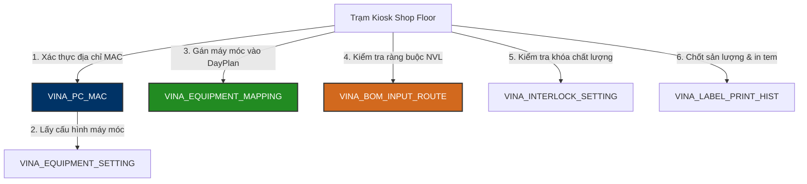

# 🖥️ VINATECH_POP — Point Of Production Database Knowledge Base

> **Máy chủ:** `dbserver.hycap.co.kr,5398` | **CSDL:** `VINATECH_POP`  
> **Quy mô thực tế:** **66 Bảng (Tables)**, **25 Khóa ngoại (FKs)**  
> **Vai trò:** Cơ sở dữ liệu vận hành đầu cuối dành riêng cho trạm máy tính Kiosk cảm ứng, thu thập dữ liệu PLC máy móc, ràng buộc quét nguyên vật liệu và quản lý khóa liên động (Interlock) dưới nhà xưởng.

---

## 🗺️ 1. Kiến Trúc Vận Hành POP Kiosk & Thu Thập Thiết Bị



---

## 🗄️ 2. Danh Mục 66 Bảng Toàn Diện Phân Theo 5 Khối Chức Năng

### Khối 1: Định Danh & Cấu Hình Trạm Kiosk (Hardware & Security)
1. `VINA_PC_MAC`: Ánh xạ địa chỉ MAC card mạng vật lý của PC trạm xưởng với ID cấu hình thiết bị và phiên bản phần mềm.
2. `VINA_ALLOWED_IP`: Whitelist các địa chỉ IP được phép kết nối dịch vụ POP Web API.
3. `VINA_COOKIE_NAME`: Quản lý Cookie và Token phiên làm việc của trạm.
4. `VINA_KIOSK_SESSION`: Quản lý phiên làm việc active của từng máy Kiosk.
5. `VINA_KIOSK_LOG`: Nhật ký các sự kiện phần cứng, quét mã, đăng nhập và cảnh báo lỗi tại trạm.
6. `VINA_KIOSK_FACTORY_CONFIG`: Cấu hình nhà máy (Hà Nam / Hưng Yên) cho từng Kiosk.
7. `VINA_SYSTEM_VERSION`: Quản lý phiên bản phần mềm client và tự động kích hoạt nâng cấp.

### Khối 2: Kết Nối PLC & Tham Số Máy Móc (Equipment & Automation)
8. `VINA_EQUIPMENT_SETTING`: Thông số kết nối, đường dẫn log file máy, biểu thức regex lọc tên file, chu kỳ quét và ngưỡng nhiệt độ.
9. `VINA_EQUIPMENT_MAPPING`: Quản lý trạng thái gán máy móc cho Kế hoạch sản xuất ngày của MES (`ACTIVE` vs `RELEASED`).
10. `VINA_EQUIPMENT_REMAINDER`: Theo dõi số lượng vật tư/bán thành phẩm còn dư trên máy móc.
11. `VINA_PLC_BASELINE`: Đường cơ sở (Baseline) cấu hình thông số chuẩn của PLC.
12. `VINA_LINE_PROD_MODE`: Quản lý chế độ sản xuất của Line (`Normal` hay `Rework`).
13. `VINA_ASSEMBLY_GROUP_MODE`: Chế độ vận hành gom nhóm công đoạn lắp ráp.

### Khối 3: Kiểm Soát Quét Nguyên Vật Liệu & Phân Tuyến (Material Interlock)
14. `VINA_BOM_INPUT_ROUTE`: Bảng ma trận ràng buộc công đoạn bắt buộc quét mã NVL phụ tương ứng theo BOM.
15. `VINA_GROUP_INPUT_ROUTE`: Định tuyến quét nhóm nguyên vật liệu phụ.
16. `VINA_MATERIAL_INPUT_HIST`: Lịch sử quét nạp NVL đầu công đoạn.
17. `VINA_MATERIAL_ROUTE_MAP`: Bản đồ liên kết mã vật tư với quy trình công đoạn.
18. `VINA_WIP_STOCK_HIST`: Lịch sử biến động bán thành phẩm (WIP) tại các trạm Kiosk.

### Khối 4: Khóa Liên Động Chất Lượng & Phán Định (Quality Interlocks)
19. `VINA_INTERLOCK_SETTING`: Thiết lập các chốt khóa chặn lỗi (ví dụ: công đoạn trước lỗi thì cấm chốt công đoạn sau).
20. `VINA_INTERLOCK_RELEASE_LOG`: Nhật ký mở khóa liên động khi có phê duyệt từ Quản đốc hoặc Kỹ sư chất lượng.
21. `VINA_BLOOM_JUDGE_POLICY`: Chính sách và tiêu chí phán định chất lượng Bloom.
22. `VINA_QC_DECISION_HIST`: Lịch sử các quyết định phán định chất lượng của QC tại trạm.
23. `VINA_REOPEN_REQUEST`: Yêu cầu xin mở lại công đoạn đã chốt hoàn thành trên Kiosk.
24. `VINA_REOPEN_POLICY`: Quy tắc và điều kiện cho phép mở lại công đoạn.
25. `VINA_OQC_SAMPLE_RULE`: Quy tắc lấy mẫu kiểm tra xuất xưởng OQC.
26. `VINA_FOQC_ITEM_RULE`: Quy tắc kiểm tra chất lượng FOQC.

### Khối 5: Đóng Gói, Tem Nhãn & Bảng Tin Xưởng (Packing & Communications)
27. `VINA_PACKING_REMAIN_QTY`: Số lượng còn dư lại khi đóng gói thùng/hộp chưa đủ số lượng chuẩn.
28. `VINA_LABEL_INFO`: Định dạng và tham số in tem nhãn nội bộ tại trạm Kiosk.
29. `VINA_LABEL_PARTNO`: Danh mục Part Number tương ứng với tem khách hàng.
30. `VINA_LABEL_PRINT_HIST`: Lịch sử in từng con tem nhãn tại xưởng (thời gian, người in, số lượng).
31. `VINA_CUSTOM_LABEL`: Cấu hình tem nhãn tùy biến theo yêu cầu của đối tác (Sanmina, v.v.).
32. `VINA_BBS_CONTENT` / `_COMMENT`: Bản tin thông báo kỹ thuật hiển thị trực tiếp trên Kiosk cho công nhân.

---

## 🛠️ 3. Tra Cứu POP Nhanh Bằng CLI Hub `.\db.ps1`
```powershell
# Xem toàn bộ cấu trúc bảng phần cứng Kiosk MAC
.\db.ps1 schema -Profile POP -Table VINA_PC_MAC

# Xem cấu hình máy móc và biểu thức regex lọc log file PLC
.\db.ps1 query -Profile POP "SELECT TOP 5 EQUIPMENT_SETTING_ID, EQUIPMENT_SETTING_NAME, EQUIPMENT_SETTING_FILENAME_DATA_PATTERN, EQUIPMENT_SETTING_DATA_COLLECTION_TIME FROM VINA_EQUIPMENT_SETTING WITH(NOLOCK)"

# Kiểm tra các máy móc đang bị gán (Lock) vào DayPlan
.\db.ps1 query -Profile POP "SELECT DAY_PLAN_NO, LINE_CODE, EQUIPMENT_ID, MAPPING_STATUS, MAPPED_AT FROM VINA_EQUIPMENT_MAPPING WITH(NOLOCK) WHERE MAPPING_STATUS = 'ACTIVE'"
```
