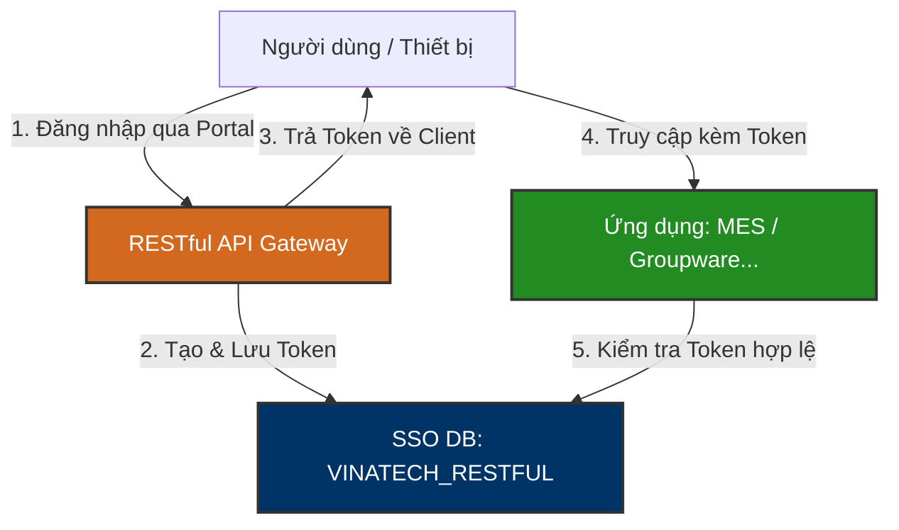

# 🔑 VINATECH_RESTFUL — Single Sign-On (SSO) Database Knowledge Base

`VINATECH_RESTFUL` là cơ sở dữ liệu chuyên trách quản lý dịch vụ **Single Sign-On (SSO - Đăng nhập một lần)** và các Token bảo mật của RESTful API phục vụ cho các ứng dụng nội bộ tại Vinatech (Web Groupware, Kiosk POP, Mobile App, MES Web Portal). Cơ sở dữ liệu này đảm bảo người dùng chỉ cần đăng nhập một lần duy nhất tại cổng chính và có thể truy cập an toàn sang các phân hệ khác mà không phải xác thực lại.

---

## 🗺️ 1. Nguyên Lý SSO & Phân Quyền Kết Nối

### ⚙️ Các Chức Năng Chính:
1.  **Cấp phát và Quản lý Token (SSO Token Management):** Lưu trữ mã Access Token (`SSO_TOKEN_CODE`) và Refresh Token (`SSO_REFRESH_TOKEN`) cấp cho phiên làm việc của người dùng, giới hạn theo địa chỉ IP của Client và loại thiết bị sử dụng (PC, Điện thoại di động...).
2.  **Lịch sử & Số lượng đăng nhập (Login Auditing):** Thống kê số lần đăng nhập trong ngày của từng nhân viên (`VINA_SSO_LOGIN`) giúp phát hiện các truy cập bất thường và thu thập dữ liệu tần suất sử dụng phần mềm.
3.  **Giới hạn truy cập API (IP Whitelisting):** Giới hạn các dải địa chỉ IP được phép gọi dịch vụ RESTful API bảo mật thông qua danh sách `VINA_ALLOWED_IP`.

---

## 🗄️ 2. Các Bảng Nghiệp Vụ Cốt Lõi

### 2.1 Quản Lý Token SSO: `VINA_SSO_TOKEN`
Bảng lưu trữ thông tin các chuỗi Token đang có hiệu lực trong hệ thống.

| Tên Cột | Kiểu Dữ Liệu | Nullable | Mô Tả |
| :--- | :--- | :--- | :--- |
| **SSO_TOKEN_CODE** (PK) | `varchar(400)` | NO | Mã Access Token cấp cho phiên làm việc (JWT hoặc chuỗi hash) |
| **SSO_REFRESH_TOKEN** | `varchar(400)` | NO | Mã Refresh Token dùng để gia hạn Access Token khi hết hạn |
| **ID_USER** | `nvarchar(50)` | YES | Tên đăng nhập của người dùng được cấp Token |
| **CD_COMPANY** | `nvarchar(7)` | YES | Mã pháp nhân công ty của người dùng (VVT, VNT...) |
| **SSO_TOKEN_KEY** | `varchar(300)` | YES | Khóa ký số / Khóa mã hóa của phiên làm việc |
| **SSO_TOKEN_CLIENT_IP** | `nvarchar(50)` | YES | Địa chỉ IP của thiết bị gửi yêu cầu cấp Token |
| **SSO_TOKEN_DIVICE** | `nvarchar(10)` | YES | Loại thiết bị kết nối (PC, Mobile, Kiosk...) |
| **SSO_TOKEN_REFRESH_DATE**| `datetime` | YES | Thời điểm Token được làm mới (Refresh) gần nhất |
| **SSO_TOKEN_REG_DATE** | `datetime` | YES | Thời điểm khởi tạo cấp phát Token gốc |

---

### 2.2 Thống Kê Phiên Đăng Nhập: `VINA_SSO_LOGIN`
Ghi nhận số lượng và trạng thái đăng nhập hàng ngày của từng tài khoản.

| Tên Cột | Kiểu Dữ Liệu | Nullable | Mô Tả |
| :--- | :--- | :--- | :--- |
| **ID_USER** (PK) | `nvarchar(50)` | NO | Tên đăng nhập của người dùng |
| **CD_COMPANY** (PK) | `nvarchar(7)` | NO | Mã công ty đăng nhập |
| **SSO_LOGIN_DATE** (PK) | `date` | NO | Ngày đăng nhập (YYYY-MM-DD) |
| **SSO_LOGIN_COUNT** | `int` | YES | Số lần đăng nhập tích lũy của tài khoản trong ngày |
| **SSO_LOGIN_REG_DATE** | `datetime` | NO | Thời điểm đăng nhập lần đầu tiên trong ngày |
| **SSO_LOGIN_MODIFY_DATE**| `datetime` | YES | Thời điểm cập nhật phiên đăng nhập gần nhất trong ngày |

---

### 2.3 Danh Sách IP Được Phép Kết Nối: `VINA_ALLOWED_IP`
Whitelists IP dành cho các API Gateway và Server tích hợp gọi chéo dịch vụ.

| Tên Cột | Kiểu Dữ Liệu | Nullable | Mô Tả |
| :--- | :--- | :--- | :--- |
| **ALLOWED_IP** (PK) | `varchar(50)` | NO | Địa chỉ IP hoặc dải IP được phép gọi API (ví dụ: `192.168.1.100`) |

---

## 📊 3. Danh Mục Toàn Bộ Bảng Trong CSDL `VINATECH_RESTFUL`

Hệ thống Single Sign-On sử dụng cấu trúc lưu trữ tối giản gồm đúng 3 bảng để đảm bảo thời gian phản hồi xác thực API ở mức mili-giây:

1.  `VINA_SSO_TOKEN`: Lưu trữ trạng thái phiên hoạt động (Access Token & Refresh Token) đang chạy.
2.  `VINA_SSO_LOGIN`: Ghi nhận nhật ký và tần suất đăng nhập hàng ngày theo tài khoản.
3.  `VINA_ALLOWED_IP`: Whitelist IP để bảo mật truy cập từ các server trung gian API.

---

*Tài liệu được biên soạn dựa trên phân tích trực tiếp cấu trúc CSDL thực tế tại máy chủ `dbserver.hycap.co.kr,5398`.*
