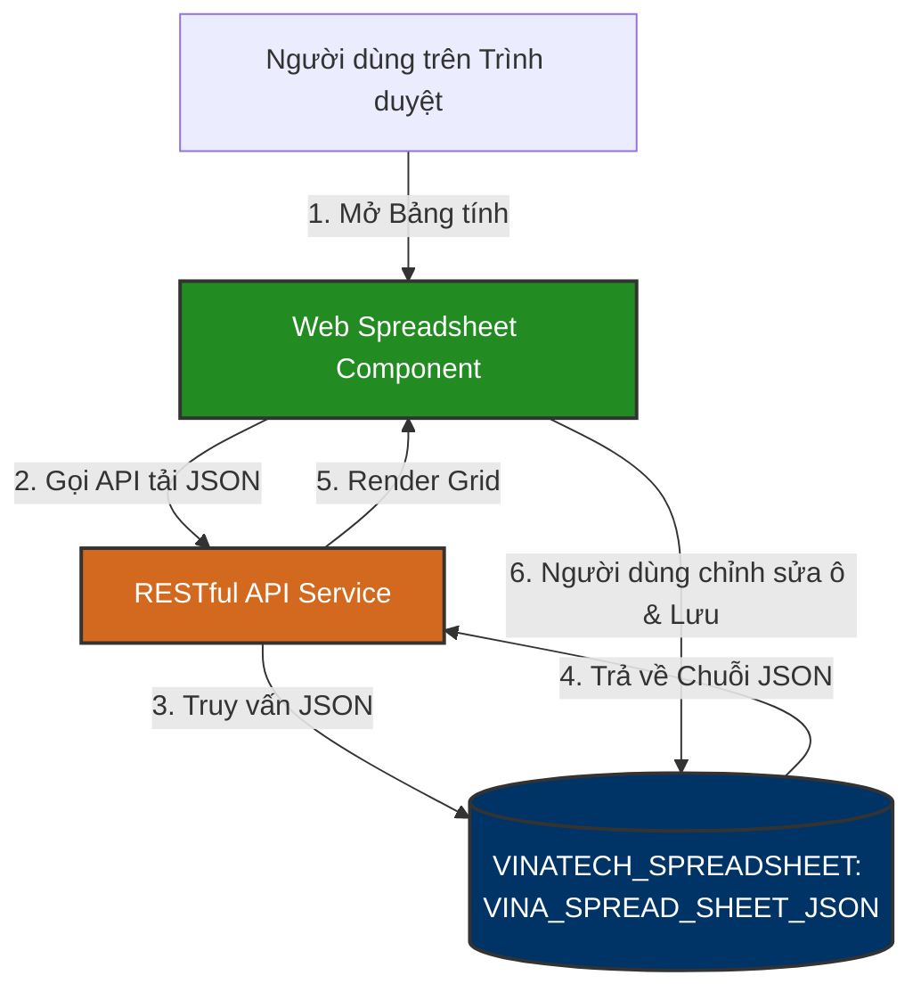

# 📊 VINATECH_SPREADSHEET — Web Spreadsheet Database Knowledge Base

`VINATECH_SPREADSHEET` là cơ sở dữ liệu chuyên biệt phục vụ cho tính năng **Bảng tính cộng tác trực tuyến (Collaborative Web Spreadsheet / Excel Online)** tích hợp trong cổng thông tin Groupware của Vinatech. Cơ sở dữ liệu này cho phép người dùng tạo, chia sẻ, phân quyền và chỉnh sửa chung các tài liệu dạng bảng tính (ví dụ: Kế hoạch sản xuất tuần, Theo dõi tiến độ công việc, Bảng tính toán chi phí...) trực tiếp trên trình duyệt mà không cần cài đặt phần mềm Microsoft Excel.

---

## 🗺️ 1. Nguyên Lý Lưu Trữ Bảng Tính Dưới Dạng JSON

Thay vì lưu trữ bảng tính thành các file nhị phân (`.xlsx`, `.xls`) cồng kềnh trên ổ đĩa, hệ thống lưu trữ toàn bộ dữ liệu ô (cell values), công thức (formulas), định dạng (styling, colors) và cấu trúc hàng/cột dưới dạng một chuỗi văn bản JSON khổng lồ (`nvarchar(max)`) trong cơ sở dữ liệu.

### ⚙️ Các Chức Năng Vận Hành Chính:
1.  **Quản lý File & Template (`VINA_SPREAD_SHEET`):** Lưu trữ thông tin metadata của bảng tính (tên file, kênh lưu trữ, liên kết với quy trình văn bản điện tử Groupware `DOCUMENT_TYPE_ID`).
2.  **Khóa cộng tác đồng thời (Concurrency Lock - `VINA_SPREAD_SHEET_OPEN`):** Theo dõi các tài khoản hiện tại đang mở bảng tính để thực hiện khóa ghi, tránh tình trạng hai người dùng ghi đè đè lên dữ liệu của nhau.
3.  **Phân quyền chi tiết (Granular Permission - `VINA_SPREAD_SHEET_PERMISSIONS`):** Kiểm soát quyền Đọc (Read), Ghi (Write), Phê duyệt (Approval), Xuất file Excel (`.xlsx`) hoặc xuất sang kho lưu trữ tập trung ECM.

---

## 🗄️ 2. Các Bảng Nghiệp Vụ Cốt Lõi

### 2.1 Metadata Bảng Tính: `VINA_SPREAD_SHEET`
Bảng lưu trữ thông tin chung của từng tệp bảng tính được khởi tạo.

| Tên Cột | Kiểu Dữ Liệu | Nullable | Mô Tả |
| :--- | :--- | :--- | :--- |
| **SPREAD_SHEET_CHANNEL** (PK) | `varchar(500)` | NO | ID duy nhất hoặc kênh định danh của bảng tính |
| **SPREAD_SHEET_FILE_NAME** | `nvarchar(500)`| YES | Tên tệp bảng tính hiển thị (ví dụ: `Ke_Hoach_San_Xuat.xlsx`) |
| **SPREAD_SHEET_TYPE_ID** | `varchar(50)` | YES | Phân loại danh mục bảng tính |
| **SPREAD_SHEET_NODE_ID** | `varchar(50)` | YES | Mã nút thư mục lưu trữ bảng tính |
| **DOCUMENT_TYPE_ID** | `varchar(50)` | YES | Mã loại tài liệu Groupware liên kết (nếu có) |
| **SPREAD_SHEET_ECM_OPEN** | `char(1)` | YES | Trạng thái tích hợp mở từ ECM (Y/N) |
| **SPREAD_SHEET_REG_DATE** | `datetime` | YES | Ngày tạo bảng tính |
| **SPREAD_SHEET_MODIFY_DATE**| `datetime` | YES | Ngày cập nhật bảng tính lần cuối |

---

### 2.2 Nội Dung Bảng Tính: `VINA_SPREAD_SHEET_JSON`
Bảng lưu trữ toàn bộ dữ liệu vật lý (nội dung ô, định dạng) của bảng tính.

| Tên Cột | Kiểu Dữ Liệu | Nullable | Mô Tả |
| :--- | :--- | :--- | :--- |
| **SPREAD_SHEET_CHANNEL** (PK)| `varchar(500)` | NO | Liên kết tới `VINA_SPREAD_SHEET` |
| **SPREAD_SHEET_JSON** | `nvarchar(max)`| YES | Chuỗi JSON chứa toàn bộ trạng thái grid ô, màu sắc, công thức |

---

### 2.3 Phân Quyền Bảng Tính: `VINA_SPREAD_SHEET_PERMISSIONS`
Bảng kiểm soát quyền thao tác trên từng bảng tính theo nhân viên.

| Tên Cột | Kiểu Dữ Liệu | Mô Tả |
| :--- | :--- | :--- |
| **NO_EMP** (PK/FK) | `nvarchar(10)` | Mã nhân viên được phân quyền |
| **CD_COMPANY** (PK/FK) | `nvarchar(7)` | Mã công ty của nhân viên |
| **SPREAD_SHEET_PERMISSIONS_READ** | `char(1)` | Quyền Đọc bảng tính (Y/N) |
| **SPREAD_SHEET_PERMISSIONS_WRITE**| `char(1)` | Quyền Chỉnh sửa ghi dữ liệu (Y/N) |
| **SPREAD_SHEET_PERMISSIONS_APPROVAL**| `char(1)` | Quyền Phê duyệt bảng tính (Y/N) |
| **SPREAD_SHEET_PERMISSIONS_EXPORT**| `char(1)` | Quyền Xuất ra file Excel nhị phân tải về (Y/N) |
| **SPREAD_SHEET_PERMISSIONS_ECM_EXPORT**| `char(1)` | Quyền Xuất bản lưu trữ vĩnh viễn lên ECM (Y/N) |

---

### 2.4 Quản Lý Phiên Mở Bảng Tính: `VINA_SPREAD_SHEET_OPEN`
Theo dõi các kết nối đang mở bảng tính để tránh xung đột ghi dữ liệu.

| Tên Cột | Kiểu Dữ Liệu | Mô Tả |
| :--- | :--- | :--- |
| **SPREAD_SHEET_CHANNEL** | `varchar(500)` | ID bảng tính đang được mở |
| **NO_EMP** / **CD_COMPANY** | `nvarchar(10)` / `(7)`| Mã nhân viên và công ty đang mở chỉnh sửa |
| **SPREAD_SHEET_OPEN_REG_DATE**| `datetime` | Thời điểm mở bảng tính |

---

## 📊 3. Danh Mục Toàn Bộ Bảng Trong CSDL `VINATECH_SPREADSHEET`

Cơ sở dữ liệu bảng tính tích hợp cấu trúc bao gồm các nhóm bảng sau:

1.  **Dữ liệu lõi:** `VINA_SPREAD_SHEET` (đăng ký file), `VINA_SPREAD_SHEET_JSON` (lưu trữ ô dữ liệu).
2.  **Cộng tác & Phiên làm việc:** `VINA_SPREAD_SHEET_OPEN` (khóa concurrency), `VINA_SPREAD_SHEET_HISTORY` (lịch sử các phiên bản thay đổi).
3.  **Phân quyền:** `VINA_SPREAD_SHEET_PERMISSIONS` (quản lý quyền Đọc/Ghi/Xuất/Duyệt).
4.  **Cấu hình hệ thống:** `VINA_SPREAD_SHEET_TYPE` (phân loại), `VINA_SPREAD_SHEET_USER` & `VINA_SPREAD_SHEET_USER_JSON` (cấu hình cá nhân hóa giao diện người dùng).
5.  **Bảng Framework kế thừa:** `VINA_MENU`, `VINA_MENU_PERMISSIONS`, `VINA_MODULE`, `VINA_STATIC_DATA` (phân quyền giao diện trang quản lý bảng tính).

---

*Tài liệu được biên soạn dựa trên phân tích trực tiếp cấu trúc CSDL thực tế tại máy chủ `dbserver.hycap.co.kr,5398`.*
