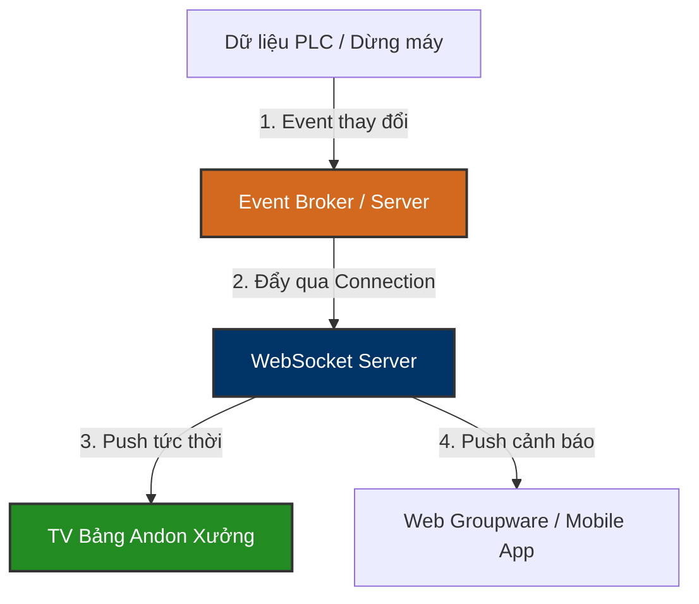

# 🔌 VINATECH_WEBSOCKET — WebSocket Server Database Knowledge Base

`VINATECH_WEBSOCKET` là cơ sở dữ liệu quản trị dành cho **Hệ thống truyền thông thời gian thực (WebSocket Server Gateway)** tại Vinatech. Hệ thống này đóng vai trò duy trì các kết nối song song liên tục (Persistent TCP Connections) giữa Server với các thiết bị đầu cuối dưới xưởng (Kiosk POP, Tivi bảng hiển thị Andon) và trình duyệt người dùng (Web Groupware) để cập nhật dữ liệu tức thời mà không cần reload trang.

---

## 🗺️ 1. Nguyên Lý Vận Hành & Vai Trò Thời Gian Thực

Trong kiến trúc hệ thống của Vinatech, truyền thông thời gian thực (Real-time Communication) cực kỳ quan trọng để đảm bảo tính tức thời trong sản xuất:

### ⚙️ Các Ứng Dụng Thực Tế Của WebSocket:
1.  **Cập nhật bảng Andon tức thời:** Khi trạng thái dây chuyền tại `AndonDB.dbo.STB_LineSituation_VVT` chuyển từ `0` (Running) sang `1` (Error), hệ thống phát tín hiệu qua WebSocket để TV Andon đổi màu sang đỏ lập tức (độ trễ dưới 1 giây).
2.  **Thông báo phê duyệt Groupware:** Khi có phiếu trình duyệt mới (ví dụ: PO mới cần duyệt), WebSocket đẩy thông báo (Toast Notification) trực tiếp lên góc màn hình trình duyệt của người phê duyệt.
3.  **Giám sát thiết bị trực quan (Live Machine Telemetry):** Đẩy dữ liệu đo đạc (nhiệt độ lò hấp, áp suất hơi...) từ trạm POP lên biểu đồ Dashboard giám sát thời gian thực của kỹ sư quy trình.

---

## 🗄️ 2. Vai Trò Của Cơ Sở Dữ Liệu `VINATECH_WEBSOCKET`

Cơ sở dữ liệu `VINATECH_WEBSOCKET` sử dụng cấu trúc Framework chuẩn của Vinatech (VINA Framework Admin Database). Nó không lưu trữ trực tiếp các kết nối socket tạm thời (các socket active được quản lý trực tiếp trên bộ nhớ RAM của WebSocket Server - ví dụ: Node.js socket.io hoặc ASP.NET SignalR). 

Thay vào đó, database này lưu trữ cấu hình quản trị hệ thống, quyền hạn truy cập của các module WebSocket dịch vụ:

| Tên Bảng | Vai trò nghiệp vụ | Mô tả chi tiết |
| :--- | :--- | :--- |
| `VINA_MODULE` | Danh mục Module | Khai báo các module dịch vụ WebSocket (ví dụ: `WS_ANDON` cho Andon, `WS_NOTICE` cho thông báo Groupware, `WS_TELEMETRY` cho PLC) |
| `VINA_MODULE_COMPANY` | Ánh xạ Công ty | Cấu hình giới hạn module WebSocket nào được phép chạy ở pháp nhân nào (VVT, VNT...) |
| `VINA_MENU` | Menu Quản trị | Quản lý cấu hình giao diện màn hình Admin điều khiển WebSocket Server |
| `VINA_MENU_PERMISSIONS` | Quyền hạn giao diện | Phân quyền cho admin kỹ thuật được phép bật/tắt, cấu hình hoặc xem monitor kết nối WebSocket |
| `VINA_STATIC_DATA` | Dữ liệu tĩnh | Lưu các tham số cấu hình tĩnh của WebSocket Server (Cổng kết nối, giới hạn Heartbeat/Ping-Pong timeout, Buffer size...) |

---

*Tài liệu được biên soạn dựa trên phân tích trực tiếp cấu trúc CSDL thực tế tại máy chủ `dbserver.hycap.co.kr,5398`.*
