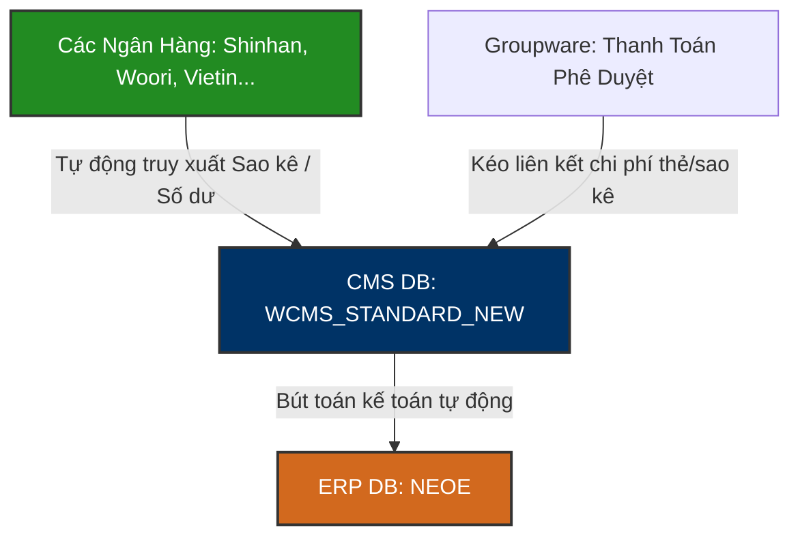

# 🏦 WCMS_STANDARD_NEW — Cash Management System Database Knowledge Base

`WCMS_STANDARD_NEW` là cơ sở dữ liệu chuyên biệt phục vụ cho hệ thống **Cash Management System (CMS)** (Web-CMS hoặc Win-CMS) tại Vinatech Việt Nam. Hệ thống này đóng vai trò tự động hóa kết nối và giao tiếp dữ liệu tài chính giữa các ngân hàng liên kết (ví dụ: Shinhan Bank, Woori Bank, VietinBank...) với phòng Kế toán doanh nghiệp và hệ thống **ERP Douzone (NEOE)**.

---

## 🗺️ 1. Tổng Quan Nghiệp Vụ & Vai Trò Hệ Thống

CMS là hạ tầng quản lý dòng tiền tập trung, giúp doanh nghiệp tự động hóa các nghiệp vụ kế toán ngân hàng thay vì xử lý thủ công trên từng trang ngân hàng điện tử (e-banking).

### ⚙️ Các Nghiệp Vụ Nghiệp Vụ Chính:
1.  **Quản lý Tài khoản & Số dư thực tế (Firm Banking Account):** Đồng bộ liên tục số dư (`WCMS_ACCOUNT`) và lịch sử số dư ngày (`WCMS_BALANCE_HISTORY`) từ tất cả các tài khoản ngân hàng của Vinatech mở tại Việt Nam và Hàn Quốc.
2.  **Lịch sử Giao dịch Ngân hàng (Account Statement Scraping):** Tự động cào sao kê chi tiết tiền vào/tiền ra (`WCMS_ACCOUNT_TRNX_LOG`) từ ngân hàng theo thời gian thực và tự động tạo bút toán nợ/có đồng bộ sang ERP (`NEOE`) bằng cơ chế check `ERP_FLAG`.
3.  **Quản lý Thẻ Doanh nghiệp (Corporate Cards Management):** Khai báo danh mục thẻ tín dụng công ty cấp cho các phòng ban/cá nhân sử dụng (`WCMS_CARD`), theo dõi chi tiết lịch sử chi tiêu quẹt thẻ (`WCMS_CARD_USE`), phục vụ đối chiếu hóa đơn trên Groupware khi làm tờ trình thanh toán (Expense Report).
4.  **Thanh toán Đối tác (Supplier Payments - B2B Banking):** Lưu trữ thông tin tài khoản ngân hàng của nhà cung cấp/đối tác (`WCMS_BIZ_PARTNER_ACCOUNT`) để thực hiện lệnh chuyển khoản thanh toán hàng loạt (Firm Banking Transfer) trực tiếp từ phần mềm.

---

## 🗄️ 2. Các Bảng Nghiệp Vụ Cốt Lõi

### 2.1 Lịch Sử Giao Dịch Tài Khoản: `WCMS_ACCOUNT_TRNX_LOG`
Bảng lớn nhất lưu trữ sao kê chi tiết từ các tài khoản ngân hàng.

| Tên Cột | Kiểu Dữ Liệu | Nullable | Mô Tả |
| :--- | :--- | :--- | :--- |
| **ACCOUNT_TRNX_LOG_UUID** (PK) | `nvarchar(40)` | NO | ID duy nhất của bản ghi giao dịch |
| **BANK_CODE** | `nvarchar(10)` | YES | Mã ngân hàng phát sinh giao dịch |
| **ACCOUNT_NO** | `nvarchar(100)`| YES | Số tài khoản phát sinh giao dịch |
| **TRNX_DATE** / **TRNX_TIME** | `nvarchar(8)` / `(6)` | YES | Ngày giao dịch (YYYYMMDD) và Giờ giao dịch (HHMMSS) |
| **CURRENCY** | `nvarchar(20)` | NO | Loại tiền tệ (VND, USD, KRW) |
| **IN_AMOUNT** / **OUT_AMOUNT**| `numeric` | YES | Số tiền ghi có (vào) / Số tiền ghi nợ (ra) |
| **BALANCE** | `numeric` | YES | Số dư tài khoản sau giao dịch |
| **BOOK_DESC** / **REMARK** | `nvarchar(50)` / `(100)`| YES | Nội dung diễn giải trên sao kê ngân hàng |
| **TRANS_FLAG** / **VERIFY_FLAG**| `nchar(1)` | YES | Trạng thái chuyển khoản / Trạng thái xác minh đối chiếu |
| **ERP_FLAG** | `nchar(1)` | YES | Trạng thái đồng bộ bút toán kế toán sang ERP (Y/N) |
| **ERP_TX_DATE** / **ERP_TX_MSG**| `nvarchar(8)` / `(200)`| YES | Ngày truyền tin và Thông báo kết quả phản hồi từ ERP |

---

### 2.2 Danh Mục Thẻ Doanh Nghiệp: `WCMS_CARD`
Lưu trữ thông tin cấu hình thẻ tín dụng/thẻ ghi nợ do công ty cấp cho cán bộ nhân viên.

| Tên Cột | Kiểu Dữ Liệu | Mô Tả |
| :--- | :--- | :--- |
| **CARD_UUID** (PK) | `nvarchar(40)` | ID duy nhất của thẻ |
| **CARD_NO** | `nvarchar(100)`| Số thẻ (được mã hóa/che bớt ký tự hiển thị) |
| **CARD_DEPT_UUID** / **USER_UUID**| `nvarchar(40)` | Bộ phận và Nhân sự được giao sử dụng thẻ |
| **CARD_PASSWORD** / **CVC_NO** | `nvarchar(100)`| Thông tin bảo mật thẻ (Mã hóa) |
| **SETTLE_ACCOUNT** / **BANK_CODE**| `nvarchar(100)` | Tài khoản ngân hàng và ngân hàng thanh toán nợ thẻ hàng tháng |
| **SETTLE_DAY** | `nvarchar(10)` | Ngày chốt nợ thẻ hàng tháng (ví dụ: ngày 25) |
| **ERP_CODE** | `nvarchar(20)` | Mã thẻ đồng bộ tương ứng trong danh mục thẻ ERP |
| **DELETE_FLAG** | `nchar(1)` | Trạng thái xóa thẻ (Y/N) |

---

### 2.3 Tài Khoản Ngân Hàng Đối Tác: `WCMS_BIZ_PARTNER_ACCOUNT`
Lưu danh sách tài khoản ngân hàng thụ hưởng của các nhà cung cấp/khách hàng để thực hiện Firm Banking.

| Tên Cột | Kiểu Dữ Liệu | Nullable | Mô Tả |
| :--- | :--- | :--- | :--- |
| **BIZ_PARTNER_UUID** (PK) | `nvarchar(40)` | NO | ID đối tác trong hệ thống (liên kết mã vendor ERP) |
| **BANK_CODE** (PK) | `nvarchar(10)` | NO | Mã ngân hàng thụ hưởng |
| **ACCOUNT_NO** | `nvarchar(100)`| YES | Số tài khoản thụ hưởng |
| **OWNER_NAME** | `nvarchar(50)` | YES | Tên chủ tài khoản thụ hưởng |
| **ACCOUNT_ALIAS_NAME** | `nvarchar(100)`| YES | Tên gợi nhớ/biệt danh tài khoản |
| **DELETE_FLAG** | `nchar(1)` | NO | Trạng thái xóa (Y/N) |

---

### 2.4 Lịch Sử Số Dư Ngày: `WCMS_BALANCE_HISTORY`
Ghi nhận số dư cuối ngày của tất cả các tài khoản ngân hàng để phục vụ báo cáo dòng tiền và kiểm tra chéo với số dư sổ cái ERP.

| Tên Cột | Kiểu Dữ Liệu | Mô Tả |
| :--- | :--- | :--- |
| **BALANCE_HISTORY_UUID** (PK) | `nvarchar(40)` | ID dòng lịch sử số dư |
| **ACCOUNT_UUID** | `nvarchar(40)` | ID liên kết tài khoản ngân hàng |
| **BALANCE** | `numeric` | Số dư tài khoản thực tế |
| **PAY_BALANCE** | `numeric` | Số dư khả dụng (sau khi trừ các lệnh treo) |
| **BALANCE_DATE** / **BALANCE_TIME**| `nvarchar(8)` / `(6)`| Ngày và Giờ ghi nhận số dư |
| **ERP_FLAG** | `nchar(1)` | Đồng bộ đối chiếu số dư với ERP (Y/N) |

---

## 📊 3. Danh Mục Các Bảng Quản Lý Cash Management (CMS)

| Phân hệ nghiệp vụ | Tên Bảng | Vai trò nghiệp vụ |
| :--- | :--- | :--- |
| **Quản lý Tài khoản** | `WCMS_ACCOUNT` | Danh mục tài khoản ngân hàng của Vinatech |
| | `WCMS_ACCOUNT_AUTH` | Phân quyền truy cập tài khoản cho nhân sự kế toán |
| | `WCMS_BALANCE_HISTORY` | Bảng ghi lịch sử biến động số dư theo ngày |
| | `WCMS_ACCOUNT_TRNX_LOG`| Sao kê chi tiết tiền vào/ra từ ngân hàng |
| **Quản lý Thẻ** | `WCMS_CARD` | Danh mục thẻ doanh nghiệp cấp phát cho nhân viên |
| | `WCMS_CARD_USE` | Lịch sử chi tiêu quẹt thẻ của nhân viên |
| | `WCMS_CARD_REQ` | Phiếu yêu cầu cấp thẻ mới |
| **Giao dịch đối tác** | `WCMS_BIZ_PARTNER` | Danh mục đối tác thanh toán |
| | `WCMS_BIZ_PARTNER_ACCOUNT`| Tài khoản ngân hàng thụ hưởng của đối tác |
| **Tích hợp & B2B** | `WCMS_B2B_LOAN_EXE` | Quản lý hạn mức vay và khế ước vay B2B |
| | `WCMS_B2B_PARTNER` | Đối tác tài trợ chuỗi cung ứng B2B ngân hàng |
| | `WCMS_CERT` / `_SERVER` | Chứng thư số / Token kết nối cổng bảo mật ngân hàng |
| **Hệ thống** | `WCMS_ALIMI_MESSAGE` | Thông báo / Alert tài chính qua KakaoWork/Zalo |
| | `WCMS_AUDIT_HISTORY` | Log kiểm toán thao tác tài chính của nhân viên trên CMS |

---

*Tài liệu được biên soạn dựa trên phân tích trực tiếp cấu trúc CSDL thực tế tại máy chủ `dbserver.hycap.co.kr,5398`.*
