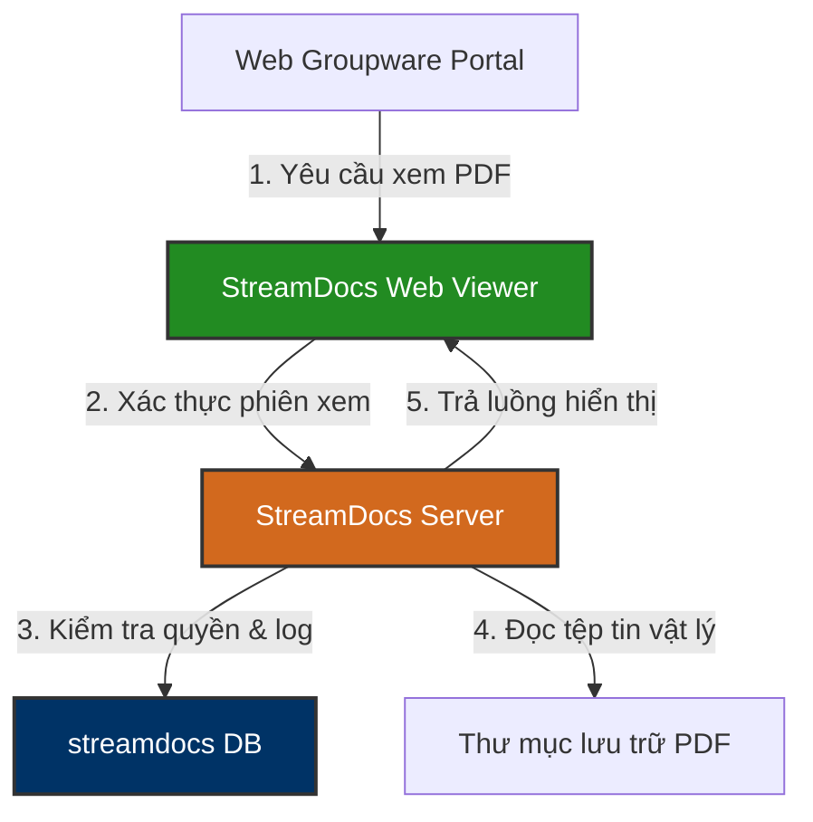

# 📄 streamdocs — StreamDocs PDF Server Database Knowledge Base

`streamdocs` là cơ sở dữ liệu chuyên dụng của công cụ **Forcs StreamDocs (PDF Viewer & E-Form Engine)** tích hợp trong hệ thống Groupware của Vinatech. Database này quản lý thông tin siêu dữ liệu (metadata) của các tài liệu PDF đính kèm, phân quyền xem tài liệu, nhật ký đọc tài liệu của người dùng và các cấu hình kết nối, bảo mật tệp tin.

---

## 🗺️ 1. Nguyên Lý Vận Hành & Vai Trò Trong Groupware

Khi người dùng nhấn xem trước (preview) một tệp tin đính kèm dạng PDF hoặc xem một tờ trình phê duyệt điện tử trên Groupware, trình duyệt sẽ không tải tệp PDF về máy tính của người dùng. Thay vào đó, máy chủ StreamDocs Server sẽ phân giải tệp tin PDF thành các dòng dữ liệu luồng (stream data) hiển thị trực tiếp trên trình xem web (Web Viewer) của Groupware để bảo mật dữ liệu.

### ⚙️ Các Chức Năng Vận Hành Chính:
1.  **Quản lý Tài nguyên Tài liệu (`pdf_resource` / `pdf_resource_owner`):** Lưu trữ định danh (hash), đường dẫn vật lý, kích thước và chủ sở hữu của tệp tin PDF đã tải lên máy chủ.
2.  **Xác thực & Bảo mật Truy cập (`pdf_auth` / `pdf_open_limit_info`):** Kiểm soát khóa phiên (session key) được cấp phép để mở tài liệu, giới hạn số lần mở và thời gian hết hạn của đường link xem thử.
3.  **Nhật ký Xem Tài liệu (`sd_document_usage_history`):** Ghi chép chi tiết thời điểm xem tài liệu, IP truy cập và tài khoản người dùng đã xem PDF (Audit Trail cho tài liệu bảo mật nội bộ).
4.  **Bảo trì Định kỳ (`sd_cron_schedule` / `pdf_orphan_resource`):** Quét dọn tự động các tệp tin mồ côi (orphan files) đã bị xóa liên kết trên Groupware để giải phóng dung lượng đĩa cứng.

---

## 🗄️ 2. Các Bảng Nghiệp Vụ Cốt Lõi

| Phân hệ chức năng | Tên Bảng | Vai trò nghiệp vụ | Mô tả chi tiết |
| :--- | :--- | :--- | :--- |
| **Quản lý Tài nguyên** | `pdf_resource` | Lưu trữ file PDF | Chứa thông tin kích thước, đường dẫn đĩa cứng, mã MD5 hash của file |
| | `pdf_resource_owner` | Chủ sở hữu tài liệu | Liên kết file PDF với ID người dùng hoặc ID biểu mẫu duyệt trên Groupware |
| | `pdf_orphan_resource` | File mồ côi | Lưu các tệp tin PDF đã mất liên kết để hàng tuần dọn dẹp vật lý trên ổ đĩa |
| **Bảo mật & Quyền** | `pdf_auth` | Quyền xem tài liệu | Quản lý mã phiên token được phép render dữ liệu PDF lên Web Viewer |
| | `pdf_open_limit_info` | Giới hạn mở tệp | Cấu hình giới hạn số lần được phép xem hoặc thời gian hết hiệu lực của link xem thử |
| **Nhật ký & Thống kê** | `sd_document_usage_history`| Log đọc tài liệu | Ghi nhận tài khoản, IP, thời gian và ID tài liệu đã được mở xem |
| | `sd_system_usage_statistics`| Thống kê hệ thống | Thống kê hiệu năng sử dụng của StreamDocs Server |
| | `sd_error_statistics` | Lịch sử lỗi | Ghi nhận các lỗi phát sinh trong quá trình biên dịch/render file PDF |
| **Cấu hình & Task** | `sd_config` | Cấu hình hệ thống | Lưu trữ thông số cài đặt hệ thống của StreamDocs Server |
| | `sd_cron_schedule` | Lịch trình dọn dẹp | Thiết lập lịch tự động dọn dẹp tài liệu tạm, cache và log hệ thống |
| | `calculation_script` | Script tính toán | Kịch bản tính toán trường thông tin trên các mẫu E-Form |
| | `Dejavu` | Font chữ hệ thống | Quản lý font chữ hỗ trợ hiển thị tệp PDF đa ngôn ngữ |

---

*Tài liệu được biên soạn dựa trên cấu trúc CSDL thực tế tại máy chủ `dbserver.hycap.co.kr,5398`.*
