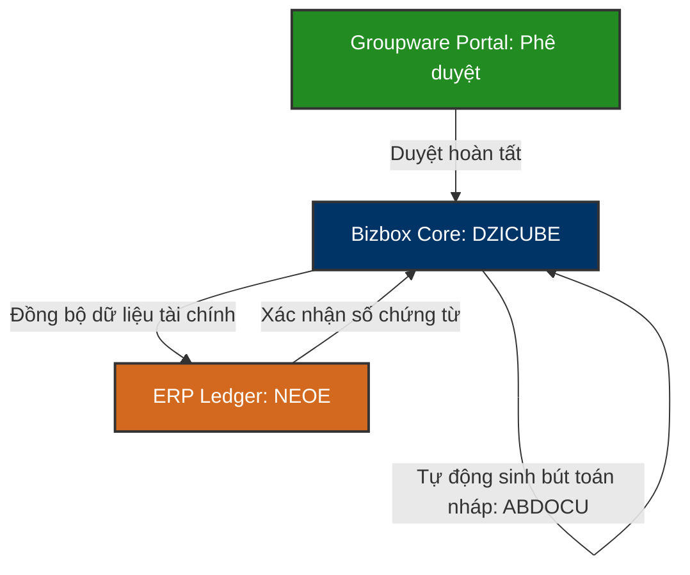

# 📦 DZICUBE — Douzone Bizbox Groupware & Accounting Integration Database

`DZICUBE` là cơ sở dữ liệu cốt lõi của hệ thống **Douzone Bizbox Alpha (더존 비즈박스 알파)**. Đây là giải pháp phần mềm quản trị văn phòng (Groupware) và kết nối kế toán doanh nghiệp được phát triển bởi hãng công nghệ Douzone Hàn Quốc, được Vinatech sử dụng làm hạ tầng kết nối phê duyệt tài chính, hạch toán kế toán tự động với hệ thống **ERP Douzone (NEOE)**.

---

## 🗺️ 1. Nguyên Lý Tích Hợp Kế Toán Tự Động (Groupware ↔ ERP)

Khi một biểu mẫu duyệt tài chính hoặc chi phí (như Yêu cầu thanh toán - Purchase Resolution) được duyệt hoàn tất trên Groupware, hệ thống Bizbox (DZICUBE) sẽ tự động sinh các bút toán nợ/có (accounting slips) nháp và lưu vào các bảng trung gian của `DZICUBE` trước khi đồng bộ chính thức vào Sổ cái kế toán của ERP (`NEOE`).

### ⚙️ Các Phân Hệ Nghiệp Vụ Chính Trong `DZICUBE`:
1.  **Quản lý Chứng từ Kế toán (`ABDOCU` / `ABDOCU_D`):** Lưu trữ thông tin chi tiết các bút toán, tài khoản đối ứng (nợ/có), mã trung tâm chi phí (Cost Center) phát sinh từ các luồng thanh toán được phê duyệt.
2.  **Quản lý Tài sản cố định (`ABASSET`):** Theo dõi danh mục, nguyên giá, khấu hao lũy kế và phòng ban quản lý tài sản cố định của doanh nghiệp.
3.  **Tích hợp Ngân hàng & Thẻ (`ABANK_CMS` / `ABANK_USECARD`):** Đối chiếu dữ liệu sao kê ngân hàng và chi tiêu thẻ doanh nghiệp phục vụ cho việc tự động hạch toán kế toán.
4.  **Quản lý Hóa đơn Thuế (`A_TAXBILL`):** Lưu trữ hóa đơn tài chính điện tử (VAT Tax Invoices) nhận được từ nhà cung cấp hoặc phát hành cho khách hàng.

---

## 🗄️ 2. Các Bảng Nghiệp Vụ Cốt Lõi

### 2.1 Chứng Từ Kế Toán Nháp: `ABDOCU` / `ABDOCU_D`
Lưu trữ thông tin đầu phiếu (Header) và định khoản chi tiết (Line Detail) của chứng từ kế toán trước khi chuyển sang ERP.

| Tên Bảng | Tên Cột Chính | Mô tả |
| :--- | :--- | :--- |
| **ABDOCU** (Header) | `NO_DOCU` (PK) | Số chứng từ kế toán nháp |
| | `DT_DOCU` | Ngày lập chứng từ |
| | `CD_COMPANY` | Mã pháp nhân công ty (VVT, VNT...) |
| | `ID_WRITE` | Nhân viên hạch toán/lập phiếu |
| | `AM_DOCU` | Tổng số tiền hạch toán của chứng từ |
| **ABDOCU_D** (Line Detail) | `NO_DOCU` (PK/FK) | Liên kết tới `ABDOCU` |
| | `NO_DOLINE` (PK) | Số dòng chi tiết định khoản |
| | `CD_ACCT` | Mã tài khoản kế toán (ví dụ: tiền mặt, phải trả người bán) |
| | `AM_DR` / `AM_CR` | Số tiền phát sinh Nợ / Số tiền phát sinh Có |
| | `CD_PARTNER` | Mã đối tác (nhà cung cấp / khách hàng) liên quan |
| | `CD_CC` | Mã trung tâm chi phí (Cost Center) chịu phí |

---

### 2.2 Tài Sản Cố Định: `ABASSET`
Theo dõi các tài sản cố định trong nhà máy và văn phòng.

| Tên Cột | Mô Tả |
| :--- | :--- |
| **CD_ASSET** (PK) | Mã tài sản cố định |
| **NM_ASSET** | Tên tài sản cố định |
| **DT_ACQ** | Ngày mua/bắt đầu đưa vào sử dụng |
| **AM_ACQ** | Nguyên giá mua tài sản |
| **CD_DEPT** | Mã phòng ban quản lý và sử dụng tài sản |
| **CD_SL** | Mã vị trí kho/vị trí vật lý đặt tài sản |

---

### 2.3 Quản Lý Hóa Đơn Thuế: `A_TAXBILL`
Quản lý trạng thái và dữ liệu hóa đơn giá trị gia tăng (VAT).

| Tên Cột | Mô Tả |
| :--- | :--- |
| **NO_TAX** (PK) | Số hóa đơn thuế GTGT |
| **DT_WRITE** | Ngày lập hóa đơn |
| **CD_PARTNER** | Mã đối tác xuất hóa đơn |
| **AM_SUPPLY** | Tiền hàng trước thuế |
| **AM_VAT** | Tiền thuế VAT |
| **FG_TAX** | Loại hình thuế suất áp dụng |

---

## 📊 3. Danh Mục Các Bảng Quản Trị Hệ Thống `DZICUBE`

Vì là giải pháp phần mềm đóng gói (commercial off-the-shelf software) của Douzone, `DZICUBE` có số lượng bảng cực kỳ lớn (hơn 3300 bảng) được chia theo các nhóm tiền tố tiêu chuẩn:

1.  **Tiền tố `A_` (Accounting Master):** Danh mục tài khoản kế toán, cấu hình hóa đơn thuế GTGT (`A_TAXBILL`).
2.  **Tiền tố `AB_` (Accounting Basic/Asset):** Quản lý định mức lương (`AB_PAYLIST`), phân quyền cấp bậc phê duyệt tài chính (`AB_MGTLEVEL`) và tài sản cố định (`ABASSET`).
3.  **Tiền tố `ABANK_` (Banking Link):** Tích hợp ngân hàng điện tử (`ABANK_CMS`), thẻ doanh nghiệp (`ABANK_USECARD`) và chuyển khoản B2B.
4.  **Tiền tố `ABDOCU_` (Journal Document):** Các nghiệp vụ liên quan đến hạch toán chứng từ kế toán, sổ chi tiết định khoản (`ABDOCU_D`) và kết nối dữ liệu thô sang ERP NEOE.

---

*Tài liệu được biên soạn dựa trên phân tích cấu trúc CSDL tiêu chuẩn của Douzone Bizbox Alpha tích hợp trên máy chủ `dbserver.hycap.co.kr,5398`.*
