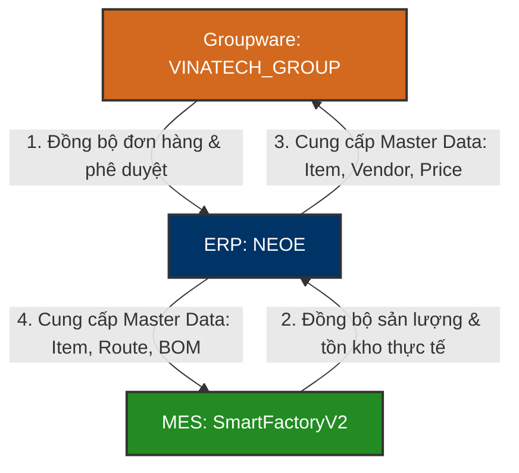

# 🏢 NEOE — Douzone ERP iU Enterprise Database Knowledge Base

`NEOE` là cơ sở dữ liệu cốt lõi và quan trọng nhất của hệ thống **ERP Douzone iU (더존 ERP iU)** tại Vinatech Việt Nam. Hệ thống ERP đóng vai trò là "Sổ cái trung tâm" lưu trữ toàn bộ dữ liệu tài chính, kế toán doanh nghiệp, kế hoạch mua sắm (PO), kế hoạch bán hàng (Suju), định mức sản xuất (BOM) và thông tin đối tác/vật tư toàn diện của pháp nhân Vinatech.

---

## 🗺️ 1. Nguyên Lý Tích Hợp Lõi (ERP ↔ Groupware ↔ MES)

Hệ thống ERP NEOE đóng vai trò làm điểm hội tụ dữ liệu tài chính cuối cùng, ghi nhận tất cả kết quả giao dịch từ xưởng sản xuất (MES) và các phê duyệt trực tuyến (Groupware).

### ⚙️ Các Nghiệp Vụ Tích Hợp Lõi:
1.  **Quản lý Master Data tập trung:** ERP là nguồn lưu trữ gốc (Single Source of Truth) cho danh mục vật tư (`MA_ITEM`), đối tác/nhà cung cấp (`MA_PARTNER`), cấu hình kho lưu trữ (`MA_SL`) và sơ đồ phòng ban/nhân viên (`MA_DEPT`, `MA_EMP`). Toàn bộ dữ liệu này được đồng bộ định kỳ sang Groupware và MES.
2.  **Hạch toán dòng tiền và thanh toán (Procure-to-Pay):** Khi chứng từ nhập kho chính thức được phê duyệt trên Groupware, dữ liệu sẽ được đẩy sang ERP để tạo các phiếu nhập kho (`PU_RCVH` / `PU_RCVL`). Từ đó, phòng kế toán duyệt Purchase Resolution để tự động sinh bút toán kế toán (`FI_DOCU` / `FI_DOCU_D`) nhằm theo dõi công nợ nhà cung cấp.
3.  **Hạch toán doanh thu và xuất kho (Order-to-Cash):** Khi hàng được xuất kho trên MES (FG01) và được duyệt thông quan trên Groupware, ERP ghi nhận chứng từ xuất kho hàng bán (`SA_GIRH` / `SA_GIRL`) và tự động xuất hóa đơn doanh thu tài chính.
4.  **BOM & Định mức sản xuất:** ERP lưu trữ các phiên bản BOM sản phẩm chính thức (`PR_BOM`). Các phiên bản BOM này được đồng bộ xuống MES để kiểm soát nguyên vật liệu đầu vào và in tem nhãn lô hàng.

---

## 🗄️ 2. Các Bảng Nghiệp Vụ Cốt Lõi (Douzone Standard Schemas)

CSDL NEOE được thiết kế theo chuẩn cơ sở dữ liệu ERP của Douzone Hàn Quốc, sử dụng các tiền tố chuẩn hóa để phân nhóm phân hệ nghiệp vụ:

### 2.1 Bảng Master Data Chung (Tiền Tố `MA_`)
Lưu trữ danh mục định nghĩa dùng chung cho toàn bộ hệ thống.

| Tên Bảng | Vai Trò Nghiệp Vụ | Mô tả chi tiết |
| :--- | :--- | :--- |
| **MA_COMPANY** | Danh mục Công ty | Khai báo các pháp nhân công ty thành viên trong tập đoàn |
| **MA_ITEM** | Danh mục Vật tư | Định nghĩa mã vật tư (Cell, Module, NVL phụ, thiết bị...) |
| **MA_PARTNER** | Danh mục Đối tác | Lưu trữ mã nhà cung cấp (Vendor) và Khách hàng (Customer) |
| **MA_EMP** / **MA_DEPT**| Danh mục HR | Quản lý mã nhân viên, mã phòng ban, sơ đồ tổ chức ERP |
| **MA_SL** | Danh mục Kho hàng | Khai báo các kho vật lý và kho logic (ví dụ: kho lỗi, kho đại lý) |
| **MA_CC** / **MA_WC** | Cost / Work Center | Khai báo trung tâm chi phí và trung tâm làm việc dưới xưởng |
| **MA_CODEDTL** | Bảng mã chung | Danh mục mã lỗi, mã tiền tệ, quốc gia và các hằng số hệ thống |

---

### 2.2 Phân Hệ Mua Hàng (Tiền Tố `PU_`)
Theo dõi toàn bộ vòng đời đặt hàng và nhận nguyên vật liệu từ nhà cung cấp.

| Tên Bảng | Tên Cột Khóa | Mô Tả |
| :--- | :--- | :--- |
| **PU_POH** (PO Header) | `NO_PO` (PK) | Số đơn đặt mua hàng (Purchase Order) |
| **PU_POL** (PO Line) | `NO_PO`, `NO_LINE` (PK) | Chi tiết các mặt hàng, số lượng và đơn giá đặt mua |
| **PU_RCVH** (Receive Header)| `NO_RCV` (PK) | Chứng từ nhận hàng / Nhập kho mua hàng |
| **PU_RCVL** (Receive Line) | `NO_RCV`, `NO_LINE` (PK)| Chi tiết số lượng hàng thực tế nhập kho |

---

### 2.3 Phân Hệ Bán Hàng & Xuất Khẩu (Tiền Tố `SA_`)
Quản lý đơn hàng của khách hàng (Suju) và luồng xuất kho thành phẩm.

| Tên Bảng | Tên Cột Khóa | Mô Tả |
| :--- | :--- | :--- |
| **SA_SOH** (SO Header) | `NO_SO` (PK) | Đơn đặt hàng từ khách hàng (Sales Order / Suju) |
| **SA_SOL** (SO Line) | `NO_SO`, `NO_LINE` (PK) | Chi tiết sản phẩm, số lượng, đơn giá và hạn giao hàng bán |
| **SA_GIRH** (Issue Header) | `NO_GIR` (PK) | Phiếu yêu cầu xuất kho hàng bán (Shipment Request) |
| **SA_GIRL** (Issue Line) | `NO_GIR`, `NO_LINE` (PK)| Chi tiết mặt hàng yêu cầu xuất |

---

### 2.4 Phân Hệ Tài Chính - Kế Toán (Tiền Tố `FI_`)
Lưu trữ toàn bộ sổ cái kế toán, chứng từ ghi sổ và báo cáo tài chính pháp lý.

| Tên Bảng | Tên Cột Khóa | Mô Tả |
| :--- | :--- | :--- |
| **FI_DOCU** (Slip Header) | `NO_DOCU` (PK) | Số chứng từ kế toán chính thức |
| **FI_DOCU_D** (Slip Line) | `NO_DOCU`, `NO_DOLINE` (PK) | Chi tiết định khoản (Mã tài khoản kế toán, Nợ/Có, số tiền) |

---

## 📊 3. Quy Mô Toàn Bộ Cơ Sở Dữ Liệu `NEOE`

Cơ sở dữ liệu `NEOE` chứa tới **4876 bảng** dữ liệu. Đây là hệ thống CSDL lớn nhất và có độ chuẩn hóa dữ liệu cao nhất tại Vinatech. Các phân hệ nghiệp vụ chính bao gồm:

1.  **Phân hệ Kế toán (Finance/Accounting - `FI_`):** Gồm sổ cái, sổ chi tiết phải thu/phải trả, tài sản cố định, báo cáo tài chính và kê khai thuế.
2.  **Phân hệ Mua hàng & Quản lý kho (Purchase & Inventory - `PU_`):** Quản lý PO, nhập kho, kiểm kê tồn kho và báo cáo chênh lệch.
3.  **Phân hệ Bán hàng & Phân phối (Sales & Distribution - `SA_`):** Quản lý Suju, xuất kho, bán hàng và hóa đơn tài chính.
4.  **Phân hệ Quản trị Sản xuất (Production - `PR_`):** Quản lý BOM (`PR_BOM`), định mức tiêu hao, kế hoạch sản xuất tháng và lệnh sản xuất ngày.

---

*Tài liệu được biên soạn dựa trên cấu trúc CSDL ERP Douzone iU tiêu chuẩn tích hợp trên máy chủ `dbserver.hycap.co.kr,5398`.*
