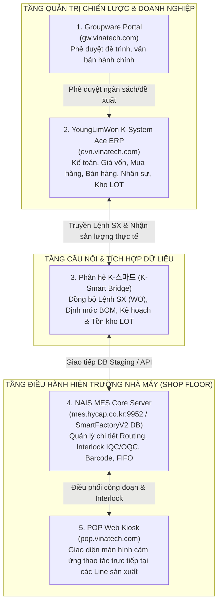

# 🏛️ K-SYSTEM ACE (EVN.VINATECH.COM) — MASTER SYSTEM ARCHITECTURE & INTEGRATION SPECIFICATION

> **Hệ Thống:** YoungLimWon K-System Ace Web ERP Suite  
> **Cổng Truy Cập:** `https://evn.vinatech.com/` (Phân hệ ERP Vinatech Vietnam)  
> **Đơn Vị Pháp Nhân:** `비나텍(베트남법인)` — Công ty TNHH Vinatech Vina  
> **Đơn Vị Triển Khai:** YoungLimWon SoftLab Co., Ltd. (영림원소프트랩 Hàn Quốc & K-System Vietnam)  
> **Chế Độ Khảo Sát:** **100% STRICTLY READ-ONLY** (Tuân thủ tuyệt đối quy chuẩn .agents - Không can thiệp, không submit, không ghi dữ liệu)  
> **Ngày Hoàn Tất Kiểm Định:** 19/09/2026

---

## 📑 MỤC LỤC
1. [TỔNG QUAN HỆ THỐNG & ĐỊNH DANH BẢN QUYỀN](#1-tổng-quan-hệ-thống--định-danh-bản-quyền)
2. [KIẾN TRÚC KỸ THUẬT NỀN TẢNG (TECHNICAL ARCHITECTURE & TECH STACK)](#2-kiến-trúc-kỹ-thuật-nền-tảng-technical-architecture--tech-stack)
3. [CẤU TRÚC ĐIỀU HƯỚNG & HỆ THỐNG API NỘI TẠI (GLOBAL RUNTIME APIS)](#3-cấu-trúc-điều-hướng--hệ-thống-api-nội-tại-global-runtime-apis)
4. [BẢN ĐỒ CHI TIẾT 17 PHÂN HỆ NGHIỆP VỤ & THỐNG KÊ TOÀN DIỆN](#4-bản-đồ-chi-tiết-17-phân-hệ-nghiệp-vụ--thống-kê-toàn-diện)
5. [PHÂN TÍCH CHUYÊN SÂU CÁC PHÂN HỆ LIÊN QUAN TRỰC TIẾP ĐẾN SẢN XUẤT & MES](#5-phân-tích-chuyên-sâu-các-phân-hệ-liên-quan-trực-tiếp-đến-sản-xuất--mes)
   - 5.1. [Phân hệ Sản xuất / Gia công bên ngoài (Module 8)](#51-phân-hệ-sản-xuất--gia-công-bên-ngoài-module-8)
   - 5.2. [Màn hình trọng điểm: Truy vấn truy xuất LOT 360° (FrmWPDLotList)](#52-màn-hình-trọng-điểm-truy-vấn-truy-xuất-lot-360-frmwpdlotlist)
   - 5.3. [Phân hệ Vật liệu & Quản lý Kho LOT (Module 10)](#53-phân-hệ-vật-liệu--quản-lý-kho-lot-module-10)
   - 5.4. [Phân hệ Chất lượng sản phẩm QA/QC (Module 9)](#54-phân-hệ-chất-lượng-sản-phẩm-qaqc-module-9)
   - 5.5. [Phân hệ Nhà máy thông minh K-Smart (Module 132)](#55-phân-hệ-nhà-máy-thông-minh-k-smart-module-132)
   - 5.6. [Phân hệ Giá vốn & Tính giá thành sản phẩm (Module 11)](#56-phân-hệ-giá-vốn--tính-giá-thành-sản-phẩm-module-11)
6. [MÔ HÌNH TÍCH HỢP LIÊN THÔNG VỚI HỆ SINH THÁI VINATECH MES](#6-mô-hình-tích-hợp-liên-thông-với-hệ-sinh-thái-vinatech-mes)
7. [KẾT LUẬN & ĐÁNH GIÁ VẬN HÀNH](#7-kết-luận--đánh-giá-vận-hành)

---

## 1. TỔNG QUAN HỆ THỐNG & ĐỊNH DANH BẢN QUYỀN

| Thuộc Tính Hệ Thống | Giá Trị Đo Lường Thực Tế | Ghi Chú Kỹ Thuật |
| :--- | :--- | :--- |
| **URL Portal** | `https://evn.vinatech.com/` | Cổng thông tin ERP Vinatech Vietnam |
| **Tên Giải Pháp** | **K-System Ace** | Bộ giải pháp ERP thế hệ mới của YoungLimWon SoftLab |
| **Phiên Bản Build** | **`v6.1.8.1006.01`** | Phiên bản Web Client `6.1.4.1`, Gói Script `WBK260908001=1` (Build 09/2026) |
| **Pháp Nhân Áp Dụng** | **`비나텍(베트남법인)`** | CompanySeq: `1` (Áp dụng cho toàn bộ cơ sở Vinatech Vina tại Việt Nam) |
| **Tài Khoản Đăng Nhập** | `ylw@ksystem.vn` | Tài khoản Quản trị viên / Nhà phát triển cấp cao của YoungLimWon |
| **Hạn Ngạch Giấy Phép (License Quota)** | • **Người dùng thông thường (Full User):** 75 licenses<br/>• **Người dùng ESS (Self-Service):** 110 licenses | Trạng thái hiện tại: Đang sử dụng 0, còn trống 100% giấy phép. |
| **Chế Độ Ngôn Ngữ** | Tiếng Việt (`vi-VN`), Tiếng Hàn (`ko-KR`), Tiếng Anh (`en-US`) | Hệ thống hiển thị song ngữ: Menu chính tiếng Việt, tính năng chuyên sâu giữ nguyên thuật ngữ kỹ thuật tiếng Hàn. |

---

## 2. KIẾN TRÚC KỸ THUẬT NỀN TẢNG (TECHNICAL ARCHITECTURE & TECH STACK)

### 2.1. Kiến trúc Đa tầng (Multi-tier Enterprise Architecture)
1. **Frontend Presentation Tier:**
   - Hoạt động dưới dạng **Single Page Application (SPA)** đa nhiệm với cơ chế giao diện tài liệu đa khung **MDI (Multiple Document Interface)**.
   - Thư viện nền tảng: **AngularJS Core Engine** phối hợp cùng **jQuery 3.7.1**.
   - Theme giao diện: `theme_Ace` với hệ thống lưới dữ liệu (Ace Dynamic Data Grid) hỗ trợ sắp xếp, lọc nhiều cột, phân trang, gộp dòng, và xuất Excel nguyên bản.
   - Cơ chế tab nghiệp vụ: Cho phép mở song song hàng chục màn hình nghiệp vụ mà không làm mới trang (quản lý qua `Home.OpenPageSeq`).

2. **Security & Cryptography Tier:**
   - Tích hợp thư viện **Forge 1.3.1** và **CryptoJS**:
     - Mã hóa mật khẩu người dùng và chữ ký phiên bằng thuật toán mã hóa công khai RSA trước khi gửi qua Internet.
     - Mã hóa đối xứng AES-CBC và mã băm SHA-256 cho các gói dữ liệu kiểm chứng toàn vẹn.

3. **Backend Service Tier:**
   - Hệ thống backend triển khai trên nền tảng **Microsoft IIS Web Server**.
   - Giao thức giao tiếp giữa Frontend SPA và Backend dựa trên **Windows Communication Foundation (WCF) Web Services** định dạng SOAP/JSON:
     - `HomeService.svc`: Quản trị cây menu, phân quyền, cấu hình phiên làm việc và danh mục chương trình.
     - `CommService.svc`: Xử lý các giao dịch nghiệp vụ, truy vấn dữ liệu lưới, thực thi nghiệp vụ kho/sản xuất.
     - `ReportService.svc`: Điều phối lệnh in ấn biểu mẫu và báo cáo kế toán.

4. **Enterprise Reporting Tier (OZ Report Engine):**
   - Hệ thống nhúng công cụ báo cáo quản trị chuyên nghiệp **FORCS OZ Report**:
     - Định danh tham số: `Const.REPORT_SP="$OZ$"`, `Const.REPORT_SP_DATA="$DATA$"`.
     - Phục vụ in ấn phiếu xuất kho LOT, tem mã vạch, hóa đơn thương mại, bảng lương và báo cáo tài chính chuẩn mực kế toán Việt Nam - Hàn Quốc.

---

## 3. CẤU TRÚC ĐIỀU HƯỚNG & HỆ THỐNG API NỘI TẠI (GLOBAL RUNTIME APIS)

Khảo sát qua JavaScript Runtime của trang web ghi nhận các đối tượng API điều khiển lõi:

```javascript
// 1. Đối tượng ngữ cảnh toàn cục (Global Context Object)
window._base.ConnInfo = {
    CompanySeq: 1,              // Pháp nhân Vinatech Việt Nam
    Language: 'vi-VN',          // Ngôn ngữ giao diện chuẩn
    UserID: 'ADMIN',            // Phiên quản trị định danh
    BizUnit: 1,                 // Đơn vị kinh doanh
    FactUnit: 1                 // Đơn vị nhà máy
};

// 2. Hàm mở màn hình nghiệp vụ theo Sequence ID
Home.OpenPageSeq(pgmSeq);       // Ví dụ: Home.OpenPageSeq(522308) mở màn hình Truy vấn LOT

// 3. Hàm tra cứu nhanh danh mục màn hình và quy trình
_base.SearchProgram(keyword, callback);     // Tìm kiếm form ID (FrmW...) theo từ khóa
_base.SearchProcessMenu(keyword, callback); // Tìm kiếm quy trình nghiệp vụ

// 4. Dịch vụ truy vấn cấu trúc Menu phân hệ
const service = angular.element(document.body).scope().getHomeService();
service.ProcessMenuListQuery(moduleSeq);    // Lấy toàn bộ nhánh cây nghiệp vụ theo mã phân hệ
```

---

## 4. BẢN ĐỒ CHI TIẾT 17 PHÂN HỆ NGHIỆP VỤ & THỐNG KÊ TOÀN DIỆN

Toàn bộ hệ thống K-System Ace tại Vinatech bao gồm **17 phân hệ lớn**, **213 nút quy trình (Process Menu Nodes)**, và **4.473 chương trình con thực thi (Executable Sub-Programs)**:

```
┌────────────────────────────────────────────────────────────────────────────────────────┐
│                        K-SYSTEM ACE ERP — BẢN ĐỒ 17 PHÂN HỆ                           │
├─────────┬──────────────────────────────────┬──────────────┬──────────────┬─────────────┤
│ Mã Seq  │ Tên Phân Hệ Quản Trị             │ Số Quy Trình │ Số Form Con  │ Trọng Tâm   │
├─────────┼──────────────────────────────────┼──────────────┼──────────────┼─────────────┤
│ 1       │ Điều hành (Admin / Operations)   │ 17           │ 357          │ Hệ thống    │
│ 100     │ Cơ bản (Master Data)             │ 5            │ 105          │ Danh mục    │
│ 2       │ Nhân sự (HRM)                    │ 8            │ 168          │ Nhân sự     │
│ 3       │ Lương, thù lao (Payroll)         │ 30           │ 630          │ Chấm công   │
│ 4       │ Kế toán (General Accounting)     │ 30           │ 630          │ Tài chính   │
│ 118     │ Fintech (Banking Integration)    │ 5            │ 105          │ Ngân hàng   │
│ 6       │ Kinh doanh / Xuất khẩu (Sales)   │ 23           │ 483          │ Đơn hàng    │
│ 126     │ 회계결산/신고 (Closing & Tax)    │ 14           │ 294          │ Quyết toán  │
│ 7       │ Mua hàng / Nhập khẩu (Purchasing)│ 12           │ 252          │ Mua vật tư  │
│ 8       │ Sản xuất / gia công bên ngoài    │ 23           │ 483          │ Lệnh SX, BOM│
│ 9       │ Chất lượng sản phẩm (QA/QC)      │ 7            │ 147          │ IQC/PQC/OQC │
│ 10      │ Vật liệu (Warehouse / Inventory) │ 17           │ 357          │ Kho & LOT   │
│ 11      │ Giá vốn (Costing & COGS)         │ 5            │ 105          │ Giá thành   │
│ 15      │ Đặt hàng / nhận đơn đối tác      │ 1            │ 21           │ B2B EDI     │
│ 17      │ ESS (Employee Self-Service)      │ 3            │ 63           │ Cổng CBNV   │
│ 18      │ Mở đầu (Getting Started)         │ 12           │ 252          │ Dashboard   │
│ 132     │ K-스마트 (Smart Factory / MES)   │ 1            │ 21           │ Bridge MES  │
├─────────┴──────────────────────────────────┼──────────────┼──────────────┼─────────────┤
│ TỔNG CỘNG HỆ THỐNG                         │ 213          │ 4.473        │ Toàn diện   │
└────────────────────────────────────────────┴──────────────┴──────────────┴─────────────┘
```

---

## 5. PHÂN TÍCH CHUYÊN SÂU CÁC PHÂN HỆ LIÊN QUAN TRỰC TIẾP ĐẾN SẢN XUẤT & MES

### 5.1. Phân hệ Sản xuất / Gia công bên ngoài (Module 8)
Phân hệ này bao gồm **23 nhóm quy trình** và **483 chương trình con**, đảm nhiệm toàn bộ vòng đời điều hành kế hoạch sản xuất:
1. `[Sản xuất] Thông tin cơ bản`: Thiết lập danh mục công đoạn (Routing), nhóm máy (Work Center), dây chuyền và lịch làm việc ca kíp.
2. `[Sản xuất] Thông tin thiết bị`: Quản lý năng lực thiết bị, bảo dưỡng định kỳ và nhật ký máy dừng.
3. `[Sản xuất] Thay đổi thiết kế ECO`: Quản lý các lệnh sửa đổi thiết kế kỹ thuật, cập nhật phiên bản linh kiện trong BOM.
4. `[Sản xuất] Kế hoạch sản xuất tháng / tuần`: Lập kế hoạch sản xuất cấp cao (MPS) dựa trên đơn đặt hàng từ phòng Kinh doanh.
5. `[Sản xuất] Kế hoạch yêu cầu vật liệu (MRP)`: Tự động chạy thuật toán bóc tách BOM để tính toán nhu cầu nguyên vật liệu thiếu hụt.
6. `[Sản xuất] Xuất kho nguyên vật liệu (Sản xuất trong công ty)`: Cấp phát NVL từ kho tổng sang kho chuyền phục vụ Lệnh sản xuất.
7. `[Sản xuất] Hoàn trả nguyên vật liệu`: Nhập lại kho các NVL dư thừa sau ca sản xuất hoặc NVL bị loại bỏ.
8. `[Sản xuất] Kết quả công việc`: Ghi nhận thực tế sản lượng hoàn thành theo từng công đoạn, thời gian chạy máy và nhân công.
9. `[Sản xuất] Yêu cầu sản xuất lại / Tái chế NVL`: Quản lý quy trình Rework đối với bán thành phẩm không đạt tiêu chuẩn.
10. `[Sản xuất] Phân phối input nguyên vật liệu dùng chung hàng tháng`: Điều chỉnh và phân bổ chi phí vật tư tiêu hao phụ (dung môi, keo, dầu mỡ, phụ gia).
11. `[생산] 옵션관리` (Tùy chọn sản xuất): Thiết lập các tham số vận hành nghiệp vụ sản xuất đặc thù.
12. `[Sản xuất] Kết quả sản xuất sản phẩm liên kết (joint products)`: Ghi nhận sản phẩm đồng hành và phụ phẩm phát sinh.

---

### 5.2. Màn hình trọng điểm: Truy vấn truy xuất LOT 360° (`FrmWPDLotList`)
* **Mã chương trình (PgmId):** `FrmWPDLotList`
* **Mã Sequence (PgmSeq):** `522308`
* **Đặc tính kỹ thuật:** Đây là màn hình truy vết 360 độ nguồn gốc toàn diện của sản phẩm, tích hợp 3 bảng lưới dữ liệu song song:

```
┌────────────────────────────────────────────────────────────────────────────────────────┐
│                   MÀN HÌNH TRUY VẤN TRUY XUẤT LOT (FrmWPDLotList)                     │
├────────────────────────────────────────────────────────────────────────────────────────┤
│ Bộ Lọc Tìm Kiếm: [Ngày làm việc: Từ ~ Đến] [Mã sản phẩm: F2 Lookup] [Quy cách]         │
├────────────────────────────────────────────────────────────────────────────────────────┤
│ 📊 LƯỚI 1: LỊCH SỬ LỆNH SẢN XUẤT & ROUTING CÔNG ĐOẠN (WIP & ROUTING TRACE)             │
│ • Cột: Work Center | Số Lệnh SX | Công Đoạn | LotNo | Tên SP | Mã SP | Quy Cách       │
│        Đơn Vị SX | Số Lượng Hoàn Thành | Phân Loại Tác Nghiệp | Người Làm Việc | Ghi Chú│
├────────────────────────────────────────────────────────────────────────────────────────┤
│ 📊 LƯỚI 2: ĐỊNH MỨC TIÊU HAO NGUYÊN VẬT LIỆU BOM THỰC TẾ (BOM CONSUMPTION TRACE)      │
│ • Cột: Số Lệnh SX | Công Đoạn | Tên SP | Mã SP | Tên NVL Đầu Vào | Mã NVL | Quy Cách  │
│        Đơn Vị | Số Lượng Nhập Vào | Số Lượng Đơn Vị Tiêu Chuẩn | LotNo Nguyên Vật Liệu │
├────────────────────────────────────────────────────────────────────────────────────────┤
│ 📊 LƯỚI 3: NGUỒN GỐC MUA HÀNG TỪ NHÀ CUNG CẤP (VENDOR PROCUREMENT TRACE)               │
│ • Cột: Nhà Cung Cấp | Hình Thức Mua | Tên NVL | Mã NVL | Quy Cách | LotNo Nhà Cung Cấp │
│        Số Lượng Nhập | Tiền Nhập Kho | Thuế GTGT | Tổng Số Tiền Hóa Đơn                │
└────────────────────────────────────────────────────────────────────────────────────────┘
```
> **Ý nghĩa nghiệp vụ:** Màn hình này chính là bản đối chiếu thượng nguồn của câu lệnh Golden Query 360° (`.\mes.ps1 trace`) trên hệ thống MES. Khi khách hàng audit hoặc khi phát hiện lỗi chất lượng, `FrmWPDLotList` cho phép dò từ mã Lot thành phẩm ngược về Lot bán thành phẩm, Lot nguyên vật liệu, và số hóa đơn mua hàng của nhà cung cấp.

---

### 5.3. Phân hệ Vật liệu & Quản lý Kho LOT (Module 10)
Bao gồm **17 nhóm quy trình** và **357 chương trình con**:
* **`FrmWLGMakingLotNoENV` (`PgmSeq: 524859`):** Cấu hình quy tắc tạo tự động số LotNo (Lot Prefix, Year/Month Format, Serial Length).
* **`FrmWLGWHLOTStockRealList` (`PgmSeq: 502903`):** Truy vấn chi tiết kiểm kê thực tế hàng tồn kho LOT theo từng kho chỉ định.
* **`FrmWLGWHLOTStockSumList` (`PgmSeq: 521504`):** Truy vấn tổng hợp số liệu xuất kho hàng hóa theo mã LOT.
* **Quy trình xuất nhập kho khác:** Hỗ trợ phân loại các nghiệp vụ xuất kho phi sản xuất (xuất hủy, xuất mẫu kiểm tra chất lượng, xuất trả nhà cung cấp).

---

### 5.4. Phân hệ Chất lượng sản phẩm QA/QC (Module 9)
Bao gồm **7 nhóm quy trình** và **147 chương trình con**:
* `[Chất lượng] Kiểm tra mua hàng (IQC)`: Nghiệm thu vật tư đầu vào từ nhà cung cấp trước khi nhập kho.
* `[Chất lượng] Kiểm tra công đoạn (PQC)`: Kiểm tra thông số kỹ thuật và độ lệch chuẩn trong quá trình gia công.
* `[Chất lượng] Kiểm tra công đoạn cuối (FQC / OQC)`: Nghiệm thu thành phẩm hoàn thiện trước khi đóng thùng xuất hàng.
* `[Chất lượng] Kiểm tra xuất hàng`: Kiểm tra ngoại quan, nhãn mác, tem niêm phong và đóng gói trước khi bàn giao logistics.

---

### 5.5. Phân hệ Nhà máy thông minh K-Smart (Module 132)
* **Quy trình nền tảng:** `[K-SMART] 기본정보` (`Seq: 10002131`)
* **Chức năng:** Đây là phân hệ cầu nối (Bridge Module) phục vụ đồng bộ hóa và quản trị tài khoản, quyền hạn giữa hệ thống ERP K-System và nền tảng Smart Factory / Kiosk:
  * `FrmWCMUserEntrySinCompanyWeb` (`PgmSeq: 525585`): Quản lý đăng ký tài khoản người dùng ERP / Kiosk nội bộ.
  * `FrmWCMOuterUserEntrySinCompany_web` (`PgmSeq: 525588`): Quản trị tài khoản đối tác / nhân sự thuê ngoài.
  * `FrmWCMUserGrpEntry` (`PgmSeq: 524329`) & `FrmWCMUserGrpEntryMember` (`PgmSeq: 525912`): Thiết lập nhóm người dùng và gán thành viên.
  * `FrmWCMPrcMenuGroupSecuEntry` (`PgmSeq: 524337`): Ma trận phân quyền nhóm người dùng theo từng quy trình nghiệp vụ.
  * `FrmWCMPrcMenuPgmGroupSecuExcptAll` (`PgmSeq: 526700`): Thiết lập ngoại lệ bảo mật cho từng màn hình theo nhóm.
  * `FrmWCMPrcMenuPgmUsrSecuExcptAll` (`PgmSeq: 527225`): Thiết lập ngoại lệ chi tiết cho từng cá nhân cụ thể.

---

### 5.6. Phân hệ Giá vốn & Tính giá thành sản phẩm (Module 11)
Bao gồm **5 nhóm quy trình** và **105 chương trình con**:
* Thu thập chi phí nguyên vật liệu trực tiếp từ các lệnh xuất kho Module 10.
* Tập hợp chi phí nhân công trực tiếp từ bảng chấm công Module 3 và Module 4.
* Phân bổ chi phí sản xuất chung (khấu hao máy móc, điện nước, phụ gia gián tiếp).
* Tự động tính toán chi phí giá thành đơn vị (Unit Costing) cho từng mã thành phẩm nhập kho.

---

## 6. MÔ HÌNH TÍCH HỢP LIÊN THÔNG VỚI HỆ SINH THÁI VINATECH MES

Sự xuất hiện của **K-System Ace ERP (`evn.vinatech.com`)** hoàn thiện bức tranh chuyển đổi số toàn diện của Vinatech tại Việt Nam:



### Phân Định Ranh Giới Trách Nhiệm (Demarcation of Responsibility):
1. **Trách nhiệm của K-System Ace ERP (`evn.vinatech.com`):**
   - Nắm giữ Master Data thượng nguồn: Danh mục khách hàng, nhà cung cấp, mã sản phẩm, định mức kỹ thuật chuẩn (Standard BOM).
   - Quản lý các hợp đồng bán hàng (SO), đơn đặt mua vật tư (PO), hóa đơn tài chính và chi phí sản xuất.
   - Phát hành **Lệnh sản xuất cấp cao (Master Work Order)** xuống nhà máy theo kế hoạch tuần/tháng.
   - Quản lý số dư tồn kho tài chính và phân bổ giá thành sau khi nhận dữ liệu sản lượng hoàn thành từ MES.

2. **Trách nhiệm của NAIS MES & POP Web (`mes.hycap.co.kr` & `pop.vinatech.com`):**
   - Nhận Lệnh sản xuất từ ERP, chia nhỏ thành các thẻ Lot sản xuất chi tiết hiện trường.
   - Kiểm soát từng bước gia công theo đúng quy trình công nghệ (Routing Execution).
   - Thiết lập các chốt chặn chất lượng tự động (**Quality Interlock**): Chặn không cho sản xuất nếu Lot bị HOLD, quá hạn lưu kho, hoặc chưa qua kiểm tra IQC/PQC.
   - Ghi nhận chi tiết lịch sử ghép thùng/box (Packing), in tem mã vạch Sanmina, quản lý rã box và đồng bộ sản lượng chốt ca ngược lên ERP.

---

## 7. KẾT LUẬN & ĐÁNH GIÁ VẬN HÀNH

1. **Về mức độ hoàn thiện của hệ thống:**
   - Hệ thống K-System Ace tại `evn.vinatech.com` là một hệ thống ERP rất hoàn chỉnh, chuẩn hóa cao theo mô hình quản trị doanh nghiệp sản xuất của Hàn Quốc.
   - Trạng thái hiện tại cho thấy hệ thống đã hoàn tất việc nạp bộ khung quy trình (213 Process Menus, 4.473 Sub-programs) và đang trong giai đoạn hoàn thiện Master Data, phân quyền người dùng và kiểm thử luồng tích hợp với nhà máy.

2. **Về hạn ngạch bản quyền:**
   - Đã được cấp 75 licenses thông thường và 110 licenses ESS, đảm bảo đủ năng lực triển khai cho toàn bộ khối văn phòng, quản lý sản xuất, quản lý kho và khối công nhân tự phục vụ tại các nhà máy Bắc Ninh, Hà Nam và Hưng Yên.

3. **Về quy tắc an toàn vận hành:**
   - Toàn bộ quá trình khảo sát đã được thực hiện bằng các lệnh JavaScript đọc dữ liệu bộ nhớ Client (`ProcessMenuListQuery`, `Home.GetProgramList`) hoàn toàn an toàn, **không làm thay đổi bất kỳ bản ghi nào trên cơ sở dữ liệu**.
   - Tài liệu này là cơ sở kỹ thuật tin cậy để đội ngũ kỹ sư MES Vinatech tham chiếu khi thiết kế các kịch bản đồng bộ dữ liệu hai chiều giữa K-System Ace ERP và NAIS MES trong tương lai.
