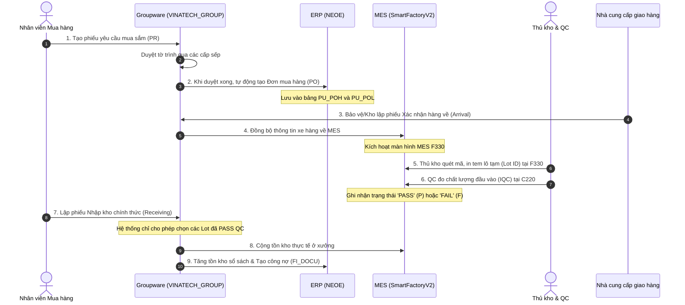
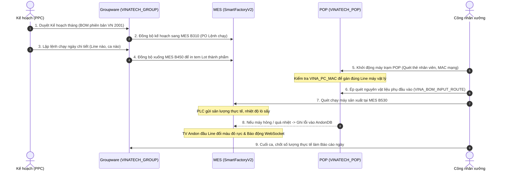
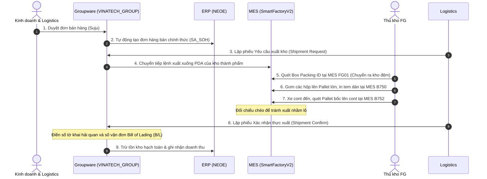

# 📖 TẬP 2: QUY TRÌNH NGHIỆP VỤ LIÊN THÔNG VÀ HƯỚNG DẪN BIỂU MẪU HÀNH CHÍNH
> **VINATECH BUSINESS WORKFLOWS & FORM INTER-COMMUNICATION HANDBOOK (VOLUME 2)**
>
> **Dành cho:** Kỹ sư hệ thống, lập trình viên và nhân viên vận hành nhà xưởng.
>
> ← [Quay lại Mục lục chính](README.md) | 🏛️ [Tập 1: Kiến trúc & CSDL (VOL_01)](VOL_01_SYSTEM_ARCHITECTURE.md) | 🔍 [Tập 3: Sửa lỗi Screen ID (VOL_03)](VOL_03_SCREEN_OPERATIONS_AND_TROUBLESHOOTING.md)

---

## 🏰 1. Phép Ẩn Dụ "Bốn Vương Quốc"

Để dễ dàng nắm bắt toàn bộ hệ sinh thái phần mềm đồ sộ tại Vinatech, hãy hình dung các hệ thống là **Bốn Vương Quốc** trao đổi thông tin với nhau qua các sứ giả cơ sở dữ liệu:

```
┌─────────────────────────────────────────────────────────────────────────┐
│                    VƯƠNG QUỐC GROUPWARE (GW)                            │
│                 "Văn phòng ký duyệt & Hành chính"                       │
│  - Nơi con người đưa ra quyết định, đề xuất và ký duyệt giấy tờ.        │
│  - Bảng trung tâm: VINA_DOCUMENT_SAVE (Phiếu lưu), VINA_EMP (Nhân sự)   │
└────────────────────────────────────┬────────────────────────────────────┘
                                     │
                                     │ (Sứ giả: Sync PO / Plan / Items)
                                     v
┌─────────────────────────────────────────────────────────────────────────┐
│                       VƯƠNG QUỐC ERP (DOUZONE)                          │
│                    "Hầm vàng kế toán & Master Data"                     │
│  - Nơi quản lý tiền bạc, công nợ, định giá vật tư gốc và sổ cái.        │
│  - Bảng trung tâm: MA_ITEM (Vật tư), PU_POH (Đơn mua), FI_DOCU (Sổ cái)  │
└────────────────────────────────────┬────────────────────────────────────┘
                                     │
                                     │ (Sứ giả: Sync Lệnh ngày / Tồn thực)
                                     v
┌─────────────────────────────────────────────────────────────────────────┐
│                        VƯƠNG QUỐC MES (NAIS)                            │
│                   "Đốc công & Vận hành nhà xưởng"                       │
│  - Nơi trực tiếp quét barcode, in tem, QC hàng hóa, chạy máy vật lý.    │
│  - Bảng trung tâm: STB_MaterialLotInfo (Lô), STB_SetInfo (Chạy máy)     │
└────────────────────────────────────┬────────────────────────────────────┘
                                     │
                                     │ (Sứ giả: Mạng lưới an ninh & Còi báo)
                                     v
┌─────────────────────────────────────────────────────────────────────────┐
│                   VƯƠNG QUỐC PHỤ TRỢ (HELPERS)                          │
│            "Hệ thống đường ống, cảm biến và bảo vệ"                     │
│  - SSO (RESTFUL): Bảo vệ soát vé.   - POP (MAC): Máy trạm hiện trường.  │
│  - Andon (Alerts): Chuông báo lỗi.  - WebSocket: Mạng lưới truyền tin.  │
│  - WCMS (Cash): Chuyển tiền NH.     - streamdocs: Kính xem PDF an toàn. │
└─────────────────────────────────────────────────────────────────────────┘
```

---

## 🔄 2. Ba Dòng Đời Nghiệp Vụ Cốt Lõi (The 3 Master Lifecycles)

### 2.1 Quy trình Mua hàng & Nhập kho (Procure-to-Pay)


### 2.2 Quy trình Chỉ thị & Vận hành Sản xuất (Production Execution)


### 2.3 Quy trình Bán hàng & Xuất khẩu Container (Order-to-Cash)


---

## 📋 3. Hướng Dẫn Vận Hành Chi Tiết 17 Biểu Mẫu Groupware

### 3.1 Đề xuất mua sắm (PR / Expense Request)
*   **Mã Form ID:** `purchaseRequestDocument` (Vật tư) hoặc `expenseReportDocument` (Chi phí tự do).
*   **Tuyến phê duyệt mặc định (PR):**
    *   *Nguyên vật liệu/Vật tư phụ:* `71908026-Đào Thị Phiên` &rarr; `21910034-Trần Quang Thỏa` (Final Approval). CC: Kế toán.
    *   *Tài sản IT:* `92005006-Nguyễn Văn Nha` &rarr; `11910035-Nguyễn Thành Phi` (Final).
    *   *Thiết bị/Nhà xưởng:* `71908026-Đào Thị Phiên` &rarr; `21910034-Trần Quang Thỏa` &rarr; CEO.
*   **Các trường thông tin trên UI:**
    *   *Phân loại (documentSaveApprovalTarget):* Nguyên liệu thô, IT, Thiết bị.
    *   *Ngoại tệ:* Mua Local (Không ngoại tệ, nhập VAT), mua Overseas (Bắt buộc tỷ giá ngoại tệ, khóa VAT).
    *   *Trường làm hộ:* Chọn nhân viên thụ hưởng tại ô "Thay đổi người sử dụng".

### 3.2 Đơn đặt hàng (PO)
*   **Mã Form ID:** `purchaseOrderDocument`.
*   **Tuyến phê duyệt:** `71908026-Đào Thị Phiên` &rarr; `21910034-Trần Quang Thỏa` &rarr; CEO.
*   **Các trường thông tin trên UI:**
    *   *Đối tác (Vendor/cdPartner):* Tìm chọn mã nhà cung cấp (Mã `13000` = Vinatech HQ Hàn Quốc, tự tạo PO đối ứng bên HQ).
    *   *Loại đặt hàng (cdTppo):* `1100` (Local VAT 10%), `1120` (Import L/C), `1130` (Import T/T), `1170` (Local VAT 0%), `1180` (Local VAT 8%).
    *   *Điều khoản giá (condPrice):* Incoterms `EXW`, `FOB`, `CIF`, `DDP`, `DAP`.
    *   *Loại thanh toán (fgPayment):* `001` (Cash 3 months), `003` (T/T for Vietnam), `004` (Cash for Vietnam).
    *   *Hệ mặt hàng (Grid):* Nhập Mã hàng, chọn phiên bản BOM **2001** (⚠️ Bắt buộc cho Việt Nam), Số lượng, Đơn giá, Kho nhận (Material Warehouse Code).
*   **Tác động:** Duyệt hoàn tất sẽ đồng bộ ngay sang ERP (`PU_POH`) và hiển thị trên **MES B310**.

### 3.3 Xác nhận hàng về (Arrival Confirmation)
*   **Mã Form ID:** `arrivalConfirmationDocument`.
*   **Tuyến phê duyệt:** Tổ thiết bị & Kho &rarr; `71908026-Đào Thị Phiên`. CC: Kế toán.
*   **Các trường thông tin trên UI:**
    *   *Phân loại:* Nguyên liệu thô, Trong nước, Quốc tế.
    *   *Số phiếu giao nhận MES (materialDocNo):* Gắn mã phiếu tự sinh từ MES.
    *   *Thông tin B/L & Thông quan (Chỉ dành cho hàng nhập khẩu):* Nhập số B/L, Ngày phát hành B/L, số hóa đơn Invoice, Số tờ khai thông quan, Tỷ giá hải quan.
    *   *MES Label (Nhãn tem):* Khai báo Số lượng Lot trên bao bì và số lượng nhãn in để hệ thống tự động truyền lệnh in xuống **MES F330**.

### 3.4 Xác nhận nhập kho thực tế (Receiving Confirmation)
*   **Mã Form ID:** `receivingConfirmationDocument` (UI hiển thị sai chính tả: `receivingConfirmationDoucment`).
*   **⚠️ Điều kiện:** Chỉ tạo được khi kết quả IQC tại màn hình **MES C220** đã đạt trạng thái **PASS**.
*   **Các trường thông tin trên UI:**
    *   *Ngày nhập kho (dtIo):* Ngày thực tế nhập kho.
    *   *Bảng chi tiết (Grid):* Chọn các Lot hàng đã đạt chuẩn chất lượng IQC, số lượng nhập kho, kho lưu trữ thực tế.
*   **Tác động:** Tăng tồn kho thực tế của MES và ghi nhận phiếu nhập kho kế toán trên ERP.

### 3.5 Quyết toán mua hàng (Purchase Resolution)
*   **Mã Form ID:** `purchaseResolutionDocument`.
*   **Các trường thông tin trên UI:**
    *   *Chứng từ liên kết:* Chọn Arrival Document, Receiving Document hoặc Return Document.
    *   *Đăng ký Chi phí phụ (Hàng nhập khẩu):* Chọn nhà cung cấp logistics (Ví dụ: `Bee Logistics`), nhập số tiền phụ phí (FREIGHT COST, Trucking fee, THC, Custom Declaration fee) để phân bổ vào giá trị nhập kho của lô vật tư.
    *   *Bút toán kế toán:* Chọn Tài khoản Nợ (Cost Center chi phí) và Tài khoản Có (`33111` VND / `33112` USD).

### 3.6 Đơn xin nghỉ việc (Employee Retire Document)
*   **Mã Form ID:** `empRetireDocument`.
*   **Quy tắc điền:** Ngày nghỉ việc chính thức, người nhận bàn giao, thông tin liên lạc và lý do nghỉ.
*   **Tác động:** Khóa tài khoản ERP và tự động set `AllowFlag = 'Deny'` trên **MES Z410**.

### 3.7 Đi làm ngày nghỉ/lễ (Holiday Work Request)
*   **Mã Form ID:** `holidayWorkRequest`.
*   **Thao tác:** Đăng ký danh sách nhân viên tăng ca ngày lễ/nghỉ cuối tuần. Sau khi đi làm về, lập báo cáo thực tế (Check-in/Check-out) đối chiếu với máy chấm công vân tay.

### 3.8 Đăng ký đơn bán hàng (Suju / Sales Order)
*   **Mã Form ID:** `salesOrderDocument`.
*   **Các trường thông tin trên UI:**
    *   *Loại đơn hàng (tpSo):* `1100` (Domestic Normal), `1150` (Vietnam Export), `1140` (Overseas T/T).
    *   *Điều kiện giao hàng:* Incoterms `FOB`, `CIF`, `DDP`, `DAP`.
    *   *Nhóm kinh doanh (cdSaleGrp):* Bán hàng quốc tế / Bán hàng trong nước.
*   **Tác động:** Tạo Suju trên ERP và tự động lên Kế hoạch tháng (Month Plan) trên Groupware.

### 3.9 Yêu cầu xuất hàng (Shipment Request)
*   **Mã Form ID:** `deliverOutDocument` (Menu tiếng Hàn: `출하요청서`).
*   **Thao tác:** Liên kết đơn Suju đã duyệt, chọn số lượng xuất hàng của từng dòng vật tư. Đẩy dữ liệu xuống PDA **MES FG01** để thủ kho quét Packing ID.

### 3.10 Xác nhận thực xuất (Shipment Confirmation)
*   **Mã Form ID:** `deliverOutConfirmationDocument` (`출하확인서`).
*   **Thao tác:** Khai báo số tờ khai hải quan, số Invoice, số vận đơn B/L thực tế khi xe Cont lăn bánh. Tự động ghi giảm tồn kho hạch toán ERP.

### 3.11 Chỉ thị sản xuất ngày (Daily Production Order)
*   **Mã Form ID:** `dailyProductionOrderDocument`.
*   **Các trường thông tin trên UI:**
    *   *Line (rawLineCode):* Chọn Line chạy máy (Ví dụ: `ElectrodeBN`, `Aging co nho`).
    *   *BOM:* Chọn phiên bản BOM **2001** hoặc **2002** (Cho cell line mới).
    *   *Grid:* Nhập số lượng kế hoạch ngày và ca làm việc để chuyển tiếp xuống trạm **MES B450**.

### 3.12 Báo cáo sản xuất ngày (Daily Production Report)
*   **Mã Form ID:** `dailyProductionReportDocument`.
*   **Thao tác:** Liên kết Kế hoạch ngày, nhập Số lượng nạp (`inputQty`), Số lượng phế (`defectQty`) và Số lượng sản xuất thực tế (`prodQty`) để đối chiếu với nhật ký quét **MES B530**.

### 3.13 Yêu cầu tuyển dụng (Emp Request)
*   **Mã Form ID:** `empRequestDocument`.
*   **Thao tác:** Đề xuất bổ sung nhân sự, ghi nhận cơ cấu hợp đồng và hạn phê duyệt.

### 3.14 Yêu cầu đi công tác (Business Trip Request)
*   **Mã Form ID:** `businessTripDocument`.
*   **UI đặc thù:** Phân loại Trong nước/Nước ngoài, địa điểm quốc gia, chi phí ăn uống theo tiêu chuẩn và hãng hàng không di chuyển.

### 3.15 Đăng ký nhà thầu / đối tác (Partner Registration)
*   **Mã Form ID:** `partnerRegistrationDocument`.
*   **UI đặc thù:** Đính kèm Giấy đăng ký kinh doanh và Thông báo tài khoản ngân hàng thụ hưởng. Khai báo MST, email và cờ Quản lý tín dụng (`Credit Management = Y` cho khách hàng; `N` cho NCC).

### 3.16 Yêu cầu thay đổi định mức (BOM Revision Request)
*   **Mã Form ID:** `bomRevisionDocument`.
*   **Thao tác:** Đề xuất sửa đổi linh kiện, keo hoặc bao bì phụ trên cây BOM. Bắt buộc kiểm tra phiên bản BOM được nạp sang MES.

### 3.17 Đăng ký các loại code (Item Code Registration)
*   **Mã Form ID:** `itemRegistrationDocument`.
*   **Các trường thuộc tính kỹ thuật:**
    *   *Loại vật tư (clsItem):* `001` (Raw material), `002` (Subsidiary), `004` (Semi-finished).
    *   *SIZE:* Size model (Ví dụ: `0820`, `0835`).
    *   *Điện áp (volt):* `2.7`, `3` Volt.
    *   *Thông số QC:* `acEsr` (AC-ESR), `dcEsr` (DC-ESR), `maximumCurrent`, `leakageCurrent`.
*   **Tác động:** Tạo Item gốc trên ERP Douzone và đồng bộ xuống **MES A230**.

---

## 🏖️ 4. Hướng Dẫn Các Biểu Mẫu Nhân Sự & Hành Chính Khác

### 4.1 Đơn xin nghỉ phép & Đơn hủy phép (Leave & Leave Cancel)
*   **Mã Form ID:** `leaveDocument` và `leaveCancelDocument`.
*   **Loại phép (cdWcode):** `G05` (Phép năm), `G14` (Nửa ngày - Half-day), `G15` (Nghỉ bù/Thưởng), `G17` (Khác - Hưởng lương), `G18` (Không lương).
*   **Bàn giao:** Bắt buộc tìm và chọn mã nhân viên thay thế (`noEmpNmAn`).

### 4.2 Đơn sửa đổi ngày công (Attendance Modify Document)
*   **Mã Form ID:** `attendanceModifyDocument`.
*   **Vận hành:** Dùng khi máy chấm công vân tay bị lỗi hoặc nhân viên quên quét thẻ. CC: Kế toán để cập nhật dữ liệu tính công.

### 4.3 Đơn yêu cầu đóng dấu (Seal Request Document)
*   **Mã Form ID:** `sealRequestDocument`.
*   **Phân loại:** Chi nhánh nhân cảm (Thông thường), Sử dụng nhân cảm, Chi nhánh nhân cảm (Quan trọng).
*   **Người nhận bàn giao:** Khai báo người giữ con dấu và số bản đóng dấu thực tế.

### 4.4 Báo cáo tai nạn lao động (Industrial Accident Report Document)
*   **Mã Form ID:** `industrialAccidentReportDocument`.
*   **Hành trình duyệt:** `12407001-Đồng Thị Hòe` &rarr; `11910035-Nguyễn Thành Phi` (Final).

---

## 📘 5. Từ Điển Thuật Ngữ Nghiệp Vụ & Viết Tắt (Glossary)

*   **WMS (Warehouse Management System):** Hệ thống quản lý kho nguyên vật liệu đầu vào.
*   **IQC (Incoming Quality Control):** Kiểm tra chất lượng nguyên vật liệu đầu vào (màn hình **C220**).
*   **PQC (Process Quality Control):** Kiểm tra chất lượng trong công đoạn sản xuất (màn hình **C443**).
*   **OQC / FOQC (Outgoing Quality Control):** Kiểm tra chất lượng thành phẩm đầu ra trước khi xuất xưởng (màn hình **C530 / C546**).
*   **Lot ID / MaterialLotNo:** Mã vạch định danh lô vật liệu đầu vào kho (Prefix `ML...`).
*   **ControlNo / Barcode:** Mã số định danh duy nhất dán lên từng viên tụ điện / Lot sản phẩm trên chuyền.
*   **Packing ID / BoxID:** Mã số định danh của túi hoặc hộp nhỏ chứa cell/module (màn hình **B523**).
*   **ParentPackingID / BigBoxID:** Mã vạch dán trên thùng carton lớn chứa nhiều hộp nhỏ (màn hình **B525**).
*   **BOM 2001:** Định mức nguyên vật liệu cấu thành sản phẩm tiêu chuẩn của nhà máy Việt Nam.
*   **Backflush:** Cơ chế trừ tồn kho nguyên vật liệu ảo tự động dựa trên định mức BOM khi công đoạn chốt sản lượng hoàn thành.
*   **FIFO (First In, First Out):** Nguyên tắc xuất kho Lot cũ nhất trước. Hệ thống chặn quét Lot mới nếu còn Lot cũ cùng mã trong kho.
*   **Holding (Kho khóa):** Trạng thái vật tư bị khóa chất lượng hoặc cận date, tự động hoặc thủ công chuyển vào kho ảo `HOLDING_WH` để cấm xuất.
