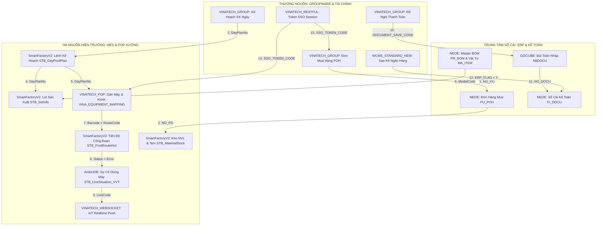

# 🌐 SYSTEM INTEGRATION MAP — BẢN ĐỒ LIÊN KẾT 4 NỀN TẢNG & 15 CƠ SỞ DỮ LIỆU

> **Cập nhật:** 2026-09-21  
> **Mục tiêu:** Bản đồ trực quan hóa chi tiết các đường dẫn dữ liệu (Data Pipelines), khóa liên kết (Foreign / Cross-DB Keys) và quy trình giao dịch xuyên suốt 15 cơ sở dữ liệu tại Vinatech.

---

## 🏛️ 0. Bốn Trụ Cột Nền Tảng Doanh Nghiệp (Enterprise Platforms)

1. **① Groupware (`gw.vinatech.com`):** Cổng phê duyệt tờ trình hành chính, nhân sự, mua sắm và kế hoạch ở thượng nguồn (`VINATECH_GROUP`, `VINATECH_RESTFUL`, `VINATECH_SPREADSHEET`, `streamdocs`).
2. **② ERP Douzone iU (`NEOE`):** Sổ cái trung tâm lưu trữ Master Data gốc (vật tư, đối tác, BOM, HR), hạch toán tài chính (`NEOE`, `DZICUBE`, `WCMS_STANDARD_NEW`, `erpdb`).
3. **③ NAIS MES (`mes.hycap.co.kr:9952`):** Hệ thống thực thi sản xuất tại hiện trường nhà xưởng (quét barcode, routing, QC và kho vật lý: `SmartFactoryV2`, `SmartFramework`, `VINATECH_POP`, `AndonDB`).
4. **④ YoungLimWon K-System Ace Web ERP (`evn.vinatech.com`):** Hệ thống Web ERP quản trị thế hệ mới cho Vinatech Việt Nam (17 phân hệ, 213 process menus, 4.473 sub-programs) bao gồm: Quản lý Lệnh sản xuất, MRP, Quản lý kho theo LOT (`FrmWPDLotList`), Kế toán, Mua hàng, Bán hàng và phân hệ cầu nối Smart Factory (`K-스마트`). Chi tiết: [KSYSTEM_ACE_ERP_MASTER_SPECIFICATION.md](SYSTEM_ARCHITECTURE/KSYSTEM_ACE_ERP_MASTER_SPECIFICATION.md).

---

## 🗺️ 1. Bản Đồ Tổng Thể Luồng Dữ Liệu Xuyên Suốt (End-to-End Topology)

---

## 🔗 2. Chi Tiết 7 Tuyến Tích Hợp Dữ Liệu Trọng Yếu

### Tuyến 1: Mua Hàng & Quản Lý Kho NVL (Procure-to-Stock)
- **Chuỗi liên kết:** `VINATECH_GROUP` ➔ `NEOE` ➔ `SmartFactoryV2`
- **Khóa liên kết:** `NO_PO` (Purchase Order Number) & `CD_ITEM` (Mã vật tư)
- **Quy trình dữ liệu:**
  1. Nhân sự tạo PO trên Groupware: `VINATECH_GROUP.dbo.VINA_DOCUMENT_POH`.
  2. Phê duyệt hoàn tất ➔ Đồng bộ sang ERP: `NEOE.dbo.PU_POH` và `PU_POL`.
  3. Hàng về đến xưởng ➔ Thủ kho quét nhận hàng qua màn hình **MES F330**: Dữ liệu lưu vào `SmartFactoryV2.dbo.STB_MaterialLotInfo` và `STB_MaterialStock`.
  4. Đội QC kiểm tra chất lượng qua **MES C220 (IQC)**: Kết quả `PASS` mới mở khóa trạng thái `Status = '0'` cho cuộn NVL.

---

### Tuyến 2: Kế Hoạch & Điều Hành Sản Xuất (Plan-to-Production)
- **Chuỗi liên kết:** `VINATECH_GROUP` ➔ `SmartFactoryV2` ➔ `VINATECH_POP`
- **Khóa liên kết:** `DayPlanNo` (Số kế hoạch ngày) & `Barcode` / `LotNo`
- **Quy trình dữ liệu:**
  1. Kế hoạch sản xuất duyệt trên Groupware: `VINATECH_GROUP.dbo.VINA_DOCUMENT_DAILY_PLAN`.
  2. Tự động sinh lệnh sản xuất ngày: `SmartFactoryV2.dbo.STB_DayProdPlan`.
  3. Khởi tạo mã Lot và in Barcode đầu chuyền (B530/B540): `SmartFactoryV2.dbo.STB_SetInfo`.
  4. Kiosk POP gán máy móc cho kế hoạch ngày: `VINATECH_POP.dbo.VINA_EQUIPMENT_MAPPING`.
  5. Công nhân quét barcode chốt công đoạn tại Kiosk ➔ Ghi vào `SmartFactoryV2.dbo.MongoToMesPerformance` ➔ Đồng bộ sang `SmartFactoryV2.dbo.STB_ProdRouteHist`.

---

### Tuyến 3: Hạch Toán Kế Toán Tự Động (Disbursement-to-Ledger)
- **Chuỗi liên kết:** `VINATECH_GROUP` ➔ `DZICUBE` ➔ `NEOE`
- **Khóa liên kết:** `DOCUMENT_SAVE_CODE` ➔ `NO_DOCU` (Số chứng từ)
- **Quy trình dữ liệu:**
  1. Nhân viên lập tờ trình thanh toán trên Groupware: `VINATECH_GROUP.dbo.VINA_DOCUMENT_PAYMENT`.
  2. Sau khi Giám đốc ký duyệt ➔ Bizbox sinh chứng từ nháp: `DZICUBE.dbo.ABDOCU` và `ABDOCU_D`.
  3. Kế toán trưởng kiểm tra và đẩy chính thức vào Sổ cái ERP: `NEOE.dbo.FI_DOCU` và `FI_DOCU_D`.

---

### Tuyến 4: Tự Động Hóa Kế Toán Ngân Hàng (Bank-to-ERP)
- **Chuỗi liên kết:** Ngân hàng liên kết (Shinhan, Woori, VietinBank) ➔ `WCMS_STANDARD_NEW` ➔ `NEOE`
- **Khóa liên kết:** `ACCOUNT_TRNX_LOG_UUID` & `ERP_FLAG`
- **Quy trình dữ liệu:**
  1. Dịch vụ Firm Banking tự động cào sao kê tiền gửi theo thời gian thực: `WCMS_STANDARD_NEW.dbo.WCMS_ACCOUNT_TRNX_LOG`.
  2. Khi giao dịch hợp lệ, hệ thống bật cờ `ERP_FLAG = 'Y'` và gửi lệnh hạch toán tự động tạo phiếu thu/chi trên `NEOE.dbo.FI_DOCU`.
  3. Lịch sử số dư chốt cuối ngày: `WCMS_STANDARD_NEW.dbo.WCMS_BALANCE_HISTORY`.

---

### Tuyến 5: Định Danh Kiosk & Thu Thập Dữ Liệu PLC Xưởng
- **Chuỗi liên kết:** `VINATECH_POP` ➔ `SmartFactoryV2`
- **Khóa liên kết:** `PC_MAC_ADDRESS` ➔ `EQUIPMENT_SETTING_ID`
- **Quy trình dữ liệu:**
  1. Kiosk mở ứng dụng Web POP ➔ Xác thực qua địa chỉ MAC mạng: `VINATECH_POP.dbo.VINA_PC_MAC`.
  2. Nạp cấu hình tham số máy móc (đường dẫn log, ngưỡng nhiệt độ): `VINATECH_POP.dbo.VINA_EQUIPMENT_SETTING`.
  3. Ràng buộc công đoạn quét linh kiện theo BOM: `VINATECH_POP.dbo.VINA_BOM_INPUT_ROUTE`.

---

### Tuyến 6: Giám Sát Dừng Chuyền & Cảnh Báo Thời Gian Thực (Andon Alerting)
- **Chuỗi liên kết:** `SmartFactoryV2` / Kiosk ➔ `AndonDB` ➔ `VINATECH_WEBSOCKET` ➔ TV Display / Mobile App
- **Khóa liên kết:** `LineCode`, `RouteCode`, `ErrorCode`
- **Quy trình dữ liệu:**
  1. Máy móc gặp sự cố hoặc công nhân ấn nút dừng khẩn cấp tại line: Dữ liệu ghi vào `AndonDB.dbo.STB_LineSituation_VVT` với `status = 1`.
  2. Hệ thống đẩy tín hiệu socket qua `VINATECH_WEBSOCKET` đổi màu đỏ trên TV nhà xưởng ngay tức khắc (<1s).
  3. Dịch vụ gửi thông báo kiểm tra `statusEmail = 0` và `statusApp = 0`, sau đó gửi cảnh báo tới nhóm kỹ sư được cấu hình tại `AndonDB.dbo.STB_VVT_UserWarning`.

---

### Tuyến 7: Xác Thực Một Lần (Single Sign-On SSO)
- **Chuỗi liên kết:** `VINATECH_RESTFUL` ➔ Toàn bộ các phân hệ Web (Groupware, POP, Portal)
- **Khóa liên kết:** `SSO_TOKEN_CODE` & `ID_USER`
- **Quy trình dữ liệu:**
  1. Người dùng đăng nhập cổng chính ➔ Sinh JWT Access Token lưu tại: `VINATECH_RESTFUL.dbo.VINA_SSO_TOKEN`.
  2. Ghi nhận số lượt đăng nhập trong ngày: `VINATECH_RESTFUL.dbo.VINA_SSO_LOGIN`.
  3. Kiểm soát dải IP được phép gọi API: `VINATECH_RESTFUL.dbo.VINA_ALLOWED_IP`.

---

## ⚡ 3. Nguyên Tắc An Toàn Khi Truy Vấn Liên Cơ Sở Dữ Liệu (Cross-Database Safety)

1. **Khóa liên kết Cross-DB bắt buộc dùng `WITH(NOLOCK)`:**
   Khi JOIN giữa các database khác nhau (ví dụ: JOIN giữa `SmartFactoryV2` và `NEOE`), tuyệt đối phải đặt `WITH(NOLOCK)` trên tất cả các bảng để tránh tình trạng phân tán khóa (Distributed Deadlock).
2. **Hạn chế phép JOIN trực tiếp bảng lớn sang bảng lớn:**
   Khi cần đối chiếu giữa bảng lịch sử hàng triệu dòng `STB_ProdRouteHist` (MES) và `FI_DOCU_D` (ERP), hãy lọc trước theo ngày (`JobDate` / `DT_DOCU`) vào bảng tạm hoặc CTE rồi mới thực hiện đối chiếu.
3. **Tuân thủ Collation:**
   Đặc biệt lưu ý CSDL `erpdb` có bảng mã tiếng Hàn, khi đối chiếu chuỗi văn bản với các CSDL khác cần chỉ định rõ: `COLLATE Korean_Wansung_Unicode_CS_AS` hoặc `COLLATE Vietnamese_CI_AS`.
