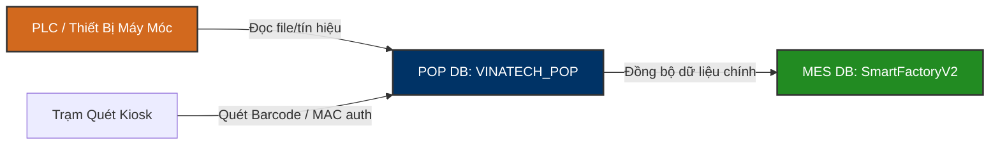

# 🖥️ VINATECH_POP — Point Of Production Database Knowledge Base

`VINATECH_POP` là cơ sở dữ liệu vận hành đầu cuối dành riêng cho các trạm máy tính và kiosk đầu cuối (POP Terminals) trên mặt bằng nhà xưởng (Shop Floor) của Vinatech. Database này chịu trách nhiệm quản lý cấu hình kết nối thiết bị, thu thập dữ liệu PLC/máy móc, định tuyến quét nguyên vật liệu, phân quyền thiết bị đầu cuối và ghi nhận log hoạt động của công nhân.

---

## 🗺️ 1. Kiến Trúc Vận Hành & Mối Liên Kết MES

Trong mô hình sản xuất, nếu **SmartFactoryV2 (MES)** đóng vai trò là "bộ não" trung tâm lưu trữ thông tin sản xuất chính (SetInfo, RouteHist, LotInfo), thì `VINATECH_POP` là "các giác quan" trực tiếp giao tiếp với các thiết bị và trạm quét vật lý dưới xưởng.

### ⚙️ Các Nghiệp Vụ Vận Hành Chính:
1.  **Định danh Kiosk vật lý (MAC Address Auth):** Thay vì dùng login thông thường, hệ thống POP nhận diện quyền hạn và line sản xuất của máy tính đầu cuối thông qua địa chỉ MAC của card mạng máy tính (`VINA_PC_MAC`).
2.  **Thu thập dữ liệu thiết bị (PLC Data Collection):** Cấu hình cách thức đọc dữ liệu từ máy móc (tần suất thu thập, đường dẫn file log máy, pattern tên file, giới hạn nhiệt độ/thời gian) được lưu trữ tại `VINA_EQUIPMENT_SETTING`.
3.  **Kiểm soát chế độ sản xuất (Production Mode):** Trạm POP dựa vào trạng thái tại `VINA_LINE_PROD_MODE` để quyết định xem line đó đang chạy bình thường (Normal) hay chạy sửa lại (Rework).
4.  **Kiểm soát quét chặn lỗi NVL (Input Scan Validation):** Đối chiếu danh sách linh kiện cần quét trên từng công đoạn (`VINA_BOM_INPUT_ROUTE`) nhằm ngăn chặn việc công nhân quét sai chủng loại hoặc bỏ sót NVL phụ.

---

## 🗄️ 2. Cấu Trúc Các Bảng Nghiệp Vụ Lõi

### 2.1 Mapped Thiết Bị Đầu Cuối: `VINA_PC_MAC`
Bảng này ánh xạ địa chỉ vật lý (MAC) của PC trạm xưởng với cấu hình máy móc và phiên bản client.

| Tên Cột | Kiểu Dữ Liệu | Nullable | Mô Tả |
| :--- | :--- | :--- | :--- |
| **PC_MAC_ADDRESS** (PK) | `varchar(50)` | NO | Địa chỉ MAC vật lý của card mạng trạm Kiosk |
| **EQUIPMENT_SETTING_IDS** | `varchar(1000)`| NO | Danh sách ID cấu hình thiết bị gán cho PC này (phân tách bằng dấu phẩy) |
| **PC_IPV4_ADDRESS** | `varchar(20)` | YES | Địa chỉ IP của máy trạm |
| **SYSTEM_VERSION** | `varchar(20)` | YES | Phiên bản phần mềm POP Client đang chạy |
| **EQUIPMENT_SETTING_JSON** | `varchar(max)` | YES | Chi tiết cấu hình thiết bị đầu cuối dưới dạng JSON |

---

### 2.2 Cấu Hình Thu Thập Dữ Liệu Thiết Bị: `VINA_EQUIPMENT_SETTING`
Định nghĩa phương thức giao tiếp và thu thập tham số vận hành (Nhiệt độ, Thời gian, Áp suất hơi...) từ các máy móc trên dây chuyền.

| Tên Cột | Kiểu Dữ Liệu | Mô Tả |
| :--- | :--- | :--- |
| **EQUIPMENT_SETTING_ID** (PK)| `varchar(50)` | Mã cấu hình thiết bị |
| **EQUIPMENT_SETTING_NAME**| `varchar(200)` | Tên cấu hình thiết bị |
| **EQUIPMENT_SETTING_TYPE**| `varchar(50)` | Phân loại thiết bị |
| **EQUIPMENT_SETTING_DEFAULT**| `varchar(500)` | Đường dẫn thư mục dữ liệu mặc định của thiết bị |
| **EQUIPMENT_SETTING_FILENAME_DATA_PATTERN**| `varchar(200)` | Biểu thức Regex / Pattern lọc tên file log dữ liệu của máy |
| **EQUIPMENT_SETTING_DATA_COLLECTION_TIME**| `int` | Chu kỳ quét thu thập dữ liệu (tính bằng giây) |
| **EQUIPMENT_SETTING_TEMPERATURE**| `varchar(50)` | Ngưỡng nhiệt độ quy định |
| **EQUIPMENT_SETTING_STEAM_TEMPERATURE**| `varchar(50)` | Ngưỡng nhiệt độ hơi nước quy định |
| **EQUIPMENT_SETTING_TIME**| `varchar(50)` | Thời gian chu kỳ máy hoạt động quy định |
| **EQUIPMENT_SETTING_ECM_BACKUP**| `char(1)` | Sao lưu dữ liệu máy lên hệ thống lưu trữ tài liệu ECM (Y/N) |
| **EQUIPMENT_SETTING_LINE_CODE**| `varchar(20)` | Mã dây chuyền gắn cấu hình |

---

### 2.3 Phân Tuyến Quét NVL Theo Công Đoạn: `VINA_BOM_INPUT_ROUTE`
Ràng buộc chặt chẽ vị trí công đoạn bắt buộc quét mã NVL phụ.

| Tên Cột | Kiểu Dữ Liệu | Nullable | Mô Tả |
| :--- | :--- | :--- | :--- |
| **MATERIAL_CODE** (PK) | `nvarchar(50)` | NO | Mã sản phẩm chính (Cell/Module) |
| **BOM_VERSION** (PK) | `nvarchar(10)` | NO | Phiên bản BOM áp dụng |
| **SUB_MATERIAL_CODE** (PK)| `nvarchar(50)` | NO | Mã vật tư/linh kiện phụ cần quét |
| **INPUT_ROUTE_CODE** (PK)| `nvarchar(20)` | NO | Mã công đoạn (Route) bắt buộc quét mã vật tư này |
| **SUB_MATERIAL_NAME** | `nvarchar(200)`| YES | Tên vật tư phụ |

---

### 2.4 Ánh Xạ Thiết Bị Vận Hành: `VINA_EQUIPMENT_MAPPING`
Quản lý việc gán (map) thiết bị vật lý cụ thể cho Kế hoạch sản xuất ngày của MES.

| Tên Cột | Kiểu Dữ Liệu | Mô Tả |
| :--- | :--- | :--- |
| **MAPPING_ID** (PK) | `int` | ID tự tăng của bản ghi map |
| **DAY_PLAN_NO** | `nvarchar(50)` | Số kế hoạch sản xuất ngày (lấy từ MES) |
| **LINE_CODE** | `nvarchar(50)` | Mã line sản xuất đang chạy |
| **EQUIPMENT_ID** | `nvarchar(50)` | Mã thiết bị vật lý được gán |
| **MAPPING_STATUS** | `nvarchar(20)` | Trạng thái map (ACTIVE, RELEASED) |
| **MAPPED_AT** / **RELEASED_AT**| `datetime` | Thời gian kích hoạt / Giải phóng thiết bị |
| **RELEASE_REASON** | `nvarchar(50)` | Lý do giải phóng (Hết hàng, Lỗi máy, Đổi PO) |

---

## 📊 3. Danh Mục Toàn Bộ Bảng Trong CSDL `VINATECH_POP`

| Nhóm dữ liệu | Tên Bảng | Vai trò nghiệp vụ |
| :--- | :--- | :--- |
| **Cấu hình & Phân quyền** | `VINA_PC_MAC` | Ánh xạ MAC Kiosk đầu cuối với cấu hình thiết bị |
| | `VINA_ALLOWED_IP` | Danh sách IP được phép kết nối dịch vụ POP |
| | `VINA_COOKIE_NAME` | Cấu hình Cookie phiên làm việc trạm |
| | `VINA_MENU` / `VINA_MENU_PERMISSIONS` | Cấu hình Menu hiển thị trên giao diện trạm POP |
| **Tham số máy móc (PLC)**| `VINA_EQUIPMENT_SETTING` | Tham số kết nối, file log, nhiệt độ, time chu kỳ của máy |
| | `VINA_PLC_BASELINE` | Đường cơ sở cấu hình PLC |
| | `VINA_LINE_PROD_MODE` | Chế độ chạy dây chuyền (Normal / Rework) |
| **Vận hành sản xuất** | `VINA_EQUIPMENT_MAPPING` | Gán máy móc cho Lệnh sản xuất ngày của MES |
| | `VINA_EQUIPMENT_REMAINDER` | Theo dõi lượng hàng/phế phẩm còn lại trên thiết bị |
| | `VINA_BOM_INPUT_ROUTE` | Ràng buộc công đoạn quét NVL theo BOM |
| | `VINA_MATERIAL_INPUT_HIST`| Lịch sử quét nạp NVL đầu công đoạn |
| | `VINA_LABEL_INFO` | Dữ liệu in tem nhãn nội bộ trạm |
| | `VINA_WIP_STOCK_HIST` | Lịch sử biến động bán thành phẩm (WIP) tại trạm |
| **Hệ thống & Log** | `VINA_KIOSK_LOG` | Ghi nhận sự kiện Login/Scan/Error/Print tại trạm |
| | `VINA_POP_ACTION_LOG` | Log hành vi chi tiết của người vận hành |
| | `VINA_BBS_CONTENT` / `_COMMENT`| Bản tin thông báo kỹ thuật hiển thị tại trạm Kiosk |
| | `VINA_SYSTEM_VERSION` | Quản lý phiên bản nâng cấp phần mềm POP |

---

*Tài liệu được biên soạn dựa trên phân tích trực tiếp cấu trúc CSDL thực tế tại máy chủ `dbserver.hycap.co.kr,5398`.*
