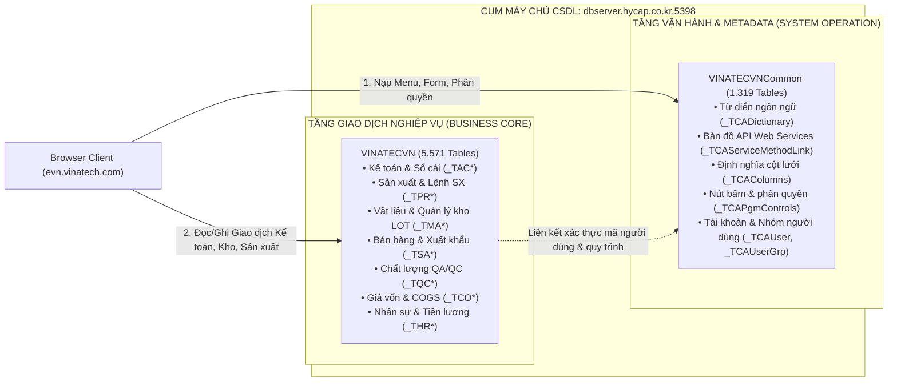

# 🏛️ TẬP 1: BẢN CHẤT CỐT LÕI VẬN HÀNH THÂM SÂU & TAXONOMY DỮ LIỆU K-SYSTEM ACE
> **K-SYSTEM ACE ERP CORE OPERATING ENGINE & DATA TAXONOMY SPECIFICATION (VOLUME 1)**
>
> **Hệ Thống:** YoungLimWon K-System Ace Web ERP Suite (영림원소프트랩)  
> **Cổng Truy Cập:** `https://evn.vinatech.com/`  
> **Pháp Nhân Áp Dụng:** `비나텍(베트남법인)` — Công ty TNHH Vinatech Vina (`CompanySeq = 1`)  
> **Cặp Cơ Sở Dữ Liệu:** `VINATECVN` (5.571 Tables) & `VINATECVNCommon` (1.319 Tables)  
> **Chế Độ Khảo Sát:** **STRICTLY READ-ONLY** (Bảo vệ toàn vẹn tuyệt đối hệ thống tài chính & sản xuất)

---

## 📑 MỤC LỤC
1. [BẢN CHẤT CỐT LÕI CỦA MỘT METADATA-DRIVEN ERP HIỆN ĐẠI](#1-bản-chất-cốt-lõi-của-một-metadata-driven-erp-hiện-đại)
2. [KIẾN TRÚC CLIENT FRONTEND MDI & CƠ CHẾ ĐIỀU PHỐI RUNTIME](#2-kiến-trúc-client-frontend-mdi--cơ-chế-điều-phối-runtime)
3. [TẦNG DỊCH VỤ WCF SERVICES & ĐỘNG CƠ BÁO CÁO FORCS OZ REPORT](#3-tầng-dịch-vụ-wcf-services--động-cơ-báo-cáo-forcs-oz-report)
4. [MÔ HÌNH CẶP ĐÔI CƠ SỞ DỮ LIỆU: VINATECVN & VINATECVNCOMMON](#4-mô-hình-cặp-đôi-cơ-sở-dữ-liệu-vinatecvn--vinatecvncommon)
5. [HỆ THỐNG TIỀN TỐ BẢNG (TAXONOMY) & QUY ƯỚC ĐẶT TÊN 10 HỌ DỮ LIỆU](#5-hệ-thống-tiền-tố-bảng-taxonomy--quy-ước-đặt-tên-10-họ-dữ-liệu)
6. [CƠ CHẾ PHÂN VÙNG DỮ LIỆU ĐA PHÁP NHÂN (MULTI-COMPANY ISOLATION)](#6-cơ-chế-phân-vùng-dữ-liệu-đa-pháp-nhân-multi-company-isolation)
7. [TỔNG KẾT VÀ NGUYÊN TẮC VẬN HÀNH THÂM SÂU](#7-tổng-kết-và-nguyên-tắc-vận-hành-thâm-sâu)

---

## 1. BẢN CHẤT CỐT LÕI CỦA MỘT METADATA-DRIVEN ERP HIỆN ĐẠI

Khác biệt căn bản giữa một phần mềm viết theo lối truyền thống (Hardcoded Codebase) và hệ thống ERP cấp độ Enterprise của YoungLimWon nằm ở mô hình **Metadata-Driven Architecture** (Kiến trúc điều khiển thuần túy bằng Siêu dữ liệu).

Trong K-System Ace, lập trình viên không viết mã nguồn HTML/JS cứng cho 4.473 màn hình. Thay vào đó, toàn bộ giao diện, lưới dữ liệu, nhãn đa ngôn ngữ, nút bấm, và điều kiện lọc được sinh động tại thời gian chạy (Runtime Dynamic Generation) thông qua việc đọc 4 bảng Siêu dữ liệu khổng lồ tại `VINATECVNCommon`:

```
┌─────────────────────────────────────────────────────────────────────────────┐
│                 NGUỒN NĂNG LƯỢNG SIÊU DỮ LIỆU (VINATECVNCommon)             │
├──────────────────────────┬──────────────────┬───────────────────────────────┤
│ Bảng Metadata Gốc        │ Quy Mô Bản Ghi   │ Vai Trò Vận Hành Cốt Lõi      │
├──────────────────────────┼──────────────────┼───────────────────────────────┤
│ _TCADictionary           │ 839.991 dòng     │ Từ điển thuật ngữ 3 thứ tiếng │
│ _TCAServiceMethodLink    │ 622.284 dòng     │ Bản đồ liên kết Web Services  │
│ _TCAColumns              │ 152.169 dòng     │ Định nghĩa chi tiết cột lưới  │
│ _TCAPgmControls          │ 122.728 dòng     │ Định nghĩa nút bấm & Actions  │
└──────────────────────────┴──────────────────┴───────────────────────────────┘
```

### Chu trình sinh màn hình tự động (Screen Dynamic Hydration Cycle):
1. **Khởi tạo định danh:** Khi người dùng click menu hoặc lệnh JavaScript `Home.OpenPageSeq(pgmSeq)` được kích hoạt, Client gửi yêu cầu kèm `PgmSeq` (ví dụ `522308` cho màn hình Truy vấn LOT `FrmWPDLotList`).
2. **Nạp cấu trúc điều khiển:** Client gọi `_TCAPrcMenu` và `_TCAPgmControls` để biết màn hình này có bao nhiêu nút (Search, Save, Print, Excel, Delete), quyền hạn tài khoản hiện tại được bấm nút nào.
3. **Nạp quy cách lưới (Grid Schema):** Đọc `_TCAColumns` để dựng động các bảng dữ liệu: tên cột, độ rộng (width), kiểu dữ liệu (số lượng, tiền tệ, ngày tháng, văn bản), căn lề (left/center/right), và có cho phép sửa trực tiếp (inline editable) hay không.
4. **Nạp đa ngôn ngữ (Localization):** Dựa vào thiết lập ngôn ngữ `vi-VN` (hoặc `ko-KR`, `en-US`) trong phiên, hệ thống quét bảng `_TCADictionary` đối chiếu `WordSeq` để thay thế toàn bộ tiêu đề cột và nhãn nút bấm tương ứng.

*Ý nghĩa vận hành thâm sâu:* Một thay đổi về quy trình, thêm cột quản lý trên lưới hoặc đổi tên thuật ngữ chỉ cần cập nhật trực tiếp vào bảng Metadata mà không phải biên dịch lại mã nguồn Web hay khởi động lại máy chủ IIS.

---

## 2. KIẾN TRÚC CLIENT FRONTEND MDI & CƠ CHẾ ĐIỀU PHỐI RUNTIME

Giao diện người dùng tại `https://evn.vinatech.com/` được xây dựng theo mô hình **Single Page Application (SPA)** đa nhiệm với cơ chế giao diện tài liệu đa khung **MDI (Multiple Document Interface)**:

```
[ BROWSER RUNTIME (https://evn.vinatech.com) ]
  ├── Angular Core Engine + jQuery 3.7.1
  ├── Cryptography: Forge v1.3.1 (RSA-2048) + CryptoJS (AES-CBC + SHA-256)
  ├── MDI Workspace Manager (Home.OpenPageSeq, OpenPageList)
  └── Global Runtime Context (window._base.ConnInfo)
```

### 2.1. Đối Tượng Ngữ Cảnh Toàn Cục (Global Runtime Context)
Mọi tác vụ truy vấn nghiệp vụ của Client đều được kiểm soát nghiêm ngặt thông qua đối tượng ngữ cảnh `window._base.ConnInfo`:

```javascript
window._base.ConnInfo = {
    CompanySeq: 1,              // Pháp nhân Vinatech Việt Nam
    Language: 'vi-VN',          // Ngôn ngữ giao diện chuẩn
    UserID: 'ADMIN',            // Mã người dùng phiên làm việc
    BizUnit: 1,                 // Đơn vị kinh doanh (Business Unit)
    FactUnit: 1,                // Đơn vị nhà máy (Factory Unit: Bắc Ninh/Hà Nam/Hưng Yên)
    DeptSeq: 1001,              // Mã định danh phòng ban hiện hành
    EmpSeq: 92601001            // Mã số nhân sự của người dùng
};
```

### 2.2. Cơ chế Điều hướng & Quản trị Phiên (MDI Tab Management)
- **Quản lý đa màn hình:** K-System Ace cho phép người dùng mở song song hàng chục màn hình nghiệp vụ mà không làm mất trạng thái dữ liệu đang nhập dở dang. Trạng thái mỗi tab được định danh trong mảng `Home.OpenPageList`.
- **API Mở Màn Hình Bằng Mã Sequence:**
  ```javascript
  Home.OpenPageSeq(522308);   // Mở ngay màn hình FrmWPDLotList (Truy vấn truy xuất LOT 360°)
  Home.OpenPageSeq(525585);   // Mở ngay màn hình FrmWCMUserEntrySinCompanyWeb (Đăng ký User)
  Home.OpenPageSeq(502903);   // Mở màn hình FrmWLGWHLOTStockRealList (Tồn kho LOT thực tế)
  ```
- **Hệ thống Tra cứu Nhanh Bộ nhớ Client:**
  ```javascript
  _base.SearchProgram("Lot", callback);        // Tìm kiếm tất cả màn hình liên quan đến Lot
  _base.SearchProcessMenu("Sản xuất", callback); // Tìm kiếm quy trình nghiệp vụ theo từ khóa
  ```

---

## 3. TẦNG DỊCH VỤ WCF SERVICES & ĐỘNG CƠ BÁO CÁO FORCS OZ REPORT

### 3.1. Windows Communication Foundation (WCF) Web Services
Hệ thống backend triển khai trên Microsoft IIS Web Server, kết nối với Frontend qua các Endpoint WCF chuẩn hóa theo giao thức SOAP/JSON nhúng bảo mật cao:

1. **`HomeService.svc`:**
   - Điều phối cây menu phân hệ (`ProcessMenuListQuery`).
   - Xác thực người dùng, giải mã chữ ký RSA, cấp phát Token phiên làm việc.
   - Quản trị cấu hình hiển thị, màu sắc giao diện, danh mục Favorites.
2. **`CommService.svc`:**
   - Trục xương sống tiếp nhận và xử lý toàn bộ các giao dịch nghiệp vụ.
   - Nhận gói tin lọc dữ liệu từ Frontend, đối soát phân quyền theo `_TCAPrcMenuGroupSecuEntry`, thực thi các hàm nghiệp vụ trên SQL Server và nén dữ liệu dạng DataSet nhị phân trả về Client.
3. **`ReportService.svc`:**
   - Điều phối lệnh in ấn tài liệu chứng từ, phiếu xuất kho, tem nhãn mã vạch.

### 3.2. Động Cơ Báo Cáo Chuyên Nghiệp FORCS OZ Report
K-System tích hợp giải pháp báo cáo doanh nghiệp hàng đầu Hàn Quốc **FORCS OZ Report Engine**:
- **Cơ chế tham số:** `Const.REPORT_SP="$OZ$"`, `Const.REPORT_SP_DATA="$DATA$"`.
- **Ứng dụng thực tế tại Vinatech:**
  * Xuất bản mẫu phiếu xuất kho bán lẻ và xuất container theo quy chuẩn Kế toán Việt Nam (Thông tư 200/BTC).
  * In ấn tem nhãn mã vạch linh kiện, nhãn thùng carton phụ vụ khách hàng quốc tế (Sanmina Barcode Standards).
  * Kết xuất báo cáo tài chính song ngữ Việt - Hàn nộp Tập đoàn mẹ tại Hàn Quốc.

---

## 4. MÔ HÌNH CẶP ĐÔI CƠ SỞ DỮ LIỆU: VINATECVN & VINATECVNCOMMON

Đây là thiết kế kiến trúc chuẩn mực của YoungLimWon nhằm đảm bảo tính toàn vẹn dữ liệu, tách biệt tuyệt đối giữa **Dữ liệu Vận hành / Metadata Hệ thống** và **Dữ liệu Nghiệp vụ Giao dịch Doanh nghiệp**:



### So Sánh Đặc Tính Kỹ Thuật:
| Đặc Tính Kỹ Thuật | CSDL `VINATECVNCommon` | CSDL `VINATECVN` |
| :--- | :--- | :--- |
| **Mục đích sử dụng** | Quản trị vận hành hệ thống K-System | Lưu trữ giao dịch sản xuất & tài chính |
| **Số lượng bảng DB** | **1.319 bảng** | **5.571 bảng** |
| **Bản ghi lớn nhất** | `_TCADictionary` (839.991 dòng) | Các bảng lịch sử giao dịch kho, công nợ |
| **Tần suất thay đổi** | Thấp (Chỉ đổi khi cấu hình menu/user) | Rất cao (Liên tục theo từng giây chạy ca) |
| **Khóa liên kết chính** | `PgmSeq`, `ProcessMenuSeq`, `WordSeq` | `CompanySeq`, `ItemSeq`, `LotNo`, `SlipSeq` |

---

## 5. HỆ THỐNG TIỀN TỐ BẢNG (TAXONOMY) & QUY ƯỚC ĐẶT TÊN 10 HỌ DỮ LIỆU

Với quy mô 5.571 bảng, YoungLimWon áp dụng bộ tiền tố phân loại (Prefix Taxonomy) cực kỳ khoa học, giúp kỹ sư hệ thống nhận diện ngay bảng thuộc phân hệ nào chỉ qua tên gọi:

```
┌─────────────────────────────────────────────────────────────────────────────┐
│                 BẢN ĐỒ 10 HỌ TIỀN TỐ DỮ LIỆU CỐT LÕI TRONG VINATECVN        │
├─────────┬───────────────────────────────┬───────────────────────────────────┤
│ Tiền Tố │ Tên Phân Hệ Kỹ Thuật          │ Bảng Tiêu Biểu & Nội Dung Lưu Trữ │
├─────────┼───────────────────────────────┼───────────────────────────────────┤
│ _TCA*   │ Common / System Administration│ _TCAUser, _TCACompany, _TCAPrcMenu│
│ _TDA*   │ Master Data (Danh mục gốc)    │ _TDAItem, _TDACust, _TDAVendor    │
│ _TAC*   │ Accounting & Finance (Kế toán)│ _TACSlip, _TACSlipD, _TACAccount  │
│ _TPR*   │ Production (Sản xuất & BOM)   │ _TPRWorkOrder, _TPRBOM, _TPRResult│
│ _TMA*   │ Material & Warehouse (Kho LOT)│ _TMAPOH, _TMAItemStock, _TMAWH    │
│ _TSA*   │ Sales & Export (Kinh doanh)   │ _TSASalesOrder, _TSAInvoice       │
│ _TQC*   │ Quality Control (QA/QC)       │ _TQCInspIQC, _TQCDefectCode       │
│ _THR*   │ Human Resources (Nhân sự)     │ _THREmp, _THRDept, _THRSalaryGrid │
│ _TCO*   │ Costing & COGS (Giá vốn)      │ _TCOUnitProductCost, _TCODirectMat│
│ _TCOM*  │ Common Shared Framework       │ _TCOMCalendar (Lịch làm việc ca)  │
└─────────┴───────────────────────────────┴───────────────────────────────────┘
```

### Chi tiết 10 Họ Dữ Liệu:

1. **Họ `_TCA*` (Common Administration):** Quản trị danh mục công ty, chi nhánh, pháp nhân, người dùng, phân quyền truy cập và nhóm bảo mật.
2. **Họ `_TDA*` (Master Data):** Nắm giữ các danh mục nguồn gốc của doanh nghiệp: mã linh kiện tụ điện (`_TDAItem`), đối tác khách hàng (`_TDACust`), nhà cung cấp nguyên vật liệu (`_TDAVendor`), định nghĩa các kho vật lý và kho ảo (`_TDAWH` - có cột `IsMES`).
3. **Họ `_TAC*` (Accounting):** Chứa các sổ cái, chứng từ kế toán tổng hợp (`_TACSlip`), bút toán chi tiết nợ/có (`_TACSlipD`), tài sản cố định (`_TACAsst`), quy tắc hạch toán tự động (`_TACSlipAutoEnvRowCol` với 31.277 quy tắc).
4. **Họ `_TPR*` (Production):** Toàn bộ thực thể sản xuất: Lệnh sản xuất cấp cao (`_TPRWorkOrder`), định mức kỹ thuật bóc tách BOM (`_TPRBOM`), định nghĩa trung tâm gia công / Work Center (`_TPRWorkCenter`), kết quả sản lượng hoàn thành theo ca (`_TPRProdResult`), báo phế và nguyên nhân NG (`_TPRProdScrap`).
5. **Họ `_TMA*` (Material Management):** Quản lý chuỗi cung ứng vật tư: Yêu cầu mua hàng (`_TMAPurchaseReq`), đơn đặt mua (`_TMAPOH`, `_TMAPOL`), quản lý thẻ kho chi tiết theo từng mã LOT (`_TMAItemStockLot`), chứng từ xuất nhập kho vật lý (`_TMAGoodsReceipt`, `_TMAGoodsIssue`).
6. **Họ `_TSA*` (Sales Management):** Đơn đặt hàng bán từ khách hàng (`_TSASalesOrder`), hóa đơn thương mại bán lẻ và xuất khẩu (`_TSAInvoice`), chứng từ kiểm định hải quan.
7. **Họ `_TQC*` (Quality Control):** Biên bản nghiệm thu kiểm tra nguyên vật liệu đầu vào IQC (`_TQCInspIQC`), kiểm tra công đoạn PQC (`_TQCInspPQC`), nghiệm thu thành phẩm trước khi xuất xưởng OQC (`_TQCInspOQC`), bảng mã lỗi chất lượng (`_TQCDefectCode`).
8. **Họ `_THR*` (Human Resources):** Hồ sơ trích ngang 825 cán bộ công nhân viên Vinatech Việt Nam (`_THREmp`), cơ cấu tổ chức phòng ban (`_THRDept`), thang bảng lương, biểu mẫu bảo hiểm xã hội và thuế thu nhập cá nhân (`_TPRBasTaxTableEmpCntTax` với 48.273 mức tính).
9. **Họ `_TCO*` (Costing & COGS):** Thu thập toàn bộ chi phí nguyên vật liệu xuất dùng từ `_TMA`, chi phí nhân công từ `_THR`, chi phí phân bổ khấu hao máy móc từ `_TPR` để tự động tính toán ra giá thành sản phẩm (`_TCOUnitProductCost`).
10. **Họ `_TCOM*` (Common Framework):** Lịch làm việc nhà máy ca ngày / ca đêm (`_TCOMCalendar` với 52.595 dòng lịch nạp sẵn), bảng mã quy đổi đơn vị đo lường và tham số hệ thống.

---

## 6. CƠ CHẾ PHÂN VÙNG DỮ LIỆU ĐA PHÁP NHÂN (MULTI-COMPANY ISOLATION)

K-System Ace là nền tảng quản trị phục vụ nhiều pháp nhân thành viên trong cùng một tập đoàn sản xuất toàn cầu (Global Enterprise Multi-Tenant Architecture):

### 6.1. Quy Ước Bắt Buộc Cột `CompanySeq`
Trong CSDL `VINATECVN`, **100% tất cả các bảng nghiệp vụ** đều có cột đầu tiên là `CompanySeq` (INT).
* **`CompanySeq = 1`:** Định danh pháp nhân duy nhất của **Vinatech Việt Nam (`비나텍(베트남법인)`)**. Toàn bộ số liệu của nhà máy Bắc Ninh, Hà Nam, Hưng Yên bắt buộc phải được gắn `CompanySeq = 1`.
* **`CompanySeq = 2` (hoặc khác):** Dành cho các pháp nhân khác (ví dụ Vinatech HQ tại Hàn Quốc hoặc các chi nhánh toàn cầu).

### 6.2. Đối Sánh Khóa Phân Vùng Khác Cần Lưu Ý
- **`BizUnit` (Business Unit):** Định danh khối kinh doanh (Văn phòng Hà Nội, Nhà máy Hà Nam, Nhà máy Hưng Yên).
- **`FactUnit` (Factory Unit):** Định danh phân xưởng sản xuất trực tiếp (Line Tụ điện Cell, Line Module, Line Cực).
- Mọi câu truy vấn SQL an toàn đều phải tuân thủ điều kiện lọc:
  ```sql
  SELECT TOP 50 * 
  FROM VINATECVN.dbo._TPRWorkOrder WITH(NOLOCK)
  WHERE CompanySeq = 1 AND FactUnit = 1;
  ```

---

## 7. TỔNG KẾT VÀ NGUYÊN TẮC VẬN HÀNH THÂM SÂU

1. **K-System Ace là một Hệ thống Metadata Sống:** Không can thiệp sửa đổi cấu trúc bảng bằng lệnh DDL (`ALTER`, `DROP`) vì sẽ phá vỡ định nghĩa đồng bộ trong `_TCAColumns` và `_TCAPgmControls`.
2. **Quy tắc bảo mật tài chính:** K-System nắm giữ toàn bộ số liệu giá thành, giá bán, lương bổng và bí quyết công nghệ BOM. Mọi hoạt động của Agent phải duy trì ở chế độ **Read-only**, tuân thủ nghiêm ngặt bảo mật thông tin nội bộ.
3. **Cơ sở cho giai đoạn Hợp nhất (Unified Final System):** Sự hoàn chỉnh của 10 họ tiền tố dữ liệu và 4.473 chương trình con chính là nền tảng vững chắc để K-System Ace đón nhận và hợp nhất toàn bộ dữ liệu từ các hệ thống cũ (MES, POP, Groupware, Douzone) trong các Volume tiếp theo.
