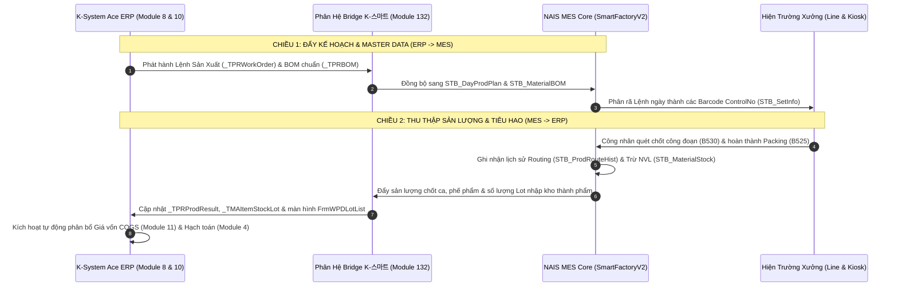
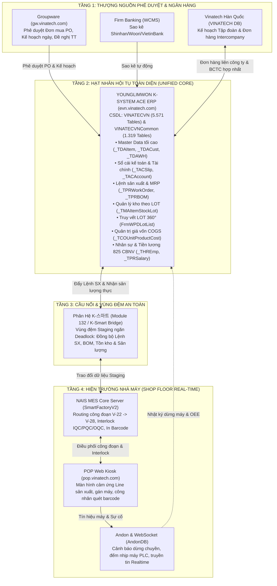

# 🏛️ TẬP 3: BẢN THIẾT KẾ HỢP NHẤT HỆ THỐNG CŨ VÀO NỀN TẢNG K-SYSTEM ACE
> **K-SYSTEM ACE ERP UNIFIED CONSOLIDATION & LEGACY INTEGRATION BLUEPRINT (VOLUME 3)**
>
> **Mục Tiêu Chiến Lược:** Quy chuẩn hóa toàn bộ luồng dữ liệu liên thông, xóa bỏ các ốc đảo thông tin (Information Silos), đưa K-System Ace trở thành **Nguồn Sự Thật Duy Nhất (Single Source of Truth - SSOT)** hội tụ toàn bộ hệ thống cũ tại Vinatech.  
> **Các Hệ Thống Cũ Tích Hợp:**  
> 1. **NAIS MES (`SmartFactoryV2`, `SmartFramework`):** Điều hành sản xuất, Routing công đoạn, Interlock & Kho vật lý.  
> 2. **POP Kiosk (`VINATECH_POP`):** Màn hình cảm ứng hiện trường, máy quét Barcode, bộ đếm PLC máy móc.  
> 3. **Groupware (`VINATECH_GROUP`):** Cổng phê duyệt điện tử 17 biểu mẫu hành chính, mua sắm và nhân sự.  
> 4. **Douzone iU ERP (`NEOE`) & erpdb:** Sổ cái kế toán cũ, lịch sử tài chính và Master Data chuyển giao.  
> 5. **Andon & IoT (`AndonDB`, `VINATECH_WEBSOCKET`):** Giám sát dừng chuyền, cảnh báo thời gian thực và đo OEE.  
> 6. **Firm Banking (`WCMS_STANDARD_NEW`):** Tự động hóa đối soát sao kê tài khoản ngân hàng.

---

## 📑 MỤC LỤC
1. [TẦM NHÌN CHIẾN LƯỢC: K-SYSTEM ACE LÀ HẠT NHÂN HỘI TỤ TỐI CAO](#1-tầm-nhìn-chiến-lược-k-system-ace-là-hạt-nhân-hội-tụ-tối-cao)
2. [HỢP NHẤT VỚI HỆ THỐNG ĐIỀU HÀNH SẢN XUẤT NAIS MES](#2-hợp-nhất-với-hệ-thống-điều-hành-sản-xuất-nais-mes)
3. [HỢP NHẤT VỚI HỆ THỐNG POP KIOSK & THU THẬP PLC](#3-hợp-nhất-với-hệ-thống-pop-kiosk--thu-thập-plc)
4. [HỢP NHẤT VỚI CỔNG PHÊ DUYỆT GROUPWARE](#4-hợp-nhất-với-cổng-phê-duyệt-groupware)
5. [HỢP NHẤT VỚI ERP DOUZONE VÀ HỆ THỐNG TẬP ĐOÀN MẸ TẠI HÀN QUỐC](#5-hợp-nhất-với-erp-douzone-và-hệ-thống-tập-đoàn-mẹ-tại-hàn-quốc)
6. [HỢP NHẤT VỚI HỆ THỐNG ANDON, IOT & FIRM BANKING](#6-hợp-nhất-với-hệ-thống-andon-iot--firm-banking)
7. [BẢN ĐỒ HUYẾT MẠCH LIÊN THÔNG DỮ LIỆU ĐA TẦNG (END-TO-END TOPOLOGY)](#7-bản-đồ-huyết-mạch-liên-thông-dữ-liệu-đa-tầng-end-to-end-topology)

---

## 1. TẦM NHÌN CHIẾN LƯỢC: K-SYSTEM ACE LÀ HẠT NHÂN HỘI TỤ TỐI CAO

Trước khi triển khai K-System Ace, Vinatech vận hành theo mô hình "Bốn Vương Quốc" phân mảnh:
- **Groupware** lưu trữ tờ trình và quyết định phê duyệt.
- **Douzone iU ERP** quản lý hạch toán tài chính và sổ cái.
- **NAIS MES** quản lý thực thi công đoạn, lô hàng và mã vạch hiện trường.
- **POP Kiosk** ghi nhận thao tác công nhân tại từng máy vật lý.

Hạn chế lớn nhất của mô hình cũ là dữ liệu bị phân mảnh: Một mã vật tư phải khai báo ở 3 nơi (`VINA_ITEM`, `MA_ITEM`, `STB_MaterialMaster`); khi có chênh lệch tồn kho hoặc lỗi chất lượng, việc truy vết đòi hỏi kỹ sư phải viết script đối chiếu phức tạp qua nhiều database.

👉 **K-System Ace (`https://evn.vinatech.com/`) ra đời để đóng vai trò là NỀN TẢNG HỢP NHẤT (UNIFIED FINAL SYSTEM):**
1. **Thượng nguồn Master Data:** K-System là nơi duy nhất khởi tạo mã sản phẩm, định mức BOM chuẩn, đơn giá mua/bán và tài khoản người dùng.
2. **Hạ nguồn Hạch toán & Quyết toán:** Toàn bộ kết quả sản xuất từ xưởng, giờ công từ máy quét, hao hụt vật tư thực tế từ MES đều chảy về K-System để tự động tính giá thành (COGS) và kết xuất báo cáo tài chính.
3. **Cầu nối điều phối:** Các hệ thống cũ không bị loại bỏ đột ngột mà được chuyển đổi thành các "Cánh tay chấp hành" (Execution Satellites) xoay quanh hạt nhân K-System.

---

## 2. HỢP NHẤT VỚI HỆ THỐNG ĐIỀU HÀNH SẢN XUẤT NAIS MES

Hệ thống NAIS MES (`SmartFactoryV2` DB) là xương sống sản xuất tại nhà máy Hà Nam và Hưng Yên. Cơ chế liên thông giữa K-System và NAIS MES được thiết kế theo mô hình **Giao thức Hai Chiều (Bidirectional Decoupled Pipeline)**:



### 2.1. Quản Trị Kho Hàng Bằng Cờ `_TDAWH.IsMES`
Trong bảng quản lý kho `VINATECVN.dbo._TDAWH`, YoungLimWon đã cấu hình sẵn trường cờ **`IsMES`**:
- **`IsMES = 'Y'` (Kho Hiện Trường MES):** Áp dụng cho các kho chuyền, kho đệm NVL (`Defective Warehouse`, `Processing Stock Transfer`, `Set Component`, `Receiving Standby`). Tồn kho tại các kho này được ủy quyền hoàn toàn cho NAIS MES quản lý theo thời gian thực (FIFO, Interlock chất lượng IQC).
- **`IsMES = 'N'` (Kho Tài Chính ERP):** Áp dụng cho kho tổng nguyên vật liệu và kho thành phẩm xuất khẩu (`Head Office Warehouse`, `Sales Waiting Warehouse`). Tồn kho tại đây chịu sự kiểm soát nghiêm ngặt của sổ cái kế toán K-System.
- Khi hàng chuyển từ kho `IsMES = 'N'` sang kho `IsMES = 'Y'`, hệ thống tự động sinh chứng từ xuất cấp phát sản xuất (`_TMAGoodsIssue`).

### 2.2. Vai Trò Vùng Đệm An Toàn Của Phân Hệ `K-스마트` (Module 132)
Tại sao không cho MES ghi trực tiếp vào bảng kế toán của K-System?
- **Đặc thù tốc độ:** Hiện trường nhà máy có hàng chục line, mỗi giây có hàng trăm thao tác quét barcode và tín hiệu cảm biến PLC. Nếu ghi trực tiếp vào `_TACSlip` hoặc `_TPRProdResult`, áp lực transaction sẽ làm nghẽn (Deadlock) cơ sở dữ liệu kế toán và tài chính.
- **Cơ chế Decoupling:** Phân hệ `K-스마트` đóng vai trò là hàng đợi trung gian (Queue/Buffer Staging). Dữ liệu sản xuất được gom cụm (batch aggregation) theo chu kỳ 1 phút / 5 phút rồi mới đồng bộ đẩy lên ERP, đảm bảo cả 2 hệ thống vận hành mượt mà độc lập.

---

## 3. HỢP NHẤT VỚI HỆ THỐNG POP KIOSK & THU THẬP PLC

POP Kiosk (`https://pop.vinatech.com/`) là giao diện tiếp xúc trực tiếp giữa công nhân và hệ thống phần mềm. Luồng dữ liệu từ POP hội tụ vào K-System diễn ra qua 3 bước chuyển tiếp:

```
[ THAO TÁC CÔNG NHÂN TẠI KIOSK ]
  │
  ├─ 1. Quét mã Barcode cuộn cực / Cell
  ├─ 2. Cảm biến PLC đếm số nhịp dập/quấn máy
  └─ 3. Bấm nút báo phế / báo lỗi NG trên màn hình cảm ứng
         │
         ▼
[ BẢNG TRUNG GIAN KIOSK (SmartFactoryV2.dbo.MongoToMesPerformance) ]
  │  - MachineCode, Barcode, RouteCode, CreateDate
  │
         ▼
[ TIẾN ĐỘ CÔNG ĐOẠN MES (SmartFactoryV2.dbo.STB_ProdRouteHist) ]
  │  - Barcode, RouteCode, EquipmentCode, ProdQty, WorkerID, JobDate
  │
         ▼
[ TẬP HỢP K-SYSTEM ACE (VINATECVN.dbo._TPRProdResult & _TPRWorkCenter) ]
  │  - WorkOrderSeq, LotNo, WorkCenterSeq, GoodQty, ScrapQty, LaborHours, MachineHours
```

### Điểm chạm kỹ thuật quan trọng:
1. **Xác thực trạm làm việc:** Địa chỉ MAC của máy trạm Kiosk (`VINATECH_POP.dbo.VINA_PC_MAC`) được liên kết với danh mục Trung tâm gia công (`_TPRWorkCenter`) trong K-System Ace Module 8.
2. **Đồng bộ mã công nhân:** Mã nhân viên quét đăng nhập Kiosk (`STB_ProdRouteWorkerHist.WorkerID`) đối chiếu trực tiếp với danh mục nhân sự `VINATECVN.dbo._THREmp` (`EmpNo`).
3. **Quy tắc Playbook EA:** Khi có lỗi đổi máy nhầm Kiosk, bắt buộc phải update đồng thời cả 2 bảng (`STB_ProdRouteHist` và `MongoToMesPerformance`) trước khi số liệu được đẩy lên tổng kết tại `_TPRProdResult`.

---

## 4. HỢP NHẤT VỚI CỔNG PHÊ DUYỆT GROUPWARE

Groupware (`https://gw.vinatech.com/`) là nơi Ban Giám đốc và các Trưởng bộ phận ký duyệt tờ trình hành chính điện tử. K-System Ace tiếp quản và liên kết chặt chẽ với Groupware qua các điểm chạm sau:

```
┌───────────────────────────────────────┐         ┌───────────────────────────────────────┐
│     GROUPWARE (VINATECH_GROUP)        │         │      K-SYSTEM ACE (VINATECVN)         │
├───────────────────────────────────────┤         ├───────────────────────────────────────┤
│ Đơn Mua Hàng (VINA_DOCUMENT_POH)      │ ──────> │ Đơn Đặt Hàng Mua (_TMAPOH / _TMAPOL)  │
│ Đề Nghị Thanh Toán (VINA_DOC_PAYMENT) │ ──────> │ Phiếu Kế Toán Chi Tiền (_TACSlip)     │
│ Kế Hoạch SX Ngày (VINA_DOC_DAILY_PLAN)│ ──────> │ Lệnh Sản Xuất Khả Thi (_TPRWorkOrder) │
│ Hồ Sơ Nhân Viên (V_ORG_USER)          │ <─────> │ Danh Mục CBNV Gốc (_THREmp - 825 người│
└───────────────────────────────────────┘         └───────────────────────────────────────┘
```

### Cơ chế Khóa Liên Kết `DOCUMENT_SAVE_CODE`:
- Mọi tờ trình được duyệt trên Groupware đều sinh một mã định danh duy nhất `DOCUMENT_SAVE_CODE` (ví dụ `PO-202609-0012`).
- Mã này được ghi vào trường tham chiếu `RefDocNo` trong bảng chứng từ kế toán `_TACSlip` và đơn mua `_TMAPOH` của K-System.
- Khi kế toán viên hoặc kiểm toán viên kiểm tra chứng từ trên K-System, chỉ cần bấm vào liên kết là có thể mở ngay văn bản ký điện tử gốc trên Groupware.

---

## 5. HỢP NHẤT VỚI ERP DOUZONE VÀ HỆ THỐNG TẬP ĐOÀN MẸ TẠI HÀN QUỐC

### 5.1. Kế Hoạch Chuyển Giao Từ Douzone iU (`NEOE`) Sang K-System Ace (`VINATECVN`)
Hệ thống Douzone iU ERP từng đóng vai trò quản lý tài chính cũ. Quá trình hợp nhất vào K-System tuân thủ lộ trình 4 bước:
1. **Chuyển giao Danh mục Đối tác & Vật tư:** Bảng `MA_ITEM` và `MA_PARTNER` của Douzone được đối soát, làm sạch và nạp vào `_TDAItem`, `_TDACust`, `_TDAVendor`.
2. **Chuyển giao Số dư Đầu kỳ:** Số dư tài khoản kế toán (`FI_DOCU`), công nợ phải thu/phải trả được khóa sổ chốt số dư và nạp làm số dư đầu kỳ trên `_TACSlip`.
3. **Chuyển giao Tài sản Cố định:** Bảng danh mục tài sản và khấu hao lũy kế được ánh xạ sang `_TACAsst`.
4. **Vận hành song song (Parallel Run):** Sau khi đối soát khớp 100% số liệu báo cáo tài chính tháng giữa Douzone và K-System, hệ thống Douzone sẽ chuyển sang chế độ Lưu trữ tra cứu lịch sử (Read-only Historical Archive).

### 5.2. Đồng Bộ Hóa Hai Chiều Với Trụ Sở Chính Hàn Quốc (`VINATECH` DB)
Tại máy chủ IDC, cơ sở dữ liệu `VINATECVN` (Việt Nam) chạy song song với `VINATECH` (Hàn Quốc):
- **Giao dịch liên công ty (Intercompany Transactions):** Khi Vinatech HQ tại Hàn Quốc đặt hàng sản xuất từ Vinatech Vina tại Việt Nam, đơn hàng bán xuất khẩu (`_TSASalesOrder`) trên `VINATECVN` sẽ tự động khớp nối với đơn mua hàng nhập khẩu (`_TMAPOH`) trên CSDL `VINATECH` HQ.
- **Báo cáo tài chính hợp nhất:** Hàng tháng, K-System tự động quy đổi tỷ giá VND/KRW/USD để nộp dữ liệu hạch toán giá vốn lên hệ sinh thái quản trị của Tập đoàn mẹ.

---

## 6. HỢP NHẤT VỚI HỆ THỐNG ANDON, IOT & FIRM BANKING

### 6.1. Hợp Nhất Hệ Thống Cảnh Báo Dừng Chuyền Andon (`AndonDB`)
- Khi xảy ra sự cố dừng chuyền vật lý, bảng `AndonDB.dbo.STB_LineSituation_VVT` ghi nhận mã lỗi và thời gian dừng máy.
- Dữ liệu này được đẩy vào phân hệ Quản lý thiết bị của K-System (`VINATECVN.dbo._TPREquipDowntime`).
- **Tác dụng:** Giúp phân hệ Giá vốn (Module 11) tính toán chính xác chi phí máy dừng (Downtime Cost) và đánh giá hiệu suất hữu dụng tổng thể (OEE) của từng dây chuyền.

### 6.2. Hợp Nhất Dịch Vụ Ngân Hàng Điện Tử WCMS (`WCMS_STANDARD_NEW`)
- Hệ thống Firmware Banking tự động cào sao kê biến động tài khoản ngân hàng Shinhan, Woori, VietinBank: `WCMS_STANDARD_NEW.dbo.WCMS_ACCOUNT_TRNX_LOG`.
- Khi có giao dịch tiền về hoặc giải ngân, K-System phân hệ Fintech (Module 118) tự động kích hoạt tạo phiếu thu/chi trên `_TACSlip`, loại bỏ hoàn toàn thao tác nhập tay của kế toán viên.

---

## 7. BẢN ĐỒ HUYẾT MẠCH LIÊN THÔNG DỮ LIỆU ĐA TẦNG (END-TO-END TOPOLOGY)

Dưới đây là sơ đồ kiến trúc tổng thể mô tả toàn bộ mạng lưới dữ liệu hội tụ vào K-System Ace:



### Kết luận Giá Trị Hợp Nhất:
Hệ thống **K-System Ace** chính thức xác lập vai trò là **Bộ Não Trung Tâm** điều phối toàn diện hoạt động sản xuất kinh doanh của Vinatech tại Việt Nam. Việc hoàn thiện bản thiết kế hợp nhất này đảm bảo tính kế thừa toàn vẹn từ các hệ thống cũ, đồng thời nâng tầm năng lực quản trị doanh nghiệp theo chuẩn mực quốc tế.
