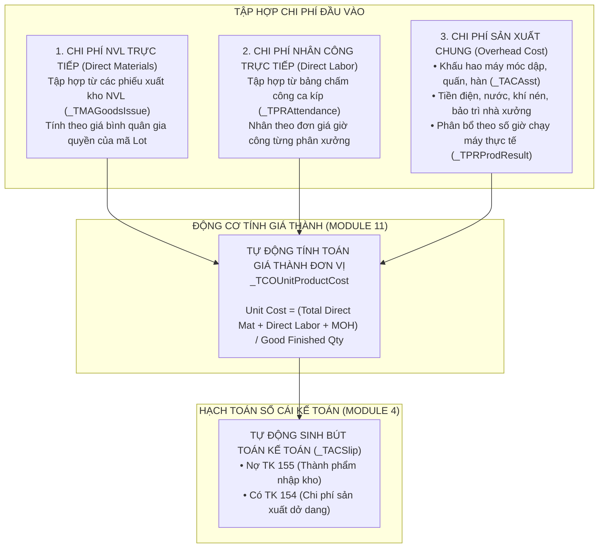

# 🏛️ TẬP 4: HUYẾT MẠCH TRUY VẾT LOT 360°, THUẬT TOÁN MRP & GIÁ THÀNH SẢN PHẨM (COGS)
> **K-SYSTEM ACE ERP LOT 360° TRACEABILITY, MRP & COGS CALCULATION ENGINE (VOLUME 4)**
>
> **Tầm Quan Trọng:** Ngành sản xuất linh kiện tụ điện công nghệ cao (Supercapacitor EDLC & Hybrid) đòi hỏi độ chính xác tuyệt đối về nguồn gốc vật tư và an toàn kiểm định cho các ngành công nghiệp ô tô, năng lượng tái tạo và quân sự.  
> **Tâm Điểm Kỹ Thuật:** Màn hình **`FrmWPDLotList` (`PgmSeq: 522308`)**, Thuật toán bóc tách **MRP**, và Động cơ tính **Giá thành COGS (Module 11)**.  
> ← [Tập 2: 17 Phân hệ nghiệp vụ](VOL_02_17_MODULES_COMPLETE_DEEPDIVE.md) | 📖 [Tập 3: Kế hoạch Hợp nhất Hệ thống Cũ](VOL_03_LEGACY_CONSOLIDATION_BLUEPRINT.md)

---

## 📑 MỤC LỤC
1. [TRIẾT LÝ QUẢN TRỊ THEO MÃ LOT (LOT-CENTRIC MANUFACTURING PARADIGM)](#1-triết-lý-quản-trị-theo-mã-lot-lot-centric-manufacturing-paradigm)
2. [GIẢI PHẪU MÀN HÌNH TRỌNG ĐIỂM: TRUY VẤN TRUY XUẤT LOT 360° (FRMWPDLOTLIST)](#2-giải-phẫu-màn-hình-trọng-điểm-truy-vấn-truy-xuất-lot-360-frmwpdlotlist)
3. [BẢNG ĐỐI CHIẾU 1-1: FRMWPDLOTLIST (ERP) VS GOLDEN QUERY 360° (MES)](#3-bảng-đối-chiếu-1-1-frmwpdlotlist-erp-vs-golden-query-360-mes)
4. [ĐỘNG CƠ HOẠCH ĐỊNH NHU CẦU VẬT LIỆU (MRP & BOM EXPLOSION)](#4-động-cơ-hoạch-định-nhu-cầu-vật-liệu-mrp--bom-explosion)
5. [CHU TRÌNH TỰ ĐỘNG TÍNH GIÁ THÀNH ĐƠN VỊ SẢN PHẨM (COGS)](#5-chu-trình-tự-động-tính-giá-thành-đơn-vị-sản-phẩm-cogs)
6. [TỔNG KẾT VÀ QUY TẮC BẢO VỆ TÍNH TOÀN VẸN CỦA LOT](#6-tổng-kết-và-quy-tắc-bảo-vệ-tính-toàn-vẹn-của-lot)

---

## 1. TRIẾT LÝ QUẢN TRỊ THEO MÃ LOT (LOT-CENTRIC MANUFACTURING PARADIGM)

Tại Vinatech, một tụ điện siêu nhỏ bán cho khách hàng toàn cầu không chỉ là một linh kiện phần cứng, mà là một **"Hồ sơ dữ liệu số" (Digital Product Passport)**. Khi khách hàng phát hiện một lỗi suy giảm điện dung (Capacitance Drop) hoặc rò rỉ điện dịch, hệ thống bắt buộc phải truy vết ngược trong vòng 60 giây:
* Lô tụ này sản xuất vào ngày nào, trên máy nào, công nhân nào đứng chuyền?
* Cuộn cực dương, cực âm được cán từ mẻ trộn than hoạt tính nào?
* Cuộn nhôm thô do nhà cung cấp nào sản xuất, nhập theo đơn mua (PO) nào và kiểm định IQC bởi ai?

### Chuỗi Phả Hệ Lot Từ Cuộn Đến Container (Coil-to-Container Lineage):
```
[ NHÀ CUNG CẤP VENDOR ]
  │  - Đơn mua PO (_TMAPOH)
  │  - Hóa đơn nhà cung cấp
  ▼
[ LÔ VẬT TƯ THÔ (Raw Material Lot: ML...) ]
  │  - Nhập kho F330 & Kiểm định IQC C220
  │  - Lưu tại _TMAItemStockLot & STB_MaterialLotInfo
  ▼
[ LÔ BÁN THÀNH PHẨM ĐIỆN CỰC (Electrode Lot: EL...) ]
  │  - Trộn hồ (Mixing) ➔ Cán phủ (Coating B802) ➔ Chia cuộn (Slitting B552)
  │  - Kiểm soát độ dày cực (<100um)
  ▼
[ LÔ THÀNH PHẨM CELL (Cell Lot: VV...) ]
  │  - Quấn cell ➔ Lắp ráp ➔ Hàn nắp ➔ Châm dịch ➔ Lão hóa (Aging)
  │  - Mã Barcode ControlNo (STB_SetInfo)
  ▼
[ GỘP HỘP & THÙNG CARTON (Packing Lot) ]
  │  - Đóng hộp con Box (B523: PackingID)
  │  - Đóng thùng tổng Master Carton (B525: ParentPackingID)
  │  - Tem nhãn Sanmina & Nghiệm thu xuất xưởng OQC (C530)
  ▼
[ XUẤT CONTAINER (Shipping Pallet) ]
  │  - Xuất kho PDA (FG01) ➔ Bốc xếp Pallet lên Container (B752)
  │  - Hóa đơn thương mại xuất khẩu (_TSAInvoice) & Giá vốn COGS (_TCOUnitProductCost)
```

---

## 2. GIẢI PHẪU MÀN HÌNH TRỌNG ĐIỂM: TRUY VẤN TRUY XUẤT LOT 360° (FRMWPDLOTLIST)

Màn hình **`FrmWPDLotList`** (`PgmSeq: 522308`) trong Phân hệ Sản xuất (Module 8) là tác phẩm kiến trúc phần mềm đỉnh cao của YoungLimWon. Màn hình này tích hợp đồng thời **3 bảng lưới dữ liệu đa chiều (Multi-dimensional Synchronized Grids)**:

```
┌────────────────────────────────────────────────────────────────────────────────────────┐
│                   MÀN HÌNH TRUY VẤN TRUY XUẤT LOT (FrmWPDLotList)                     │
├────────────────────────────────────────────────────────────────────────────────────────┤
│ Bộ Lọc Tìm Kiếm: [Ngày làm việc: Từ ~ Đến] [Mã sản phẩm: F2 Lookup] [Quy cách]         │
├────────────────────────────────────────────────────────────────────────────────────────┤
│ 📊 LƯỚI 1: LỊCH SỬ LỆNH SẢN XUẤT & ROUTING CÔNG ĐOẠN (WIP & ROUTING TRACE)             │
│ • Cột: Work Center | Số Lệnh SX | Công Đoạn | LotNo | Tên SP | Mã SP | Quy Cách       │
│        Đơn Vị SX | Số Lượng Hoàn Thành | Phân Loại Tác Nghiệp | Người Làm Việc | Ghi Chú│
├────────────────────────────────────────────────────────────────────────────────────────┤
│ 📊 LƯỚI 2: ĐỊNH MỨC TIÊU HAO NGUYÊN VẬT LIỆU BOM THỰC TẾ (BOM CONSUMPTION TRACE)      │
│ • Cột: Số Lệnh SX | Công Đoạn | Tên SP | Mã SP | Tên NVL Đầu Vào | Mã NVL | Quy Cách  │
│        Đơn Vị | Số Lượng Nhập Vào | Số Lượng Đơn Vị Tiêu Chuẩn | LotNo Nguyên Vật Liệu │
├────────────────────────────────────────────────────────────────────────────────────────┤
│ 📊 LƯỚI 3: NGUỒN GỐC MUA HÀNG TỪ NHÀ CUNG CẤP (VENDOR PROCUREMENT TRACE)               │
│ • Cột: Nhà Cung Cấp | Hình Thức Mua | Tên NVL | Mã NVL | Quy Cách | LotNo Nhà Cung Cấp │
│        Số Lượng Nhập | Tiền Nhập Kho | Thuế GTGT | Tổng Số Tiền Hóa Đơn                │
└────────────────────────────────────────────────────────────────────────────────────────┘
```

### Chi tiết 3 Lưới Dữ Liệu Đồng Bộ:
1. **Lưới 1 (WIP & Routing Trace):** Truy xuất toàn bộ lộ trình công đoạn mà Lot đã đi qua. Cho biết chính xác mã máy móc (Work Center), số lệnh sản xuất, ngày giờ chạy máy, số lượng đạt (Good Qty), số lượng phế phẩm (Scrap Qty) và mã nhân viên vận hành.
2. **Lưới 2 (BOM Consumption Trace):** Truy xuất chính xác định mức tiêu hao nguyên vật liệu tại thời điểm gia công. Đối chiếu giữa **Số lượng tiêu chuẩn theo BOM** và **Số lượng thực tế công nhân đã quét nạp vào máy**, giúp phát hiện ngay các mẻ sản xuất bị hao hụt vật tư vượt định mức.
3. **Lưới 3 (Vendor Procurement Trace):** Kết nối trực tiếp từ mã Lot NVL sang Phân hệ Mua hàng (Module 7). Hiển thị tên nhà cung cấp, số đơn đặt mua (PO), số lô nhà cung cấp (Vendor LotNo), ngày hàng cập cảng và tổng giá trị hóa đơn đã thanh toán.

---

## 3. BẢNG ĐỐI CHIẾU 1-1: FRMWPDLOTLIST (ERP) VS GOLDEN QUERY 360° (MES)

Trong hệ sinh thái phần mềm Vinatech, kỹ sư nhà xưởng thường dùng câu lệnh Golden Query CLI `.\mes.ps1 trace "<LotID>"` để kiểm tra nhanh sự cố hiện trường. Màn hình `FrmWPDLotList` trên Web ERP chính là phiên bản nghiệp vụ quản trị cấp cao của câu lệnh này:

| Trường Thông Tin Truy Vết | Màn Hình K-System Ace (`FrmWPDLotList`) | Lệnh Golden Query MES (`.\mes.ps1 trace`) | Bảng CSDL Lưu Trữ Thực Tế |
| :--- | :--- | :--- | :--- |
| **Mã định danh Lot** | Cột `LotNo` (Lưới 1) | Tham số `<LotID>` | `SmartFactoryV2.dbo.STB_SetInfo.LotNo` |
| **Lệnh sản xuất cấp cao** | Cột `Số Lệnh SX` | Cột `DayPlanNo` / `OrderNo` | `VINATECVN.dbo._TPRWorkOrder.WorkOrderNo` |
| **Tiến độ Routing** | Cột `Công Đoạn` | Cột `RouteCode` (V-22 ➔ V-28) | `SmartFactoryV2.dbo.STB_ProdRouteHist` |
| **Máy móc gia công** | Cột `Work Center` | Cột `EquipmentCode` | `VINATECVN.dbo._TPRWorkCenter` & `STB_MachineMaster` |
| **Người thực hiện** | Cột `Người Làm Việc` | Cột `WorkerID` | `STB_ProdRouteWorkerHist` ➔ `_THREmp` |
| **Nguyên liệu tiêu hao** | Cột `LotNo NVL` (Lưới 2) | Bảng `STB_MaterialLotInfo` | `SmartFactoryV2.dbo.STB_MaterialStock` |
| **Hóa đơn mua hàng** | Cột `Tổng Số Tiền` (Lưới 3) | N/A (MES không lưu giá tiền) | `VINATECVN.dbo._TMAPOH` & `_TMAPOL` |

> [!TIP]
> **Điểm ưu việt của K-System:** MES chỉ biết số lượng vật lý và mã vạch công đoạn, hoàn toàn không có thông tin về tiền bạc. K-System Ace mở rộng tầm nhìn 360° sang cả chiều kích **Tài chính & Giá trị hợp đồng**, giúp Ban Giám đốc biết chính xác một lô hàng lỗi gây thiệt hại bao nhiêu tiền USD/VND.

---

## 4. ĐỘNG CƠ HOẠCH ĐỊNH NHU CẦU VẬT LIỆU (MRP & BOM EXPLOSION)

Phân hệ Sản xuất (Module 8) sở hữu động cơ tính toán hoạch định nhu cầu nguyên vật liệu (Material Requirements Planning - MRP) đa tầng:

```
[ CẤU TRÚC ĐỊNH MỨC BÓC TÁCH BOM ĐA TẦNG (MULTI-LEVEL BOM) ]
  Level 0: Thành Phẩm Tụ Điện Hoàn Thiện (Supercapacitor Module / Pack)
    │
    ├── Level 1: Tế bào Tụ điện đơn (Single Cell 2.7V/3.0V)
    │     │
    │     ├── Level 2: Cuộn Lõi Quấn (Wound Core Element)
    │     │     ├── Level 3: Cuộn Cực Dương (Positive Electrode Roll - EL...)
    │     │     │     ├── Level 4: Lá Nhôm Thô (Raw Aluminum Foil)
    │     │     │     └── Level 4: Bột Than Hoạt Tính (Activated Carbon Paste)
    │     │     ├── Level 3: Cuộn Cực Âm (Negative Electrode Roll)
    │     │     └── Level 3: Màng Ngăn Cách Điện (Separator Paper)
    │     │
    │     ├── Level 2: Vỏ Nhôm & Nắp Cao Su (Aluminum Case & Rubber Header)
    │     └── Level 2: Dung Dịch Điện Giải (Acetonitrile Electrolyte)
    │
    └── Level 1: Phụ kiện Đóng gói & Đầu Cực (Lead Wire, Nut, Shrink Sleeve, Box, Carton)
```

### Thuật toán Bóc tách Đơn hàng (Gross-to-Net MRP Explosion Formula):
Khi phòng Kinh doanh nhập đơn đặt hàng bán 100.000 chiếc tụ điện:
1. **Nhu cầu thô (Gross Requirement):** Bằng `Số lượng đơn hàng` nhân với `Định mức tiêu chuẩn (StdQty)` trong `_TPRBOM`.
2. **Khấu trừ tồn kho khả dụng (Available Stock Deduction):** Trừ đi lượng hàng sẵn có trong kho `IsMES = 'N'` (`_TMAItemStockLot`) và trừ đi lượng hàng đang trên đường về từ các PO đã duyệt.
3. **Bù trừ tỷ lệ hao hụt kỹ thuật (Scrap/Loss Allowance Factor):** Nhân với hệ số hao hụt công đoạn `(1 + LossRate)`:
   $$\text{Net Requirement} = \left(\text{Gross Req} - \text{Stock} - \text{Open PO}\right) \times (1 + \text{LossRate})$$
4. **Tự động sinh Đơn yêu cầu mua hàng (Purchase Requisition - PR):** Đẩy sang Module 7 để phòng Mua hàng đàm phán với vendor.

---

## 5. CHU TRÌNH TỰ ĐỘNG TÍNH GIÁ THÀNH ĐƠN VỊ SẢN PHẨM (COGS)

Phân hệ Giá vốn (Module 11) kết hợp với Phân hệ Kế toán (Module 4) thực hiện chu trình tính giá thành sản phẩm (Cost of Goods Sold - COGS) theo phương pháp chi phí thực tế (Actual Costing Method):



### Ý nghĩa đột phá trong quản trị:
* **Loại bỏ ước lượng thủ công:** Trước đây, kế toán phải mất hàng tuần sau khi hết tháng để tính giá thành trên Excel. Với K-System, dữ liệu tiêu hao từ MES được đổ về liên tục, cho phép chạy thử nghiệm tính giá thành tạm tính theo từng tuần.
* **Kiểm soát độ biến động giá (Variance Analysis):** Hệ thống đối chiếu trực tiếp giữa **Giá thành tiêu chuẩn (Standard Cost)** và **Giá thành thực tế (Actual Cost)** để phát hiện ngay phân xưởng nào đang để lãng phí vật tư hoặc hiệu suất chạy máy thấp.

---

## 6. TỔNG KẾT VÀ QUY TẮC BẢO VỆ TÍNH TOÀN VẸN CỦA LOT

1. **Nguyên tắc "Không Lot - Không Di Chuyển":** Bất kỳ một cuộn nguyên liệu hay bán thành phẩm nào lưu lạc trên sàn xưởng mà không có mã Lot hợp lệ trong `_TMAItemStockLot` đều bị coi là hàng bất thường và phải đưa vào kho cách ly `Defective Warehouse`.
2. **Nguyên tắc khóa tự động khi phát sinh lỗi (Quality Hold Lock):** Khi phòng QC cập nhật trạng thái `FAIL` trên màn hình kiểm định `_TQCInspIQC` hoặc `_TQCInspPQC`, hệ thống tự động khóa mã Lot trên cả K-System và NAIS MES, ngăn chặn tuyệt đối công nhân quét nạp vào công đoạn tiếp theo.
3. **Quyền năng tối cao của Golden Query & FrmWPDLotList:** Việc làm chủ màn hình `FrmWPDLotList` và công cụ CLI `.\ksys.ps1 trace` trao cho đội ngũ kỹ sư Vinatech năng lực kiểm soát 100% chất lượng sản phẩm từ hạ tầng chip điện tử đến container xuất cảng quốc tế.
