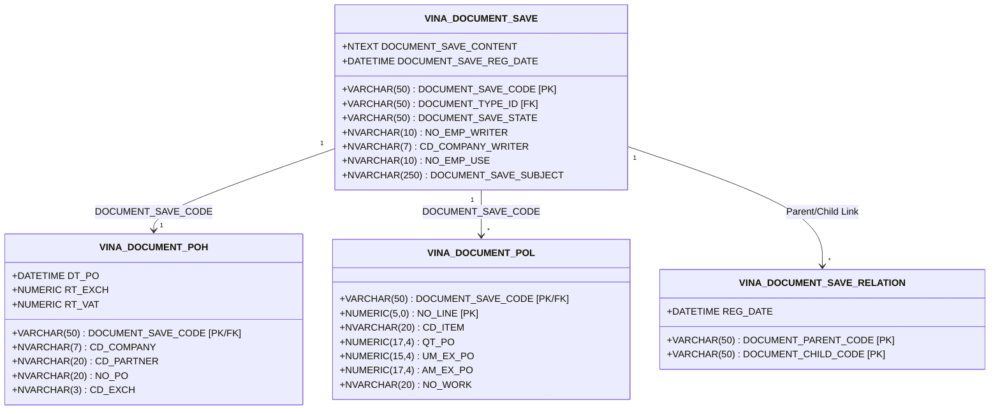

# 🗄️ GW_09 — Cấu Trúc Kiến Trúc & Lược Đồ CSDL VINATECH_GROUP

> **Cơ sở dữ liệu:** `VINATECH_GROUP` | **Máy chủ:** `dbserver.hycap.co.kr,5398`
> **Nền tảng:** Bizbox Alpha (Douzone Bizon) Web Groupware (`https://gw.vinatech.com`)
> **Mục tiêu:** Cung cấp thông tin kiến trúc dữ liệu chi tiết nhất về các bảng, khóa chính/ngoại, cột nghiệp vụ và cơ chế lưu trữ của hệ thống Groupware Vinatech.

---

## 🗺️ 1. Tổng Quan Kiến Trúc Dữ Liệu Generic Document Flow

Groupware Vinatech được thiết kế theo mô hình **Generic Document Architecture (Kiến trúc Tài liệu Chung)**:
- Mọi biểu mẫu (dù là Mua hàng PO, Xin nghỉ phép, Kế hoạch sản xuất hay Thanh toán) đều bắt buộc có một bản ghi Header tổng quát trong bảng `VINA_DOCUMENT_SAVE`.
- Các dữ liệu nghiệp vụ đặc thù cho từng loại chứng từ sẽ được lưu trữ tại các bảng chuyên biệt (ví dụ `VINA_DOCUMENT_POH` cho PO, `VINA_DOCUMENT_LEAVE_REQUEST` cho Nghỉ phép) và liên kết với `VINA_DOCUMENT_SAVE` qua khóa chính/ngoại `DOCUMENT_SAVE_CODE`.
- Chuỗi liên kết nghiệp vụ giữa các biểu mẫu tiền nhiệm và kế nhiệm (Predecessor & Successor) được quản lý chặt chẽ trong bảng `VINA_DOCUMENT_SAVE_RELATION`.



---

## 📋 2. Chi Tiết Lược Đồ Bảng Cốt Lõi (Core Database Tables)

### 2.1 Bảng Tài Liệu Gốc: `VINA_DOCUMENT_SAVE`
Lưu trữ thông tin khởi tạo, phân loại và trạng thái duyệt của mọi văn bản trên Groupware.

| Tên Cột | Kiểu Dữ Liệu | Nullable | Mô Tả Nghiệp Vụ |
| :--- | :--- | :--- | :--- |
| **DOCUMENT_SAVE_CODE** (PK) | `varchar(50)` | NO | Mã định danh duy nhất của văn bản (VD: `DOC20260615001`) |
| **DOCUMENT_TYPE_ID** | `varchar(50)` | NO | Phân loại biểu mẫu (PO, LEAVE, DISBURSEMENT, ARRIVAL...) |
| **DOCUMENT_SAVE_STATE** | `varchar(50)` | NO | Mã trạng thái duyệt: `001` (Draft), `002` (Approving), `008` (Approved), `004` (Rejected), `009` (Deleted) |
| **NO_EMP_WRITER** | `nvarchar(10)` | YES | Mã nhân viên người soạn thảo văn bản |
| **CD_COMPANY_WRITER** | `nvarchar(7)` | YES | Mã pháp nhân công ty người soạn thảo (`VVT`, `VNT`, `1000`, `2000`) |
| **NO_EMP_USE** | `nvarchar(10)` | YES | Mã nhân viên sử dụng thực tế (trường hợp soạn hộ) |
| **DOCUMENT_SAVE_SUBJECT** | `nvarchar(250)` | NO | Tiêu đề văn bản |
| **DOCUMENT_SAVE_CONTENT** | `ntext` | NO | Nội dung văn bản định dạng HTML rich-text |
| **DOCUMENT_SAVE_REG_DATE** | `datetime` | YES | Thời điểm gửi phê duyệt |
| **DOCUMENT_SAVE_MODIFY_DATE** | `datetime` | YES | Thời điểm cập nhật trạng thái gần nhất |

---

### 2.2 Nghiệp Vụ Mua Hàng & Quản Lý Đơn Đặt Hàng (Purchasing)

#### A. Header Đơn Mua Hàng: `VINA_DOCUMENT_POH`
Lưu thông tin chung của hợp đồng đặt hàng với nhà cung cấp.

| Tên Cột | Kiểu Dữ Liệu | Nullable | Mô Tả Nghiệp Vụ |
| :--- | :--- | :--- | :--- |
| **DOCUMENT_SAVE_CODE** (PK/FK) | `varchar(50)` | NO | Khóa ngoại liên kết tới `VINA_DOCUMENT_SAVE` |
| **CD_COMPANY** | `nvarchar(7)` | NO | Mã pháp nhân mua hàng (`VVT` Hưng Yên, `VNT` Bắc Ninh/Hà Nam) |
| **CD_PARTNER** | `nvarchar(20)` | NO | Mã đối tác / nhà cung cấp (VD: `13000` cho Vinatech HQ Hàn Quốc) |
| **NO_PO** | `nvarchar(20)` | NO | Số đơn PO chính thức (đồng bộ 1-1 với ERP `NEOE.dbo.PU_PO.NO_PO`) |
| **DT_PO** | `datetime` | NO | Ngày phát hành đơn mua hàng |
| **CD_EXCH** | `nvarchar(3)` | YES | Đơn vị tiền tệ giao dịch (`VND`, `USD`, `KRW`, `EUR`) |
| **RT_EXCH** | `numeric(11,4)` | YES | Tỷ giá hối đoái quy đổi tại thời điểm tạo đơn |
| **RT_VAT** | `numeric(5,2)` | YES | Tỷ lệ thuế giá trị gia tăng áp dụng (0%, 5%, 8%, 10%) |
| **DC_RMK** | `nvarchar(500)` | YES | Ghi chú điều khoản thanh toán & giao hàng |

#### B. Line Chi Tiết Đơn Mua Hàng: `VINA_DOCUMENT_POL`
Lưu danh sách từng vật tư trong đơn mua hàng.

| Tên Cột | Kiểu Dữ Liệu | Nullable | Mô Tả Nghiệp Vụ |
| :--- | :--- | :--- | :--- |
| **DOCUMENT_SAVE_CODE** (PK/FK) | `varchar(50)` | NO | Khóa ngoại liên kết tới `VINA_DOCUMENT_SAVE` |
| **NO_LINE** (PK) | `numeric(5,0)` | NO | Thứ tự dòng trong đơn hàng (1, 2, 3...) |
| **CD_ITEM** | `nvarchar(20)` | NO | Mã vật tư đặt mua (khớp với Master Data `NEOE.MA_PITEM`) |
| **QT_PO** | `numeric(17,4)` | NO | Số lượng đặt mua |
| **UM_EX_PO** | `numeric(15,4)` | NO | Đơn giá ngoại tệ |
| **AM_EX_PO** | `numeric(17,4)` | NO | Thành tiền ngoại tệ (`QT_PO * UM_EX_PO`) |
| **AM_PO** | `numeric(17,4)` | NO | Thành tiền nội tệ VNĐ (`AM_EX_PO * RT_EXCH`) |
| **DT_LIMIT** | `nvarchar(8)` | YES | Ngày hạn định nhà cung cấp phải giao hàng (YYYYMMDD) |
| **CD_SL** | `nvarchar(7)` | YES | Mã kho dự kiến nhập hàng (VD: `W01`, `W02`) |

---

### 2.3 Khai Báo Hàng Về & Nhập Kho Vật Lý (Arrival & Receiving)

#### A. Khai Báo Hàng Về: `VINA_DOCUMENT_RECEIVING_PHYSICAL_ITEM_H / L`
- **Mục đích:** Kích hoạt thông báo hàng đã đến cổng nhà máy, đẩy dữ liệu sang **MES màn hình F330** để thủ kho in tem NVL và mời QC kiểm tra.
- **Khóa liên kết:** Liên kết tới `VINA_DOCUMENT_POH` để biết hàng về theo PO nào.

#### B. Xác Nhận Nhập Kho Chính Thức: `VINA_DOCUMENT_RECEIVING_CONFIRMATION_H / L`
- **Điều kiện tiên quyết:** Màn hình **MES C220 (IQC)** phải chốt kết quả kiểm định là **PASS**.
- **Tác động hệ thống:** Sau khi form này duyệt hoàn tất:
  1. Tồn kho thực tế trên **MES** được ghi nhận chính thức.
  2. Tự động đăng ký chứng từ nhập kho **ERP `PU_BL` / `PU_RCV`**.

---

### 2.4 Kế Hoạch Sản Xuất & Chỉ Thị Hiện Trường (Production Planning)

#### Bảng Kế Hoạch Tháng: `VINA_PROD_MONTH_PRODPLAN`
Lưu trữ kế hoạch điều hành sản xuất tổng thể theo tháng cho các nhà máy.

| Tên Cột | Kiểu Dữ Liệu | Nullable | Mô Tả Nghiệp Vụ |
| :--- | :--- | :--- | :--- |
| **CD_COMPANY** | `nvarchar(7)` | NO | Mã pháp nhân nhà máy sản xuất (`VVT`, `VNT`) |
| **YM_PLAN** | `nvarchar(6)` | NO | Năm tháng kế hoạch sản xuất (VD: `202606`) |
| **CD_ITEM** | `nvarchar(20)` | NO | Mã thành phẩm / bán thành phẩm cần sản xuất |
| **QT_PLAN** | `numeric(17,4)` | NO | Sản lượng mục tiêu trong tháng |
| **CD_WC** | `nvarchar(7)` | YES | Mã phân xưởng / Work Center phụ trách |
| **YN_CONFIRM** | `nvarchar(1)` | YES | Cờ chốt kế hoạch (`Y` / `N`) |

- **Liên kết sang MES:** Sau khi kế hoạch tháng được phê duyệt, dữ liệu được phân bổ thành kế hoạch ngày (`STB_DayProdPlan`) trên MES để mở màn hình **B310** (Tạo chỉ thị sản xuất) và **B450** (Phát hành Lot sản xuất).

---

### 2.5 Danh Mục Nhân Sự & Sơ Đồ Tổ Chức (Human Resources & Org)

#### Bảng Hồ Sơ Nhân Viên: `VINA_EMP`
Lưu trữ thông tin nhân viên toàn công ty, đóng vai trò là danh bạ trung tâm cho tuyến phê duyệt.

| Tên Cột | Kiểu Dữ Liệu | Nullable | Mô Tả Nghiệp Vụ |
| :--- | :--- | :--- | :--- |
| **NO_EMP** (PK) | `nvarchar(10)` | NO | Mã nhân viên (VD: `21910034`, `71908026`, `32511007`) |
| **CD_COMPANY** | `nvarchar(7)` | NO | Mã pháp nhân trực thuộc (`VVT`, `VNT`) |
| **NM_KOR** | `nvarchar(50)` | YES | Tên tiếng Hàn (nếu là chuyên gia Hàn Quốc) |
| **NM_ENG** | `nvarchar(50)` | YES | Tên tiếng Anh / Tiếng Việt không dấu |
| **CD_DEPT** | `nvarchar(12)` | NO | Mã phòng ban trực thuộc |
| **CD_DUTY_RANK** | `nvarchar(3)` | YES | Cấp bậc / Chức vụ (Nhân viên, Trưởng nhóm, Trưởng phòng, Giám đốc) |
| **NO_TEL_EMERGENCY** | `nvarchar(20)` | YES | Số điện thoại liên hệ |
| **CD_INCOM** | `nvarchar(3)` | YES | Tình trạng công tác (`001`: Đang làm, `002`: Nghỉ việc, `003`: Tạm nghỉ) |

---

## 🔗 3. Sơ Đồ Quan Hệ Khóa Giữa 3 Cơ Sở Dữ Liệu (Cross-DB Schema Map)

```
[VINATECH_GROUP]                           [NEOE_ERP]                           [SmartFactoryV2 / SmartFramework]
VINA_DOCUMENT_SAVE (DOCUMENT_SAVE_CODE)
         │
         ├── VINA_DOCUMENT_POH (NO_PO) ───► PU_PO (NO_PO) ────────────────────► STB_POInfo (POCode)
         │                                       │
         ├── VINA_DOCUMENT_POL (CD_ITEM) ─► MA_PITEM (CD_ITEM) ───────────────► STB_MaterialMaster (MaterialCode)
         │                                       │
         ├── VINA_PROD_MONTH_PRODPLAN ────► PR_WO (NO_WO) ────────────────────► STB_DayProdPlan (JobDate, LotID)
         │
         └── VINA_EMP (NO_EMP) ───────────► MA_USER (ID_USER, NO_EMP) ────────► STB_UserInfo (Appendix8 = ERPUserID)
```

---

## 💡 4. Các Lưu Ý Vận Hành & Khuyến Cáo Khi Thao Tác CSDL

1. **Khóa liên kết `DOCUMENT_SAVE_CODE` là bất biến:** Tuyệt đối không sửa mã này thủ công vì sẽ làm đứt gãy liên kết giữa Header và Detail.
2. **Không tự ý chuyển trạng thái `DOCUMENT_SAVE_STATE`:** Khi một văn bản bị kẹt duyệt, không cập nhật trực tiếp `DOCUMENT_SAVE_STATE = '008'` trên SQL vì quy trình tự động đẩy dữ liệu sang ERP sẽ không được kích hoạt. Bắt buộc xử lý qua đường tuyến duyệt chuẩn hoặc trigger đồng bộ.
3. **Cơ chế đọc an toàn:** Luôn dùng `WITH (NOLOCK)` khi truy vấn các bảng `VINA_DOCUMENT_*` để tránh khóa bảng người dùng đang soạn thảo.
