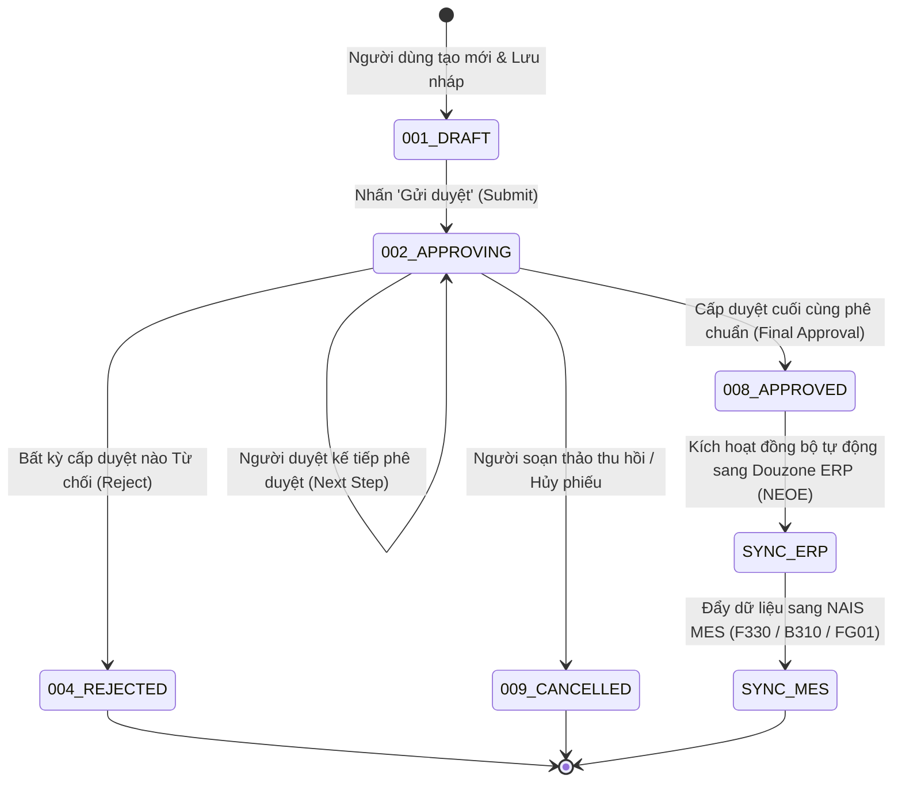
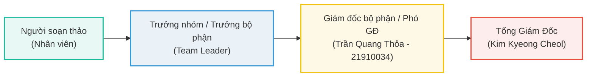

# 🔄 GW_10 — Cỗ Máy Phê Duyệt Điện Tử & Vòng Đời Biểu Mẫu (Approval Engine & Lifecycle)

> **Phân hệ:** Electronic Approval (전자결재) | **Nền tảng:** Bizbox Alpha Web Groupware
> **Mục tiêu:** Cung cấp hướng dẫn toàn diện về luồng trạng thái văn bản, cơ chế phân tuyến phê duyệt (Line of Approval), nguyên tắc ký duyệt ủy quyền và xử lý các điểm nghẽn phê duyệt.

---

## 🧭 1. Cỗ Máy Trạng Thái Văn Bản (Document State Machine)

Mọi biểu mẫu trên Groupware Vinatech trải qua chu trình chuyển đổi trạng thái nghiêm ngặt được điều khiển bởi trường `DOCUMENT_SAVE_STATE` trong bảng `VINA_DOCUMENT_SAVE`:

### Bảng Mã Trạng Thái Chi Tiết:

| Mã Trạng Thái | Tên Trạng Thái | Ý Nghĩa Kỹ Thuật & Vận Hành | Quyền Thao Tác Của Người Dùng |
| :---: | :--- | :--- | :--- |
| **`001`** | **DRAFT** (Lưu nháp) | Phiếu đang soạn thảo, lưu tạm thời trong CSDL, chưa xuất hiện trên hàng đợi của người duyệt | Người soạn có quyền sửa, xóa, gửi duyệt |
| **`002`** | **APPROVING** (Đang trình duyệt) | Phiếu đã gửi, đang nằm trong hàng đợi chờ duyệt của cấp thẩm quyền hiện tại | Người soạn không được sửa nội dung; có thể Thu hồi (Recall) nếu người duyệt chưa mở đọc |
| **`008`** / **`090`** | **APPROVED** (Phê chuẩn hoàn tất) | Cấp duyệt cuối cùng đã ký duyệt, văn bản có hiệu lực pháp lý và kinh tế | Dữ liệu bị đóng băng (Lock); Hệ thống kích hoạt Trigger/Job đồng bộ sang ERP |
| **`004`** | **REJECTED** (Từ chối) | Bị từ chối bởi một cấp duyệt kèm lý do phản hồi | Phiếu kết thúc chu trình; Người soạn xem lý do và tạo phiếu mới nếu cần |
| **`009`** | **CANCELLED** (Hủy bỏ) | Người soạn chủ động thu hồi và hủy hoặc bị hủy bởi quản trị viên | Bản ghi được gắn cờ hủy, không xóa cứng khỏi DB |

---

## 👥 2. Tuyến Phê Duyệt Tiêu Chuẩn (Line of Approval Architecture)

Tuyến duyệt trên Groupware được phân cấp theo 4 vai trò chính:
1. **Approval (결재 - Ký duyệt chính):** Có quyền phê chuẩn hoặc bác bỏ văn bản.
2. **Agreement (합의 - Thỏa thuận / Tham vấn):** Các phòng ban liên quan (Kế toán, Kỹ thuật, IT) tham gia cho ý kiến trước khi cấp cuối duyệt.
3. **Receipt (수신 - Tiếp nhận):** Bộ phận chịu trách nhiệm triển khai sau khi phiếu được duyệt xong (VD: Mua hàng tiếp nhận đơn đề xuất để đặt PO).
4. **Reference (참조 - Tham chiếu / CC):** Nhận thông báo để theo dõi tiến độ, không tham gia vào luồng duyệt.

### 2.1 Tuyến Phê Duyệt Mua Sắm (Purchase Request / PO Approval):

### 2.2 Quy Định Hạn Mức Phê Duyệt Chi Phí (Financial Authorization Thresholds):

| Hạn Mức Chi Phí (VNĐ quy đổi) | Cấp Phê Duyệt Cuối Cùng (Final Approval) | Yêu Cầu Tham Vấn Kế Toán |
| :--- | :--- | :---: |
| **< 10,000,000 VNĐ** | Trưởng phòng phụ trách bộ phận | Không bắt buộc |
| **10,000,000 – 50,000,000 VNĐ** | Giám đốc bộ phận (Trần Quang Thỏa - `21910034`) | Tham vấn (CC Kế toán) |
| **> 50,000,000 VNĐ** hoặc mua ngoài kế hoạch | Tổng Giám Đốc (Kim Kyeong Cheol) | Bắt buộc Kế toán trưởng ký Agree |

---

## ✍️ 3. Cơ Chế Ủy Quyền & Ký Thay (Delegation & Proxy Approval)

Khi người phê duyệt đi công tác hoặc nghỉ phép:
1. **Thiết lập người ủy quyền (Proxy Setting):**
   - Vào mục: `Personal Settings → Approval Settings → Absence / Delegation`.
   - Chọn thời gian vắng mặt (Từ ngày → Đến ngày) và chọn nhân sự được ủy quyền ký thay.
2. **Hiệu lực trong CSDL:**
   - Hệ thống tự động ghi nhận mã nhân viên ký thay (`NO_EMP_PROXY`) kèm thời điểm ký.
   - Khi xuất file PDF lưu trữ, hệ thống đóng dấu `[대결 - Ký thay]` đảm bảo tính minh bạch theo chuẩn kiểm toán K-SOX.

---

## 🗄️ 4. Lưu Trữ & Số Hóa Chứng Từ (Digital Archiving & PDF Generation)

Sau khi trạng thái chuyển sang `008` (Approved):
1. Cỗ máy **StreamDocs (`DB_15_streamdocs`)** tự động kết xuất toàn bộ nội dung HTML, danh sách chữ ký điện tử, dấu mộc số thành file PDF tiêu chuẩn lưu trữ dài hạn.
2. File PDF được đánh số chứng từ chính thức theo cú pháp:
   `[MÃ_CÔNG_TY]-[MÃ_PHÒNG_BAN]-[NĂM]-[SỐ_THỨ_TỰ]`
   *Ví dụ: `VVT-PUR-2026-00142`*
3. File PDF được gắn mã Hash MD5/SHA256 để chống chỉnh sửa và phục vụ thanh tra thuế.
