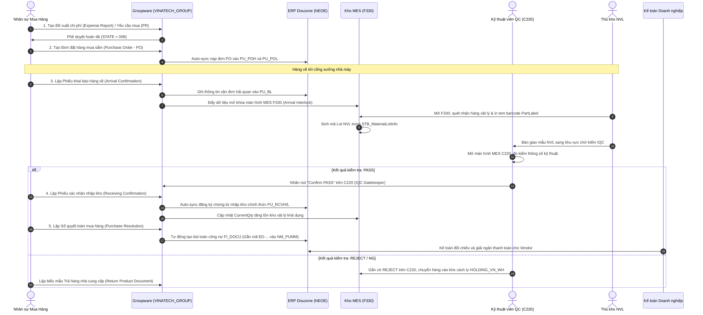
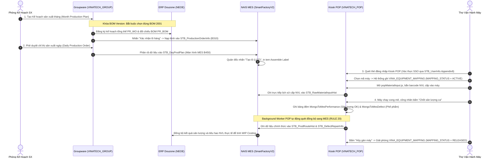
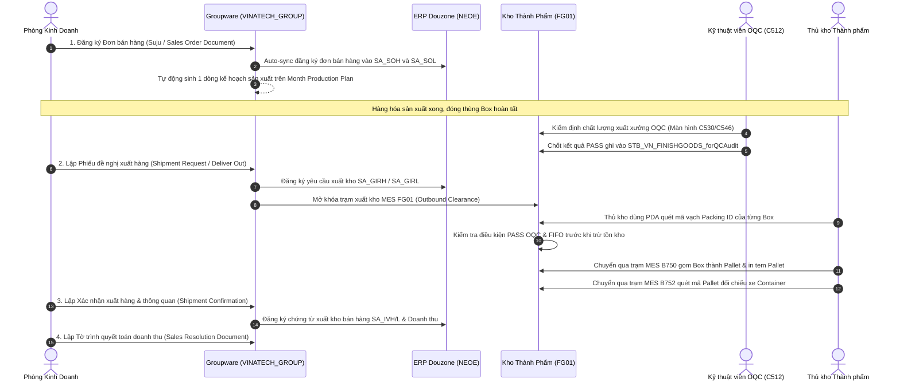
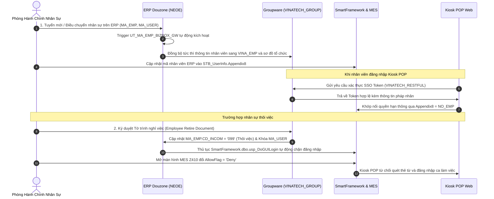
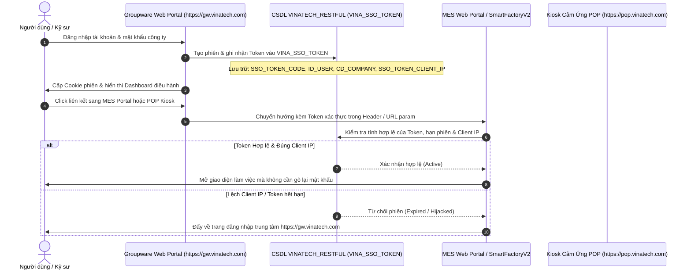

# 🌐 GW_12 — Hướng Dẫn Tích Hợp Đa Nền Tảng Toàn Diện (Groupware ↔ ERP ↔ MES ↔ POP)

> **Cập nhật:** 2026-09-25 | **Mục tiêu:** Cẩm nang kỹ thuật chuyên sâu về kiến trúc kết nối, luồng luân chuyển dữ liệu, khóa liên động kỹ thuật và cơ chế đồng bộ khép kín giữa 4 trụ cột công nghệ tại Vinatech:
> 1. **Groupware (GW):** Bizbox Alpha (`https://gw.vinatech.com` - CSDL `VINATECH_GROUP`) — Cổng thẩm quyền điều hành thượng nguồn.
> 2. **ERP Douzone iU:** CSDL `NEOE` — Trục tài chính, sổ cái kế toán, giá thành và Master Data.
> 3. **NAIS MES:** SmartFactoryV2 & SmartFramework (`http://mes.hycap.co.kr:9952`) — Trục thực thi xưởng, kho hiện trường và kiểm định chất lượng.
> 4. **Kiosk POP:** CSDL `VINATECH_POP` (`https://pop.vinatech.com`) — Giao diện cảm ứng công nhân, cấp NVL máy, chốt mẻ và báo phế.
>
> **Nguyên tắc cốt lõi:** *"No Approved Document, No Physical Movement"* (Không có tờ trình duyệt hoàn tất, không có bất kỳ chuyển động nào về tiền tệ, vật tư hay máy móc).

---

## 🧭 I. BẢN ĐỒ TỔNG THỂ KIẾN TRÚC 4 CHIỀU (4-WAY SYSTEM MESH)

```mermaid
graph TD
    subgraph "TRỤ CỘT 1: THƯỢNG NGUỒN — GROUPWARE (VINATECH_GROUP)"
        GW_PO["Mua Hàng & NVL<br>(VINA_DOCUMENT_POH / POL)"]
        GW_ARR["Khai Báo Hàng Về<br>(VINA_DOCUMENT_RECEIVING_PHYSICAL_ITEM_H)"]
        GW_RCV["Nhập Kho Chính Thức<br>(VINA_DOCUMENT_RECEIVING_CONFIRMATION_H)"]
        GW_PLAN["Kế Hoạch SX Tháng<br>(VINA_PROD_MONTH_PRODPLAN)"]
        GW_SO["Đơn Bán Hàng Suju<br>(VINA_SALES_SELLPLAN)"]
        GW_SHIP["Đề Nghị Xuất Hàng<br>(VINA_SALES_PROD_HAND)"]
        GW_DISB["Đề Nghị Thanh Toán<br>(VINA_DOCUMENT_PURCHASE_RESOLUTION)"]
        GW_SSO["Cổng Xác Thực SSO Token<br>(VINATECH_RESTFUL)"]
    end

    subgraph "TRỤ CỘT 2: TRUNG NGUỒN — ERP DOUZONE iU (NEOE)"
        ERP_PO["Đơn Mua Hàng & B/L Hải Quan<br>(PU_PO, PU_BL, PU_RCV)"]
        ERP_BOM["Master Data & Định Mức BOM 2001<br>(MA_PITEM, PR_BOM, PR_WO)"]
        ERP_SO["Đơn Bán Hàng & Doanh Thu<br>(SA_SO, SA_GIR, SA_IV)"]
        ERP_FIN["Sổ Cái Tài Chính & Bút Toán Kế Toán<br>(FI_DOCU - Khớp chuỗi ED-...)"]
        ERP_HR["Hồ Sơ Nhân Sự & Công Phép<br>(MA_EMP, HR_WTM_* - Trigger UT_MA_EMP)"]
    end

    subgraph "TRỤ CỘT 3: HẠ NGUỒN — NAIS MES (SmartFactoryV2 & SmartFramework)"
        MES_ARR["Trạm Nhận Hàng F330<br>(STB_MaterialDocInfo / STB_MaterialLotInfo)"]
        MES_IQC["Trạm Kiểm Định IQC C220<br>(STB_MaterialQcInfo.QcResult = PASS)"]
        MES_WO["Giám Sát PO Sản Xuất B310<br>(STB_ProductionOrderInfo)"]
        MES_DAY["Kế Hoạch Ngày & Chia Lot B450<br>(STB_DayProdPlan / STB_SetInfo)"]
        MES_PROD["Chốt Sản Lượng Chuyền B530<br>(STB_ProdRouteHist)"]
        MES_FG["Kho Thành Phẩm FG01 & OQC<br>(STB_VN_FINISHGOODS_forQCAudit)"]
        MES_PALLET["Tem Pallet B750 & Container B752<br>(STB_PackingInfo)"]
    end

    subgraph "TRỤ CỘT 4: HIỆN TRƯỜNG KIOSK — POP (VINATECH_POP)"
        POP_LOGIN["Đăng Nhập Thợ Vận Hành<br>(API /api/common/login - SSO Appendix8)"]
        POP_MAP["Chiếm Dụng Thiết Bị Kiosk<br>(VINA_EQUIPMENT_MAPPING.MAPPING_STATUS)"]
        POP_BOM["Quét Cấp NVL Vào Máy<br>(popMaterialInput.js -> STB_RawMaterialInputHist)"]
        POP_RUN["Bảng Đệm Chốt Mẻ Sản Lượng<br>(MongoToMesPerformance -> STB_ProdRouteHist)"]
        POP_DEF["Bảng Đệm Báo Hàng Lỗi / Phế<br>(MongoToMesDefect -> STB_DefectRepairInfo)"]
        POP_PACK["Gom Thùng Đóng Gói Kiosk<br>(popManualPackModal.js -> STB_PackingInfo)"]
    end

    %% Luồng Mua hàng
    GW_PO -->|Auto-sync PO khi State = 008| ERP_PO
    GW_ARR -->|Khai báo hàng về kích hoạt| MES_ARR
    MES_ARR -->|Gửi mẫu kiểm định| MES_IQC
    MES_IQC -.->|QcResult = PASS mở khóa form| GW_RCV
    GW_RCV -->|Auto-sync phiếu nhập kho| ERP_PO
    GW_RCV -->|Tăng tồn kho vật lý khả dụng| MES_ARR
    GW_DISB -->|Ghi nhận chi phí ED-...| ERP_FIN

    %% Luồng Bán hàng & Kế hoạch
    GW_SO -->|Auto-sync Suju| ERP_SO
    GW_SO -.->|Tự động sinh Month Plan| GW_PLAN
    GW_PLAN -->|Auto-sync lệnh sản xuất| ERP_BOM
    ERP_BOM -->|Cung cấp định mức BOM 2001| MES_WO
    MES_WO -->|Phân rã lệnh| MES_DAY
    MES_DAY -->|Nạp danh sách Day Plan & Lot| POP_RUN

    %% Luồng Kiosk POP
    GW_SSO -->|Token SSO qua Appendix8| POP_LOGIN
    POP_MAP -->|Khóa máy ACTIVE| POP_RUN
    POP_BOM -->|Trừ tồn NVL theo BOM| MES_ARR
    POP_RUN <-->|Đồng bộ Worker 2 chiều| MES_PROD
    POP_PACK -->|Chuyển thùng hoàn thiện| MES_FG

    %% Luồng Xuất kho
    GW_SHIP -->|Đề nghị xuất kho duyệt 008| ERP_SO
    GW_SHIP -->|Mở trạm quét Box FG01| MES_FG
    MES_FG -->|Quét Box OQC PASS| MES_PALLET
    MES_PALLET -->|Đối chiếu container B752| ERP_SO
```



---

## 🗄️ II. MA TRẬN BẢNG DỮ LIỆU & ÁNH XẠ TRƯỜNG CHI TIẾT (CROSS-SYSTEM FIELD-LEVEL MAPPING)

| Nghiệp Vụ Cốt Lõi | Thượng Nguồn: Groupware (`VINATECH_GROUP`) | Trung Nguồn: ERP Douzone (`NEOE`) | Hạ Nguồn: NAIS MES (`SmartFactoryV2`) | Trạm Kiosk: POP (`VINATECH_POP`) |
| :--- | :--- | :--- | :--- | :--- |
| **1. Đơn Mua Hàng (PO)** | `VINA_DOCUMENT_POH` (`DOCUMENT_SAVE_CODE`, `NO_PO`, `CD_PARTNER`, `CD_EXCH`, `RT_EXCH`)<br>`VINA_DOCUMENT_POL` (`NO_LINE`, `CD_ITEM`, `QT_PO`, `UM_EX_PO`, `CD_SL`) | `PU_POH` (`NO_PO`, `CD_PARTNER`, `DT_PO`, `CD_EXCH`)<br>`PU_POL` (`NO_PO`, `NO_LINE`, `CD_ITEM`, `QT_PO`, `UM_EX`, `AM_EX`) | `STB_ProductionOrderInfo` (Dùng để theo dõi tiến độ cấp vật tư) | Màn hình tiếp nhận vật tư ngoại tuyến |
| **2. Khai Báo Hàng Về (Arrival)** | `VINA_DOCUMENT_RECEIVING_PHYSICAL_ITEM_H` (`NO_PO`, `CD_SL`, `DT_ARRIVAL`, `NO_BL`)<br>`VINA_DOCUMENT_RECEIVING_PHYSICAL_ITEM_L` (`CD_ITEM`, `QT_ARRIVAL`, `BARCODE_LABEL_QTY`) | `PU_BL` (Vận đơn hải quan, số B/L, ngày tàu cập bến) | `STB_MaterialDocInfo` (`MaterialDocNo`)<br>`STB_MaterialDocDetailInfo` (Mở khóa màn hình **F330**)<br>`STB_MaterialLotInfo` (Sinh Lot NVL) | - |
| **3. Kiểm Định Chất Lượng IQC** | Kiểm tra điều kiện tiên quyết trước khi lập form Receiving: `QcResult = 'PASS'` | - | `STB_MaterialQcInfo` (`QcResult`, `InspDate`, `InspQty`)<br>`STB_CommInspDocHistory` (Màn hình **C220** / **C220_SPS**) | Tab Kiểm Tra Chất Lượng Kiosk POP (`popQcModal.js`) |
| **4. Nhập Kho Chính Thức** | `VINA_DOCUMENT_RECEIVING_CONFIRMATION_H` (`DOCUMENT_SAVE_CODE`, `NO_PO`, `DT_RCV`)<br>`VINA_DOCUMENT_RECEIVING_CONFIRMATION_L` (`CD_ITEM`, `LOT_NO`, `QT_RCV`) | `PU_RCVH` (`NO_RCV`, `NO_PO`, `DT_RCV`)<br>`PU_RCVL` (`NO_RCV`, `NO_LINE`, `CD_ITEM`, `QT_RCV`) | `STB_MaterialLotInfo.CurrentQty` (Cập nhật tồn kho vật lý khả dụng để cấp phát) | Tồn kho hiển thị trên Kiosk modal `popMaterialInput.js` |
| **5. Quyết Toán Mua Hàng & Chi Phí** | `VINA_DOCUMENT_PURCHAE_RESOLUTION` (`DOCUMENT_SAVE_CODE`, `NO_PO`, `AM_TOTAL`, `CD_ACCT`) | `FI_DOCU` (`NO_DOCU`, `NM_PUMM` nhận chuỗi `ED-...`)<br>`FI_DOCU_D` (Chi tiết nợ/có tài khoản `627`/`642`/`33111`) | - | - |
| **6. Kế Hoạch Sản Xuất Tháng** | `VINA_PROD_MONTH_PRODPLAN` (`CD_FACTORY`, `YM_PLAN`, `CD_ITEM`, `QT_PLAN`, `BOM_VER = 2001`) | `PR_WO` (Lệnh sản xuất tổng thể)<br>`PR_BOM` (Phiên bản định mức BOM 2001) | `STB_ProductionOrderInfo` (Hiển thị trên màn hình **MES B310**) | API `/api/pop/screen/getMonthPlan` |
| **7. Kế Hoạch Ngày & Phát Hành Lot** | `dailyProductionOrderDocument` / `VINA_PROD_DAY_PRODPLAN` (`DAY_PLAN_NO`, `CD_LINE`, `CD_SHIFT`, `CD_ITEM`) | Đồng bộ trạng thái lệnh WIP | `STB_DayProdPlan` (Màn hình **MES B450**)<br>`STB_SetInfo` (Quản lý mã `Barcode`, `LotNo`, `JobDate`) | API `/api/pop/screen/getDayPlanList`<br>API `/api/pop/screen/getLotList` |
| **8. Cấp NVL Máy Theo BOM** | Dựa trên định mức tính toán nguyên vật liệu (Raw Material Requirements) từ form Month Plan | Bảng định mức cấp phát `PR_BOM` (Version 2001) | Trạm cấp NVL **MES B540/B597**<br>`STB_RawMaterialInputHist` | Giao diện Kiosk `popMaterialInput.js`<br>API `saveMaterialInput` ghi vào `STB_RawMaterialInputHist` |
| **9. Chốt Mẻ & Sản Lượng Ca** | Quản đốc ký duyệt form `dailyProductionReportDocument` từ sản lượng tổng hợp | Ghi nhận chi phí sản xuất dở dang (WIP Costing) | Màn hình **MES B530**<br>`STB_ProdRouteHist` (Sản lượng OK)<br>`STB_ProdRouteWorkerHist` (Thợ máy) | Bảng đệm `MongoToMesPerformance`<br>Công nhân chốt Kiosk POP ➔ Worker sync MES (RULE 20) |
| **10. Khai Báo Lỗi & Phế Phẩm** | Đối chiếu tỷ lệ hao hụt phế phẩm trên báo cáo ca hàng ngày | Phân bổ tỷ lệ hao hụt vào giá thành đơn vị | `STB_DefectRepairInfo` (Chi tiết mã lỗi phế phẩm)<br>`STB_ProdRouteDefectHist` | Bảng đệm `MongoToMesDefect`<br>Công nhân bấm loại lỗi trên Kiosk màn hình Defect |
| **11. Đơn Bán Hàng (Suju)** | `VINA_SALES_SELLPLAN` (`DOCUMENT_SAVE_CODE`, `NO_SO`, `CD_PARTNER`, `DT_SO`, `TP_INCOTERMS`) | `SA_SOH` (`NO_SO`, `CD_PARTNER`, `DT_SO`)<br>`SA_SOL` (`NO_SO`, `NO_LINE`, `CD_ITEM`, `QT_SO`, `UM_SO`) | - | - |
| **12. Đề Nghị Xuất Hàng** | `VINA_SALES_PROD_HAND` (`DOCUMENT_SAVE_CODE`, `NO_SO`, `DT_OUT_REQ`) | `SA_GIRH` (`NO_GIR`, `NO_SO`)<br>`SA_GIRL` (`NO_GIR`, `NO_LINE`, `CD_ITEM`, `QT_GIR`) | Mở màn hình **MES FG01**<br>Quét Box PASS OQC (`STB_VN_FINISHGOODS_forQCAudit`) | Giao diện gom Box đóng gói Kiosk: `popManualPackModal.js` |
| **13. Xuất Hàng & In Tem Pallet** | `VINA_TRADE_ALL_INVOICE`<br>`VINA_DOCUMENT_TR_INV` (`NO_INV`, `NO_CONTAINER`, `NO_SEAL`) | `SA_IVH` (`NO_IV`, `NO_SO`)<br>`SA_IVL` (Đăng ký Doanh thu & Thuế) | Màn hình **MES B750** (In tem Pallet)<br>Màn hình **MES B752** (Đối chiếu xếp xe Container) | `STB_PackingInfo` (Ghi nhận mã Pallet và danh sách Box liên kết) |
| **14. Đăng Ký Mã Vật Tư Mới** | `VINA_ITEM_REG_DOCU` (31 trường thuộc tính kỹ thuật: `clsItem`, `grpMfg`, `volt`, `volume`...) | `MA_PITEM` (`CD_ITEM`, `NM_ITEM`, `STND_ITEM`, `UNIT_IM`, `TP_PROC`) | Màn hình thiết lập thiết bị **MES A230** và **MES A410** | Danh mục nạp tự động vào bảng chọn Model Kiosk |
| **15. Đăng Ký Đối Tác / Vendor**| `VINA_PARTNER_REG_DOCU` (`CD_PARTNER`, `LN_PARTNER`, `NO_COMPANY`, `CD_BANK`) | `MA_PARTNER` (`CD_PARTNER`, `LN_PARTNER`, `YN_USE = 'Y'`) | - | - |
| **16. Hồ Sơ Nhân Sự & Sơ Đồ** | `VINA_EMP` (`NO_EMP`, `NM_KOR`, `NM_ENG`)<br>`VINA_ORG_CHART_NODE` (Sơ đồ tổ chức) | `MA_EMP` & `MA_USER` (Trigger `UT_MA_EMP_BIZBOX_GW` tự động sync GW) | `SmartFramework.dbo.STB_UserInfo` (Trường `Appendix8 = NO_EMP`) | API `/api/common/login` xác thực SSO dựa trên `Appendix8` |
| **17. Nghỉ Việc & Khóa Quyền** | `empRetireDocument` (`NO_EMP`, `DT_RETIRE`, `DT_LAST_WORK`) | `MA_EMP.CD_INCOM = '099'` (Thôi việc)<br>Khóa tài khoản `MA_USER` | SP `usp_DoGUILogin` chặn đăng nhập MES.<br>Màn hình **Z410** đổi `AllowFlag = 'Deny'` | Kiosk POP lập tức từ chối thẻ từ và tài khoản đăng nhập ca |
| **18. Quản Lý Máy & Chiếm Dụng**| Phân quyền theo WorkCenter trong kế hoạch sản xuất tháng | Định nghĩa trung tâm chi phí và nguồn lực máy móc | Bảng danh mục thiết bị `STB_MachineInfo` (Mã máy, Chuyền, Trạng thái) | Bảng `VINA_EQUIPMENT_MAPPING`<br>(`MAPPING_STATUS`: `'ACTIVE'` / `'RELEASED'`) |

---

## ⚡ III. 4 KHÓA LIÊN ĐỘNG KỸ THUẬT BẤT BIẾN (CIRCUIT BREAKERS)

Hệ sinh thái Groupware, ERP, MES và POP không vận hành rời rạc mà được kiểm soát bởi 4 khóa liên động kỹ thuật bất biến (Technical Circuit Breakers):

```
                                  ┌────────────────────────────────────────────────────────┐
                                  │               BOM VERSION LOCK (2001 / 2002)           │
                                  │ Groupware Month Plan bắt buộc chọn BOM version 2001.   │
                                  │ Lệch BOM: MES B310/B450 từ chối lệnh, Kiosk POP mất NVL│
                                  └───────────────────────────┬────────────────────────────┘
                                                              │
                                                              ▼
┌─────────────────────────────────────────┐       ┌────────────────────────────────────────┐
│         ARRIVAL INTERLOCK (F330)        │       │          IQC GATEKEEPER (C220)         │
│ Phiếu Arrival GW duyệt STATE = '008'    │──────►│ QC phải bấm Confirm PASS trên MES C220 │
│ mới mở màn hình MES F330 quét mã NVL.   │       │ thì GW mới cho làm Receiving nhập kho. │
└─────────────────────────────────────────┘       └───────────────────┬────────────────────┘
                                                                      │
                                                                      ▼
                                                  ┌────────────────────────────────────────┐
                                                  │        OUTBOUND CLEARANCE (FG01)       │
                                                  │ Shipment Request duyệt 008 + Box PASS  │
                                                  │ OQC mới cho quét xuất kho và in tem B750│
                                                  └────────────────────────────────────────┘
```

### 1. Khóa Liên Động 1: Arrival Interlock (GW ➔ MES F330)
- **Cơ chế bảo vệ:** Phiếu Khai báo hàng về `VINA_DOCUMENT_RECEIVING_PHYSICAL_ITEM_H` trên Groupware bắt buộc phải được phê duyệt hoàn tất ở trạng thái `DOCUMENT_SAVE_STATE = '008'`.
- **Điểm chặn kỹ thuật:** Khi trạng thái sang `008`, Backend Groupware nạp mã chứng từ vào `SmartFactoryV2.dbo.STB_MaterialDocInfo` với khóa `MaterialDocNo`. Chỉ khi tồn tại bản ghi này và mã kho `CD_SL` khớp với phân quyền của thủ kho, màn hình **MES F330** mới hiển thị danh mục hàng để quét mã vạch và in tem nhãn nguyên vật liệu (`PartLabel`).
- **Hệ quả vi phạm:** Ngăn chặn triệt để việc thủ kho nhận hàng ngoài luồng không qua phê duyệt mua sắm hoặc in tem lậu.

### 2. Khóa Liên Động 2: IQC Gatekeeper (MES C220 ➔ GW Receiving)
- **Cơ chế bảo vệ:** Sau khi hàng về và được dán nhãn tại trạm `F330`, mẫu nguyên vật liệu được chuyển sang trạm kiểm soát chất lượng đầu vào **MES C220** (hoặc `C220_SPS`). Kỹ thuật viên QC bắt buộc phải kiểm tra ngoại quan, kích thước và lý hóa, sau đó nhấn nút **"Xác nhận hoàn thành (Confirm PASS)"**.
- **Điểm chặn kỹ thuật:** Hệ thống MES ghi nhận giá trị `QcResult = 'PASS'` trong bảng `SmartFactoryV2.dbo.STB_MaterialQcInfo`. Khi nhân viên Mua hàng mở form `Receiving Confirmation Document` trên Groupware và nhấn chọn danh mục lô hàng, Backend Groupware gọi thủ tục kiểm tra chéo: **Chỉ những lô hàng có cờ `QcResult = 'PASS'` mới được phép hiển thị lên lưới để làm thủ tục nhập kho chính thức.**
- **Hệ quả vi phạm:** Tuyệt đối không cho phép thủ kho hoặc kế toán làm thủ tục nhập kho tài chính cho nguyên vật liệu đang chờ kiểm định hoặc đã bị đánh lỗi (REJECT/NG).

### 3. Khóa Liên Động 3: BOM Version Lock (ERP ➔ GW ➔ MES ➔ POP)
- **Cơ chế bảo vệ:** Toàn bộ sản phẩm sản xuất tại các nhà máy Vinatech Việt Nam (F1 Bắc Ninh, F2 Bắc Giang, F3 Hà Nam) bắt buộc phải sử dụng phiên bản định mức BOM chuẩn là **`2001`** (hoặc **`2002`** đối với Cell line thế hệ mới) được nạp từ ERP `NEOE.dbo.PR_BOM`.
- **Điểm chặn kỹ thuật:** Khi lập kế hoạch sản xuất tháng trên Groupware (`VINA_PROD_MONTH_PRODPLAN`), cột `BOM_VER` bắt buộc là `2001` (hoặc `2002`). Nếu người dùng chọn các mã phiên bản khác (như 1001 của Hàn Quốc hoặc các mã dự thảo):
  - Màn hình **MES B310** sẽ từ chối tiếp nhận lệnh sản xuất.
  - Màn hình **MES B450** sẽ bị **mờ nút "Tạo lô (LOT)"**, không thể phân rã sản lượng.
  - Giao diện Kiosk POP (`popMaterialInput.js`) sẽ báo lỗi không tải được "Lượng kiến cấp" của nguyên vật liệu theo định mức.

### 4. Khóa Liên Động 4: Outbound Clearance (GW ➔ MES FG01 ➔ B750/B752)
- **Cơ chế bảo vệ:** Khi phòng Kinh doanh lập phiếu đề nghị xuất hàng (`VINA_SALES_PROD_HAND`) duyệt `008`, dữ liệu được chuyển xuống trạm xuất kho thành phẩm **MES FG01**.
- **Điểm chặn kỹ thuật:** Thủ kho dùng súng bắn PDA quét mã vạch Packing ID của từng Box (thùng thành phẩm). Hệ thống MES tự động đối chiếu với bảng kiểm định chất lượng xuất xưởng `SmartFactoryV2.dbo.STB_VN_FINISHGOODS_forQCAudit` (được thẩm định qua màn hình **MES C530/C546**). Chỉ những Box đạt trạng thái **PASS OQC** mới được chấp nhận xuất kho tạm. Tiếp đó, trạm **MES B750** mới cho phép in tem Pallet và trạm **MES B752** mới xác thực niêm phong thùng container.
- **Hệ quả vi phạm:** Ngăn chặn xuất nhầm hàng, xuất thiếu số lượng hoặc xuất hàng chưa qua kiểm định chất lượng xuất xưởng ra thị trường.

---

## 🔄 IV. CHI TIẾT 4 LUỒNG GIAO DỊCH KHÉP KÍN (CLOSED-LOOP INTEGRATION WORKFLOWS)

---

### LUỒNG 1: MUA HÀNG, NHẬP KHO NVL & KIỂM ĐỊNH CHẤT LƯỢNG (PROCUREMENT & INBOUND WMS)



---

### LUỒNG 2: KẾ HOẠCH, ĐIỀU HÀNH SẢN XUẤT & KIOSK POP HIỆN TRƯỜNG (MANUFACTURING CLOSED-LOOP)



---

### LUỒNG 3: BÁN HÀNG, XUẤT KHO THÀNH PHẨM & OQC (SALES & OUTBOUND WMS)



---

### LUỒNG 4: QUẢN TRỊ DỮ LIỆU GỐC & NHÂN SỰ TẬP TRUNG (MASTER DATA & HR INTEGRATION)



---

## 🤖 V. CƠ CHẾ ĐỒNG BỘ ĐỆM KÉP TRÊN KIOSK POP (DUAL-BUFFER & RULE 20)

Hệ thống Kiosk POP xưởng (`VINATECH_POP`) được thiết kế với cơ chế bảng đệm kép (Dual-Buffer) để đảm bảo tốc độ đáp ứng tức thì cho công nhân bấm nút (<0.1s) mà không làm nghẽn CSDL MES:

```
[Công Nhân Bấm Chốt Mẻ Kiosk] 
              │
              ├──► Ghi nhận tức thì vào CSDL Kiosk: VINATECH_POP.dbo.MongoToMesPerformance (OK Qty)
              │                                    VINATECH_POP.dbo.MongoToMesDefect (NG Qty)
              │
              ▼
[POP Background Sync Daemon] ──(Chu kỳ quét liên tục)──► Ghi nhận chính thức vào CSDL MES:
                                                         SmartFactoryV2.dbo.STB_ProdRouteHist
                                                         SmartFactoryV2.dbo.STB_DefectRepairInfo
```

### ⚠️ QUY TẮC BẤT BIẾN KHI XỬ LÝ LỖI SẢN LƯỢNG KIOSK (RULE 20):
1. **Lỗi Đổi Máy / Chạy Nhầm Kiosk:** Khi công nhân thao tác nhầm mã máy trên Kiosk, kỹ sư hệ thống **BẮT BUỘC PHẢI CẬP NHẬT ĐỒNG THỜI CẢ 2 BẢNG**:
   - `SmartFactoryV2.dbo.STB_ProdRouteHist` (CSDL MES)
   - `VINATECH_POP.dbo.MongoToMesPerformance` (CSDL POP)  
   *Nếu chỉ update trên MES mà quên update bảng đệm POP, Kiosk sẽ tiếp tục nạp lại dữ liệu cũ, gây lệch mốc sản lượng Kiosk (`POP-ERR-31`).*
2. **Lỗi "Already Completed":** Nếu mẻ hàng bị báo lỗi đã hoàn tất, phải xóa bản ghi thừa trên cả `STB_ProdRouteHist` và `STB_ProdRouteWorkerHist`.
3. **Giải Phóng Máy Kẹt ACTIVE:** Khi công nhân ca trước quên bấm "Hủy gán máy", thiết bị bị khóa cứng trong bảng `VINATECH_POP.dbo.VINA_EQUIPMENT_MAPPING`. Phải giải phóng máy bằng lệnh:
   ```sql
   UPDATE VINATECH_POP.dbo.VINA_EQUIPMENT_MAPPING 
   SET MAPPING_STATUS = 'RELEASED', MODIFY_DATE = GETDATE()
   WHERE EQUIPMENT_CODE = 'MÃ_MÁY' AND MAPPING_STATUS = 'ACTIVE';
   ```

---

## 🔒 VI. KIẾN TRÚC XÁC THỰC MỘT LẦN (SSO MESH SECURITY)



---

## ⚡ VII. BỘ LỆNH ĐIỀU HÀNH TÁC NGHIỆP TRUY VẾT 4 CHIỀU (`.\gw.ps1`)

Kỹ sư vận hành sử dụng bộ công cụ `.\gw.ps1` tại thư mục gốc `PROCESS/GROUPWARE` để điều tra sự cố liên thông:

```powershell
# 1. Golden Query 360° truy vết đa hệ thống (GW ↔ ERP ↔ MES)
.\gw.ps1 trace "<NO_PO>"             # Truy vết đơn mua hàng: GW POH -> ERP PU_PO -> MES F330 -> IQC C220
.\gw.ps1 trace "<RECORD_CODE>"       # Truy vết mã hồ sơ (ví dụ ED-VJPMTR000000021) -> ERP FI_DOCU
.\gw.ps1 trace "<NO_EMP>"            # Truy vết thông tin nhân sự: GW -> ERP MA_EMP -> MES Appendix8

# 2. Tra cứu L1 Cache & ma trận biểu mẫu tức thì (<0.001s)
.\gw.ps1 find "PO"                   # Tra cứu biểu mẫu Mua hàng
.\gw.ps1 find "B310"                 # Tra cứu các biểu mẫu liên quan màn hình MES B310
.\gw.ps1 find "kho"                  # Tra cứu danh mục mã kho Việt Nam

# 3. Soi chi tiết cấu trúc 1 biểu mẫu
.\gw.ps1 form FORM_PO                # Soi cấu trúc bảng, tuyến duyệt, ánh xạ ERP/MES của Purchase Order
.\gw.ps1 form FORM_MONTH_PLAN        # Soi cấu trúc Month Production Plan & BOM 2001
.\gw.ps1 form FORM_RECEIVING         # Soi cấu trúc Receiving Confirmation & chốt chặn IQC C220

# 4. Kiểm tra sức khỏe đầu ngày & quét phiếu kẹt duyệt
.\gw.ps1 health                      # Báo cáo tổng quan phiếu chờ duyệt
.\gw.ps1 health -Detail              # Danh sách chi tiết các phiếu kẹt duyệt > 48h kèm tên người giữ phiếu

# 5. Kiểm tra kết nối mạng & CSDL toàn hệ thống
.\gw.ps1 check -Target All           # Kiểm tra kết nối đồng thời tới GW, ERP, MES, SSO, streamdocs
```

---

## 📋 VIII. BẢNG TỔNG KẾT NGUYÊN TẮC BẢO TOÀN DỮ LIỆU SỐNG CÒN

1. **Tuyệt Đối Không Sửa Dữ Liệu Thực Tế Bằng SQL (RULE 1):** Môi trường `dbserver.hycap.co.kr,5398` là cơ sở dữ liệu Production sống. Nghiêm cấm chạy lệnh `UPDATE`, `DELETE`, `DROP`, `ALTER`, `TRUNCATE` trực tiếp. Mọi truy vấn bắt buộc là `SELECT` kèm gợi ý `WITH (NOLOCK)`.
2. **Cấm Ép Trạng Thái `DOCUMENT_SAVE_STATE = '008'` (RULE 2):** Bắt buộc người dùng phê duyệt qua giao diện Web để kích hoạt đầy đủ 5 side-effects ngầm (PDF StreamDocs, mã `ED-...`, interface ERP, WebSocket alarm, đóng băng dữ liệu).
3. **Bảo Tồn Khóa Phiên Bản BOM 2001/2002:** Không tự ý sửa BOM sang mã khác trên CSDL vì sẽ làm tê liệt cỗ máy chia Lot trên MES `B450` và mất hiển thị định mức cấp liệu trên Kiosk POP.
4. **Quy Tắc Cập Nhật Bảng Đệm Kép Kiosk (RULE 20):** Khi sửa đổi số lượng hoặc thiết bị chạy nhầm trên Kiosk, bắt buộc cập nhật đồng thời cả `STB_ProdRouteHist` (MES) VÀ `MongoToMesPerformance` (POP).
